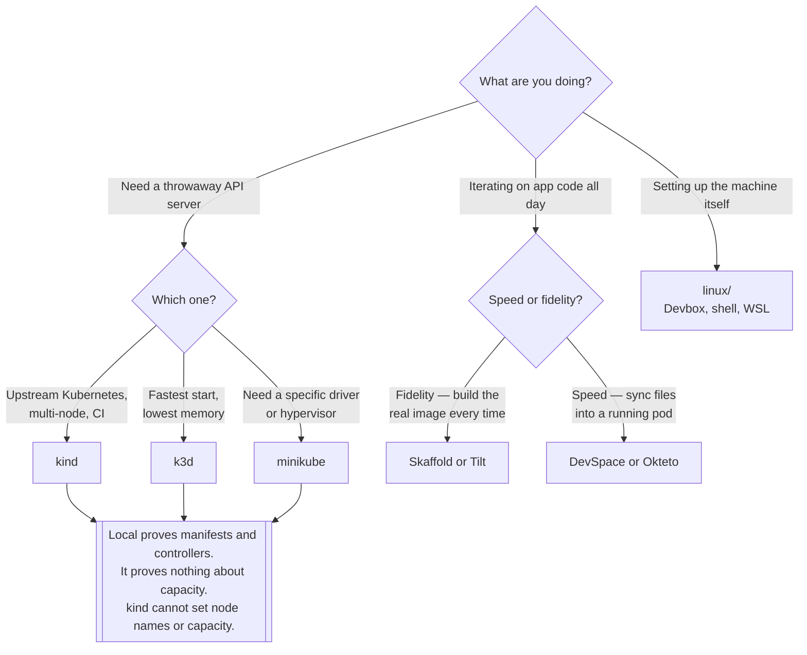

[← Kubernetes](../README.md)

# Local

The cluster on your machine, and the workstation underneath it.

Sections covered: [`development/`](development/README.md) — inner-loop tools ·
[`distributions/`](distributions/README.md) — kind, k3d, minikube and friends ·
[`linux/`](linux/README.md) — the workstation itself

## Contents

1. [Two different problems in one folder](#1-two-different-problems-in-one-folder)
2. [Picking a local distribution](#2-picking-a-local-distribution)
3. [The inner loop](#3-the-inner-loop)
4. [What a local cluster cannot tell you](#4-what-a-local-cluster-cannot-tell-you)
5. [Decision tree](#5-decision-tree)
6. [Anti-patterns](#6-anti-patterns)
7. [How this applies to pikakube](#7-how-this-applies-to-pikakube)

---

## 1. Two different problems in one folder

Two questions get answered here, and they are only related because they happen on the same laptop:

| Question | Folder |
|---|---|
| How do I get a Kubernetes API server locally? | [`distributions/`](distributions/README.md) |
| How do I iterate on code that runs in it, without rebuilding by hand? | [`development/`](development/README.md) |
| How do I make my workstation reproducible in the first place? | [`linux/`](linux/README.md) |

The third one looks out of place next to the other two and is not: an inner loop that depends on
seven tools installed by hand at seven different versions is not an inner loop, it is a support
burden. [`linux/virtual-enviroment/devbox/`](linux/virtual-enviroment/devbox/README.md) exists
because of that.

## 2. Picking a local distribution

Practically, this is a two-way choice with a long tail:

| Tool | Runs as | Pick it when |
|---|---|---|
| **kind** | Docker containers as nodes | you want upstream Kubernetes, multi-node, CI-friendly |
| **k3d** | k3s in Docker | you want it **fast** and small, and k3s's opinions are fine |
| minikube | VM or container, many drivers | you need a driver the other two do not have |
| k0s / MicroK8s | single binary / snap | single-node installs that are meant to outlive a test |

kind is the default for anything meant to match a real cluster, because it is upstream Kubernetes
with no substitutions. k3d wins on startup time and memory, at the price of k3s's replacements
(Traefik, servicelb, sqlite-backed storage unless configured otherwise).

`k9s` is not a distribution — it is a terminal UI for whatever cluster you are pointed at, and it
belongs in the same sentence only because it is the other thing everyone installs.

## 3. The inner loop

Without a tool, changing one line of application code means: build image, tag it, push it, update
the manifest, apply it, wait, read logs. The tools in
[`development/`](development/README.md) collapse that into a file watcher.

Two shapes, and the difference matters more than the feature lists:

- **Build and redeploy** — Skaffold, Tilt, Garden. A change triggers a real image build and a real
  deploy. Slower per iteration, but what runs is what will run in production.
- **Sync into a running pod** — DevSpace, Okteto, Nocalhost. Files are copied into a live
  container and the process restarts. Nearly instant, at the cost of running something that is not
  your production image.

Sync is addictive and produces "works locally" bugs, because the container you were developing in
had your source tree mounted into it and the real one will not.

## 4. What a local cluster cannot tell you

A local cluster gives you a genuine API server, which means genuine admission, RBAC, CRDs and
controller behaviour. That is most of what manifests and operators need.

It does not give you:

- **node capacity that means anything** — kind cannot set node names or capacity, which is a
  recorded upstream limitation, not a configuration you have missed
- a cloud load balancer, unless you add `cloud-provider-kind`
- storage that behaves like the production storage class
- resource pressure, eviction, or a scheduler making hard choices

So: test **correctness** locally, test **capacity and failure** somewhere real. For scale
behaviour without the hardware, [`kwok`](../on-premise/nodes/kwok/README.md) simulates thousands
of fake nodes and is the right tool for that specific question.

## 5. Decision tree

## 6. Anti-patterns

| Anti-pattern | Why it is bad | What to do instead |
|---|---|---|
| Treating a local cluster as a staging environment | no realistic capacity, storage or load balancing | a real cluster for anything about behaviour under load |
| Sync-based inner loop, then deploy the built image | the container you tested had your source mounted | build-based loop before merging |
| Installing every CLI globally by hand | version drift between machines and CI | [Devbox](linux/virtual-enviroment/devbox/README.md) or an equivalent |
| `latest` tags in the local loop | the cluster caches the image and you debug the old one | let the tool tag per build |
| A local cluster left running for weeks | it drifts from the manifests and stops being a clean test | recreate it; that is the point of a disposable cluster |
| Filing your own bugs against kind's node capacity | it is a known upstream limitation | design the test around it, or use kwok |

## 7. How this applies to pikakube

[`distributions/`](distributions/README.md) is where the real content is, and it is mostly
**recorded limitations**: two upstream issues showing kind cannot set node names or node capacity,
the `cloud-provider-kind` project noted as the way to get a load balancer, and the exact steps to
upgrade kind by deleting the binary from `/usr/local/bin` — because `kind` installs outside any
package manager and upgrading it is not obvious.

[`development/`](development/README.md) has one tool with commands recorded — Skaffold — and five
bookmarks. That asymmetry is the finding: Skaffold is the one that was actually run, complete with
a small Python app, a Dockerfile and a `skaffold.yaml` in the folder.

[`linux/`](linux/README.md) is the most personal and most useful part. The Devbox notes are a
working configuration in daily use, including the two upstream issues that shape it — Docker
cannot run inside Devbox, and Devbox's JSON config cannot hold comments. The WSL notes contain a
blunt verdict on the `wsl.conf` boot command, which is exactly the sort of thing that is worth
writing down once so nobody tries it twice.

---

[← Kubernetes](../README.md)
