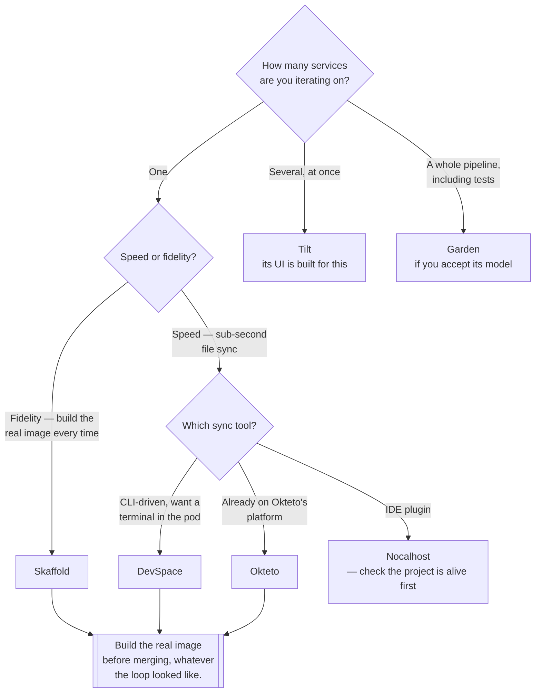

[← Local](../README.md)

# Development

Closing the edit-to-running-pod loop so it takes seconds instead of a checklist.

Tools covered: [`devspace`](devspace/README.md) · [`garden`](garden/README.md) ·
[`nocalhost`](nocalhost/README.md) · [`okteto`](okteto/README.md) ·
[`skaffold`](skaffold/README.md) · [`tilt`](tilt/README.md)

## Contents

1. [The loop being fixed](#1-the-loop-being-fixed)
2. [Build-and-deploy versus file sync](#2-build-and-deploy-versus-file-sync)
3. [The tools, compared](#3-the-tools-compared)
4. [Where the loop still breaks](#4-where-the-loop-still-breaks)
5. [Decision tree](#5-decision-tree)
6. [Anti-patterns](#6-anti-patterns)
7. [How this applies to pikakube](#7-how-this-applies-to-pikakube)

---

## 1. The loop being fixed

Changing one line of application code and seeing it run in Kubernetes, by hand:

```
edit → docker build → docker tag → docker push → edit manifest → kubectl apply → wait → kubectl logs
```

Eight steps, most of them mechanical, and one of them — remembering to bump the tag — is the source
of the "I deployed it and nothing changed" confusion that costs an hour the first time.

Every tool in this folder replaces that with a file watcher and a stream of logs. That is the whole
category. The differences are in *what* they do when a file changes.

## 2. Build-and-deploy versus file sync

The one real distinction:

| | **Build and deploy** | **File sync** |
|---|---|---|
| On change | rebuild the image, redeploy | copy files into the running container, restart the process |
| Speed | seconds to a minute | sub-second |
| Fidelity | **what runs is what will ship** | a dev container with your source mounted in |
| Needs | a working Dockerfile | a container with the language runtime and often a debugger |
| Fails when | builds are slow | the production image differs from the dev one |

Sync feels dramatically better and quietly moves you away from testing the artifact you will
actually deploy. The healthy pattern is sync while exploring, build before merging — and never let
the sync-mode container be the only place the code has ever run.

## 3. The tools, compared

| Tool | Shape | Notable |
|---|---|---|
| **Skaffold** | build and deploy, config in `skaffold.yaml` | Google-maintained, generates its own config, the closest thing to a default |
| **Tilt** | build and deploy, config in a Python-like `Tiltfile` | a live web UI for many services at once; strong for multi-service repos |
| **DevSpace** | sync-first, plus build and deploy | terminal into the dev container, opinionated dev/prod split |
| **Garden** | build, deploy **and test** as a dependency graph | aims at the whole pipeline, not just the loop; heaviest model |
| **Okteto** | sync-first, plus a hosted platform | swaps a deployment for a dev container; the OSS CLI is the part that matters here |
| **Nocalhost** | sync-first, IDE-driven | JetBrains and VS Code plugins; effectively unmaintained — see its notes |

## 4. Where the loop still breaks

The tool solves the mechanics. These remain:

- **Image pull policy.** A cached `latest` in the node's image store means your rebuild is ignored.
  Let the tool tag per build; do not hand-roll `latest`.
- **Ingress and DNS.** Reaching the service from the host is a separate problem the tool may or may
  not solve; port-forwarding is usually the honest answer locally.
- **Dependencies.** A database, a broker, a queue. The tool deploys your service; the rest of the
  stack is your manifests.
- **CRDs and admission.** Fine locally, but if production has webhooks that local does not, the
  loop is testing a different cluster.

## 5. Decision tree



## 6. Anti-patterns

| Anti-pattern | Why it is bad | What to do instead |
|---|---|---|
| Sync mode as the only place code runs | the shipped image was never exercised | a build-and-deploy run before merge |
| `latest` tags in the loop | the node serves a cached image and you debug the old one | per-build tags, which every tool here does |
| Pointing the inner loop at a shared cluster | one developer's rebuild disrupts everyone | a local cluster, or [`remote-development/`](../../managed/remote-development/README.md) done deliberately |
| Using the loop tool to deploy to production | these are development tools; deploys belong to GitOps | Flux or Argo CD |
| Two loop tools in one repository | two sources of truth for how the app is built | pick one and delete the other config |
| Committing developer-specific overrides | breaks the loop for everyone else | profiles, or local-only files |

## 7. How this applies to pikakube

**Skaffold is the only one actually exercised.** [`skaffold/`](skaffold/README.md) contains a
Python app, a Dockerfile, a `deployment.yaml`, a `service.yaml` and a `skaffold.yaml`, along with
the three commands that matter — `skaffold init`, `skaffold dev`, and the `--skip-build` variant
for when the image already exists. Everything else in this folder is a GitHub link.

That is worth reading as a deliberate result rather than as unfinished work: this repository is an
inventory, and the inventory records that one tool was picked up and run to completion while five
others were noted and left alone. Skaffold being the one is unsurprising — it is the least
opinionated of the six and the only one whose config a single command will generate for you.

The gap, if any: nothing here is wired into the rest of the repository. The inner loop targets a
local cluster and stops there, while everything deployed for real goes through Flux. Those are two
separate paths on purpose, and keeping them separate is the correct call.

---

[← Local](../README.md)
