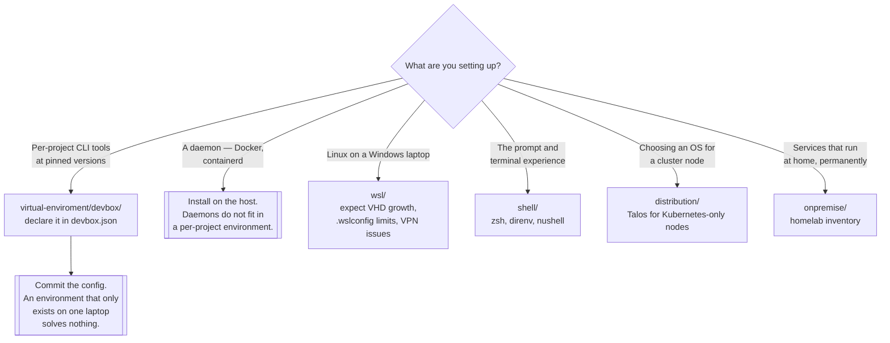

[← Local](../README.md)

# Linux

The workstation underneath the cluster — and making it reproducible instead of hand-built.

Sections covered: [`distribution/`](distribution/README.md) — the kernel and the OSes built on it ·
[`onpremise/`](onpremise/README.md) — the homelab that runs at home ·
[`shell/`](shell/README.md) — the terminal you live in ·
[`virtual-enviroment/`](virtual-enviroment/README.md) — per-project tooling with Devbox ·
[`wsl/`](wsl/README.md) — Linux on a Windows machine

## Contents

1. [Why this is filed under Kubernetes](#1-why-this-is-filed-under-kubernetes)
2. [The reproducibility problem](#2-the-reproducibility-problem)
3. [WSL is a different machine, not a shell](#3-wsl-is-a-different-machine-not-a-shell)
4. [Decision tree](#4-decision-tree)
5. [Anti-patterns](#5-anti-patterns)
6. [How this applies to pikakube](#6-how-this-applies-to-pikakube)

---

## 1. Why this is filed under Kubernetes

Because the tools that talk to a cluster all live on a workstation, and every one of them is
version-sensitive. `kubectl` has a supported skew window against the API server. `helm`, `flux`,
`kustomize`, `vcluster`, `k9s` and `kind` each have their own release cadence and their own
breaking changes.

Install them by hand, on two machines, six months apart, and you get two different environments and
a class of bug that is not in anyone's code. That is what this folder is about: making the
workstation itself a declared artifact rather than an accumulation.

## 2. The reproducibility problem

The failure modes, in the order people hit them:

| Symptom | Cause |
|---|---|
| "Works on my machine" | two engineers, two tool versions, no record of either |
| A project breaks after upgrading a tool for a different project | globally installed dependencies conflict |
| Onboarding takes a day | the setup lives in someone's memory or an outdated wiki |
| The host accumulates cruft | every global install leaves something behind |
| Environments drift | nobody notices until the drift breaks something |

The fix is per-project, declared, isolated tooling —
[Devbox](virtual-enviroment/devbox/README.md) here, backed by Nix. A `devbox.json` in the
repository, `devbox shell` to enter it, and the versions are the same everywhere because they are
pinned in a file rather than remembered.

The limit of that fix matters as much as the fix: **anything that needs a daemon does not fit**.
Docker is the standing example — it is installed on the host, outside Devbox, because the daemon
cannot live in a per-project environment.

## 3. WSL is a different machine, not a shell

Running Linux tools on Windows through WSL2 looks like a terminal and behaves like a VM with its
own kernel, its own disk and its own network stack. Everything surprising about it follows from
that:

- the filesystem is a **virtual disk** that grows and does not shrink on its own
- memory and CPU are capped by a config file on the Windows side, not by anything inside Linux
- corporate VPNs routinely break its networking, because the VPN captures routes the VM needs
- crossing between `/mnt/c` and the Linux filesystem is slow, and it is where most "WSL is slow"
  complaints actually come from

It is a good environment once those are known. Every one of them costs an afternoon if they are
not.

## 4. Decision tree

## 5. Anti-patterns

| Anti-pattern | Why it is bad | What to do instead |
|---|---|---|
| `apt install` for every CLI tool | versions drift between machines and CI | declare them in `devbox.json` |
| Devbox config not committed | the reproducibility is real and only yours | commit it with the project |
| Trying to run the Docker daemon inside Devbox | it does not work, for reasons upstream has closed as by-design | install Docker on the host |
| Never cleaning `/nix/store` | it grows without bound; every old package version is still there | `nix store gc` on a schedule |
| Ignoring `.wslconfig` | WSL takes whatever memory it likes and the host swaps | set explicit CPU and memory limits |
| Assuming WSL disk shrinks after deleting files | the VHD only grows | shrink it deliberately |
| A general-purpose distro on a Kubernetes-only node | package manager, SSH and drift you did not need | an immutable OS such as Talos |

## 6. How this applies to pikakube

This is the part of the repository that is genuinely **in daily use**, and the notes read that way.

[`virtual-enviroment/devbox/`](virtual-enviroment/devbox/README.md) is the centre of it: the full
lifecycle of commands, the VS Code auto-shell hook appended to `~/.bashrc`, how to find out which
packages were installed manually with `apt-mark showmanual`, how to garbage-collect `/nix/store`,
and the two upstream issues that shape the setup — Docker cannot run inside Devbox, and Devbox's
JSON config cannot carry comments, which is why a separate `devbox-comments.yaml` exists.

[`wsl/`](wsl/README.md) carries the sharpest recorded verdict in the folder: the `wsl.conf` boot
command that is supposed to start Docker automatically **does not work**, and the note says so in
plain terms. It also records the VPN workaround (`wsl-vpnkit`), where the 1 TB virtual disk lives,
and how to shrink it.

[`onpremise/`](onpremise/README.md) is a categorised homelab inventory rather than anything
deployed — virtualization, storage, monitoring, MQTT, network, security. It is a shopping list with
opinions embedded in the categories.

[`shell/`](shell/README.md) and [`distribution/`](distribution/README.md) are short link lists. The
one entry in `distribution/` worth a second look is Talos: an immutable, API-driven Linux with no
shell and no package manager, built for exactly one job, which is the honest answer for a
Kubernetes node in [`on-premise/`](../../on-premise/README.md).

---

[← Local](../README.md)
