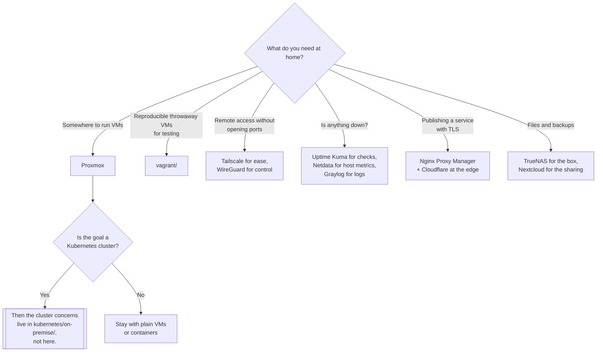

[← Linux](../README.md)

# On premise

The homelab — what runs at home, and the categories it breaks into.

Tools covered: [`vagrant`](vagrant/README.md)

## Contents

1. [What this folder is](#1-what-this-folder-is)
2. [The categories, and what each one is for](#2-the-categories-and-what-each-one-is-for)
3. [Where the homelab and the cluster meet](#3-where-the-homelab-and-the-cluster-meet)
4. [Decision tree](#4-decision-tree)
5. [Anti-patterns](#5-anti-patterns)
6. [How this applies to pikakube](#6-how-this-applies-to-pikakube)

---

## 1. What this folder is

A categorised inventory of self-hosted software for a machine or rack you own, plus
[Vagrant](vagrant/README.md) as the one tool here with commands recorded against it.

It sits under `local/linux/` rather than under
[`kubernetes/on-premise/`](../../../on-premise/README.md) on purpose, and the distinction is worth
being explicit about:

| Folder | Scope |
|---|---|
| this one | services that run on hardware you own, mostly **not** on Kubernetes |
| [`kubernetes/on-premise/`](../../../on-premise/README.md) | running a Kubernetes **control plane** yourself |

A homelab is where you find out what an operational problem actually feels like before it costs
money. That is its value, and it is why the inventory is here rather than nowhere.

## 2. The categories, and what each one is for

| Category | Entries | The point |
|---|---|---|
| **Virtualization** | Proxmox, VMware | the layer everything else sits on; Proxmox is the free, KVM-based answer |
| **Cloud** | OpenStack, CloudStack | a private IaaS — enormous, and only sane if the hardware fleet justifies it |
| **Container** | Portainer, Dockge | a UI over Docker; Dockge is Compose-file-first, Portainer is broader |
| **Dashboard** | Homepage | one page of links to everything you self-host |
| **Monitoring** | Netdata, Uptime Kuma, Graylog | per-host metrics, uptime checks, and log aggregation respectively |
| **Network** | Pi-hole, Tailscale, WireGuard, Nginx Proxy Manager, NetBox | DNS filtering, mesh VPN, raw VPN, reverse proxy with certificates, IPAM |
| **Security** | Cloudflare, CrowdSec, fail2ban | edge protection, crowd-sourced blocklists, log-driven IP banning |
| **MQTT** | EMQX, Mosquitto | IoT messaging; Mosquitto is minimal, EMQX is clustered and heavier |
| **Storage** | Nextcloud, TrueNAS | file sync and sharing, and the NAS underneath it |
| **OS updates** | bootc | bootable container images as the OS update mechanism |

Two entries deserve singling out because they are not obvious:

- **NetBox** is the source of truth for what hardware exists and which IP it has. In a homelab it
  looks like overkill; the moment there are more than a handful of machines it is the difference
  between an inventory and a guess.
- **bootc** applies the container model to the operating system itself: the OS is an OCI image, and
  updating means booting a new image rather than running a package manager. It is the same idea as
  Talos in [`distribution/`](../distribution/README.md), arrived at from the container side.

## 3. Where the homelab and the cluster meet

Three of these categories overlap directly with the rest of this repository, and the overlap is
worth naming so the same problem is not solved twice:

- **Dashboard.** Homepage appears here and again as a Kubernetes deployment in
  [`managed/dashboard-ingress/homepage/`](../../../managed/dashboard-ingress/homepage/README.md).
  Same tool, two contexts: a static link page at home, an ingress-driven one in-cluster.
- **Monitoring.** Netdata and Graylog are the homelab answers to what
  [`observability/`](../../../../../observability/README.md) covers properly for clusters.
- **Network.** WireGuard and Tailscale are the homelab version of the connectivity problem that
  [`network/`](../../../../../network/README.md) handles for the platform.

## 4. Decision tree

## 5. Anti-patterns

| Anti-pattern | Why it is bad | What to do instead |
|---|---|---|
| Kubernetes for a homelab that runs six containers | the control plane costs more than the workloads | Docker Compose, or Proxmox VMs |
| Exposing services straight to the internet | home IPs are scanned continuously | a VPN, or a reverse proxy behind Cloudflare |
| OpenStack in a homelab | operational weight that assumes a datacentre team | Proxmox |
| No backups because it is "just a lab" | the lab is where the family photos ended up | TrueNAS snapshots and an off-site copy |
| Monitoring that runs on the machine being monitored | the alert dies with the host | an external uptime check |
| Pi-hole as the only DNS server | it goes down and the whole house loses DNS | a second resolver configured on the router |

## 6. How this applies to pikakube

The original note is a **link list grouped into categories** — no commands, no verdicts, one URL per
entry. That shape is the finding: this is a shopping list of what to look at when the lab needs
something, not a record of anything deployed.

The one exception is [`vagrant/`](vagrant/README.md), which has real content: the command set, the
WSL-specific environment variables needed to drive VirtualBox from inside WSL, a plugin and an
upstream issue. That is the tool that was actually used, and it was used for the obvious reason —
building throwaway multi-node VMs to install Kubernetes on by hand.

Two entries connect back to the rest of the repository rather than staying local:
[Homepage](../../../managed/dashboard-ingress/homepage/README.md) is deployed in-cluster elsewhere,
and the MQTT brokers belong to the same family as the messaging systems in
[`software-engineering/`](../../../../../software-engineering/README.md).

---

[← Linux](../README.md)
