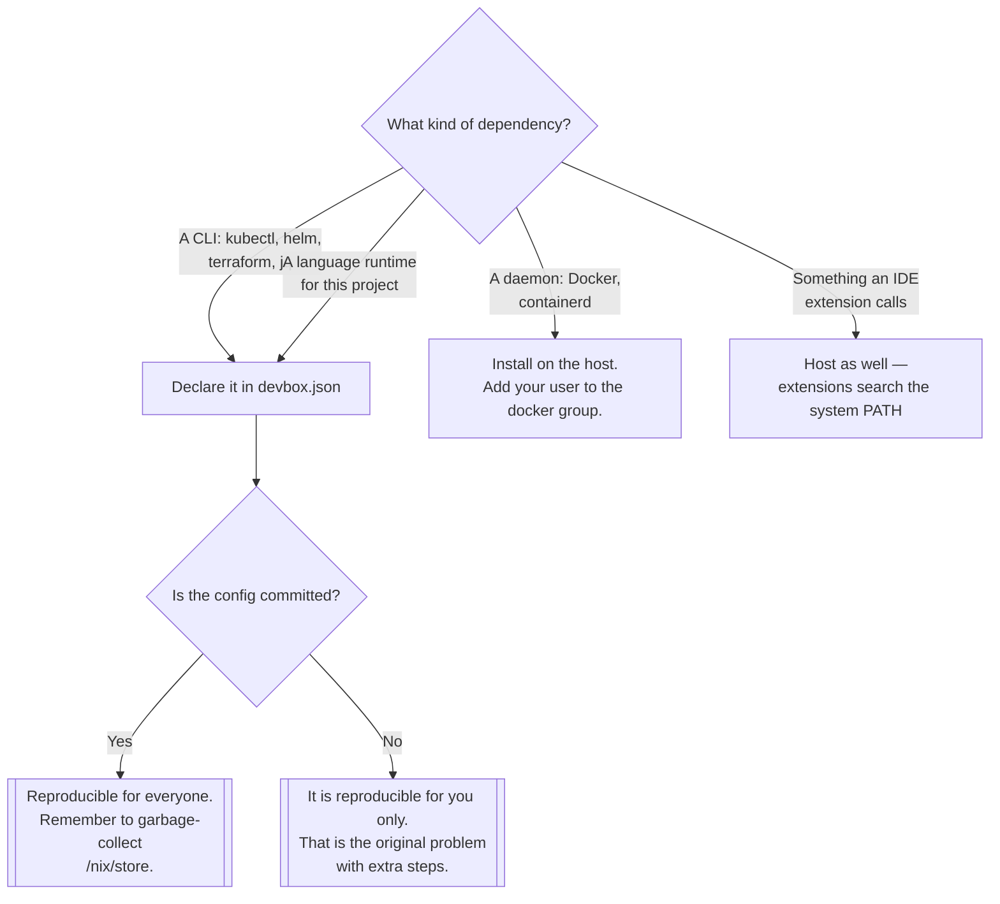

[← Linux](../README.md)

# Virtual environment

Per-project tooling, declared in a file, instead of installed into the machine.

Tools covered: [`devbox`](devbox/README.md)

## Contents

1. [The problem, stated properly](#1-the-problem-stated-properly)
2. [What Nix actually gives you](#2-what-nix-actually-gives-you)
3. [What does not fit in a project environment](#3-what-does-not-fit-in-a-project-environment)
4. [Decision tree](#4-decision-tree)
5. [Anti-patterns](#5-anti-patterns)
6. [How this applies to pikakube](#6-how-this-applies-to-pikakube)

---

## 1. The problem, stated properly

A Kubernetes workstation accumulates: `kubectl`, `helm`, `kustomize`, `flux`, `kind`, `k9s`,
`vcluster`, `terraform`, `jq`, `yq`, a Python version, a Node version. Installed globally, each one
has a single version shared by every project on the machine, and upgrading one for project A can
break project B.

The consequences, which look like separate problems and are the same problem:

| Symptom | Underlying cause |
|---|---|
| "Works on my machine" | no record of which versions were installed |
| Onboarding takes a day | the setup exists in someone's head |
| Upgrading a tool breaks an old project | one global version, many consumers |
| The host is full of half-removed tools | global installs leave residue |
| CI and laptop disagree | two independently maintained lists |

A per-project environment fixes all five at once by moving the list into the repository and making
entering the project directory the thing that activates it.

## 2. What Nix actually gives you

Devbox is a friendly front end; Nix is what makes the guarantee real:

- packages are **content-addressed** and stored under `/nix/store`, so two projects can use two
  versions of the same tool simultaneously without conflict
- an environment is a set of symlinks into that store, built from a declaration — not a sequence of
  installs you hope were the same last time
- nothing is written into `/usr/bin`, so leaving the environment leaves no trace

The cost is disk. Every version of every package ever used stays in `/nix/store` until it is
garbage-collected, and it grows faster than people expect.

## 3. What does not fit in a project environment

The important limit, and the one that surprises people:

- **Daemons.** Docker and containerd need to run as system services, own device nodes and manage
  cgroups. They belong on the host. This is not a Devbox bug; it is what a per-project user-space
  environment cannot do by design.
- **Anything an IDE extension shells out to.** Editor extensions look for binaries on the system
  `PATH`, not in the project shell, unless the editor itself was launched from inside it.
- **Kernel modules and system configuration.** Out of scope entirely.

The practical split that results: daemons and IDE-visible basics on the host, everything else
declared per project.

## 4. Decision tree

## 5. Anti-patterns

| Anti-pattern | Why it is bad | What to do instead |
|---|---|---|
| Installing CLI tools globally "just this once" | that is how version drift starts | declare it, even for one tool |
| Not committing `devbox.json` / the lock file | reproducibility that only exists on one laptop | commit both |
| Expecting the Docker daemon to run inside the environment | it cannot; upstream has said so | Docker on the host |
| Never running a store garbage collection | `/nix/store` grows without limit | `nix store gc`, periodically |
| Pinning nothing and letting versions float | the environment is declared but not reproducible | pin versions in the config |
| Duplicating the tool list in CI | two lists, drifting apart | CI enters the same environment |

## 6. How this applies to pikakube

[`devbox/`](devbox/README.md) is not a bookmark — it is the environment this repository is actually
worked in, and its notes are among the most detailed in the whole tree: the full command lifecycle,
a `~/.bashrc` hook that opens the Devbox shell automatically in VS Code terminals, `apt-mark
showmanual` for auditing what was previously installed by hand before migrating it, the
`/nix/store` size check and the garbage-collection command.

Two upstream issues shape the setup and are recorded there rather than worked around silently:
Devbox's JSON config cannot carry comments, so a separate `devbox-comments.yaml` holds the
candidate package list; and Docker cannot run inside Devbox, so it is installed on the host.

The reason this folder has one tool and no comparison table: the decision was made, it works, and
the interesting content is the operational detail rather than the alternatives.

---

[← Linux](../README.md)
