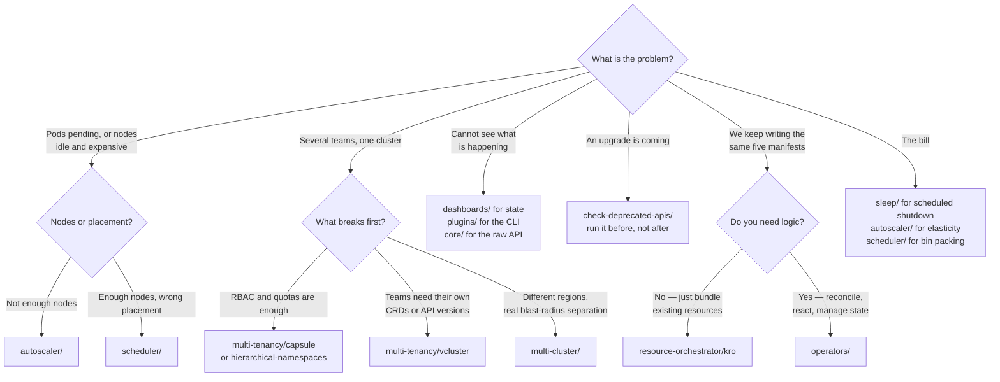

[← Kubernetes](../README.md)

# Managed

Someone else runs the control plane. Everything that is still your problem lives here.

Sections covered: [`autoscaler/`](autoscaler/README.md) · [`check-deprecated-apis/`](check-deprecated-apis/README.md) ·
[`core/`](core/README.md) · [`dashboard-ingress/`](dashboard-ingress/README.md) ·
[`dashboards/`](dashboards/README.md) · [`multi-cluster/`](multi-cluster/README.md) ·
[`multi-tenancy/`](multi-tenancy/README.md) · [`operators/`](operators/README.md) ·
[`platforms/`](platforms/README.md) · [`plugins/`](plugins/README.md) ·
[`remote-development/`](remote-development/README.md) · [`resource-orchestrator/`](resource-orchestrator/README.md) ·
[`scheduler/`](scheduler/README.md) · [`sleep/`](sleep/README.md) ·
[`virtual-machine/`](virtual-machine/README.md) · [`wasm/`](wasm/README.md)

## Contents

1. [What managed actually removes](#1-what-managed-actually-removes)
2. [The four questions this folder answers](#2-the-four-questions-this-folder-answers)
3. [Isolation: namespaces, virtual clusters, real clusters](#3-isolation-namespaces-virtual-clusters-real-clusters)
4. [Cost is a scheduling problem](#4-cost-is-a-scheduling-problem)
5. [Decision tree](#5-decision-tree)
6. [Anti-patterns](#6-anti-patterns)
7. [Notes](#7-notes)
8. [How this applies to pikakube](#8-how-this-applies-to-pikakube)

---

## 1. What managed actually removes

EKS, AKS and GKE take away etcd, the API server, the scheduler binary, certificate rotation and
control-plane upgrades. That is a genuine and large reduction.

What it does not take away:

| Still yours | Where it shows up |
|---|---|
| Node pools, their size and their instance types | [`autoscaler/`](autoscaler/README.md) |
| **When** nodes scale and how fast | [`autoscaler/`](autoscaler/README.md), [`sleep/`](sleep/README.md) |
| Where pods land, and what happens when they cannot | [`scheduler/`](scheduler/README.md) |
| Who can do what, and to whose namespace | [`multi-tenancy/`](multi-tenancy/README.md) |
| Surviving version upgrades without broken manifests | [`check-deprecated-apis/`](check-deprecated-apis/README.md) |
| The cost of all of the above | [`sleep/`](sleep/README.md), [`autoscaler/`](autoscaler/README.md) |

The pattern: managed removes the parts that are *hard to build* and leaves the parts that are *hard
to decide*. Most of the folders below are decisions.

## 2. The four questions this folder answers

Sixteen subfolders, four underlying questions:

**Where does work run?** — [`scheduler/`](scheduler/README.md) decides placement,
[`autoscaler/`](autoscaler/README.md) decides how many nodes exist,
[`sleep/`](sleep/README.md) decides when workloads should not exist at all, and
[`virtual-machine/`](virtual-machine/README.md) and [`wasm/`](wasm/README.md) widen what "work" can
mean beyond a container.

**Who is allowed to do what?** — [`multi-tenancy/`](multi-tenancy/README.md) inside one cluster,
[`multi-cluster/`](multi-cluster/README.md) across several.

**How do humans see it?** — [`dashboards/`](dashboards/README.md) for cluster state,
[`dashboard-ingress/`](dashboard-ingress/README.md) for finding the URLs,
[`plugins/`](plugins/README.md) for the `kubectl` you actually type, and
[`core/`](core/README.md) for the raw API and the commands you need at 3am.

**How do we extend the API?** — [`operators/`](operators/README.md) to write controllers,
[`resource-orchestrator/`](resource-orchestrator/README.md) to compose resources without writing
one, and [`platforms/`](platforms/README.md) for products that have made all of these choices for
you.

## 3. Isolation: namespaces, virtual clusters, real clusters

The most consequential decision in this folder, and the one most often made by accident:

| Level | What is shared | Isolation | Cost |
|---|---|---|---|
| **Namespace** | everything: CRDs, API server, nodes, cluster-scoped resources | RBAC and quota only | near zero |
| **Virtual cluster** | nodes, and the host control plane | tenants get their own API server, CRDs and versions | one control plane per tenant, on shared nodes |
| **Real cluster** | nothing | complete | a full cluster to upgrade, monitor and pay for |

The forcing question is **CRDs**. Namespaces cannot isolate them: install two operators wanting
different versions of the same CRD and one team's upgrade breaks the other's workloads, with no
RBAC boundary that can help. That single constraint is what pushes teams from
[`multi-tenancy/`](multi-tenancy/README.md) into
[vcluster](multi-tenancy/vcluster/README.md) or into separate clusters.

Start at namespaces. Move up only when a specific thing fails, and name the thing.

## 4. Cost is a scheduling problem

On a managed cluster the invoice is almost entirely nodes, and nodes exist because the scheduler
could not fit pods on the ones already running. So cost work is scheduling work:

- **Requests, not usage, drive scaling.** A pod requesting 2 CPU and using 0.1 keeps a node alive.
  The cluster autoscaler reads requests and nothing else.
- **A single unschedulable pod can hold a node.** Or, worse, keep asking for a node that will never
  satisfy it.
- **Non-production clusters are idle most of the week.** Nights and weekends are roughly two thirds
  of the hours — [`sleep/`](sleep/README.md) exists for exactly that arithmetic.
- **Fragmentation is invisible.** Pods spread thin across many nodes cost the same as pods packed
  onto few, and only the second one lets nodes be removed —
  [`scheduler/descheduler/`](scheduler/descheduler/README.md) and bin-packing policies address it.

Right-sizing requests is the highest-leverage action available, and it belongs to application teams
rather than to the platform — which is why it is so often left undone.

## 5. Decision tree



## 6. Anti-patterns

| Anti-pattern | Why it is bad | What to do instead |
|---|---|---|
| A cluster per team as the default | multiplies upgrades, monitoring and cost for isolation namespaces often provide | namespaces, then vcluster, then clusters |
| Writing an operator for a bundle of static YAML | a controller to maintain forever, for templating | [kro](resource-orchestrator/kro/README.md), or Helm |
| Autoscaler tuned without fixing resource requests | it scales to satisfy requests nobody is using | right-size requests first |
| Discovering deprecated APIs after the upgrade | workloads that will not apply, mid-maintenance-window | scan before, in CI |
| A dashboard exposed without authentication | full cluster access behind a URL | OIDC, or no ingress at all |
| Installing an admission webhook without testing failure | a broken webhook can make the API server reject everything | test the failure policy; see [capsule](multi-tenancy/capsule/README.md) |
| Adopting a platform to avoid learning Kubernetes | the abstraction leaks during the first incident | learn the primitives first |
| `kubectl --force --grace-period=0` as routine | it removes the API object while the container may still run | use it knowingly, on stuck resources only |

## 7. Notes

The original note in this folder is a single link:

```
https://github.com/txn2/kubefwd
```

**kubefwd** bulk port-forwards every service in a namespace at once and writes the corresponding
entries into `/etc/hosts`, so a process on your laptop can resolve `my-service` and
`my-service.my-namespace` exactly as it would inside the cluster. It is `kubectl port-forward` for
a whole namespace, without picking local ports by hand.

It is filed at the top of `managed/` rather than in a subfolder, which is fair — it does not belong
to any one capability. The closest neighbours are
[`remote-development/`](remote-development/README.md), which solve the same "run locally, talk to
the cluster" problem more thoroughly and more invasively: kubefwd needs root (it edits `/etc/hosts`)
but changes nothing in the cluster, while
[Telepresence](remote-development/telepresence/README.md) and
[mirrord](remote-development/mirrord/README.md) do change the cluster and get much closer to a real
environment.

## 8. How this applies to pikakube

This is the largest folder in the repository and the one with real deployments rather than
bookmarks. Most tools here carry Flux `HelmRelease` and `HelmRepository` manifests, which means the
install path has been exercised, not just read about.

The most valuable content is the recorded failures, and they cluster:

- **[Capsule](multi-tenancy/capsule/README.md) broke a cluster.** A webhook whose certificate could
  not be parsed made namespace operations fail cluster-wide. The note is unambiguous about it.
- **[Forecastle](dashboard-ingress/forecastle/README.md) reads the wrong host** — it takes the URL
  from `tls.hosts` instead of `rules.hosts`, with the upstream issue filed.
- **[Headlamp](dashboards/headlamp/README.md) cannot scope access by namespace** properly — it
  works only with `ClusterRole` and `ClusterRoleBinding`, which defeats the purpose.
- **[Descheduler](scheduler/descheduler/README.md) does not help unschedulable pods** — it only acts
  on pods already bound to a node, which is precisely not the case people hope it will fix.
- **[Custom scheduler configuration is impossible on managed clouds](scheduler/custom-scheduler/README.md)** —
  with the AKS and EKS issues recorded, and the generic workaround of running a second scheduler.
- **[mirrord's Helm chart is enterprise-only](remote-development/mirrord/README.md)** and needs a
  licence key.

[`core/`](core/README.md) is different in kind: it is the accumulated set of commands for getting
out of trouble — force-deleting pods, clearing namespace finalizers, draining a node that will not
drain — plus the CKA, CKS and LFCS study material. That folder is the one most likely to be opened
during an incident.

---

[← Kubernetes](../README.md)
