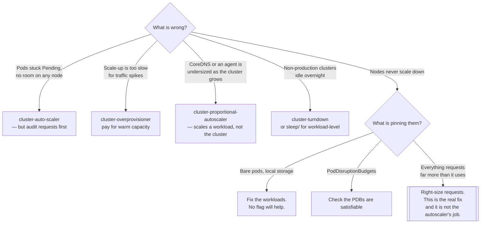

[← Managed](../README.md)

# Autoscaler

Deciding how many nodes exist, and paying for exactly that many.

Tools covered: [`cluster-auto-scaler`](cluster-auto-scaler/README.md) ·
[`cluster-overprovisioner`](cluster-overprovisioner/README.md) ·
[`cluster-proportional-autoscaler`](cluster-proportional-autoscaler/README.md) ·
[`cluster-turndown`](cluster-turndown/README.md)

## Contents

1. [Three layers, three different things](#1-three-layers-three-different-things)
2. [Requests are the input — not usage](#2-requests-are-the-input--not-usage)
3. [Scale-up is slow, and the fix is counter-intuitive](#3-scale-up-is-slow-and-the-fix-is-counter-intuitive)
4. [What stops a node from being removed](#4-what-stops-a-node-from-being-removed)
5. [Decision tree](#5-decision-tree)
6. [Anti-patterns](#6-anti-patterns)
7. [How this applies to pikakube](#7-how-this-applies-to-pikakube)

---

## 1. Three layers, three different things

"Autoscaling" names three mechanisms that are routinely confused:

| Layer | Scales | Triggered by | Lives in |
|---|---|---|---|
| **HPA** | pod replicas | metrics — CPU, memory, custom | Kubernetes core |
| **VPA** | a pod's requests and limits | observed usage | an add-on |
| **Cluster Autoscaler** | **nodes** | pods that cannot be scheduled | this folder |

This folder is the third layer. It reacts to `Pending` pods that the scheduler could not place, adds
a node, and later removes nodes that are underused.

The two extra tools here are neither of those three:
[cluster-overprovisioner](cluster-overprovisioner/README.md) keeps spare capacity warm so scale-up
appears instant, and [cluster-proportional-autoscaler](cluster-proportional-autoscaler/README.md)
scales a *workload* in proportion to cluster size — it is named after the cluster but it does not
scale the cluster.

[cluster-turndown](cluster-turndown/README.md) is different again: scheduled, not reactive.

## 2. Requests are the input — not usage

The single most important fact about the Cluster Autoscaler, and the source of most surprise:

> It looks at **resource requests**. It never looks at actual usage.

Consequences that follow directly:

- A pod requesting 2 CPU and using 0.05 keeps a node alive and billable.
- A cluster at 15% real utilisation can be at 95% *requested* and legitimately scaling up.
- Fixing this is not an autoscaler setting. It is right-sizing requests, in the application's
  manifests, by the team that owns them.

Anyone tuning autoscaler flags before auditing requests is optimising the wrong layer. VPA in
recommendation mode is the cheapest way to find out how wrong the requests are.

## 3. Scale-up is slow, and the fix is counter-intuitive

The sequence when a pod cannot be placed:

```
pod Pending → autoscaler notices → cloud API called → VM boots → node joins → image pulled → pod runs
```

Realistically two to five minutes, and none of it is compressible: the VM boot and the image pull
dominate. For a batch job that is fine. For a traffic spike it is far too slow.

The fix is [cluster-overprovisioner](cluster-overprovisioner/README.md): run pods that do nothing,
at **negative priority**, that hold real capacity. When a real pod arrives it preempts them
immediately and runs on a node that already exists; the evicted placeholders go `Pending`, and
*they* trigger the slow scale-up. You are paying for idle capacity in exchange for latency, which is
an honest trade as long as it is made deliberately.

## 4. What stops a node from being removed

Scale-down is where clusters quietly stay expensive. The autoscaler will refuse to remove a node if
any of these is true:

| Blocker | Why | Fix |
|---|---|---|
| A pod with no controller (bare `Pod`) | nothing would recreate it | run it under a Deployment or Job |
| A pod using local storage (`emptyDir`, `hostPath`) | data would be lost | annotate to allow eviction, if it is genuinely disposable |
| A `PodDisruptionBudget` that cannot be satisfied | evicting would breach it | check the PDB is not `minAvailable: 100%` |
| kube-system pods without a PDB | conservative default | give them PDBs |
| An explicit "do not evict" annotation | someone asked for it | review whether it is still needed |
| Node utilisation above the threshold | by design | the threshold is a flag, but see §2 first |

The characteristic symptom is a cluster that scales up readily and never scales back down. It is
almost always one of the first three rows.

## 5. Decision tree



## 6. Anti-patterns

| Anti-pattern | Why it is bad | What to do instead |
|---|---|---|
| Tuning autoscaler flags before auditing requests | it faithfully scales to satisfy requests nobody uses | VPA in recommendation mode, then fix the manifests |
| Expecting scale-up to absorb a traffic spike | a VM boot plus an image pull is minutes | overprovisioning, or a warm pool |
| One node group of one instance type | either wasteful or unable to fit large pods | several groups, and a priority expander |
| Bare pods in a cluster that should scale down | they pin nodes permanently | always run under a controller |
| `minAvailable: 100%` PDBs | nothing can ever be evicted, so nothing scales down | make the budget actually satisfiable |
| Cluster Autoscaler plus a cloud-native scaler both active | two controllers fighting over node groups | pick one |
| Confusing cluster-proportional-autoscaler with cluster autoscaling | it scales a Deployment, not the cluster | read the name carefully; they are unrelated |

## 7. How this applies to pikakube

All four tools are wired for Flux, and three of the four are Helm-based.

[`cluster-auto-scaler/`](cluster-auto-scaler/README.md) is the most developed: chart `9.58.0` from
`https://kubernetes.github.io/autoscaler`, plus a **priority expander ConfigMap** that ranks node
groups — `t2.large` and `t3.large` at priority 10, `m4.4xlarge` at 50. Higher wins, so large
instances are preferred and the small ones are the fallback. That file is the most concrete piece of
autoscaler configuration in the repository, and it is AWS-shaped. Two upstream issues are recorded
against the project.

[`cluster-turndown/`](cluster-turndown/README.md) has a `TurndownSchedule` pausing the cluster daily
and an upstream issue filed. Notably it is **plain manifests, not Helm** — the only one here that
is.

One defect is worth stating plainly rather than leaving to be discovered: the `HelmRepository` named
`deliveryhero`, used by
[`cluster-overprovisioner/`](cluster-overprovisioner/README.md), points at
`https://kubernetes.github.io/autoscaler` — the **Kubernetes autoscaler chart repository, not
Delivery Hero's**. The Delivery Hero charts live at `https://charts.deliveryhero.io/`. As written,
Flux will not find a `cluster-overprovisioner` chart at that URL and the release cannot reconcile.

---

[← Managed](../README.md)
