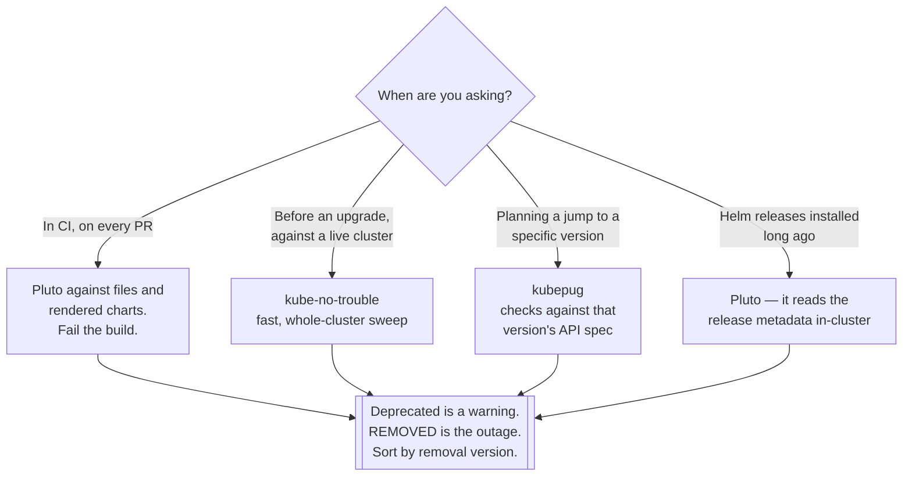

[← Managed](../README.md)

# Check deprecated APIs

Finding the manifests that will stop applying at the next upgrade — before the upgrade.

Tools covered: [`kube-no-trouble`](kube-no-trouble/README.md) · [`kubepug`](kubepug/README.md) ·
[`pluto`](pluto/README.md)

## Contents

1. [The failure this prevents](#1-the-failure-this-prevents)
2. [Where deprecated APIs hide](#2-where-deprecated-apis-hide)
3. [The three tools](#3-the-three-tools)
4. [Decision tree](#4-decision-tree)
5. [Anti-patterns](#5-anti-patterns)
6. [How this applies to pikakube](#6-how-this-applies-to-pikakube)

---

## 1. The failure this prevents

Kubernetes deprecates API versions and then removes them. Removal is the part that bites: a manifest
using `extensions/v1beta1 Ingress` or `policy/v1beta1 PodDisruptionBudget` applies cleanly until the
version that drops it, and then does not apply at all.

The characteristic incident: the control plane upgrade succeeds, everything keeps running — existing
objects are converted and served under the new version — and then something is redeployed and fails.
Possibly weeks later. Possibly at 2am, when the only change was a routine rollout.

That delay is what makes this worth tooling. The upgrade looks successful because the *running*
state is fine; what is broken is your **stored YAML**, and nothing tells you until it is applied.

## 2. Where deprecated APIs hide

Four places, and most people only check the first:

| Location | Why it is missed |
|---|---|
| Manifests in Git | the obvious one |
| **Rendered Helm charts** | the chart's templates, not your files; only visible after rendering |
| **Helm release metadata** in the cluster | the last-applied manifest is stored in a Secret and rolls forward on upgrade |
| Live objects in the cluster | served under a new version, so they look fine until re-applied |

The Helm cases are the ones that catch teams out. A chart you have not touched in a year renders
whatever its templates say, and `helm upgrade` on a newer cluster fails on API versions you never
wrote.

## 3. The three tools

Same job, three angles:

| Tool | Reads | Notable |
|---|---|---|
| **Pluto** (Fairwinds) | files, Helm releases in-cluster, Helm output | the most complete Helm story; good CI exit codes |
| **kube-no-trouble** (`kubent`) | live cluster, files, Helm | the quickest "is my cluster ready" one-shot |
| **kubepug** | live cluster, files, against the Kubernetes **swagger spec** | validates against a target version's real API definition |

They overlap heavily and disagree occasionally. The disagreement is usually about *where* they
looked, not about what is deprecated — which is why the sensible answer is to run one in CI against
files and charts, and one against the cluster before an upgrade.

kubepug's distinguishing feature is that it checks against the API specification for a **specific
target version**, which is the right question when planning a jump: not "is this deprecated" but
"will this exist in 1.33".

## 4. Decision tree

## 5. Anti-patterns

| Anti-pattern | Why it is bad | What to do instead |
|---|---|---|
| Scanning after the upgrade | you find out by failing to deploy | scan first, as a gate |
| Scanning only files in Git | rendered charts and Helm metadata are where the surprises are | scan charts and the cluster too |
| Treating "deprecated" and "removed" as the same urgency | deprecated has years; removed is now | sort by removal version |
| Running it once, manually | new charts reintroduce old APIs | in CI, on every change |
| Ignoring third-party charts you do not control | they are still your outage | pin, check, and upgrade them deliberately |
| Fixing the live objects but not the source | the next apply reintroduces the old version | fix the YAML, always |

## 6. How this applies to pikakube

Three tools, three GitHub links, no commands and no deployments. This is a **mapped** capability,
not an operated one — and unlike some folders in this repository, that gap is worth closing, because
the cost is one CI step and the failure it prevents is a deployment that stops working.

The specific reason it matters here: this repository installs dozens of third-party Helm charts
through Flux. Every one of them renders manifests nobody in this repository wrote, on whatever
schedule upstream chooses. That is precisely the case the Helm-aware scanners exist for, and
precisely the case that file-only scanning misses.

Practical placement, if it is ever wired up: [Pluto](pluto/README.md) against the rendered output of
the Flux `HelmRelease` set, run in CI. That covers the largest exposure with a single job.

---

[← Managed](../README.md)
