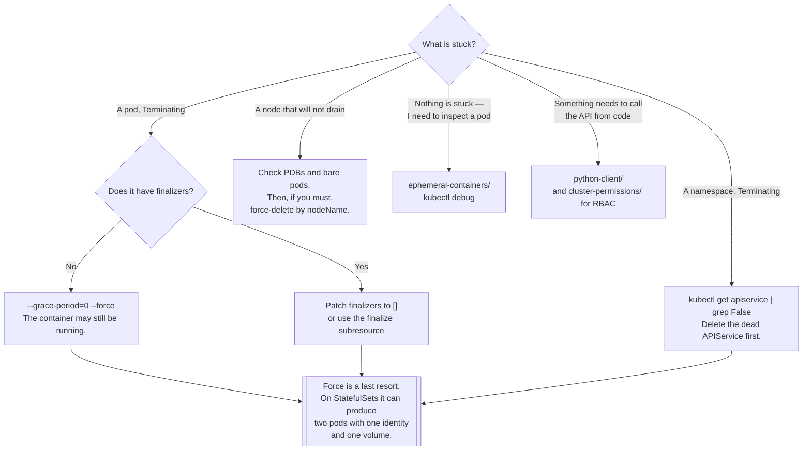

[← Managed](../README.md)

# Core

The API, the primitives, and the commands you need when something is stuck.

Sections covered: [`certifications/`](certifications/README.md) — CKA, CKS, LFCS study material ·
[`cluster-permissions/`](cluster-permissions/README.md) — RBAC ·
[`ephemeral-containers/`](ephemeral-containers/README.md) — debugging a running pod ·
[`python-client/`](python-client/README.md) — talking to the API from code

## Contents

1. [What this folder is](#1-what-this-folder-is)
2. [The API server is an HTTP API](#2-the-api-server-is-an-http-api)
3. [Things that will not delete](#3-things-that-will-not-delete)
4. [Nodes that will not drain](#4-nodes-that-will-not-drain)
5. [Decision tree](#5-decision-tree)
6. [Anti-patterns](#6-anti-patterns)
7. [Notes](#7-notes)
8. [How this applies to pikakube](#8-how-this-applies-to-pikakube)

---

## 1. What this folder is

Not a tool. The primitives everything else in this repository is built on, plus the accumulated set
of commands for getting out of trouble — the ones you cannot look up calmly, because by the time you
need them a namespace has been `Terminating` for twenty minutes.

Four subfolders:

| Folder | What is in it |
|---|---|
| [`certifications/`](certifications/README.md) | CKA, CKS and LFCS preparation — command drills and links |
| [`cluster-permissions/`](cluster-permissions/README.md) | a `ClusterRole` and `ClusterRoleBinding` pair |
| [`ephemeral-containers/`](ephemeral-containers/README.md) | `kubectl debug` against a running pod |
| [`python-client/`](python-client/README.md) | a Deployment that calls the API from inside the cluster |

## 2. The API server is an HTTP API

Everything `kubectl` does is an HTTP request with a bearer token. Internalising that changes how you
debug, because it separates "kubectl is misbehaving" from "the API server said no".

```sh
grep server ~/.kube/config
curl -k URL_ENDPOINT/api/v1/namespaces
curl -k https://127.0.0.1:37799/api/v1/namespaces
curl -k https://127.0.0.1:37799/api/v1/namespaces/default/pods/<pod>/log?container=nginx
```

The response code to an **unauthenticated** request tells you how the cluster is configured:

| Code | Meaning |
|---|---|
| **401** | anonymous access is **disabled** — you are nobody, and nobody is not allowed in |
| **403** | anonymous access is **enabled** — you got in as `system:anonymous` and RBAC refused the action |

That distinction is not intuitive and it is genuinely useful: a 403 to an anonymous curl means the
cluster is accepting unauthenticated requests and relying entirely on RBAC to stop them. Background
reading recorded with it:
<https://arthurchiao.art/blog/cracking-k8s-authn/#12-authn-and-authz>.

Authenticating as a ServiceAccount, from outside:

```sh
TOKEN=$(kubectl get secret $(kubectl get sa default -o jsonpath="{.secrets[0].name}") -o jsonpath="{.data.token}" | base64 --decode)
API_SERVER_ENDPOINT=xxxxxxxxxxxx
NAMESPACE=dev-space-test

curl -k -H "Authorization: Bearer $TOKEN" https://$API_SERVER_ENDPOINT/api/v1/namespaces/$NAMESPACE/pods
```

Worth knowing that on Kubernetes 1.24 and later, ServiceAccounts no longer get a permanent token
Secret automatically — `.secrets[0]` will be empty unless one was created deliberately. The modern
equivalent is `kubectl create token <sa>`, which issues a short-lived one. The script above is
preserved as recorded; on a current cluster it needs that substitution.

## 3. Things that will not delete

**A pod that will not terminate:**

```sh
kubectl delete pod <pod> --grace-period=0 --force
```

What this actually does is important and usually misunderstood: it removes the object from the API
server **without waiting for the kubelet to confirm the container is gone**. The container may still
be running. For a StatefulSet member that means two processes can hold the same identity and the same
volume — which is why the same command against a Zookeeper or database pod is a genuinely dangerous
operation, and why it appears in the notes against exactly such a pod:

```sh
kubectl delete pod kafka-mtolv-zookeeper-0 --grace-period=0 --force
```

**A pod held by a finalizer.** Force-delete does not help here, because the object is not waiting on
the kubelet — it is waiting for a controller that will never come:

```sh
kubectl patch pod <pod> -p '{"metadata":{"finalizers":[]}}' --type=merge
```

Or through the finalize subresource, which is the same idea done properly:

```sh
kubectl get pod <pod> -o json > pod.json
kubectl replace --raw "/api/v1/namespaces/<ns>/pods/<pod>/finalize" -f pod.json
```

**A namespace stuck in `Terminating`** — the single most common version of this problem:

```sh
kubectl get namespace <TERMINATING_NAMESPACE> -o json | jq '.spec = {} | .metadata.finalizers = []' > tempfile.json && \
kubectl replace --raw "/api/v1/namespaces/<TERMINATING_NAMESPACE>/finalize" -f ./tempfile.json && \
rm -f tempfile.json
```

Before running it, check the actual cause, because it is nearly always the same one:

```sh
kubectl get apiservice | grep False
kubectl delete apiservice <apiservice name>
```

A namespace cannot finish deleting until every API group has confirmed it has nothing left in it. An
`APIService` backed by a dead extension server — a metrics adapter, a webhook server whose pods are
gone — never answers, and the namespace hangs forever. Deleting the broken `APIService` unblocks it
properly. Clearing the finalizers by force works too, and leaves whatever the finalizer was
protecting orphaned.

**Bulk deletion by pattern**, from the notes:

```sh
kubectl delete pod $(kubectl get pods | grep 'connect-cluster-portal' | awk '{print $1}')
kubectl delete crd $(kubectl get crds | grep '.gatekeeper\.sh' | awk '{print $1}')
```

The CRD one is worth pausing on: **deleting a CRD deletes every custom resource of that kind, across
every namespace, immediately.** For Gatekeeper that means all constraints and constraint templates.
It is the correct way to remove a policy engine and a catastrophic way to typo.

## 4. Nodes that will not drain

The normal command:

```sh
kubectl drain aks-d64z1-39255961-vmss00000k --ignore-daemonsets --delete-emptydir-data
```

`--ignore-daemonsets` is required because DaemonSet pods are recreated on the node immediately and
would otherwise block forever. `--delete-emptydir-data` acknowledges that `emptyDir` contents are
lost.

The recorded fallback, when drain hangs indefinitely — *"if drain does not work and gets stuck
forever, just delete all the pods"*:

```sh
kubectl get pods -A --field-selector spec.nodeName=aks-spot-9d8s2 \
  -o custom-columns='NAMESPACE:.metadata.namespace,NAME:.metadata.name' --no-headers | \
  while read namespace name; do
    echo "Force-deleting pod $name in namespace $namespace"
    kubectl delete pod "$name" -n "$namespace" --grace-period=0 --force
  done

kubectl delete node aks-d64z1-39255961-vmss00000k
```

The `--field-selector spec.nodeName=` is the useful part to remember independently: it is how you
list everything on one node without grepping. Drain usually hangs on a `PodDisruptionBudget` that
cannot be satisfied or on a pod with no controller — checking which is the right first move, because
this loop bypasses both protections rather than resolving them.

## 5. Decision tree



## 6. Anti-patterns

| Anti-pattern | Why it is bad | What to do instead |
|---|---|---|
| `--force --grace-period=0` as a habit | the API object goes; the container may not | find out what is blocking termination |
| Force-deleting StatefulSet pods | two processes, one identity, one volume — data corruption | let it terminate, or scale the set down |
| Clearing namespace finalizers first | it hides the dead `APIService` that caused it, and orphans resources | delete the broken `APIService` |
| `kubectl delete crd` without checking | every custom resource of that kind disappears cluster-wide | list them first |
| Long-lived ServiceAccount tokens for external access | a permanent credential in a file somewhere | short-lived tokens, or OIDC |
| `curl -k` against a real cluster | TLS verification off means no verification | pass the CA bundle |
| Learning these commands during the incident | the pressure is when mistakes are irreversible | this folder, read in advance |

## 7. Notes

**Reference material recorded here**, and why each is on the list:

- <https://aws.github.io/aws-eks-best-practices/> — the best EKS operational documentation there is,
  and much of it applies to any managed cluster
- <https://github.com/kubernetes/kubernetes> and <https://github.com/kubernetes/kubectl> — the source
- <https://github.com/kubernetes/enhancements> — KEPs, where you find out what a feature actually
  does and which version it is gated behind, before the documentation catches up
- <https://github.com/kubernetes/community> — SIG structure; how to find who owns a component
- <https://github.com/kubernetes/autoscaler> — see [`autoscaler/`](../autoscaler/README.md)
- <https://github.com/dotdc/grafana-dashboards-kubernetes> — the Kubernetes Grafana dashboards worth
  starting from, rather than building from scratch
- <https://github.com/kubernetes-client/python> — the client used by
  [`python-client/`](python-client/README.md)
- <https://github.com/kubernetes-sigs/kui> — a hybrid graphical/terminal `kubectl`, where command
  output is rendered as tables and clickable objects
- <https://github.com/kubernetes-sigs/secrets-store-csi-driver> — mounting secrets from an external
  store as volumes, instead of copying them into `Secret` objects
- <https://github.com/kubernetes/pod-security-admission> — the built-in replacement for
  PodSecurityPolicy; the three levels (privileged, baseline, restricted) applied per namespace by
  label
- <https://github.com/kubernetes/registry.k8s.io> — the community image registry that replaced
  `k8s.gcr.io`; relevant because pinned old image references stop resolving
- <https://github.com/container-storage-interface/spec> — the CSI specification itself
- <https://github.com/GoogleCloudPlatform/kubectl-ai> — natural-language `kubectl`

**Two more operational commands recorded:**

```sh
kubectl exec -it <pod> -c vscode -- df -h
kubectl exec -it <pod> -c vscode -- rm -rf /home/coder/airflow/logs/
```

A specific and recurring incident: a container filling its volume with logs. `df -h` inside the
container is how you confirm it, because the node's disk usage does not show it and the pod's only
symptom is failing writes.

```sh
kubectl get pods --field-selector status.phase=Running
```

Field selectors filter **server-side**. On a large cluster that is materially different from piping
everything through `grep`.

```sh
k logs -l component=scheduler -c scheduler -f --max-log-requests 8 --tail 100 | grep TOR-headshot-reprocessing
```

Following the scheduler's logs across all control-plane replicas at once. `--max-log-requests` has to
be raised because `kubectl logs -l` refuses to follow more than five pods by default — the flag that
makes multi-replica log following work at all.

**Pod distribution across nodes:**
<https://knowledge.broadcom.com/external/article/298697/how-to-evenly-distribute-pods-across-a-t.html>
— recorded alongside the scheduler log command, which is the context: pods clustering onto a few
nodes rather than spreading. The Kubernetes-native answer is topology spread constraints; see also
[`scheduler/`](../scheduler/README.md).

## 8. How this applies to pikakube

This is the folder most likely to be opened **during** an incident rather than while planning one,
and the notes reflect that — they are not a tutorial, they are the commands that worked, against
real pod names from real clusters (`kafka-mtolv-zookeeper-0`, `aks-d64z1-39255961-vmss00000k`,
`prog-baseline-validator-motor-shxzt-9pzdk`). The AKS node names show where they came from.

[`certifications/`](certifications/README.md) is the other half: CKA, CKS and LFCS material, and the
CKA notes in particular are a compressed operational reference — etcd backup, `kubeadm` upgrade
order, static pods, certificate-based user creation — that is useful well beyond the exam.

The one thing to keep in mind reading this folder: almost every command here is a **last resort**
that trades safety for progress. They are written down so they can be used correctly, not so they can
be used first.

---

[← Managed](../README.md)
