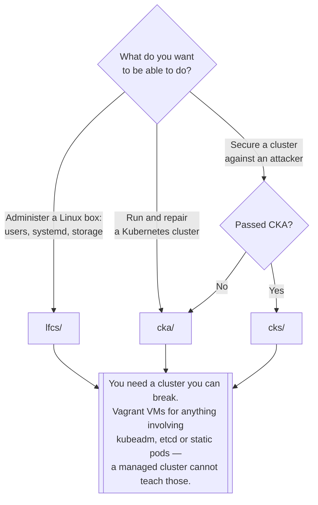

[← Core](../README.md)

# Certifications

CKA, CKS and LFCS — and why the study notes outlive the exam.

Tools covered: [`cka`](cka/README.md) · [`cks`](cks/README.md) · [`lfcs`](lfcs/README.md)

## Contents

1. [What the three exams actually cover](#1-what-the-three-exams-actually-cover)
2. [Why the notes are worth keeping](#2-why-the-notes-are-worth-keeping)
3. [How they are practised](#3-how-they-are-practised)
4. [Decision tree](#4-decision-tree)
5. [Anti-patterns](#5-anti-patterns)
6. [How this applies to pikakube](#6-how-this-applies-to-pikakube)

---

## 1. What the three exams actually cover

All three are **hands-on**: a terminal, a broken or empty system, and a time limit. None of them is
multiple choice, which is the reason the notes have value beyond the certificate.

| | **LFCS** | **CKA** | **CKS** |
|---|---|---|---|
| Subject | Linux systems administration | operating a Kubernetes cluster | securing one |
| Prerequisite | none | none | **CKA must be passed first** |
| Typical content | users, permissions, systemd, networking, storage, `find` | `kubeadm`, etcd, RBAC, scheduling, troubleshooting | admission control, runtime sandboxes, image scanning, network policy, audit |
| Where it shows up in this repo | [`local/linux/`](../../../local/linux/README.md) | this folder and [`core/`](../README.md) | [`on-premise/container-runtime-sandbox/`](../../../on-premise/container-runtime-sandbox/README.md) |

The order they are listed in is roughly the order they make sense in. LFCS teaches the machine, CKA
teaches the cluster on top of it, CKS assumes both and asks what an attacker would do.

## 2. Why the notes are worth keeping

The exam is a deadline; the notes are an operational reference. Specifically:

- **The `kubeadm` upgrade sequence** — control plane first, `drain`, `upgrade plan`, `upgrade apply`,
  then kubelet and kubectl, then `uncordon`; workers second with `kubeadm upgrade node`. That order
  is not optional and it is the same order on a real cluster.
- **etcd backup and restore** — the one procedure you cannot improvise, and the one nobody practises
  until they need it.
- **Certificate-based user creation** — CSR, sign with the cluster CA, build a kubeconfig, bind a
  Role. It is how Kubernetes authentication works underneath every OIDC integration.
- **Static pods** — dropping a manifest in `/etc/kubernetes/manifests` and restarting the kubelet.
  How the control plane itself runs, and a recovery route when the API server is down.
- **Where the logs are** — `/var/log/kube-apiserver.log`, `kube-scheduler.log`,
  `kube-controller-manager.log`, `kubelet.log`, `kube-proxy.log`, and `journalctl -u kubelet`.

Every one of those is a thing you will do on a self-managed cluster and never on a managed one,
which is why this folder connects to
[`on-premise/provision/`](../../../on-premise/provision/README.md) more than to anything in
[`managed/`](../../README.md).

## 3. How they are practised

The exams are timed, and the constraint that shapes preparation is that **typing speed is a real
factor**. Which produces the specific habits the notes record:

- `alias k="kubectl"` and shell completion, set up before anything else
- `kubectl explain` instead of opening the documentation site
- `--dry-run=client -o yaml > file.yaml` to generate a manifest rather than write one
- `kubectl config set-context --current --namespace=<ns>` so `-n` is never typed again
- `vim` fundamentals, down to `dd` for deleting a line

A local multi-node cluster is required for the CKA material, because `kubeadm`, etcd and static pods
have no meaning on a managed one. [Vagrant](../../../local/linux/onpremise/vagrant/README.md) is the
route used here; kind works for the parts that do not involve the control plane's own lifecycle.

## 4. Decision tree

## 5. Anti-patterns

| Anti-pattern | Why it is bad | What to do instead |
|---|---|---|
| Studying by reading | the exam is a terminal, and so is the job | do the tasks on a real cluster |
| Practising only on a managed cluster | etcd, static pods and `kubeadm` are invisible there | Vagrant VMs or kind, depending on the topic |
| Memorising YAML | slower than generating it and being wrong more often | `--dry-run=client -o yaml` |
| Skipping LFCS-level Linux | most cluster problems are node problems | learn the machine first |
| Attempting CKS without CKA | it is a hard prerequisite, not a suggestion | CKA first |
| Throwing the notes away after passing | the `kubeadm` and etcd procedures are the same at 3am | keep them where you will find them |

## 6. How this applies to pikakube

The three folders have very different shapes, and the shape is the information.

[`cka/`](cka/README.md) is **worked notes** — eight files of commands and procedures, written while
doing them. This is the one that has ongoing value; it overlaps directly with
[`core/`](../README.md) and with the on-premise provisioning material.

[`cks/`](cks/README.md) is a **link list** — preparation guides, exercise repositories, course
environments, and five video links. Preparation not yet started, and the collection is the state of
it.

[`lfcs/`](lfcs/README.md) is **five mock exams with worked answers**, plus a curated list of
resources annotated with quality judgements — some marked as excellent theoretical summaries, one
set marked as mediocre. Those judgements are the useful part: it is a filtered list rather than a
search result.

None of this is infrastructure, and it sits in `core/` for the right reason — the CKA material is
the operational reference for everything under
[`on-premise/`](../../../on-premise/README.md), written in the only form that sticks, which is
having done it.

---

[← Core](../README.md)
