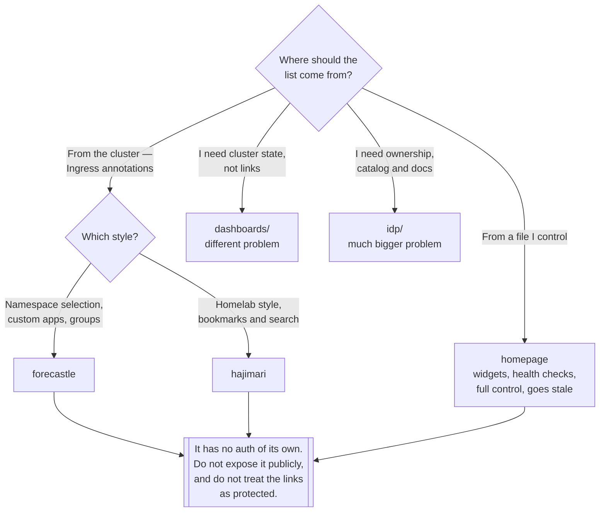

[← Managed](../README.md)

# Dashboard ingress

One page listing every internal URL, so nobody has to remember them.

Tools covered: [`forecastle`](forecastle/README.md) · [`hajimari`](hajimari/README.md) ·
[`homepage`](homepage/README.md)

## Contents

1. [The problem, which is smaller than it sounds](#1-the-problem-which-is-smaller-than-it-sounds)
2. [Discovered or declared](#2-discovered-or-declared)
3. [This is not a security boundary](#3-this-is-not-a-security-boundary)
4. [Decision tree](#4-decision-tree)
5. [Anti-patterns](#5-anti-patterns)
6. [How this applies to pikakube](#6-how-this-applies-to-pikakube)

---

## 1. The problem, which is smaller than it sounds

A platform accumulates web interfaces: Grafana, Argo CD or the Flux UI, a Kubernetes dashboard, a
registry UI, a message-broker console, a tracing UI. Each is behind an Ingress with a hostname
somebody chose six months ago.

The tools here render one page listing all of them. That is the whole scope, and being clear about
the scope matters because it is routinely confused with two much larger things:

| Not this | What it actually is | Where |
|---|---|---|
| A Kubernetes dashboard | shows cluster state — pods, nodes, logs | [`dashboards/`](../dashboards/README.md) |
| An internal developer portal | catalog, ownership, templates, docs | [`idp/`](../../../idp/README.md) |

A link page is a nice thing to have and takes an afternoon. Confusing it with a portal is how teams
end up justifying Backstage to solve a bookmarking problem.

## 2. Discovered or declared

The one real design difference between these tools:

| | **Discovered** | **Declared** |
|---|---|---|
| Source | annotations on `Ingress` objects | a config file you write |
| Tools | Forecastle, Hajimari | Homepage |
| New service appears | automatically, if it is annotated | when someone edits the config |
| Stale entries | impossible — it reflects the cluster | until someone notices |
| Control over presentation | limited to what the annotations allow | complete |

Discovery is the better model for a platform, because the page cannot drift from reality. The
trade-off is that every service owner must remember to annotate their Ingress, and unannotated
services are invisible.

Homepage's declared model is more work and produces a nicer page — it supports widgets, service
health, groups and bookmarks — but it is a file that goes stale, exactly like a wiki page.

## 3. This is not a security boundary

Worth stating explicitly because these tools are usually the first thing exposed:

- The link page itself typically has **no authentication**. It lists URLs; anyone who reaches it
  learns your internal topology.
- Discovery-based tools read `Ingress` objects **cluster-wide**, which needs a `ClusterRole`. That is
  read-only, but it is cluster-wide read of ingress configuration.
- Homepage in `cluster` mode reads more than that, and its RBAC deserves reading before it is
  applied.
- The linked applications are each responsible for their own authentication. A link page does not
  protect anything, and putting it behind SSO does not protect what it links to.

## 4. Decision tree

## 5. Anti-patterns

| Anti-pattern | Why it is bad | What to do instead |
|---|---|---|
| Exposing the link page to the internet | it publishes your internal topology to anyone | keep it internal, or put SSO in front |
| Treating it as an internal developer portal | it has no catalog, no ownership, no docs | [`idp/`](../../../idp/README.md), if that is really the need |
| Hand-maintained link lists on a wiki | stale within a month, and nobody notices | discovery from Ingress annotations |
| Discovery with no annotation convention | half the services are missing and it looks broken | document the annotation, or accept a declared config |
| Assuming the page reflects reality | see the Forecastle bug below — it can show the wrong host | verify the links actually resolve |
| One more dashboard because the last one is wrong | three half-configured pages | fix or delete the first one |

## 6. How this applies to pikakube

All three are deployed, and all three are configured with the same title — **"PikaKube Platform"** —
which makes this a genuine three-way comparison rather than an inventory.

[`forecastle/`](forecastle/README.md) is the most configured: `namespaceSelector: any: true`, a
custom app entry, yellow-and-red header colours, and an Ingress at
`pikakube.127.0.0.1.nip.io` with a `mkcert` TLS secret. It also carries the most valuable content in
this folder — **a recorded bug**: Forecastle reads the URL from `tls.hosts` instead of
`rules.hosts`, described in the original note as *"a completely ridiculous bug"*, with the upstream
issue filed. The consequence is concrete: the Karpor ingress does not work with a
`*.127.0.0.1.nip.io` wildcard.

[`hajimari/`](hajimari/README.md) is minimal — the chart with `ingress.main.enabled: true` and
nothing else.

[`homepage/`](homepage/README.md) is deployed as plain manifests rather than Helm, with a full
ConfigMap: settings, bookmarks, three placeholder service groups, a Google search widget and
`kubernetes.yaml` set to `mode: cluster`. The placeholder content is the tell — it is the default
example, lightly branded, not a curated list.

The finding across all three: this capability is **mapped and installed but not adopted**. Which is
the correct outcome for a repository that is an inventory rather than a running platform — and the
Forecastle bug, found by actually installing it, is worth more than a page of links would have been.

---

[← Managed](../README.md)
