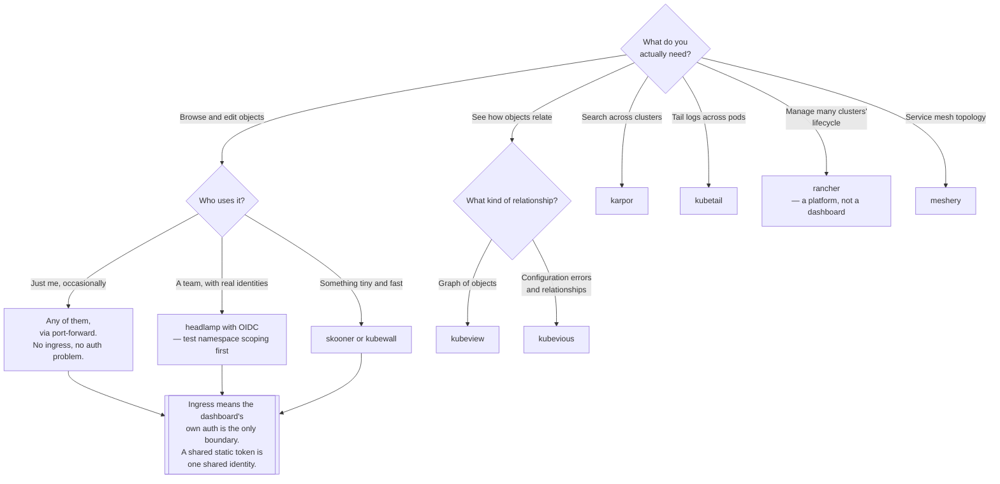

[← Managed](../README.md)

# Dashboards

Seeing cluster state without `kubectl` — and the access-control problem every one of them has.

Tools covered: [`headlamp`](headlamp/README.md) · [`karpor`](karpor/README.md) ·
[`kubernetes-dashboard`](kubernetes-dashboard/README.md) · [`kubetail`](kubetail/README.md) ·
[`kubeview`](kubeview/README.md) · [`kubevious`](kubevious/README.md) ·
[`kubewall`](kubewall/README.md) · [`meshery`](meshery/README.md) ·
[`radar`](radar/README.md) · [`rancher`](rancher/README.md) · [`skooner`](skooner/README.md)

## Contents

1. [Five different things called a dashboard](#1-five-different-things-called-a-dashboard)
2. [Authentication is the hard part](#2-authentication-is-the-hard-part)
3. [Namespace scoping, and why it usually fails](#3-namespace-scoping-and-why-it-usually-fails)
4. [Dashboards are not observability](#4-dashboards-are-not-observability)
5. [Decision tree](#5-decision-tree)
6. [Anti-patterns](#6-anti-patterns)
7. [How this applies to pikakube](#7-how-this-applies-to-pikakube)

---

## 1. Five different things called a dashboard

Eleven tools, five distinct products:

| Kind | What it is for | Here |
|---|---|---|
| **General cluster UI** | browse and edit objects, read logs, exec | Headlamp, Kubernetes Dashboard, Skooner, kubewall |
| **Relationship / topology** | how objects connect, visually | KubeView, Kubevious, Radar |
| **Search and insight** | query across many clusters, spot problems | Karpor |
| **Logs** | tail across pods and namespaces | Kubetail |
| **Management platform** | provision and govern clusters, not just view one | Rancher, Meshery |

Rancher in particular is not comparable to the others: it manages cluster lifecycle across a fleet,
and its UI is one component. Putting it in the same list as Skooner is a category error worth
noticing before comparing them.

## 2. Authentication is the hard part

Installing any of these takes minutes. Making one safe to leave running takes considerably longer,
and this is where they genuinely differ.

The models, worst to best:

| Model | Reality |
|---|---|
| **Static ServiceAccount token** | one token, shared, no expiry, no audit trail — everyone is the same user |
| Token pasted at login | better, but users need a token and audit shows the ServiceAccount |
| **OIDC** | real identities, real RBAC, real audit — the only defensible option for a shared cluster |
| No auth, port-forward only | genuinely fine, because the boundary is `kubectl` access |

Two consequences follow. First, `kubectl port-forward` is an underrated deployment model: nobody
reaches it without cluster credentials, so the dashboard inherits your existing access control.
Second, the moment an `Ingress` is created, the dashboard's own authentication becomes the entire
boundary — and for several of these tools that boundary is a token in a Secret.

## 3. Namespace scoping, and why it usually fails

The natural request — "let this team see only their namespaces" — is harder than it sounds, and it is
where several of these tools fall down.

The reason is architectural. A dashboard wants to show you a **cluster-wide list** — all namespaces,
all nodes, all CRDs — to render its navigation. Listing namespaces is a cluster-scoped operation. So
the dashboard's own ServiceAccount needs cluster-wide read, and if the UI does not then re-check
permissions **per user, per object**, everyone who logs in effectively sees everything the
ServiceAccount can see.

Tools that do this properly perform **user impersonation** or forward the user's own token to the API
server, so Kubernetes RBAC does the filtering. Tools that do not will offer a namespace filter that
is cosmetic.

This is exactly the failure recorded against [Headlamp](headlamp/README.md): restricting by namespace
does not really work, and access ends up requiring `ClusterRole` and `ClusterRoleBinding` — which is
the opposite of scoping. Test this specific behaviour before promising it to anyone.

## 4. Dashboards are not observability

A cluster dashboard answers "what exists right now". It does not answer:

- what happened an hour ago
- why latency rose
- which change caused it
- what the trend is

Those belong to [`observability/`](../../../../observability/README.md) — metrics, logs and traces,
retained and queryable. A dashboard is a live view with no memory, and every one of these tools is
excellent at questions that begin with "is" and useless at questions that begin with "why".

The practical version of the rule: if you are looking at a dashboard during an incident to find out
what changed, you are using the wrong tool.

## 5. Decision tree

## 6. Anti-patterns

| Anti-pattern | Why it is bad | What to do instead |
|---|---|---|
| Dashboard on an Ingress with a static token | one shared identity, no expiry, no audit | OIDC, or port-forward only |
| A ServiceAccount with `cluster-admin` for convenience | anyone who reaches the UI is cluster-admin | least privilege, and impersonation |
| Promising per-namespace access without testing | several of these tools cannot really do it | verify against a restricted user first |
| Using a dashboard to investigate an incident | it has no history | [`observability/`](../../../../observability/README.md) |
| Installing five dashboards | five auth surfaces, five things to upgrade | pick one; delete the rest |
| Editing objects in the UI on a GitOps cluster | the reconciler reverts it, or it becomes undocumented drift | change Git |
| Exposing it publicly because it is "read-only" | reading Secrets is not read-only in any useful sense | never public |

## 7. How this applies to pikakube

Eleven tools, nine with Flux `HelmRelease` manifests and two as plain YAML. This is breadth by
design — the folder is a survey of the category, and the survey has produced findings.

The recorded problems are the valuable part:

- **[Headlamp](headlamp/README.md)** — the sharpest note in the folder. It works well, but scoping
  access by namespace is *"rubbish"*: it only functions with `ClusterRole` and `ClusterRoleBinding`.
  Two upstream issues are recorded, one of them about OIDC on AKS. The token-retrieval command is
  written down.
- **[Kubernetes Dashboard](kubernetes-dashboard/README.md)** — recorded as *"rubbish for localhost"*,
  with the upstream issue, plus the sample-user documentation link and the command to decode the
  token.
- **[Kubevious](kubevious/README.md)** — its chart lives in a separate repository from the project,
  which is recorded because it is not obvious.

Deployment style varies and is informative: [`kubeview`](kubeview/README.md) and
[`kubevious`](kubevious/README.md) come from a `GitRepository` rather than a Helm repository,
[`kubewall`](kubewall/README.md) from an `OCIRepository`, and [`skooner`](skooner/README.md) as plain
manifests taken from upstream. Each of those is a decision forced by what the project publishes, not
a preference.

[`radar`](radar/README.md) is a bookmark with no manifests at all.

The honest summary: this is the folder where the most tools were installed and the fewest were kept.
That is what a survey looks like, and the two recorded verdicts are worth more than the nine
successful installs.

---

[← Managed](../README.md)
