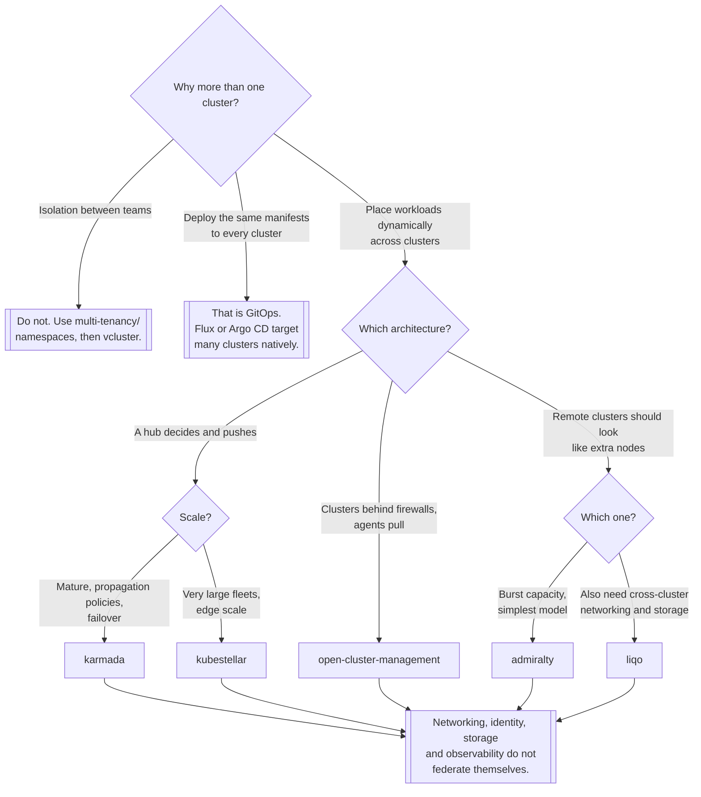

[← Managed](../README.md)

# Multi-cluster

Running more than one cluster on purpose, and the control plane that sits above them.

Tools covered: [`admiralty`](admiralty/README.md) · [`karmada`](karmada/README.md) ·
[`kubestellar`](kubestellar/README.md) · [`liqo`](liqo/README.md) ·
[`open-cluster-management`](open-cluster-management/README.md)

## Contents

1. [Why there is more than one cluster](#1-why-there-is-more-than-one-cluster)
2. [Three architectures](#2-three-architectures)
3. [What breaks the moment you go multi-cluster](#3-what-breaks-the-moment-you-go-multi-cluster)
4. [Decision tree](#4-decision-tree)
5. [Anti-patterns](#5-anti-patterns)
6. [How this applies to pikakube](#6-how-this-applies-to-pikakube)

---

## 1. Why there is more than one cluster

There are only a few good reasons, and it is worth knowing which one applies before installing any of
this:

| Reason | Is it real? |
|---|---|
| **Blast radius** — a cluster-wide failure should not take everything | yes, and it is the strongest |
| **Geography** — latency, or data that may not leave a region | yes |
| **Regulatory separation** — different compliance regimes | yes |
| **Version skew** — upgrade one cluster at a time | yes |
| **Capacity** — one cluster is not big enough | rarely; clusters scale further than most people need |
| **Team isolation** | usually not — see [`multi-tenancy/`](../multi-tenancy/README.md) first |

The last row is the common mistake. A cluster per team multiplies upgrades, monitoring, cost and
operational surface to solve a problem that namespaces, quotas and RBAC often solve — and where they
genuinely do not, [vcluster](../multi-tenancy/vcluster/README.md) is a much cheaper step than a real
cluster.

Multi-cluster is a cost you accept for a reason. If nobody can name the reason, do not pay it.

## 2. Three architectures

The tools here look similar and are not:

| Architecture | Idea | Here |
|---|---|---|
| **Push scheduling** | a hub decides which cluster a workload goes to, and pushes it | Karmada, KubeStellar |
| **Pull agents** | each cluster runs an agent that pulls its assigned work from a hub | Open Cluster Management |
| **Virtual node / burst** | remote clusters appear as **nodes** in the local one, so the normal scheduler handles them | Admiralty, Liqo |

The third is the most elegant and the most surprising. It uses the
[virtual-kubelet](../../on-premise/nodes/virtual-kubelet/README.md) idea: a fake node backed by
another cluster. A pod scheduled onto it actually runs elsewhere, and the local cluster believes it
is running locally. That means no new scheduling concepts — but also that failures happen at a
distance, and the abstraction is thin where the network is.

Push versus pull matters operationally: pull-based agents work when clusters are behind firewalls and
cannot be reached from the hub, which is the normal situation for edge and on-premise fleets.

## 3. What breaks the moment you go multi-cluster

None of these tools makes these problems go away:

- **Networking.** Pods in cluster A cannot reach pods in cluster B without a mesh, a VPN or an
  overlay. Liqo brings its own; the others expect you to have solved it.
- **Identity.** Two clusters, two sets of ServiceAccounts and CAs. Workload identity across clusters
  is a separate problem with its own answers.
- **Storage.** A PersistentVolume does not follow a pod to another cluster. Anything stateful is
  pinned or replicated, and replication is your problem.
- **Observability.** Metrics and logs must be aggregated centrally or you have several partial
  views — see [`observability/`](../../../../observability/README.md).
- **GitOps.** Both Flux and Argo CD can target many clusters natively. That is often the whole
  requirement, and it is much simpler than a federation control plane.

That last point deserves emphasis: **"deploy the same thing to five clusters" is a GitOps problem,
not a federation problem.** These tools earn their place when workloads must be *placed dynamically*
— by capacity, by locality, by policy — not merely replicated.

## 4. Decision tree

## 5. Anti-patterns

| Anti-pattern | Why it is bad | What to do instead |
|---|---|---|
| A cluster per team | upgrades, monitoring and cost multiplied for isolation namespaces provide | [`multi-tenancy/`](../multi-tenancy/README.md) |
| A federation control plane to deploy the same YAML everywhere | a whole control plane for something GitOps does natively | Flux or Argo CD with several targets |
| Assuming pods can talk across clusters | they cannot, without a mesh or overlay | solve networking first |
| Stateful workloads scheduled across clusters | volumes do not follow pods | pin them, or replicate at the data layer |
| No central observability | several partial views and no correlation during an incident | aggregate metrics and logs first |
| The hub as a single point of failure | it becomes the thing that must never break | plan its availability explicitly |
| Adopting one of these before a real placement requirement | large operational cost, no benefit | wait until placement is actually dynamic |

## 6. How this applies to pikakube

Five tools, all with Flux manifests, none with recorded commands or verdicts. This is a **surveyed**
capability — the install path exists for each, and nothing has been run in anger.

Distribution mechanisms differ and are worth noting: [Admiralty](admiralty/README.md) and
[KubeStellar](kubestellar/README.md) come from `OCIRepository` sources, while
[Karmada](karmada/README.md), [Liqo](liqo/README.md) and
[OCM](open-cluster-management/README.md) use Helm repositories.

[Karmada](karmada/README.md) is the only one split into two folders — the project itself and its
operator — which reflects a real choice in how it is installed, and is the closest thing to depth in
this capability.

The honest assessment for this repository: there is no multi-cluster requirement here. The clusters
are local and cloud-managed, GitOps is already in place, and every reason in the table above is
absent. That makes this folder a map of the territory for the day one of those reasons appears —
which is the correct amount of work to have done, and worth saying so rather than treating the empty
`values:` blocks as unfinished business.

---

[← Managed](../README.md)
