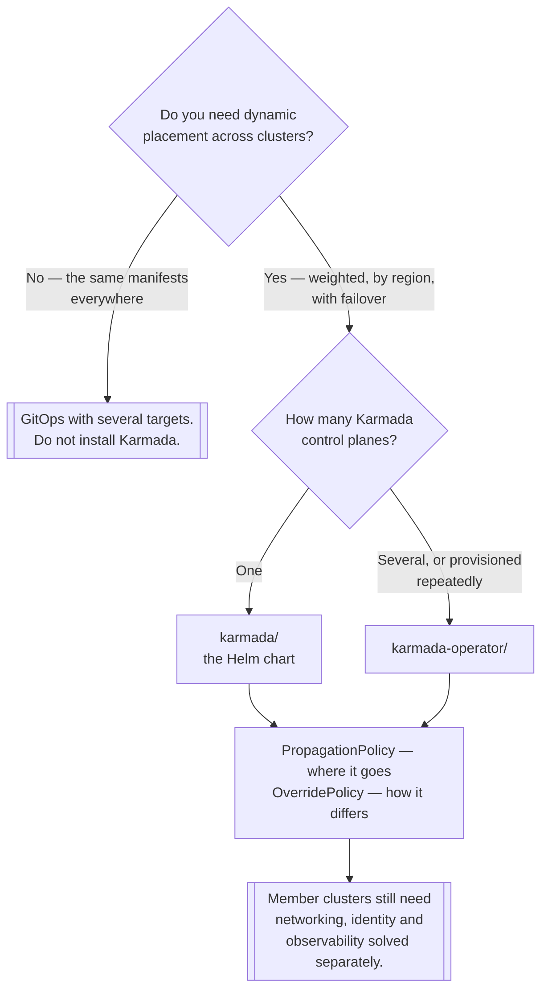

[← Multi-cluster](../README.md)

# Karmada

Kubernetes-native multi-cluster orchestration — and the two ways to install it.

Tools covered: [`karmada`](karmada/README.md) — the Helm chart ·
[`karmada-operator`](karmada-operator/README.md) — the operator that manages control planes

## Contents

1. [What Karmada does](#1-what-karmada-does)
2. [Chart or operator](#2-chart-or-operator)
3. [Propagation and override policies](#3-propagation-and-override-policies)
4. [Decision tree](#4-decision-tree)
5. [Anti-patterns](#5-anti-patterns)
6. [How this applies to pikakube](#6-how-this-applies-to-pikakube)

---

## 1. What Karmada does

Karmada runs an **aggregated API server** that looks like Kubernetes. You submit an ordinary
Deployment to it, then attach a `PropagationPolicy` describing which member clusters it should reach
and in what proportion. Karmada distributes it, tracks the aggregated status, and can reschedule
replicas when a cluster becomes unavailable.

The important property is that the objects you submit are **unmodified Kubernetes objects**. There is
no new manifest format to learn; the multi-cluster behaviour is expressed in separate policy
resources that reference them. That makes it possible to adopt without rewriting anything.

It is a CNCF project, and the most mature of the push-based options in this folder.

## 2. Chart or operator

Two installation models, and the choice is about how many control planes you will run:

| | **Helm chart** ([`karmada/`](karmada/README.md)) | **Operator** ([`karmada-operator/`](karmada-operator/README.md)) |
|---|---|---|
| Installs | one Karmada control plane | a controller that creates Karmada control planes |
| Configured by | Helm values | a `Karmada` custom resource |
| Upgrades | `helm upgrade` | the operator reconciles the desired version |
| Suits | a single control plane, the common case | several control planes, or lifecycle automation |

The operator is the right answer when Karmada control planes are themselves something you provision
repeatedly — multiple tenants, multiple environments. For one control plane it is an extra moving
part between you and a chart.

Both are present here, which makes the folder a comparison rather than a duplication.

## 3. Propagation and override policies

Two resources carry the entire model, and understanding them is understanding Karmada:

- **`PropagationPolicy`** — which resources go to which clusters. Selection can be by name, by label,
  by region, or weighted so replicas are split across clusters in a stated ratio. It also supports
  failover: if a cluster goes away, its share is rescheduled.
- **`OverridePolicy`** — how the resource differs per cluster. The same Deployment with a different
  image registry in one region, a different replica count, a different annotation.

That split is the design's strength. The workload is defined once; placement and per-cluster
variation are separate concerns expressed separately, rather than five copies of a manifest with
small differences — which is what a GitOps-only approach produces and what people eventually get
tired of maintaining.

## 4. Decision tree

## 5. Anti-patterns

| Anti-pattern | Why it is bad | What to do instead |
|---|---|---|
| Karmada to replicate identical manifests | a federation control plane for something GitOps does | Flux or Argo CD with several targets |
| Treating the Karmada API server as optional | it becomes the front door to every cluster | plan its availability like any control plane |
| Overrides used for everything | the base manifest stops describing anything real | keep overrides to genuine per-cluster differences |
| Propagating stateful workloads by weight | volumes do not follow replicas | pin stateful sets to a cluster |
| Installing the operator for one control plane | an extra layer with nothing to manage | use the chart |
| Assuming failover is free | rescheduling replicas needs capacity to reschedule into | reserve headroom, or accept degradation |

## 6. How this applies to pikakube

Both installation paths are mapped and neither is exercised. The chart and the operator each have a
`HelmRelease`, a `HelmRepository` and a namespace manifest, with empty values.

Having both is the interesting part: it records that the *choice* was noticed, which is the thing
that is easy to miss when following a quickstart. Most Karmada documentation assumes one path and
does not mention the other.

As with the rest of [`multi-cluster/`](../README.md), there is no requirement driving this here.
Karmada is the option to reach for if one ever appears and it involves genuine placement decisions
— the most mature project in the folder, with the least surprising object model.

---

[← Multi-cluster](../README.md)
