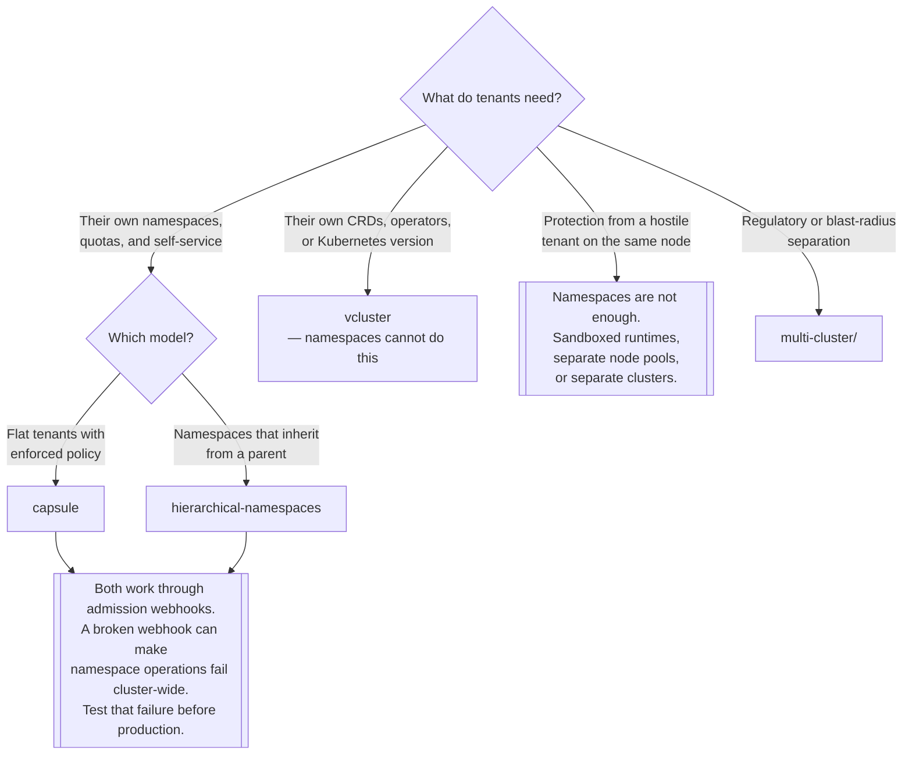

[← Managed](../README.md)

# Multi-tenancy

Several teams, one cluster — and the exact point at which namespaces stop being enough.

Tools covered: [`capsule`](capsule/README.md) ·
[`hierarchical-namespaces`](hierarchical-namespaces/README.md) · [`vcluster`](vcluster/README.md)

## Contents

1. [What a namespace is not](#1-what-a-namespace-is-not)
2. [Three levels of isolation](#2-three-levels-of-isolation)
3. [Soft, hard, and what actually separates them](#3-soft-hard-and-what-actually-separates-them)
4. [Admission webhooks are the risk](#4-admission-webhooks-are-the-risk)
5. [Decision tree](#5-decision-tree)
6. [Anti-patterns](#6-anti-patterns)
7. [How this applies to pikakube](#7-how-this-applies-to-pikakube)

---

## 1. What a namespace is not

A namespace scopes names and gives RBAC and quota something to attach to. It is a useful boundary
and it is not an isolation boundary. Everything below is shared across every namespace in a cluster:

| Shared | Consequence |
|---|---|
| **CRDs** | one version, cluster-wide; two teams cannot have different ones |
| The API server and etcd | one team's request volume affects everyone |
| Nodes and the kernel | a container escape is a cluster compromise |
| Cluster-scoped resources | ClusterRoles, PriorityClasses, StorageClasses, IngressClasses |
| **Admission webhooks** | a webhook installed for one team validates everybody's requests |
| The Kubernetes version | there is one, and everyone upgrades together |

The CRD row is the one that ends most namespace-based tenancy stories. Team A installs an operator;
team B installs a different version of the same operator; the CRD is a single cluster-scoped object
and one of them loses. No amount of RBAC helps, because the conflict is not about permission.

## 2. Three levels of isolation

| Level | Tool | What tenants get | What they still share |
|---|---|---|---|
| **Namespace + policy** | [Capsule](capsule/README.md), [HNC](hierarchical-namespaces/README.md) | their own namespaces, quotas, network policies, self-service creation | CRDs, API server, nodes, webhooks, version |
| **Virtual cluster** | [vcluster](vcluster/README.md) | their **own API server**, their own CRDs, their own version | nodes, and the host cluster's control plane |
| **Real cluster** | [`multi-cluster/`](../multi-cluster/README.md) | everything | nothing |

The middle row is the one people do not know exists, and it is the answer to most of the problems the
first row cannot solve. A virtual cluster is a real API server and etcd (or SQLite) running as a pod;
tenants get admin on it and their workloads are scheduled onto the host's nodes.

Move up a level only when you can name the thing that failed at the level below.

## 3. Soft, hard, and what actually separates them

"Multi-tenancy" means two very different threat models:

- **Soft** — tenants are colleagues. The goal is preventing accidents and noisy neighbours. Namespaces,
  quotas, RBAC and network policies are proportionate.
- **Hard** — tenants are mutually untrusted, possibly hostile. The goal is that a compromise in one
  cannot reach another.

Hard multi-tenancy on shared nodes is not achievable with namespaces, because the kernel is shared. A
container escape defeats every Kubernetes-level control at once. Getting closer requires
[sandboxed runtimes](../../on-premise/container-runtime-sandbox/README.md) — gVisor, Kata — or
separate node pools, or separate clusters.

Being honest about which model applies avoids the most expensive mistake in this area: building
elaborate namespace policy and describing it as isolation.

## 4. Admission webhooks are the risk

Every tool in the first row works by intercepting API requests with a **validating or mutating
webhook**. That is how they can enforce "this tenant may only create namespaces with this prefix" —
rules Kubernetes RBAC cannot express.

The consequence is a failure mode that is easy to underestimate:

- The webhook sits in the request path for the resources it watches.
- If the webhook's pods are unavailable, or its certificate is invalid, the API server cannot get an
  answer.
- With `failurePolicy: Fail` — the default for anything security-relevant, and correctly so —
  **requests are rejected**.

So a broken tenancy controller does not degrade tenancy. It stops namespace operations working, for
everyone, including the operations you would use to fix it. This is not hypothetical here: it is
exactly what is recorded against [Capsule](capsule/README.md).

Mitigations, in order of usefulness: exclude `kube-system` and the controller's own namespace from
the webhook's scope; monitor the webhook's certificate and pod health as a cluster-critical
component; know the `kubectl delete validatingwebhookconfiguration` escape route **before** you need
it; and test the failure deliberately on a disposable cluster.

## 5. Decision tree

## 6. Anti-patterns

| Anti-pattern | Why it is bad | What to do instead |
|---|---|---|
| Namespaces described as isolation | the kernel, CRDs and webhooks are shared | say "soft tenancy", and mean it |
| A cluster per team from the start | operational cost multiplied before anything has failed | namespaces, then vcluster, then clusters |
| Installing a tenancy webhook without testing its failure | it can take namespace operations down cluster-wide | test with the controller stopped |
| No `ResourceQuota` | one tenant's runaway job starves the rest | quota every tenant namespace |
| No `NetworkPolicy` | every pod can reach every other pod, across tenants | default-deny, then allow |
| Tenants able to create ClusterRoles | they can grant themselves anything | keep cluster-scoped resources with the platform |
| Assuming vcluster isolates the kernel | workloads still run on shared nodes | sandboxed runtimes if the threat model needs it |

## 7. How this applies to pikakube

Three tools, three levels, and one genuinely valuable recorded failure.

**[Capsule](capsule/README.md) broke a cluster.** The note is blunt — *"careful with this rubbish, it
breaks the cluster"* — and it comes with the exact error: a webhook that could not load its root
certificates, so `owner.namespace.capsule.clastix.io` failed and namespace operations stopped
working. That is the §4 failure mode, observed rather than predicted, and it is the most useful
single line in this folder.

**[vcluster](vcluster/README.md)** is the one with a working command sequence — install, create,
connect, disconnect, delete — pinned to `v0.24.1`. It is the tool that was actually driven rather
than only installed.

**[HNC](hierarchical-namespaces/README.md)** is deployed from a `GitRepository` with parent/child
namespace examples and an `HNCConfiguration`, which is enough to see the propagation model working.

The pattern across the three is the repository's usual one: the tools were installed, one of them
caused a real problem, and the problem was written down. For anyone reading this folder to make a
decision, the Capsule note is worth more than the other two entries combined — not because Capsule is
bad, but because it is the concrete form of the risk that every tool in this category carries.

---

[← Managed](../README.md)
