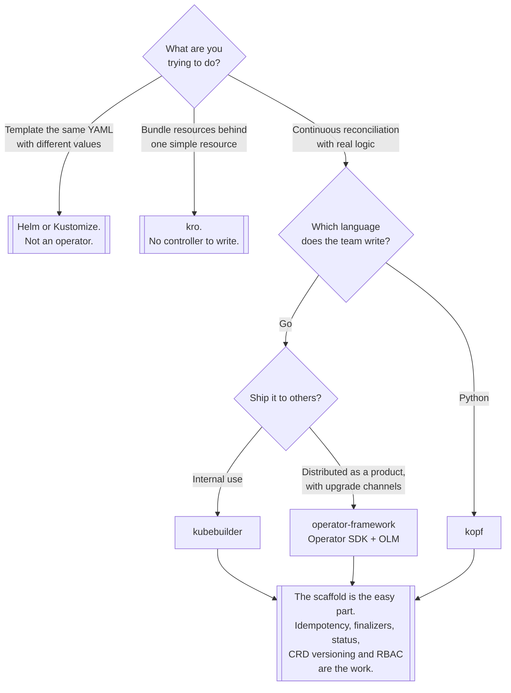

[← Managed](../README.md)

# Operators

Extending the Kubernetes API with your own resources — and when not to.

Tools covered: [`kopf`](kopf/README.md) · [`kubebuilder`](kubebuilder/README.md) ·
[`operator-framework`](operator-framework/README.md)

## Contents

1. [What an operator actually is](#1-what-an-operator-actually-is)
2. [When you do not need one](#2-when-you-do-not-need-one)
3. [The three toolkits](#3-the-three-toolkits)
4. [What is hard about writing one](#4-what-is-hard-about-writing-one)
5. [Decision tree](#5-decision-tree)
6. [Anti-patterns](#6-anti-patterns)
7. [How this applies to pikakube](#7-how-this-applies-to-pikakube)

---

## 1. What an operator actually is

Two parts, and both are required for the word to mean anything:

- a **CustomResourceDefinition** — a new object type the API server accepts and stores
- a **controller** — a process watching those objects and continuously working to make reality match
  them

The second part is the whole idea. A controller is not a script that runs on create; it is a loop
that runs **forever**, comparing desired state with actual state and acting on the difference. Delete
a Pod an operator created and it comes back, because the loop notices.

This means an operator encodes **operational knowledge**: how to back up this database, how to fail
it over, how to upgrade it in the right order. That is why databases and message brokers have
operators and why stateless web applications do not.

## 2. When you do not need one

Most of the time. The honest hierarchy, cheapest first:

| Need | Reach for |
|---|---|
| Templating the same manifests with different values | Helm, or Kustomize |
| Bundling several resources behind one simple resource | [kro](../resource-orchestrator/kro/README.md) |
| Reacting once to an event | a Job, or a webhook |
| Continuous reconciliation with real domain logic | **an operator** |
| Managing a stateful system's lifecycle: backup, failover, upgrade | **an operator** |

The test to apply: **is there logic that must run repeatedly in response to state, that cannot be
expressed as a template?** If not, an operator is a controller to maintain forever in exchange for
templating.

The cost is genuinely ongoing. A controller runs continuously with cluster permissions, needs to
handle every version of its own CRD it has ever shipped, needs upgrading with Kubernetes, and its
bugs are cluster-wide.

## 3. The three toolkits

| | **Kubebuilder** | **Operator SDK** | **Kopf** |
|---|---|---|---|
| Language | Go | Go (also Ansible, Helm) | **Python** |
| Basis | controller-runtime | controller-runtime, plus OLM | its own framework |
| Scaffolds | project, API, controller, tests | the same, plus bundle/catalog | nothing — it is a library |
| Distribution | you decide | **OLM** — catalogs, upgrade channels | you decide |
| Learning curve | steep | steep | gentle |
| Where it fits | the mainstream choice | operators shipped as products | internal automation, prototypes |

Kubebuilder and Operator SDK are close relatives — both build on `controller-runtime`, and the SDK is
roughly Kubebuilder plus packaging and distribution through the Operator Lifecycle Manager. Choosing
between them is largely about whether you need OLM.

Kopf is a different proposition: a Python decorator library where handlers respond to events on your
resources. Far less machinery, far less rigour, and for a team that writes Python rather than Go it
is the difference between an operator existing and not existing.

## 4. What is hard about writing one

Not the happy path. The scaffolding tools make "watch a CR and create a Deployment" a morning's work.
What follows:

- **Idempotency.** The reconcile loop will be called repeatedly for the same object, including for
  reasons unrelated to any change. It must converge, not accumulate.
- **Error handling and requeue.** Every failure needs a decision: retry with backoff, give up, or
  record and wait. Getting this wrong produces hot loops that hammer the API server.
- **Finalizers.** Cleaning up external resources on delete requires a finalizer — and a finalizer
  whose controller is broken means an object that cannot be deleted. See
  [`core/`](../core/README.md) for the resulting mess.
- **Status and conditions.** Reporting state properly is what makes an operator usable by anyone else.
- **CRD versioning.** Once shipped, you support that version. Conversion webhooks are the mechanism
  and they are not fun.
- **RBAC.** The controller needs permissions; the temptation is `cluster-admin`, and the result is a
  process with total cluster access whose bugs are unbounded.

None of this is exotic. All of it is the difference between a demo and something you can leave
running.

## 5. Decision tree

## 6. Anti-patterns

| Anti-pattern | Why it is bad | What to do instead |
|---|---|---|
| An operator for static YAML | a permanent controller in exchange for templating | Helm, Kustomize, or kro |
| `cluster-admin` for the controller | a bug becomes total cluster compromise | least privilege, generated from the code |
| Non-idempotent reconcile | duplicated resources, and drift that grows | converge to desired state, every time |
| No status conditions | nobody can tell whether it worked | conditions, properly |
| Finalizers without tested cleanup | objects that cannot be deleted, ever | test the delete path first |
| One CRD version, forever mutable | consumers break on every change | version the API and mean it |
| Reconcile with no backoff | a failing dependency is hammered until it stays down | exponential backoff |
| An operator wrapping another operator | two loops, one truth, arguing | use the underlying one |

## 7. How this applies to pikakube

**[Kopf](kopf/README.md) is the one with real work in it.** The folder contains a complete Python
operator: a Dockerfile, a build script, handlers for four different backing services — `kafka.py`,
`minio.py`, `mongo.py`, `postgres.py` — three CRDs, RBAC, a Deployment and example custom resources.
That is a working operator that provisions backing services from custom resources, not a tutorial
checkout.

Two learning references are recorded with it: a PyCon India 2021 talk repository and its video.

[Kubebuilder](kubebuilder/README.md) and
[operator-framework](operator-framework/README.md) are link-only. The operator-framework entry
records three separate projects — the SDK, the Operator Lifecycle Manager and the newer
operator-controller — which is worth keeping distinct, because they are commonly discussed as one
thing and are not.

The pattern is consistent with the rest of the repository: the tool matching the language actually
used got built with; the Go toolchains were mapped. And the choice was arguably right — for internal
automation, a Python operator that exists beats a Go operator that does not.

---

[← Managed](../README.md)
