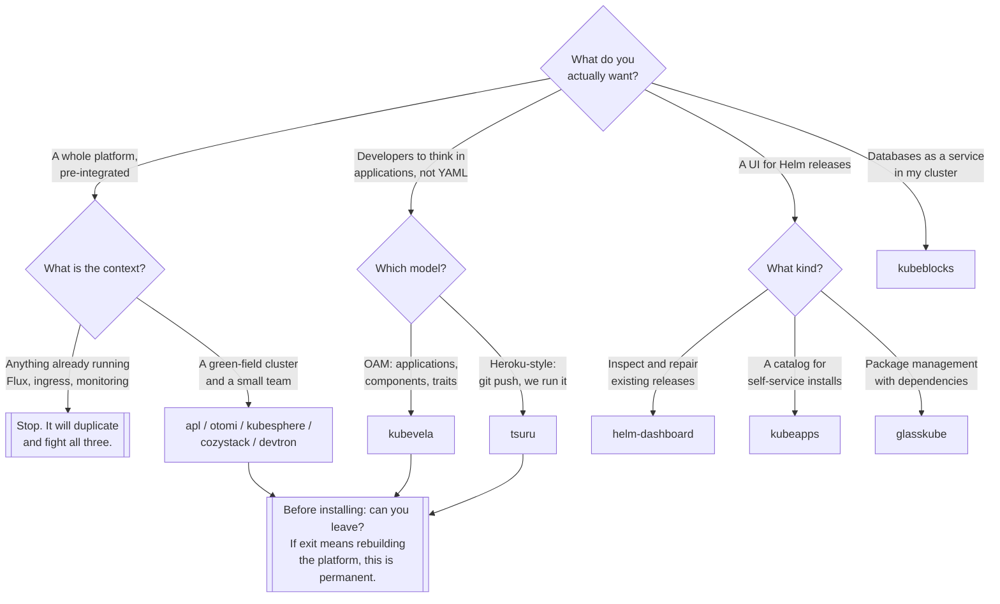

[← Managed](../README.md)

# Platforms

Products that make the platform decisions for you — and what you give up in return.

Tools covered: [`apl`](apl/README.md) · [`cozystack`](cozystack/README.md) ·
[`devtron`](devtron/README.md) · [`glasskube`](glasskube/README.md) ·
[`helm-dashboard`](helm-dashboard/README.md) · [`kubeapps`](kubeapps/README.md) ·
[`kubeblocks`](kubeblocks/README.md) · [`kubesphere`](kubesphere/README.md) ·
[`kubevela`](kubevela/README.md) · [`otomi`](otomi/README.md) · [`tsuru`](tsuru/README.md)

## Contents

1. [Four different products in one folder](#1-four-different-products-in-one-folder)
2. [The trade every platform asks you to make](#2-the-trade-every-platform-asks-you-to-make)
3. [How to evaluate one honestly](#3-how-to-evaluate-one-honestly)
4. [Decision tree](#4-decision-tree)
5. [Anti-patterns](#5-anti-patterns)
6. [How this applies to pikakube](#6-how-this-applies-to-pikakube)

---

## 1. Four different products in one folder

Eleven entries, four categories, and confusing them wastes a lot of time:

| Category | What it is | Here |
|---|---|---|
| **Full platform distribution** | an opinionated bundle: ingress, GitOps, observability, policy, identity, all pre-integrated | APL, Otomi, KubeSphere, Cozystack, Devtron |
| **Application abstraction** | a model above Kubernetes objects: applications, components, environments | KubeVela, Tsuru |
| **Package management UI** | browse, install and manage Helm releases through a UI | Kubeapps, Helm Dashboard, Glasskube |
| **Domain platform** | a platform for one class of workload | KubeBlocks — databases |

A full distribution is a decision about your entire stack. A Helm UI is an afternoon. Both are filed
here, and reading the folder as a list of comparable options is the first mistake available.

## 2. The trade every platform asks you to make

Every product here offers the same bargain: **fewer decisions, in exchange for its decisions.**

What you get:

- a working stack on day one rather than a quarter of integration
- components chosen to work together, upgraded together
- a UI and a workflow that a team can be handed

What you give up:

- **component choice** — it brings its own ingress, its own GitOps, its own monitoring
- **upgrade timing** — you move when the distribution moves
- **debuggability** — a problem is now in the platform's abstraction, not in Kubernetes
- **exit cost** — leaving means reimplementing what it was doing, and the longer you stay the larger
  that is

The bargain is good when the alternative is genuinely nothing, and bad when it replaces things that
already work. Installing a full distribution onto a cluster that already runs Flux, cert-manager and
an ingress controller does not simplify anything — it duplicates all three and forces a fight over
which one owns what.

## 3. How to evaluate one honestly

Six questions, in order of how much they will hurt if unanswered:

1. **What does it replace?** If it brings its own GitOps and you use Flux, one of them has to go.
2. **Can you leave?** If the answer requires rebuilding the platform, the decision is close to
   permanent — price it that way.
3. **Who maintains it, and would you notice if they stopped?** Several projects in this space have
   changed owner, been rebranded, or gone quiet.
4. **Is the abstraction leak-proof enough?** During an incident someone will need the Kubernetes
   objects underneath. Are they comprehensible?
5. **Open source or open core?** Which capabilities are behind a licence, and are any of them ones you
   will need.
6. **What is the upgrade story?** Distributions upgrade as a unit, which is either reassuring or
   inflexible depending on your release cadence.

## 4. Decision tree

## 5. Anti-patterns

| Anti-pattern | Why it is bad | What to do instead |
|---|---|---|
| A platform to avoid learning Kubernetes | the abstraction leaks during the first incident, when it is least welcome | learn the primitives, then abstract |
| Installing a distribution onto a working cluster | it duplicates ingress, GitOps and monitoring, then fights them | green-field, or do not |
| Adopting one without an exit plan | migrating away means rebuilding the platform | know the cost before, not after |
| Confusing a Helm UI with a platform | wildly different commitments in the same folder | read what it actually is |
| Self-service installs from a public catalog | anyone can install anything, with any permissions | curate the catalog, and constrain RBAC |
| Ignoring who maintains it | this space rebrands, changes owner and goes quiet | check the repository before the demo |
| Two platforms because each does half | two control planes contradicting each other | choose |

## 6. How this applies to pikakube

Eleven entries, ten with Flux manifests, every `values:` block empty, and no commands or verdicts
recorded anywhere. This is the widest and shallowest folder in the repository — a survey of a
category, not an adoption.

Three findings are worth extracting from the manifests, because none of them is in the notes:

**[APL](apl/README.md) and [Otomi](otomi/README.md) are the same product.** Otomi was acquired and
became Akamai/Linode's Application Platform; the APL chart comes from
`https://linode.github.io/apl-core` and the Otomi chart from `https://otomi.io/otomi-core`. Having
both mapped records the transition, which is genuinely useful history — but they are not two options
to compare.

**Both of those releases have an empty `version:` field.** An unset chart version means Flux resolves
whatever is latest at reconcile time, so the deployed version can change without any commit. In a
GitOps repository that is the one thing pinning is for.

**[Kubeapps](kubeapps/README.md) pulls from `https://charts.bitnami.com/bitnami`**, which is the
dependency most exposed to outside events in this folder — Bitnami's public catalog and image
distribution have been substantially restructured under Broadcom. Any chart depending on it deserves
verification rather than assumption.

The folder's real value is as a map: when the question "should we adopt a platform?" arrives, the
categories in §1 and the six questions in §3 matter far more than which of the eleven is picked. And
for this repository the answer is currently no — the platform is being assembled deliberately from
the GitOps layer, [`observability/`](../../../../observability/README.md) and the rest, which is the
alternative these products exist to replace.

---

[← Managed](../README.md)
