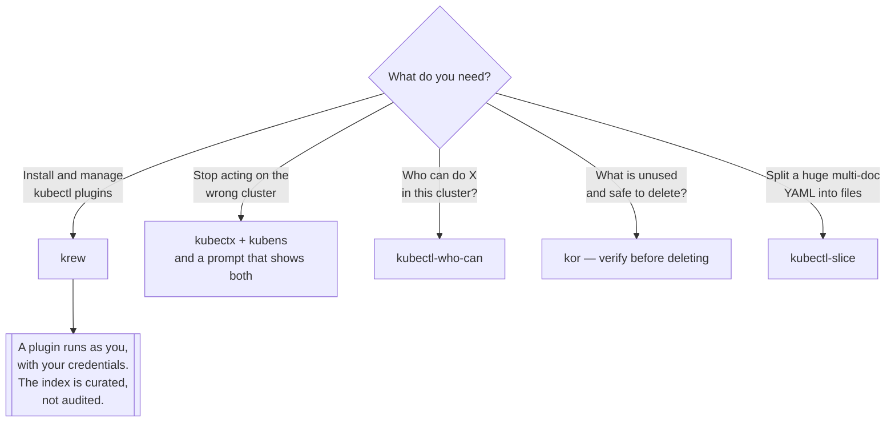

[← Managed](../README.md)

# Plugins

The `kubectl` you actually type — extended.

Tools covered: [`kor`](kor/README.md) · [`krew`](krew/README.md) ·
[`kubectl-who-can`](kubectl-who-can/README.md) · [`kubectx`](kubectx/README.md) ·
[`slice`](slice/README.md)

## Contents

1. [How kubectl plugins work](#1-how-kubectl-plugins-work)
2. [What each of these is for](#2-what-each-of-these-is-for)
3. [The context problem](#3-the-context-problem)
4. [Decision tree](#4-decision-tree)
5. [Anti-patterns](#5-anti-patterns)
6. [How this applies to pikakube](#6-how-this-applies-to-pikakube)

---

## 1. How kubectl plugins work

The mechanism is deliberately trivial: any executable on your `PATH` named `kubectl-foo` can be
invoked as `kubectl foo`. No registration, no API, no plugin interface. A shell script is a valid
plugin.

[krew](krew/README.md) is the package manager on top of that convention — it installs plugins from an
index into `~/.krew/bin` and puts that directory on your `PATH`. It is itself a plugin, which is a
neat demonstration of how little the mechanism requires.

Two consequences worth internalising:

- **A plugin runs with your credentials, as you.** Installing one is running someone else's code with
  your cluster access. The krew index is curated, which helps; it is not a guarantee.
- **Plugins are workstation tools.** Nothing here runs in a cluster, nothing is deployed, and nothing
  belongs in a GitOps repository except as documentation.

## 2. What each of these is for

| Tool | Question it answers |
|---|---|
| [krew](krew/README.md) | how do I install and update the others |
| [kubectx / kubens](kubectx/README.md) | which cluster and namespace am I about to act on |
| [kubectl-who-can](kubectl-who-can/README.md) | who is allowed to do this thing |
| [kor](kor/README.md) | what in here is unused and can be deleted |
| [kubectl-slice](slice/README.md) | how do I split this enormous multi-document YAML file |

They are unrelated tools filed together because they share a delivery mechanism, not a purpose. The
one with the largest safety payoff is `kubectx`; the one with the largest cleanup payoff is `kor`.

## 3. The context problem

The single most consequential thing on this page. `kubectl` acts on whichever context your kubeconfig
currently points at, and there is nothing in the command output to remind you which that is. The
result is the well-known incident shape: a command intended for a local cluster, executed against
production, because the context was left over from an earlier task.

Three layers of defence, and they compose:

- **Make the context visible** — a shell prompt showing cluster and namespace. This is the single
  highest-value change available.
- **Make switching cheap and explicit** — [`kubectx` and `kubens`](kubectx/README.md), so switching is
  a deliberate act rather than a forgotten one.
- **Make it automatic per directory** — `direnv` setting `KUBECONFIG` per project, from
  [`local/linux/shell/`](../../local/linux/shell/README.md), so the context follows the work.

The third is the strongest because it removes the human step entirely.

## 4. Decision tree

## 5. Anti-patterns

| Anti-pattern | Why it is bad | What to do instead |
|---|---|---|
| No context in the shell prompt | the wrong-cluster incident is a matter of time | show cluster and namespace always |
| Installing plugins from anywhere | they run with your cluster credentials | krew's index, and read what you install |
| Deleting everything `kor` reports | "unused" is a heuristic, not a fact | verify each one before deleting |
| Plugins as a substitute for RBAC | a plugin cannot do anything you could not already do | fix the permissions |
| Committing plugin output as manifests | generated files diverge from their source | keep the source, regenerate |
| Assuming `kubectl-who-can` is exhaustive | it reads RBAC; it does not model webhooks or impersonation | treat it as a strong hint |

## 6. How this applies to pikakube

Five tools, and two of them carry real recorded content.

[`krew`](krew/README.md) has the **full installation block** — the upstream shell snippet, the
`PATH` export appended to `~/.bashrc`, and `kubectl krew` to verify. That is the one command sequence
here that has to be right, because everything else installs through it.

[`slice`](slice/README.md) is the most developed: two worked examples with input and generated output
committed, the exact commands for both, an upstream issue, and a `yq` pipeline for the case
`kubectl-slice` cannot handle on its own — splitting a `List` object rather than a multi-document
file. That workaround is the most transferable thing in the folder.

The other three are links. Which is reasonable — `kubectx`, `kor` and `kubectl-who-can` are each a
single command whose behaviour is obvious once installed, and the tools that needed notes are the
ones that got them.

Nothing here is deployed, and nothing should be. This folder documents a **workstation**, which is
the same reason [`local/linux/`](../../local/linux/README.md) exists.

---

[← Managed](../README.md)
