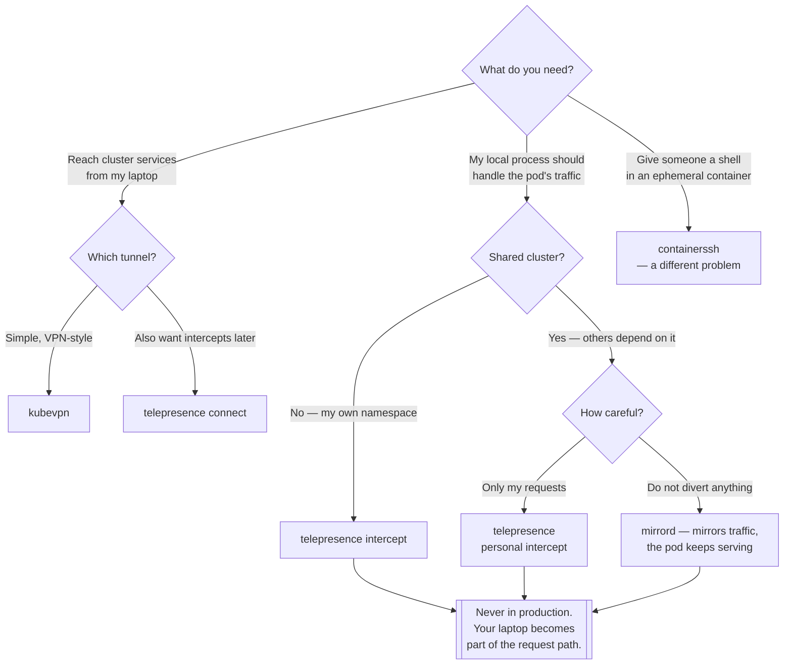

[← Managed](../README.md)

# Remote development

Running code on your laptop while it believes it is inside the cluster.

Tools covered: [`containerssh`](containerssh/README.md) · [`kubevpn`](kubevpn/README.md) ·
[`mirrord`](mirrord/README.md) · [`telepresence`](telepresence/README.md)

## Contents

1. [The opposite of the inner loop](#1-the-opposite-of-the-inner-loop)
2. [Three mechanisms](#2-three-mechanisms)
3. [Intercepting on a shared cluster](#3-intercepting-on-a-shared-cluster)
4. [Decision tree](#4-decision-tree)
5. [Anti-patterns](#5-anti-patterns)
6. [How this applies to pikakube](#6-how-this-applies-to-pikakube)

---

## 1. The opposite of the inner loop

[`local/development/`](../../local/development/README.md) makes your code run **in** a cluster
quickly. These tools do the reverse: the code runs **on your machine**, in your IDE, under your
debugger, and is given the cluster's network, environment variables, mounted secrets and DNS so that
it behaves as though it were a pod.

The reason to want that is specific. A service with fifteen dependencies cannot realistically be run
locally with all of them; but running only *it* locally, connected to the real versions of the other
fourteen, gives full debugger access to the one thing you are changing.

| | **Inner loop** | **Remote development** |
|---|---|---|
| Code runs | in the cluster | on your machine |
| Debugger | remote attach, awkward | native, local |
| Dependencies | you deploy them | the cluster's real ones |
| Iteration | rebuild or sync | none — it is already running |
| Risk | your own namespace | **you are changing a shared cluster** |

## 2. Three mechanisms

The tools differ in what they do to the cluster, and the differences matter a great deal:

| Mechanism | What it does | Tools |
|---|---|---|
| **Network tunnel** | routes cluster DNS and service traffic to your machine, and back | KubeVPN, Telepresence (connect mode) |
| **Traffic interception** | replaces a workload's traffic destination with your laptop | Telepresence (intercept), mirrord |
| **Process mirroring** | your local process receives a **copy** of the pod's traffic, environment and file reads | mirrord |

That third one deserves attention because it is the safest. mirrord's default is to *mirror*: the
real pod keeps serving, and your local process sees a duplicate of its input. Nothing breaks for
anyone if your local code crashes, because it is not in the request path.

Interception is the opposite: traffic that would have reached the pod now reaches your laptop, and
if your laptop is not answering, the service is down for whoever depends on it.

## 3. Intercepting on a shared cluster

The risk that defines this category. When you intercept a workload in a shared environment:

- other developers' requests hit **your** machine, running **your** uncommitted code
- your debugger breakpoint stops their request too
- closing your laptop takes the service down
- your local process may hold real credentials and write to real databases

Mitigations, roughly in order of how well they work:

- **Personal intercepts** — route only requests carrying your header or identity, leaving everyone
  else on the real pod. Telepresence supports this and it is the single most important feature in
  the category.
- **Mirroring instead of interception** — mirrord's default; nothing is diverted.
- **A dedicated namespace or a [vcluster](../multi-tenancy/vcluster/README.md)** — no shared traffic
  to disrupt at all.
- **Never in production.** This is not a subtle rule.

## 4. Decision tree

## 5. Anti-patterns

| Anti-pattern | Why it is bad | What to do instead |
|---|---|---|
| Intercepting in a shared environment | everyone's traffic hits your uncommitted code | personal intercepts, or mirroring |
| Any of this against production | a breakpoint stops real requests | never |
| Leaving an intercept active | the service is down when you close the laptop | disconnect, and check |
| Treating it as a deployment mechanism | these are debugging tools | GitOps |
| Local process with real database credentials | a debugging session writes real data | a scratch database, or read-only credentials |
| Skipping the inner loop entirely | you never test the artifact you ship | build the image before merging |

## 6. How this applies to pikakube

Four tools, and the most valuable content is a **licensing finding**.

**[mirrord's](mirrord/README.md) Helm chart is enterprise-only.** The recorded note is direct: the
chart is for the mirrord operator, and it *"requires a licence key"* —
<https://github.com/metalbear-co/charts/blob/main/mirrord-operator/values.yaml>. The open-source CLI
works without it; the operator, which is what makes mirrord safe for teams sharing a cluster, does
not. That distinction is exactly the kind of thing that is invisible until someone tries to deploy
it, and it is recorded here rather than discovered later.

An *"excellent demo"* is recorded alongside it — <https://www.youtube.com/watch?v=KJpEebC1tNE> — with
the demo repository at <https://github.com/mihailtd/mirrord-demo>.

[Telepresence](telepresence/README.md) has the three commands that matter — `connect`, `list`,
`intercept` — with an example intercept mapping a service's port 8080 to a local `http` port. It and
[KubeVPN](kubevpn/README.md) are deployed via Flux; Telepresence from an `OCIRepository`, KubeVPN from
a Helm repository.

[ContainerSSH](containerssh/README.md) is a link, and it is in this folder somewhat loosely — it
solves the adjacent problem of giving people SSH access into ephemeral containers rather than
connecting a laptop to a cluster.

The pattern to take away: this is a **debugging** capability, not a deployment one. Everything here
puts a laptop into the request path, which is precisely why the licensing note about mirrord's
team-safety operator is the most useful line in the folder.

---

[← Managed](../README.md)
