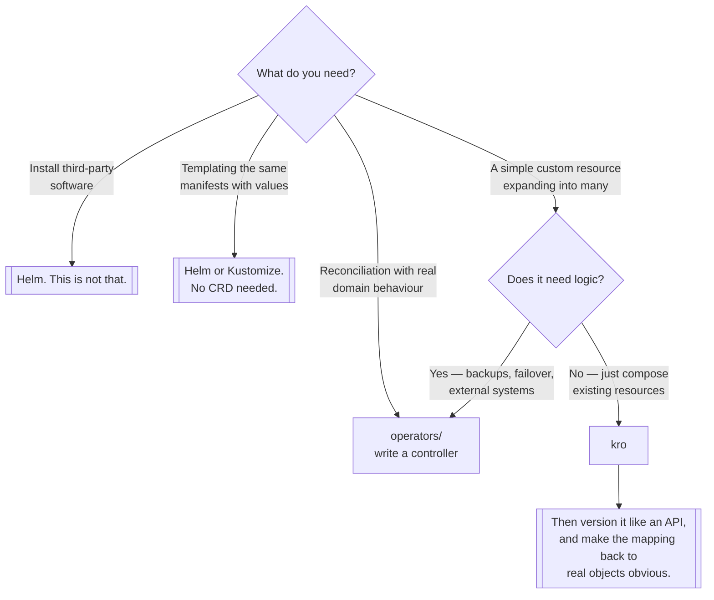

[← Managed](../README.md)

# Resource orchestrator

Bundling several resources behind one simple resource — without writing a controller.

Tools covered: [`kro`](kro/README.md)

## Contents

1. [The gap between Helm and an operator](#1-the-gap-between-helm-and-an-operator)
2. [What a resource orchestrator does](#2-what-a-resource-orchestrator-does)
3. [The cost of an abstraction](#3-the-cost-of-an-abstraction)
4. [Decision tree](#4-decision-tree)
5. [Anti-patterns](#5-anti-patterns)
6. [How this applies to pikakube](#6-how-this-applies-to-pikakube)

---

## 1. The gap between Helm and an operator

A platform team wants developers to ask for "a web application" and get a Deployment, a Service, an
Ingress, an HPA and a ConfigMap, correctly wired. Two established answers, both unsatisfying:

| Approach | What it gives | What it costs |
|---|---|---|
| **Helm chart** | templating, a values file | it is templating — no live object, no status, no reconciliation |
| **Custom operator** | a real CRD with reconciliation and status | Go, a controller, RBAC, CRD versioning, permanent maintenance |

The gap is wide. Helm produces YAML at install time and then has no opinion about anything; the
release is not an object anyone can query for health. An operator gives you all of that and asks for
a codebase in return.

Most teams want the operator's *interface* — a simple custom resource — without the operator's
*implementation*.

## 2. What a resource orchestrator does

It generates a CRD from a declarative definition, and reconciles the resources that definition
describes.

You write, in YAML, that a `WebApplication` has these fields and expands into these resources. The
orchestrator creates the `WebApplication` CRD, watches for instances of it, and creates and maintains
the underlying objects — resolving the dependency order between them from the references they contain.

The result: a developer applies a fifteen-line custom resource. A real Kubernetes object exists,
with a status. The underlying resources are owned by it, so deleting it cleans them up. And there is
no controller code anywhere.

The important properties, none of which Helm has:

- the abstraction is a **live API object**, not a rendered template
- **dependency order is inferred** from references, not declared by hand
- ownership means **garbage collection works**
- status can be surfaced up from the underlying resources

## 3. The cost of an abstraction

Cheap to build is not the same as cheap to own. Anything that hides Kubernetes objects behind a
simpler resource has the same three problems, whether it is Helm, an operator or this:

- **It will be incomplete.** The first time someone needs a field the abstraction does not expose,
  they either wait for you or bypass it. An abstraction that is routinely bypassed is pure overhead.
- **It obscures debugging.** During an incident someone must map the custom resource back to the
  objects it produced. If that mapping is not obvious, the abstraction has made the outage longer.
- **It becomes an API.** Once teams depend on `WebApplication`, changing its shape breaks them. It
  needs versioning and deprecation like any other interface.

The right time to build one is *after* the same five manifests have been copied enough times that the
shape is known — not before, when you are guessing at what the abstraction should contain.

## 4. Decision tree

## 5. Anti-patterns

| Anti-pattern | Why it is bad | What to do instead |
|---|---|---|
| Building the abstraction before the pattern is known | you are guessing at the interface | copy the manifests a few times first |
| Using it to install third-party software | that is Helm's job, and it is good at it | Helm |
| Hiding fields teams genuinely need | they bypass the abstraction, or wait on you | expose them, or accept the escape hatch |
| No versioning on the generated CRD | every change breaks consumers | version it like the API it is |
| An abstraction nobody can debug through | incidents get longer, not shorter | make the mapping to real objects obvious |
| Reaching for it when real logic is needed | composition is not reconciliation | write an operator |

## 6. How this applies to pikakube

One tool, [kro](kro/README.md), with a complete Flux setup from an `OCIRepository` and — unusually for
this repository — **committed examples**: a `resourcegroup.yaml` defining the abstraction and an
`instance.yaml` using it. Together with the upstream `webapp` example recorded in the notes, that is
enough to see the model working rather than only described.

Where this sits relative to its neighbours is the useful framing:

- [`operators/`](../operators/README.md) — write a controller when there is genuine logic. The
  [Kopf operator](../operators/kopf/README.md) in this repository is that case: it provisions backing
  services, which is behaviour, not composition.
- **here** — compose existing resources behind a simple CRD, with no code.
- [`platforms/kubevela/`](../platforms/kubevela/README.md) — the same idea at a much larger scale,
  with CUE, traits, policies and an application model. kro is the small version of that, and for most
  teams the small version is the right size.

Nothing here is deployed against a real cluster, but the examples make this one of the better-mapped
capabilities in `managed/` — the difference between a link and a worked example is most of what makes
an inventory useful later.

---

[← Managed](../README.md)
