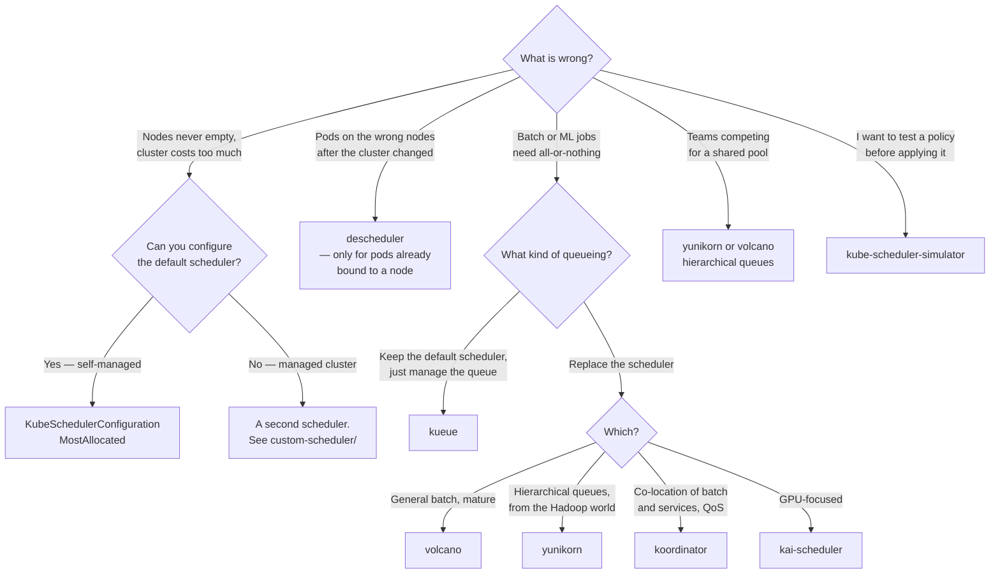

[← Managed](../README.md)

# Scheduler

Where pods land, why they sometimes do not, and what to do when the default is wrong.

Tools covered: [`armada`](armada/README.md) · [`custom-scheduler`](custom-scheduler/README.md) ·
[`descheduler`](descheduler/README.md) · [`kai-scheduler`](kai-scheduler/README.md) ·
[`koordinator`](koordinator/README.md) ·
[`kube-scheduler-simulator`](kube-scheduler-simulator/README.md) · [`kueue`](kueue/README.md) ·
[`scheduler-plugins`](scheduler-plugins/README.md) · [`volcano`](volcano/README.md) ·
[`yunikorn`](yunikorn/README.md)

## Contents

1. [What the default scheduler does](#1-what-the-default-scheduler-does)
2. [Spread or pack — the decision that costs money](#2-spread-or-pack--the-decision-that-costs-money)
3. [Four ways to change scheduling](#3-four-ways-to-change-scheduling)
4. [Batch is a different problem](#4-batch-is-a-different-problem)
5. [The scheduler only places new pods](#5-the-scheduler-only-places-new-pods)
6. [Decision tree](#6-decision-tree)
7. [Anti-patterns](#7-anti-patterns)
8. [How this applies to pikakube](#8-how-this-applies-to-pikakube)

---

## 1. What the default scheduler does

Two phases, per pod, one pod at a time:

- **Filter** — which nodes *could* run this pod. Resource requests, node selectors, affinity, taints
  and tolerations, volume topology.
- **Score** — of those, which is *best*. Several plugins vote; the highest total wins.

Two properties of that design explain most scheduling surprises:

- **It is greedy and one-at-a-time.** No global optimum, no consideration of the pods queued behind
  this one. Placement decisions made early constrain later ones and are never revisited.
- **It reads requests, never usage.** A pod requesting 2 CPU and using 0.05 occupies 2 CPU as far as
  scheduling is concerned, permanently.

Everything in this folder is a response to one of those two facts.

## 2. Spread or pack — the decision that costs money

The default scoring strategy is `LeastAllocated`: prefer the emptiest node. That spreads pods, which
is good for resilience and terrible for cost — because a node cannot be removed until it is empty,
and spreading guarantees nothing is ever empty.

| Strategy | Behaviour | Consequence |
|---|---|---|
| `LeastAllocated` (default) | prefer the emptiest node | resilient, and nothing scales down |
| **`MostAllocated`** | prefer the fullest node that fits | bin packing — nodes empty out and can be removed |
| `RequestedToCapacityRatio` | prefer a target utilisation shape | tunable middle ground |

**Bin packing is the single highest-leverage scheduling change for cost**, and it is a
`KubeSchedulerConfiguration` setting rather than a tool. It also has a real cost of its own:
concentrating pods increases the blast radius of losing one node, so it pairs with
`PodDisruptionBudget`s and topology spread constraints for the workloads that genuinely need
spreading.

## 3. Four ways to change scheduling

In increasing order of invasiveness:

| Approach | What it is | When |
|---|---|---|
| **Pod-level hints** | affinity, anti-affinity, topology spread, taints, tolerations | almost always enough |
| **Scheduler configuration** | `KubeSchedulerConfiguration` — scoring strategy, plugin weights | changing the global policy, e.g. to bin pack |
| **A second scheduler** | run another scheduler alongside; pods opt in via `schedulerName` | when you cannot reconfigure the default one |
| **A replacement scheduler** | Volcano, YuniKorn, Koordinator, KAI | batch, gang scheduling, queues, fair share |

The third row is the important escape hatch. On **managed clusters you cannot edit the default
scheduler's configuration** — the control plane is not yours. Running a second scheduler is the
generic workaround, and it is the subject of
[`custom-scheduler/`](custom-scheduler/README.md).

## 4. Batch is a different problem

The default scheduler is built for long-running services. Batch and ML workloads break its
assumptions:

- **Gang scheduling.** A distributed training job needs all 8 pods or none. Placing 6 and leaving 2
  pending wastes 6 GPUs indefinitely — and two such jobs can deadlock each other completely.
- **Queues and fair share.** Ten teams, one GPU pool. Someone must decide the order, and FIFO is not
  it.
- **Preemption by priority** in a way that fits jobs rather than services.
- **Quota that is borrowable** — let a team exceed its share while the capacity is idle, and reclaim
  it when the owner returns.

Volcano, YuniKorn, Koordinator, KAI and Kueue exist for this. Kueue is the most conservative of them:
it manages the **queue** and lets the default scheduler place pods, rather than replacing it.

## 5. The scheduler only places new pods

Once a pod is bound to a node, the scheduler is finished with it. It does not move pods when the
cluster changes — when a node is added, when utilisation becomes unbalanced, when an affinity rule
would now be better satisfied elsewhere.

That is what the [descheduler](descheduler/README.md) is for: it **evicts** pods so the scheduler
places them again. Note what that implies — the descheduler never places anything, and eviction
respects PodDisruptionBudgets.

The critical limitation, recorded here from experience: **it only acts on pods already bound to a
node.** A pod that is `Pending` because nothing can schedule it is invisible to the descheduler,
because there is nothing to evict. That is exactly the case people expect it to fix.

## 6. Decision tree

## 7. Anti-patterns

| Anti-pattern | Why it is bad | What to do instead |
|---|---|---|
| Replacing the scheduler for a placement preference | enormous change for something affinity expresses | pod-level hints first |
| Bin packing with no PodDisruptionBudgets | concentrated pods, one node lost, large blast radius | pack **and** protect |
| Expecting the descheduler to fix pending pods | it evicts bound pods; pending ones are not bound | fix the reason nothing can schedule |
| Two schedulers both able to bind the same pods | races, double-binding, unpredictable placement | one scheduler per pod, by `schedulerName` |
| Gang-scheduled work on the default scheduler | partial placement wastes resources and can deadlock | Volcano, YuniKorn or Kueue |
| Tuning the scheduler instead of fixing requests | it faithfully places what you asked for | right-size requests first |
| Testing scheduling policy in production | it is one of the hardest things to reason about | the simulator |

## 8. How this applies to pikakube

This is the folder with the most hard-won, specific content in the repository.

**[custom-scheduler](custom-scheduler/README.md)** is the standout, and it is entirely original work
rather than a chart: a complete `MostAllocated` bin-packing scheduler deployed as a **second
scheduler**, plus Gatekeeper mutation policies that assign `spec.schedulerName` to every pod outside
`kube-system` — so workloads use it without any manifest changes. The reason it exists is recorded
with the receipts: **you cannot configure the default scheduler on AKS or EKS**, with the
[AKS](https://github.com/Azure/AKS/issues/4203) and
[EKS](https://github.com/aws/containers-roadmap/issues/1468) issues linked, and the AWS sample
solution assessed as *"bad, AWS-specific and unmaintained"*.

**[descheduler](descheduler/README.md)** carries four upstream issues and the most useful negative
finding in the folder: it does not help pods that are `Pending` and unschedulable, only pods already
allocated to a node — which killed a specific plan to work around a Gatekeeper workload trying to
schedule onto a VM that no longer existed. It also records that the chart **does not support OCI
repositories**, which is a GitOps-relevant fact rather than a scheduling one. The committed
`DeschedulerPolicy` targets pods stuck in `ImagePullBackOff` and similar states for more than 1800
seconds.

The remaining eight are Flux-wired or link-only: Volcano, YuniKorn, Koordinator, Kueue and Armada have
charts; KAI, scheduler-plugins and the simulator are bookmarks.

Read together, the folder tells a coherent story: the interesting scheduling problem here was
**bin packing on a managed cluster**, the cloud provider made the direct route impossible, and the
workaround — a second scheduler plus admission-time mutation — was built and written down.

---

[← Managed](../README.md)
