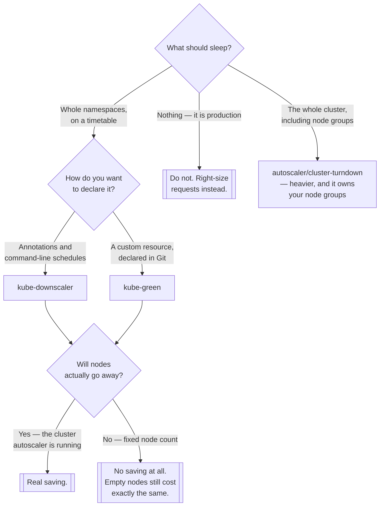

[← Managed](../README.md)

# Sleep

Turning off what nobody is using — the cheapest cost reduction available.

Tools covered: [`kube-downscaler`](kube-downscaler/README.md) · [`kube-green`](kube-green/README.md)

## Contents

1. [The arithmetic](#1-the-arithmetic)
2. [Why the autoscaler cannot do this](#2-why-the-autoscaler-cannot-do-this)
3. [What breaks when things sleep](#3-what-breaks-when-things-sleep)
4. [Decision tree](#4-decision-tree)
5. [Anti-patterns](#5-anti-patterns)
6. [How this applies to pikakube](#6-how-this-applies-to-pikakube)

---

## 1. The arithmetic

A week has 168 hours. Office hours are roughly 45. Development, staging, QA and CI clusters are
therefore idle about **73% of the time**, and billed for all of it.

Scaling those workloads to zero outside working hours does not require clever engineering. It
requires a schedule and something to enforce it, and the saving is immediate and large — larger than
almost anything achievable by tuning requests or the autoscaler.

The second-order effect is the one that actually pays: with workloads gone, nodes empty, and the
[cluster autoscaler](../autoscaler/README.md) removes them. **The saving is in nodes, not in pods** —
scaling deployments to zero on a fixed-size cluster saves nothing at all.

## 2. Why the autoscaler cannot do this

The Cluster Autoscaler reacts to unschedulable pods and to underused nodes. An idle development
cluster has neither: its pods are scheduled and running, they simply are not doing anything. From the
autoscaler's point of view, everything is fine.

Nothing in Kubernetes knows that a pod is pointless at 3am. That judgement is a business fact, and it
has to be declared:

| Mechanism | Expressed as |
|---|---|
| **Schedule** | working hours per namespace or per workload |
| **Annotation** | opt in or out, per Deployment |
| **Custom resource** | a `SleepInfo` object describing when and what |

Both tools here do the same underlying thing — set replicas to zero and restore them later. The
difference is how the schedule is expressed and where it lives.

## 3. What breaks when things sleep

Rarely the sleeping. Almost always the waking:

- **Startup order.** Everything comes back at once. Applications that expected their database to be
  up first crash, retry and recover — or do not.
- **Jobs and CronJobs.** A CronJob scheduled inside the sleep window does not run. Depending on the
  job, that is either fine or a missed batch nobody notices for a week.
- **StatefulSets.** Databases scaled to zero and back are usually fine and occasionally not. Anything
  holding a lease, a lock or a cluster membership deserves care.
- **Long-lived connections.** Anything holding a connection into the namespace sees it drop.
- **The person working late**, whose environment vanishes at 19:00. An override mechanism is not
  optional — it is what keeps the policy from being switched off entirely after the first complaint.
- **Interaction with cleanup tooling.** A workload at zero replicas looks unused to
  [`kor`](../plugins/kor/README.md), which is a genuine trap.

The habit that avoids most of this: sleep and wake the environment **once, deliberately, during the
working day** before letting the schedule run unattended.

## 4. Decision tree

## 5. Anti-patterns

| Anti-pattern | Why it is bad | What to do instead |
|---|---|---|
| Sleeping workloads on a fixed-size cluster | empty nodes cost the same as busy ones | pair it with the cluster autoscaler |
| No override for people working late | the policy gets disabled after the first complaint | a documented, easy opt-out |
| Sleeping production | it is an outage with a schedule | never |
| Never testing the wake-up | dependency ordering fails, at 08:00, on a Monday | test it once during the day |
| CronJobs left inside the sleep window | they silently do not run | move the schedule, or exclude them |
| Sleeping stateful workloads carelessly | leases, locks and cluster membership | verify per workload |
| Cleanup tools run while things are asleep | zero replicas looks like "unused" | do not run them together |

## 6. How this applies to pikakube

Two tools, both fully wired with Flux and both with **committed examples** — which makes this one of
the better-mapped capabilities here, because the example is where the semantics actually live.

[`kube-downscaler`](kube-downscaler/README.md) has an annotated example Deployment showing the
annotation-driven model. Note that its source is **Codeberg, not GitHub**, which is unusual enough in
this repository to be worth remembering when looking for it.

[`kube-green`](kube-green/README.md) has a `SleepInfo` custom resource — the CRD-driven model, where
the schedule is a Kubernetes object under GitOps like everything else.

The two are a clean illustration of the same problem solved with different philosophies: annotations
on the workloads that sleep, versus a separate object declaring what sleeps and when. The second fits
a GitOps repository better; the first requires no new API.

The third option is one folder over: [`autoscaler/cluster-turndown`](../autoscaler/cluster-turndown/README.md)
sleeps the **cluster**, including its node groups. That is more thorough and considerably more
invasive — a controller with permission to scale your node groups to zero. Scaling workloads and
letting the autoscaler reclaim the nodes achieves most of the same saving with much less authority
handed over.

---

[← Managed](../README.md)
