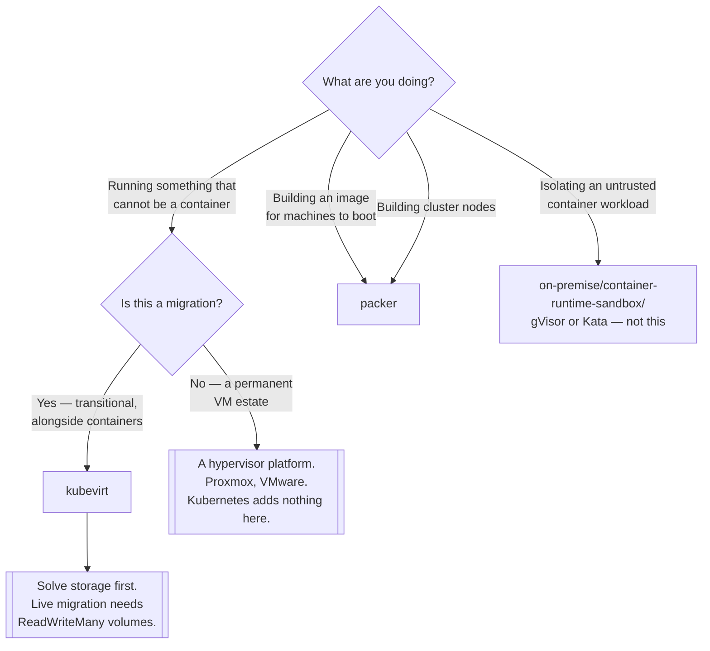

[← Managed](../README.md)

# Virtual machine

When the workload is not a container — and when the image is built before it ever runs.

Tools covered: [`kubevirt`](kubevirt/README.md) · [`packer`](packer/README.md)

## Contents

1. [Two tools, two different moments](#1-two-tools-two-different-moments)
2. [Why run VMs on Kubernetes at all](#2-why-run-vms-on-kubernetes-at-all)
3. [What a VM in a pod actually costs](#3-what-a-vm-in-a-pod-actually-costs)
4. [Decision tree](#4-decision-tree)
5. [Anti-patterns](#5-anti-patterns)
6. [How this applies to pikakube](#6-how-this-applies-to-pikakube)

---

## 1. Two tools, two different moments

They are filed together because both say "virtual machine", and they operate at opposite ends of the
lifecycle:

| | [KubeVirt](kubevirt/README.md) | [Packer](packer/README.md) |
|---|---|---|
| When | **runtime** — running a VM in a cluster | **build time** — producing an image |
| Produces | a `VirtualMachine` custom resource | an AMI, a qcow2, an OVA |
| Runs | in Kubernetes | in CI, before anything is deployed |
| Related to | KubeVirt VMs, and cluster nodes | node images for [`on-premise/provision/`](../../on-premise/provision/README.md) |

Packer's presence in a Kubernetes repository is best understood through that last row: the node
images a self-managed cluster boots from have to be built by something, and the alternative to
building them is configuring nodes after boot, which drifts.

## 2. Why run VMs on Kubernetes at all

It sounds backwards — Kubernetes runs containers, and a VM is what containers replaced. The reasons
are all migration reasons, and they are legitimate:

- **Software that cannot be containerised.** A legacy application, a vendor appliance, something
  requiring a kernel module or a specific kernel.
- **Windows workloads**, where a container is not always an option.
- **One control plane.** Rather than operating Kubernetes *and* a separate hypervisor platform, both
  are scheduled, monitored and declared the same way.
- **Incremental migration.** A VM and its replacement container can sit in the same namespace, behind
  the same Service, during a transition.

The unifying argument is operational, not technical: one scheduler, one API, one GitOps repository,
one monitoring stack — instead of two of each.

## 3. What a VM in a pod actually costs

The abstraction is genuinely leaky and worth knowing before committing:

- **Live migration needs shared storage** with `ReadWriteMany` access. Without it, moving a VM
  between nodes means stopping it.
- **Node draining is different.** Draining a node evicts pods; a VM that cannot be evicted quickly
  turns a routine node upgrade into an outage.
- **Nested virtualisation.** Running KubeVirt on cloud VMs requires the provider to permit nested
  virtualisation, or performance is emulated and poor.
- **Storage is the hard part.** VM disks are large, long-lived and not disposable. The storage story
  has to be solved first, not afterwards.
- **Networking is more complex** than pod networking — VMs frequently expect bridged interfaces,
  multiple NICs, or static addressing.

None of these is a reason not to do it. All of them are reasons not to start with a proof of concept
that ignores storage.

## 4. Decision tree

## 5. Anti-patterns

| Anti-pattern | Why it is bad | What to do instead |
|---|---|---|
| KubeVirt as a general hypervisor replacement | you gain Kubernetes' complexity and lose the hypervisor's tooling | Proxmox or VMware for a pure VM estate |
| Proof of concept without storage | live migration and disk lifecycle are the whole problem | design storage first |
| VMs for isolation from untrusted code | heavier than needed | [sandboxed runtimes](../../on-premise/container-runtime-sandbox/README.md) |
| Node images configured after boot | drift, and no reproducibility | build them with Packer |
| Packer images with no version or provenance | nobody can tell what a node is running | version and record them |
| Treating a VM as a disposable pod | it is stateful and slow to move | plan drains and upgrades around it |

## 6. How this applies to pikakube

Both are recorded as links only, with no manifests and no commands. That is the correct weight for
this repository: the clusters here are local and cloud-managed, and neither VM hosting nor node image
building is a live requirement.

The connection worth drawing is between [Packer](packer/README.md) and
[`on-premise/provision/`](../../on-premise/provision/README.md). Building a cluster with `kubeadm`
or Kubespray means deciding what the nodes boot from, and the two options are a base image plus
configuration management, or a **pre-built image with everything baked in**. The second is
reproducible and fast; the first drifts. `kubernetes-sigs/image-builder`, recorded in the
[Cluster API](../../on-premise/provision/cluster-api/README.md) notes, is Packer with Kubernetes
node recipes on top — so the tool is already implied by the provisioning material even where it is
not named.

[KubeVirt](kubevirt/README.md)'s onward link is [Cozystack](../platforms/cozystack/README.md), which
bundles it as the virtualisation layer of a bare-metal cloud. That is the shape in which KubeVirt is
most convincing: not as a way to run one legacy VM, but as the mechanism by which a platform offers
VMs as a product.

---

[← Managed](../README.md)
