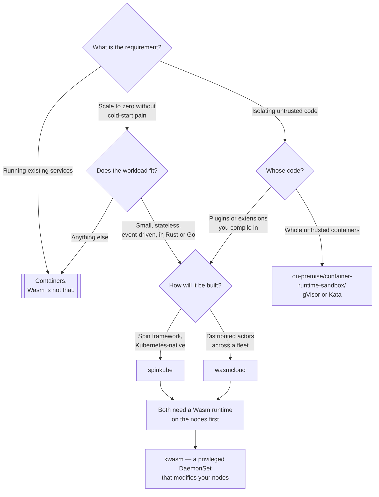

[← Managed](../README.md)

# WASM

WebAssembly as a container alternative — what it is actually good at, and what it is not.

Tools covered: [`kwasm`](kwasm/README.md) · [`spinkube`](spinkube/README.md) ·
[`wasmcloud`](wasmcloud/README.md)

## Contents

1. [Why WebAssembly outside a browser](#1-why-webassembly-outside-a-browser)
2. [How it runs in Kubernetes](#2-how-it-runs-in-kubernetes)
3. [The limits that decide everything](#3-the-limits-that-decide-everything)
4. [Decision tree](#4-decision-tree)
5. [Anti-patterns](#5-anti-patterns)
6. [Notes](#6-notes)
7. [How this applies to pikakube](#7-how-this-applies-to-pikakube)

---

## 1. Why WebAssembly outside a browser

A Wasm module is a small, sandboxed, architecture-independent binary. Compared with a container:

| | Container | Wasm module |
|---|---|---|
| Size | tens to hundreds of MB | often under 5 MB |
| Cold start | seconds | **milliseconds** |
| Isolation | kernel namespaces and cgroups | a sandbox with **no capabilities by default** |
| Portability | per architecture | one binary, any architecture |
| Access to the host | whatever the kernel allows | only what is explicitly granted |

Two of those rows carry the whole argument. **Cold start in milliseconds** makes scale-to-zero
genuinely viable — a request can arrive at nothing and be served without the delay that makes
serverless-on-Kubernetes unpleasant. And **deny-by-default capabilities** are a stronger security
posture than a container's: a Wasm module cannot open a socket or read a file unless the host was
asked to allow it.

## 2. How it runs in Kubernetes

Three pieces, and they map onto the three tools here:

1. **A Wasm runtime on the node** — `runwasi`, `crun` with WasmEdge, or similar, installed alongside
   containerd. Nodes do not have this by default, and installing it is
   [KWasm's](kwasm/README.md) job.
2. **A `RuntimeClass`** naming that runtime, and pods referencing it. This is the same mechanism
   [gVisor and Kata](../../on-premise/container-runtime-sandbox/README.md) use, which is worth
   noticing: Kubernetes already has a way to say "run this with something other than the default
   runtime", and Wasm reuses it.
3. **A way to build and ship modules** — [SpinKube](spinkube/README.md) with the Spin framework, or
   [wasmCloud's](wasmcloud/README.md) actor model.

The node preparation step is the one people underestimate. On a managed cluster, modifying nodes
means a DaemonSet doing privileged installation, which is exactly what KWasm is and exactly why it
deserves scrutiny.

## 3. The limits that decide everything

The honest assessment, because this area attracts more enthusiasm than analysis:

- **The ecosystem is small.** Existing applications do not compile to Wasm unchanged. Rust, Go and
  C/C++ are workable; most other runtimes are partial or experimental.
- **Networking and filesystem access are limited** by the WASI standard's maturity. Sockets in
  particular have been slow to stabilise, and "can this module talk to a database" is a real question
  rather than an assumption.
- **Threading and async** support varies by runtime and target.
- **Debugging and observability are immature** compared with containers, where the tooling is
  twenty years deep.
- **It does not replace containers.** It is a different execution model for a narrow class of
  workload: small, stateless, event-driven, latency-sensitive at startup.

The realistic use case is edge functions, request handlers, plugins and extension points — not the
services already running well in containers.

## 4. Decision tree

## 5. Anti-patterns

| Anti-pattern | Why it is bad | What to do instead |
|---|---|---|
| Wasm as a container replacement | the ecosystem, networking and tooling are not there | containers, and Wasm where it fits |
| Installing a node-modifying DaemonSet without review | it changes the container runtime configuration on every node | understand what KWasm does first |
| Choosing it for isolation from untrusted **containers** | Wasm isolates modules, not containers | gVisor or Kata |
| Assuming any language compiles to it | support is uneven and changes | verify the toolchain first |
| Wasm for stateful or long-running services | the model is small and short-lived | containers |
| Ignoring how to debug it | there is far less tooling than for containers | know your story before production |

## 6. Notes

Three references recorded at this level:

- <https://github.com/WebAssembly/design> — the design rationale documents. Useful for *why* the
  instruction set and the sandbox are shaped as they are, which is the part that explains the
  security model.
- <https://github.com/WebAssembly/spec> — the formal specification, including the reference
  interpreter. The authority when a runtime's behaviour is in question.
- <https://www.fermyon.com/blog/rethinking-microservices> — Fermyon's argument for Wasm as a
  microservice runtime. Worth reading as the clearest statement of the case, and worth reading as
  what it is: the position of the company behind Spin, which is the framework
  [SpinKube](spinkube/README.md) runs.

Recording the vendor argument alongside the specifications is the right instinct — the specifications
say what Wasm is, and the blog post says what someone wants it to become.

## 7. How this applies to pikakube

Three tools, all wired for Flux — [SpinKube](spinkube/README.md) and
[wasmCloud](wasmcloud/README.md) from `OCIRepository` sources, [KWasm](kwasm/README.md) from a Helm
repository — with empty values, no commands and no verdicts.

This is a **surveyed, unadopted** capability, and appropriately so. Nothing in this repository is a
small stateless event handler in Rust, which is the workload that makes Wasm worth the ecosystem
cost.

The entry that matters most if any of it is ever tried is [KWasm](kwasm/README.md), for a reason that
has nothing to do with WebAssembly: it is a **privileged DaemonSet that modifies the container
runtime configuration on every node**. That is a significant grant, and on a managed cluster it is
also a change the provider may overwrite during a node upgrade. Understanding what it does before
installing it is the whole of the operational advice for this folder.

The cross-reference worth keeping: `RuntimeClass` is the same mechanism
[`on-premise/container-runtime-sandbox/`](../../on-premise/container-runtime-sandbox/README.md) uses
for gVisor and Kata. Wasm is one more alternative runtime, not a new concept in Kubernetes.

---

[← Managed](../README.md)
