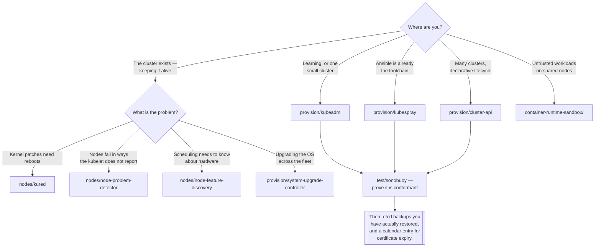

[← Kubernetes](../README.md)

# On premise

You own the control plane. Everything that implies.

Sections covered: [`add-ons/`](add-ons/README.md) — distributing add-ons across clusters ·
[`container-runtime-interface/`](container-runtime-interface/README.md) — what actually runs a container ·
[`container-runtime-sandbox/`](container-runtime-sandbox/README.md) — stronger isolation ·
[`nodes/`](nodes/README.md) — keeping machines healthy ·
[`provision/`](provision/README.md) — building and upgrading clusters ·
[`test/`](test/README.md) — proving it is really Kubernetes

## Contents

1. [What you take on](#1-what-you-take-on)
2. [The build decision](#2-the-build-decision)
3. [Nodes are the recurring work](#3-nodes-are-the-recurring-work)
4. [Prove it is Kubernetes](#4-prove-it-is-kubernetes)
5. [Decision tree](#5-decision-tree)
6. [Anti-patterns](#6-anti-patterns)
7. [How this applies to pikakube](#7-how-this-applies-to-pikakube)

---

## 1. What you take on

The list is short, entirely known, and continuous:

| Obligation | The failure it prevents |
|---|---|
| **etcd** — backups, tested restores, disk latency, odd member count | the cluster's entire state, gone |
| **Certificates** — they expire, typically after one year | the API server stops accepting connections, on a date nobody wrote down |
| **Upgrades** — control plane first, kubelets after, one minor at a time | unsupported skew, subtle breakage |
| **Node lifecycle** — draining, patching, rebooting | nodes that drift apart until they behave differently |
| **The CNI, CSI and cloud-controller pieces** | networking or storage that mostly works |
| **Conformance** | discovering the cluster is not quite Kubernetes, from a controller |

None of it is difficult. The cost is that it never stops, and it is the part that gets compared
unfavourably with a managed control plane's monthly fee — usually by comparing the fee to zero rather
than to an engineer's time.

The reasons to do it anyway are real: no cloud provider available, regulatory constraints,
air-gapped sites, existing hardware, edge locations, or cost at a scale where the arithmetic changes.

## 2. The build decision

Four routes, and they are genuinely different commitments:

| Route | What it is | Suits |
|---|---|---|
| **kubeadm** | the upstream tool that bootstraps a control plane, one command at a time | learning, small clusters, and understanding what the others automate |
| **Kubespray** | Ansible playbooks wrapping kubeadm, production-shaped | teams already using Ansible |
| **Kubean** | Kubespray driven by a Kubernetes operator | declarative cluster lifecycle, Kubespray's coverage |
| **Cluster API** | Kubernetes **manages Kubernetes** — clusters as custom resources | fleets, and the most compelling model for on-prem |

Cluster API is the one worth understanding even if it is not adopted. A management cluster holds
`Cluster` and `Machine` objects; controllers reconcile real clusters to match. Creating a cluster
becomes applying YAML, and upgrading one becomes editing a version field. It turns cluster lifecycle
into the same GitOps problem as everything else.

Start with `kubeadm` regardless of where you end up: everything else automates it, and every failure
mode is easier to diagnose having done it once by hand.

## 3. Nodes are the recurring work

Bootstrap happens once. Nodes are forever:

- **Reboots** for kernel patches — [kured](nodes/kured/README.md) coordinates them so the cluster is
  never missing more nodes than it can survive
- **Health** beyond the kubelet's own view — [node-problem-detector](nodes/node-problem-detector/README.md)
  surfaces kernel deadlocks, filesystem corruption and runtime failures as node conditions
- **Hardware capability** — [node-feature-discovery](nodes/node-feature-discovery/README.md) labels
  nodes by CPU features, GPUs and kernel modules so scheduling can use them
- **Readiness gating** — [node-readiness-controller](nodes/node-readiness-controller/README.md) holds
  a node out of service until its prerequisites are genuinely ready
- **Fake nodes** — [kwok](nodes/kwok/README.md) simulates thousands of them for testing scheduling and
  autoscaling behaviour at a scale you cannot build
- **Nodes that are not machines** — [virtual-kubelet](nodes/virtual-kubelet/README.md) registers a
  node backed by something else entirely

The pattern across all of them: a managed cluster gives you a node pool and a "recycle" button, and
on-premise every one of those behaviours is a controller you install and understand.

## 4. Prove it is Kubernetes

A hand-built cluster can be subtly wrong — a CNI that does not implement NetworkPolicy properly, a
CSI driver that ignores a field, a component with a flag that changes semantics. Everything works
until a controller depends on the part that does not.

[Sonobuoy](test/sonobuoy/README.md) runs the upstream conformance suite and tells you. It is the
cheapest possible insurance for a cluster you assembled yourself, and it should be run **after
building and after every upgrade**, not once at the beginning.

## 5. Decision tree

## 6. Anti-patterns

| Anti-pattern | Why it is bad | What to do instead |
|---|---|---|
| Self-managing to save the control-plane fee | the fee is cheaper than the engineer who now owns etcd | price the people |
| Backups that have never been restored | a backup you have not tested is a belief | restore into a scratch cluster, on a schedule |
| No certificate expiry monitoring | the cluster stops working on an anniversary | alert well before, and automate renewal |
| Upgrading kubelets before the control plane | unsupported skew direction | control plane first, always |
| Skipping conformance | you find out from a controller behaving strangely | Sonobuoy after every build and upgrade |
| Uncoordinated node reboots | too many nodes gone at once | kured, with a lock |
| Nodes configured by hand after boot | drift nobody can describe | build images; see Packer |
| Sandbox runtimes assumed to be free | gVisor and Kata have real overhead and compatibility limits | measure before committing |

## 7. How this applies to pikakube

Mapped rather than run — and that is the right weight, because the clusters here are local and
cloud-managed. Every folder has links, most have charts, and none has commands recorded against a
cluster that was actually built this way.

The one recorded opinion is in [`provision/cluster-api/`](provision/cluster-api/README.md): *"very
cool for on-prem"*, alongside the operator, the image-builder project and the AWS and Azure
providers. That is the entry with genuine enthusiasm behind it, and it is a defensible favourite —
Cluster API is the only option here that makes cluster lifecycle a GitOps problem rather than a
runbook.

The complementary material lives elsewhere in this repository and is worth connecting:

- The **CKA notes** in [`managed/core/certifications/cka/`](../managed/core/certifications/cka/README.md)
  contain the `kubeadm` upgrade sequence, etcd operations and static-pod handling — the practical form
  of everything in [`provision/`](provision/README.md).
- **Vagrant** in [`local/linux/onpremise/vagrant/`](../local/linux/onpremise/vagrant/README.md) is
  where multi-node VMs get built to practise on.
- **Talos** in [`local/linux/distribution/`](../local/linux/distribution/README.md) is the immutable
  node OS that removes most of what [`nodes/`](nodes/README.md) exists to manage.

So the material for actually doing this is present across the repository; what is absent is a cluster
that was built with it. Recorded as such rather than dressed up.

---

[← Kubernetes](../README.md)
