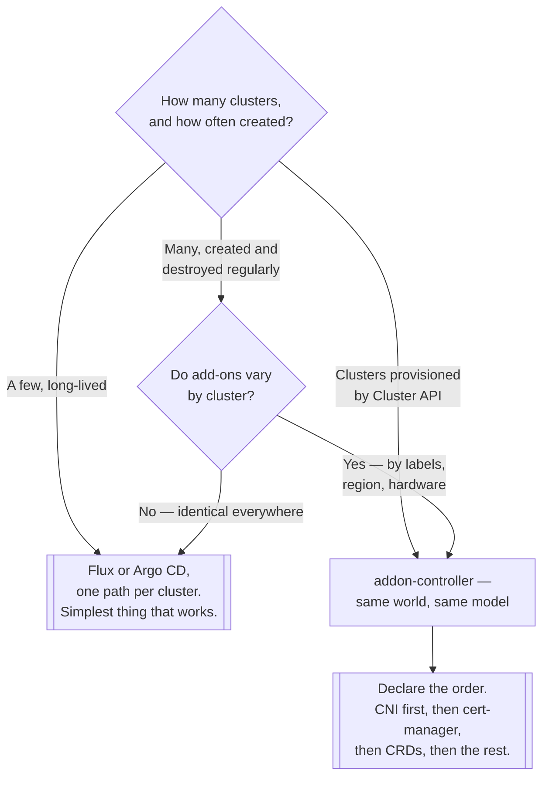

[← On premise](../README.md)

# Add-ons

Getting the same set of add-ons onto every cluster, and keeping them there.

Tools covered: [`addon-controller`](addon-controller/README.md)

## Contents

1. [The problem with cluster add-ons](#1-the-problem-with-cluster-add-ons)
2. [Where this sits relative to GitOps](#2-where-this-sits-relative-to-gitops)
3. [Ordering is the hard part](#3-ordering-is-the-hard-part)
4. [Decision tree](#4-decision-tree)
5. [Anti-patterns](#5-anti-patterns)
6. [How this applies to pikakube](#6-how-this-applies-to-pikakube)

---

## 1. The problem with cluster add-ons

A cluster is not usable when `kubeadm init` finishes. It needs a CNI, then likely an ingress
controller, cert-manager, a metrics server, a CSI driver, monitoring agents and a policy engine
before any application can run.

For one cluster that is a checklist. For several — which is the normal on-premise situation, since
clusters get built per site, per environment or per customer — three problems appear:

- **Every new cluster needs the same set**, applied in the right order, and someone has to remember
  what "the same set" is
- **Different clusters need different subsets** — GPU clusters get a device plugin, edge clusters get
  less of everything
- **Drift** — an add-on upgraded on one cluster and not another, and nobody notices until behaviour
  differs

An add-on controller answers all three: declare which add-ons belong on clusters **matching a
selector**, and let a controller reconcile them.

## 2. Where this sits relative to GitOps

The obvious objection is that Flux and Argo CD already do this, and they do — both can target
multiple clusters and both reconcile continuously.

The difference is **selection**. GitOps deploys what a given path says to a given cluster; the
mapping between cluster and content is a directory structure you maintain by hand. An add-on
controller inverts it: add-ons declare which clusters they belong on, matched by label, and a newly
registered cluster picks up everything that matches without anyone editing a repository.

That matters when clusters are created and destroyed frequently — which is exactly the
[Cluster API](../provision/cluster-api/README.md) world this tooling comes from. If you have three
long-lived clusters, GitOps with three directories is simpler and there is no reason to add a
controller.

## 3. Ordering is the hard part

Add-ons have dependencies, and getting them wrong produces failures that look unrelated to ordering:

- **The CNI first, always.** Until it is installed, every pod stays `Pending` and every other add-on
  appears broken.
- **cert-manager before anything needing certificates** — webhooks in particular, which fail in the
  confusing way described in [`multi-tenancy/`](../../managed/multi-tenancy/README.md).
- **CRDs before the resources that use them.** A manifest referencing a kind that does not exist yet
  fails, and whether it retries depends on the tool.
- **Storage before stateful workloads**, which otherwise sit waiting for a PersistentVolume forever.

Both GitOps engines express this with explicit dependencies; add-on controllers do too. What none of
them can do is infer it. The order has to be understood and declared.

## 4. Decision tree

## 5. Anti-patterns

| Anti-pattern | Why it is bad | What to do instead |
|---|---|---|
| Installing add-ons by hand on each cluster | drift, and no record of what "correct" means | declare the set |
| An add-on controller for three static clusters | machinery with nothing to select | GitOps directories |
| No declared ordering | the CNI arrives last and everything looks broken | explicit dependencies |
| One add-on set for every cluster regardless of hardware | GPU plugins on nodes with no GPUs | label-based selection |
| Add-ons pinned to `latest` | clusters diverge silently over time | pin versions |
| Two systems installing the same add-on | they fight, and the loser retries forever | one owner per add-on |

## 6. How this applies to pikakube

One tool, [`addon-controller`](addon-controller/README.md) from Project Sveltos, recorded as two
links and nothing else — the project and its Helm charts repository.

The honest position for this repository: there is one Flux setup and a small number of clusters, and
the GitOps route in §2 is the correct answer here. This folder is a map of the alternative for the
day cluster creation becomes routine — which in practice means the day
[Cluster API](../provision/cluster-api/README.md) is adopted, since that is what makes clusters
cheap enough to create that managing their add-ons by directory stops scaling.

The two are recorded in this repository side by side, and the pairing is not accidental: Cluster API
creates clusters, and something has to make them usable afterwards.

---

[← On premise](../README.md)
