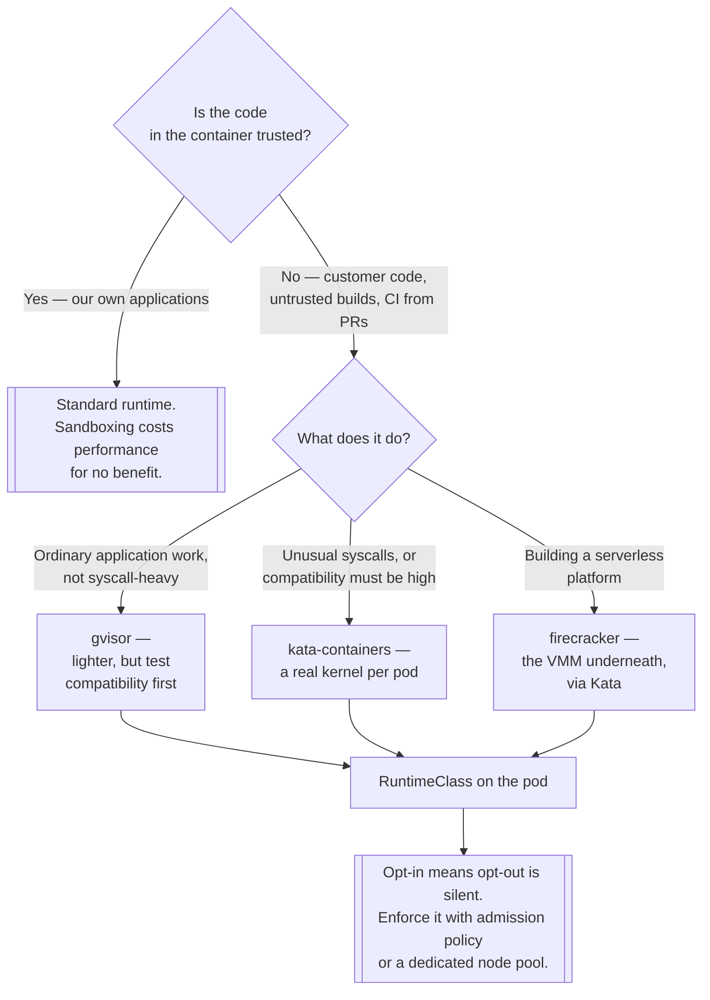

[← On premise](../README.md)

# Container runtime sandbox

Stronger isolation than namespaces — for when the workload is not trusted.

Tools covered: [`firecracker`](firecracker/README.md) · [`gvisor`](gvisor/README.md) ·
[`kata-containers`](kata-containers/README.md)

## Contents

1. [The shared kernel problem](#1-the-shared-kernel-problem)
2. [Two approaches](#2-two-approaches)
3. [How Kubernetes selects a sandbox](#3-how-kubernetes-selects-a-sandbox)
4. [What it costs](#4-what-it-costs)
5. [Decision tree](#5-decision-tree)
6. [Anti-patterns](#6-anti-patterns)
7. [How this applies to pikakube](#7-how-this-applies-to-pikakube)

---

## 1. The shared kernel problem

A container is a process with namespaces, cgroups, seccomp and capabilities applied. Every container
on a node shares **one kernel**, and the kernel's system call surface — several hundred calls, many
of them historically vulnerable — is reachable from inside every one of them.

Consequences that follow directly:

- A kernel exploit reachable from a container is a **node compromise**, and therefore a compromise of
  every other container on it.
- Namespaces and RBAC are irrelevant to this. It happens below both.
- Nothing in [`multi-tenancy/`](../../managed/multi-tenancy/README.md) addresses it — not namespaces,
  not Capsule, not vcluster, all of which isolate the control plane and share the data plane.

Which means: if the threat model includes **hostile code running in a container**, this folder is the
only part of the repository that responds to it.

## 2. Two approaches

| | **User-space kernel** | **Lightweight VM** |
|---|---|---|
| Example | gVisor | Kata Containers, Firecracker |
| Mechanism | intercepts syscalls and implements them in a userspace kernel written in Go | runs the container inside a real VM with its own kernel |
| Host kernel exposure | a small, deliberately restricted subset | the hypervisor interface only |
| Overhead | syscall-heavy and I/O-heavy work is slower | memory per VM; startup in the tens of milliseconds |
| Compatibility | **partial** — unimplemented syscalls fail | high, because it is a real kernel |

gVisor's trade is compatibility: applications making unusual syscalls may not work, and finding out
means testing. Kata's trade is resources: every pod carries a VM's memory footprint.

**Firecracker** is a different kind of entry — it is the **VMM** (the thing that runs the
microVM), not a container runtime. Kata can use it as a backend, and AWS Lambda and Fargate are built
on it. It appears in this folder as the layer underneath rather than as an alternative alongside.

## 3. How Kubernetes selects a sandbox

The same mechanism throughout, and it is worth knowing because it is shared with
[Wasm](../../managed/wasm/README.md):

```yaml
apiVersion: node.k8s.io/v1
kind: RuntimeClass
metadata:
  name: gvisor
handler: runsc
```

Then a pod opts in:

```yaml
spec:
  runtimeClassName: gvisor
```

`handler` names a runtime configured in containerd on the node. So there are three prerequisites, and
all three must be true or the pod stays pending with an unhelpful message:

1. the runtime binary is installed on the node
2. containerd's configuration registers that handler
3. the `RuntimeClass` exists in the cluster

Being **opt-in per pod** is the useful property: sandboxing can be applied to the workloads that need
it and not to the ones that would suffer from the overhead. It is also the weakness — a pod that
omits `runtimeClassName` is not sandboxed, and nothing warns you. Enforcing it requires admission
policy, or a node pool that only offers the sandboxed runtime.

## 4. What it costs

Measure rather than assume, but the shape is consistent:

- **gVisor** — syscall-heavy workloads slow noticeably; network and file I/O carry the largest
  penalty. CPU-bound work in userspace is barely affected. Some syscalls are unimplemented, and the
  failure is at runtime rather than at start.
- **Kata** — memory overhead per pod for the VM, and slower startup than a container though far
  faster than a traditional VM. Compatibility is high because it is a real kernel.
- **Both** — restrict what host resources can be used. Device access, host networking and host paths
  are limited or unavailable, which is the point and is also what breaks things.

Nothing here is free, and choosing it for workloads that do not need it is a straightforward loss.

## 5. Decision tree



## 6. Anti-patterns

| Anti-pattern | Why it is bad | What to do instead |
|---|---|---|
| Sandboxing everything | real performance cost for trusted workloads | apply it where the threat model requires it |
| Assuming namespaces isolate untrusted code | the kernel is shared, and that is where the exploit is | this folder, or separate nodes |
| gVisor without compatibility testing | unimplemented syscalls fail at runtime, not at deploy | test the actual workload |
| `RuntimeClass` left optional | a pod without it is silently unsandboxed | admission policy, or a dedicated node pool |
| Kata without accounting for memory | a VM per pod, at the density you planned for containers | size the nodes for it |
| Sandbox instead of least privilege | it is an additional layer, not a replacement | non-root, dropped capabilities, seccomp, **and** sandboxing |

## 7. How this applies to pikakube

Three tools, and one of them is the clearest recorded gap in the repository: **`firecracker/doc.md`
is an empty file.** Not a link, not a note — an empty file, which is a deliberate placeholder
recording that the topic exists and was never filled in.

[`gvisor/`](gvisor/README.md) is the only one with manifests, and they are a well-designed minimal
demonstration: a `RuntimeClass` named `gvisor` with handler `runsc`, and **two otherwise identical
nginx pods** — one with `runtimeClassName: gvisor`, one without. That pairing is the whole
experiment. Run both, compare, and the difference between a sandboxed and an unsandboxed pod is
visible directly rather than described.

[`kata-containers/`](kata-containers/README.md) is a link.

What is missing across all three, and would be the next real step: **node preparation**. None of
these runtimes exists on a node by default. Installing `runsc` or Kata and registering the handler in
containerd is a prerequisite for the gVisor manifests to do anything at all — the same node-modification
problem that [KWasm](../../managed/wasm/kwasm/README.md) solves for WebAssembly, and it is unsolved
here.

The connection worth carrying elsewhere: this folder is the honest answer to the question
[`multi-tenancy/`](../../managed/multi-tenancy/README.md) cannot answer. Namespaces, Capsule and
vcluster isolate the control plane. Only this isolates the kernel.

---

[← On premise](../README.md)
