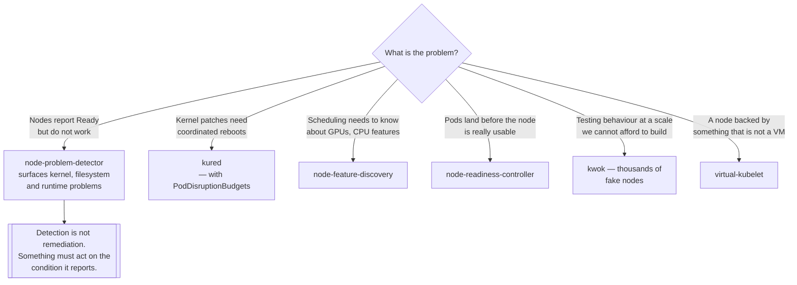

[← On premise](../README.md)

# Nodes

Keeping machines healthy, labelled, patched and honest about their own state.

Tools covered: [`kured`](kured/README.md) · [`kwok`](kwok/README.md) ·
[`node-feature-discovery`](node-feature-discovery/README.md) ·
[`node-problem-detector`](node-problem-detector/README.md) ·
[`node-readiness-controller`](node-readiness-controller/README.md) ·
[`virtual-kubelet`](virtual-kubelet/README.md)

## Contents

1. [What the kubelet does not tell you](#1-what-the-kubelet-does-not-tell-you)
2. [Four questions about a node](#2-four-questions-about-a-node)
3. [Reboots without an outage](#3-reboots-without-an-outage)
4. [Nodes that are not machines](#4-nodes-that-are-not-machines)
5. [Decision tree](#5-decision-tree)
6. [Anti-patterns](#6-anti-patterns)
7. [How this applies to pikakube](#7-how-this-applies-to-pikakube)

---

## 1. What the kubelet does not tell you

A node reports `Ready` when the kubelet is running and can talk to the API server. That is a narrow
claim, and the following are all true of a node that reports `Ready`:

- the kernel has a deadlock in a driver
- the filesystem is corrupt and read-only
- the container runtime is failing to start containers
- a critical DaemonSet — CNI, CSI, monitoring — has not started
- the node needs a reboot for a security patch applied hours ago

Every one of those produces a node that accepts pods and cannot run them properly, which is worse
than a node that is plainly down. The tools here exist to make each of them visible or handled.

## 2. Four questions about a node

| Question | Tool |
|---|---|
| Is it **actually** healthy? | [node-problem-detector](node-problem-detector/README.md) |
| What **hardware and features** does it have? | [node-feature-discovery](node-feature-discovery/README.md) |
| Is it **ready to accept work** yet? | [node-readiness-controller](node-readiness-controller/README.md) |
| Does it need **rebooting**, and when may it? | [kured](kured/README.md) |

The remaining two are not about real nodes at all: [kwok](kwok/README.md) fakes thousands of them for
testing, and [virtual-kubelet](virtual-kubelet/README.md) registers a node backed by something that
is not a machine.

The third question is more subtle than it looks. A node joins, reports `Ready`, and pods are
scheduled onto it — before the CNI DaemonSet has started, so they have no network; before the CSI
driver is up, so volumes fail to attach. The pods do not gracefully wait; they fail, restart, and
eventually recover, leaving a trail of alerts from a node that was doing exactly what it was told.

## 3. Reboots without an outage

Kernel and OS patches require reboots, and a cluster reboots nodes badly by default: either nobody
does it and the patches accumulate, or everybody does it and too many nodes leave at once.

[kured](kured/README.md) solves the coordination. It watches for the reboot-required sentinel file
that the OS package manager creates, takes a **cluster-wide lock** so only a bounded number of nodes
reboot at a time, cordons and drains the node, reboots it, and uncordons it afterwards.

The pieces that make it safe are the lock, the drain, and a maintenance window. The pieces that make
it *unsafe* if forgotten are the same ones: without PodDisruptionBudgets, a drain evicts more than a
service can survive, and kured is then an efficient way to cause an outage on a schedule.

The alternative is an immutable OS such as Talos, where updating means booting a new image and the
whole problem changes shape — see [`local/linux/distribution/`](../../local/linux/distribution/README.md).

## 4. Nodes that are not machines

[virtual-kubelet](virtual-kubelet/README.md) implements the kubelet's API without any machine behind
it. Kubernetes sees a node; pods scheduled to it are handed to whatever the provider actually is —
a cloud container service, another cluster, an edge site.

That single idea underpins several tools elsewhere in this repository:
[Admiralty](../../managed/multi-cluster/admiralty/README.md) and
[Liqo](../../managed/multi-cluster/liqo/README.md) both present remote clusters as virtual nodes so
the ordinary scheduler can place work across cluster boundaries.

It is elegant and it is thin. `kubectl logs`, `exec` and port-forward are proxied by the provider,
and the failure modes when the far side is unreachable are unlike anything a real node produces.

## 5. Decision tree

## 6. Anti-patterns

| Anti-pattern | Why it is bad | What to do instead |
|---|---|---|
| Trusting `Ready` as a health signal | it means the kubelet is up, nothing more | node-problem-detector |
| Detecting node problems and never acting | a permanent condition nobody reads | a remediation controller, or an alert with an owner |
| kured without PodDisruptionBudgets | drains evict more than services can survive | set budgets first |
| Uncoordinated fleet reboots | too many nodes gone simultaneously | a lock and a maintenance window |
| Manual node labelling for hardware | wrong within a month, and silently | node-feature-discovery |
| Scheduling onto nodes before add-ons are ready | pods fail, restart, and generate noise | readiness gating |
| Testing scale on real nodes | expensive and slow | kwok |
| Nodes configured by hand after boot | drift nobody can describe | build images |

## 7. How this applies to pikakube

Six tools: four with Flux manifests, two as links. Nothing has commands recorded against a real
cluster, which fits — the clusters here are local and cloud-managed, and node lifecycle is somebody
else's problem on both.

The one recorded issue is against
[`node-readiness-controller`](node-readiness-controller/README.md) —
<https://github.com/kubernetes-sigs/node-readiness-controller/issues/26> — which is a young
`kubernetes-sigs` project, and checking its open issues before adopting it is exactly the right
instinct for something that gates whether nodes accept work.

[`virtual-kubelet`](virtual-kubelet/README.md) is installed from a `GitRepository` and records the
Azure ACI provider alongside the core project, which is the concrete example of the pattern: a node
that is really Azure Container Instances.

The two most valuable entries for a repository shaped like this one are the two that are not about
real nodes at all. [`kwok`](kwok/README.md) makes it possible to test scheduling and autoscaling
behaviour at thousands of nodes on a laptop — which is directly relevant, because
[kind cannot set node capacity](../../local/distributions/README.md) and that limitation blocks most
of the experiments [`managed/scheduler/`](../../managed/scheduler/README.md) and
[`managed/autoscaler/`](../../managed/autoscaler/README.md) would want to run. And
[`virtual-kubelet`](virtual-kubelet/README.md) is the mechanism underneath the multi-cluster tools
already mapped here.

---

[← On premise](../README.md)
