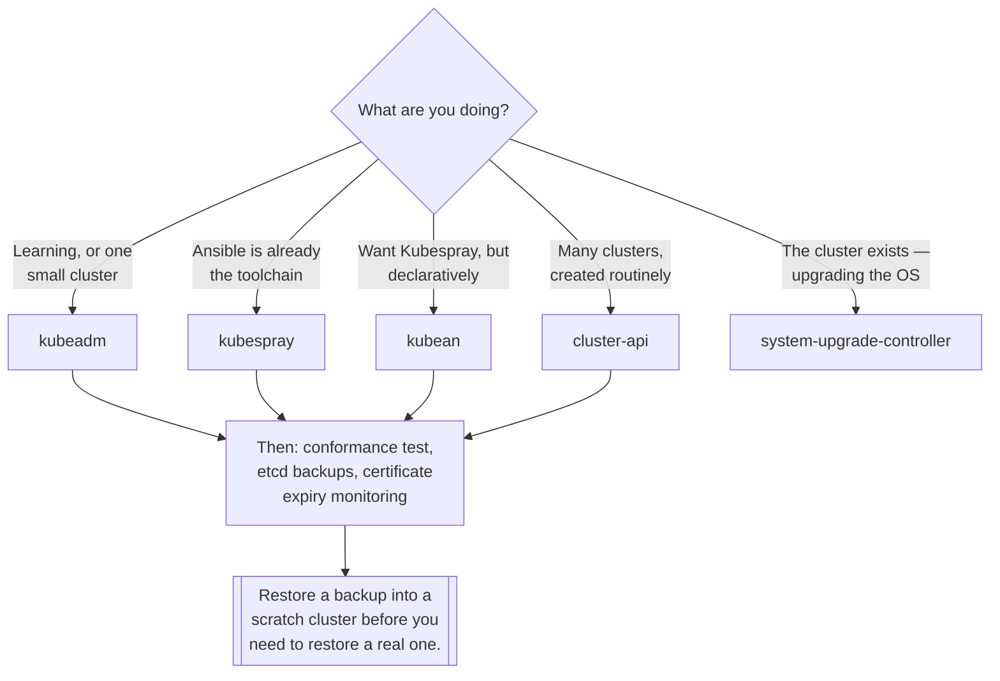

[← On premise](../README.md)

# Provision

Building clusters, and upgrading them without an outage.

Tools covered: [`cluster-api`](cluster-api/README.md) · [`kubeadm`](kubeadm/README.md) ·
[`kubean`](kubean/README.md) · [`kubespray`](kubespray/README.md) ·
[`system-upgrade-controller`](system-upgrade-controller/README.md)

## Contents

1. [Four routes to a cluster](#1-four-routes-to-a-cluster)
2. [Cluster API is the interesting one](#2-cluster-api-is-the-interesting-one)
3. [Upgrades are the recurring cost](#3-upgrades-are-the-recurring-cost)
4. [etcd, and the thing everyone postpones](#4-etcd-and-the-thing-everyone-postpones)
5. [Decision tree](#5-decision-tree)
6. [Anti-patterns](#6-anti-patterns)
7. [How this applies to pikakube](#7-how-this-applies-to-pikakube)

---

## 1. Four routes to a cluster

| Route | What it is | Suits |
|---|---|---|
| [**kubeadm**](kubeadm/README.md) | the upstream bootstrap tool — one command per node | learning, small clusters, understanding the others |
| [**Kubespray**](kubespray/README.md) | Ansible playbooks around kubeadm, plus CNI, storage and add-ons | teams already running Ansible |
| [**Kubean**](kubean/README.md) | Kubespray driven by a Kubernetes operator | declarative lifecycle with Kubespray's coverage |
| [**Cluster API**](cluster-api/README.md) | clusters as custom resources, reconciled by controllers | fleets, and GitOps-managed cluster lifecycle |

They form a ladder of automation over the same underlying work, and each rung adds a dependency:
Kubespray adds Ansible, Kubean adds a management cluster, Cluster API adds a management cluster and a
provider per infrastructure type.

**Start with kubeadm regardless of destination.** Everything above it automates it, and every failure
in the higher-level tools is easier to diagnose having done the sequence once by hand. The
[CKA notes](../../managed/core/certifications/cka/README.md) in this repository are exactly that
sequence.

## 2. Cluster API is the interesting one

Cluster API inverts the model: a **management cluster** holds `Cluster`, `MachineDeployment` and
`Machine` objects, and controllers reconcile real clusters to match them.

The consequences are worth stating explicitly, because they are what make it different in kind rather
than in degree:

- **Creating a cluster is applying YAML.** It goes in Git, it is reviewed, it has history.
- **Upgrading is editing a version field.** The controller performs a rolling replacement of machines.
- **Repair is automatic.** A machine that fails is replaced, because the desired state says it should
  exist.
- **Infrastructure is pluggable.** Providers exist for AWS, Azure, vSphere, OpenStack, bare metal and
  more, behind the same API.

That turns cluster lifecycle into the same problem as everything else in this repository — declared
state, reconciled continuously — instead of a runbook someone follows.

The costs are equally real: a management cluster whose availability now matters, a provider to
understand per infrastructure type, and a level of indirection when something goes wrong.

## 3. Upgrades are the recurring cost

Building the cluster happens once. Upgrading happens every few months, forever, and the order is not
negotiable:

1. **Control plane first.** `kubeadm upgrade plan`, then `kubeadm upgrade apply`.
2. **Then kubelets**, node by node, with a drain and an uncordon around each.
3. **One minor version at a time.** Skipping versions is unsupported and the failures are obscure.
4. **Never kubelets ahead of the API server.** Version skew is tolerated downwards only.

Two separate upgrade problems live here, and they are frequently conflated:

- **Kubernetes** version — the four steps above
- **The operating system** on the nodes — kernel patches, package updates, reboots

[system-upgrade-controller](system-upgrade-controller/README.md) addresses the second declaratively;
[kured](../nodes/kured/README.md) addresses the reboots that follow it.

## 4. etcd, and the thing everyone postpones

Owning the control plane means owning etcd, and there is one obligation that is repeatedly deferred:

> **A backup you have never restored is not a backup.**

The rest of the list is short and known: an odd number of members, low-latency disks (etcd is
sensitive to fsync latency in a way that surprises people), monitored disk space, and snapshots taken
on a schedule to somewhere that survives the cluster.

The restore procedure belongs in the same place as the upgrade sequence — see the
[CKA notes](../../managed/core/certifications/cka/README.md) — and it should be practised on a
disposable cluster before it is needed on a real one.

## 5. Decision tree

## 6. Anti-patterns

| Anti-pattern | Why it is bad | What to do instead |
|---|---|---|
| Automating before understanding | when Kubespray fails, you are debugging kubeadm anyway | build one by hand first |
| Skipping minor versions on upgrade | unsupported, and the failures are obscure | one at a time, in order |
| Upgrading kubelets before the control plane | the wrong skew direction | control plane first, always |
| Untested etcd backups | a belief, not a backup | restore into a scratch cluster, on a schedule |
| No certificate expiry monitoring | the cluster stops on an anniversary nobody recorded | alert early, automate renewal |
| Node OS patched by hand | drift, and no record of what any node is running | system-upgrade-controller, or built images |
| Cluster API without planning the management cluster | it becomes the thing that must never break | treat it as production |
| Skipping conformance after building | subtle breakage found later, by a controller | Sonobuoy |

## 7. How this applies to pikakube

Mapped, not run — and the one recorded opinion is worth surfacing:
[**Cluster API is "very cool for on-prem"**](cluster-api/README.md). That folder has the most links of
any here: the core project, the operator, `image-builder`, the AWS and Azure providers, and the Helm
addon provider. Enthusiasm plus a reading list.

[`system-upgrade-controller`](system-upgrade-controller/README.md) is the only one with real
manifests — deployment, ConfigMap, namespace and a full RBAC directory — recorded alongside the
upstream manifests it came from, which is the right way to keep a plain-manifest install honest.

[`kubean`](kubean/README.md) has a chart. [`kubeadm`](kubeadm/README.md) and
[`kubespray`](kubespray/README.md) are links.

The material that makes this folder usable is elsewhere in the repository and worth connecting: the
[CKA notes](../../managed/core/certifications/cka/README.md) carry the `kubeadm` upgrade sequence,
etcd operations, static pods and certificate-based user creation, and
[Vagrant](../../local/linux/onpremise/vagrant/README.md) is where the multi-node VMs to practise on
get built. So the knowledge is present; what is absent is a cluster built with it — which is
consistent, since the clusters here are local and cloud-managed.

---

[← On premise](../README.md)
