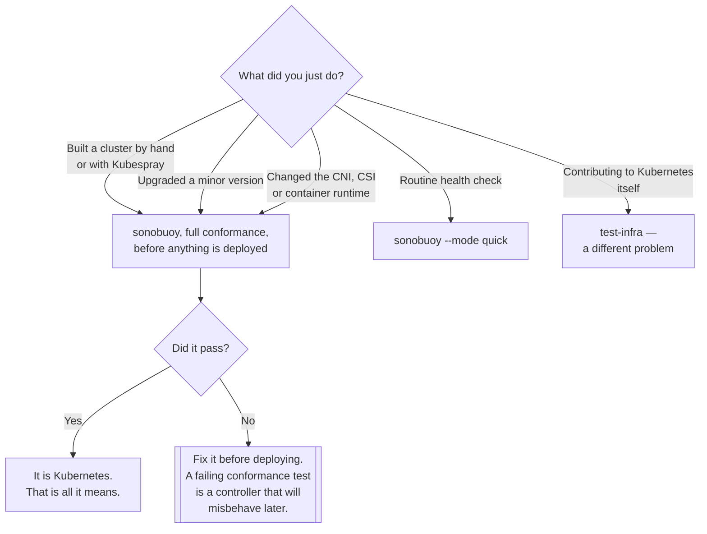

[← On premise](../README.md)

# Test

Proving the cluster you built is actually Kubernetes.

Tools covered: [`sonobuoy`](sonobuoy/README.md) · [`test-infra`](test-infra/README.md)

## Contents

1. [Why a cluster can be wrong](#1-why-a-cluster-can-be-wrong)
2. [What conformance covers, and what it does not](#2-what-conformance-covers-and-what-it-does-not)
3. [When to run it](#3-when-to-run-it)
4. [Decision tree](#4-decision-tree)
5. [Anti-patterns](#5-anti-patterns)
6. [How this applies to pikakube](#6-how-this-applies-to-pikakube)

---

## 1. Why a cluster can be wrong

A hand-built cluster starts, nodes go `Ready`, pods run, and it looks correct. It can still be
subtly wrong:

- a **CNI** that does not implement `NetworkPolicy`, so policies apply and enforce nothing
- a **CSI driver** that ignores a field, so volumes behave differently under a condition you have not
  hit yet
- a component started with a flag that changes semantics
- a feature gate enabled or disabled in a way nobody documented
- DNS that resolves the common case and not the edge cases

Every one of those passes a smoke test and fails later, from inside a controller that assumed the API
behaves as specified. Conformance testing is how you find out before the controller does.

The `NetworkPolicy` case deserves singling out because it is the most dangerous: a policy that is
accepted by the API server and enforced by nothing looks exactly like a policy that works.

## 2. What conformance covers, and what it does not

The upstream conformance suite tests the **portable, API-level behaviour** that any Kubernetes
distribution must provide — the guarantee behind the "Certified Kubernetes" mark.

| Covered | Not covered |
|---|---|
| API semantics for core resources | performance and scale |
| Scheduling behaviour | your CNI's specific features |
| Service and DNS resolution | storage performance |
| Namespace, RBAC and admission behaviour | security posture |
| Pod lifecycle and container semantics | anything you installed on top |

So passing conformance means "this is Kubernetes". It does not mean the cluster is fast, secure,
well configured, or a good idea. It rules out one specific and expensive class of problem.

## 3. When to run it

- **After building a cluster**, before anything real is deployed to it
- **After every upgrade** — this is the one people skip, and upgrades are where behaviour changes
- **After changing the CNI, the CSI driver or the runtime** — the components most likely to be the
  thing that is wrong
- **In CI**, if clusters are built automatically, as the gate on whether a build is usable

The full suite takes a while and the tests are disruptive enough that a production cluster is the
wrong place for a first run. A `--mode quick` sweep is the routine version; the full run is for
builds and upgrades.

## 4. Decision tree

## 5. Anti-patterns

| Anti-pattern | Why it is bad | What to do instead |
|---|---|---|
| Never running conformance on a hand-built cluster | subtle breakage found much later, from inside a controller | run it after building |
| Running it once and never again | upgrades and component swaps change behaviour | after every upgrade |
| Treating a pass as a security or performance statement | it tests API conformance and nothing else | separate tests for those |
| Full conformance on a busy production cluster | the tests are disruptive | a build-time or maintenance-window run |
| Ignoring failures because "it works" | it works for what you have tried | fix them, or record why not |
| Assuming `NetworkPolicy` is enforced | some CNIs accept and ignore it | test it explicitly |

## 6. How this applies to pikakube

Two links, no manifests, no runs.

[`sonobuoy`](sonobuoy/README.md) is the tool that matters, and it is the natural companion to
[`provision/`](../provision/README.md) — the step after building a cluster and before trusting it.
Nothing in this repository has built a cluster that needed it, which is consistent with everything
else here: the clusters are local and cloud-managed, and a managed cluster's conformance is the
provider's obligation.

[`test-infra`](test-infra/README.md) is a different thing entirely — the Kubernetes project's own CI
infrastructure — and belongs to contributing to Kubernetes rather than to running it. Recorded
alongside Sonobuoy presumably because both are "testing Kubernetes", which is two different senses of
the phrase.

The value of this folder is as a **reminder attached to the right place**: the moment
[`provision/`](../provision/README.md) is ever used for real, this is the next step, and it is the one
that gets skipped because the cluster appears to work.

---

[← On premise](../README.md)
