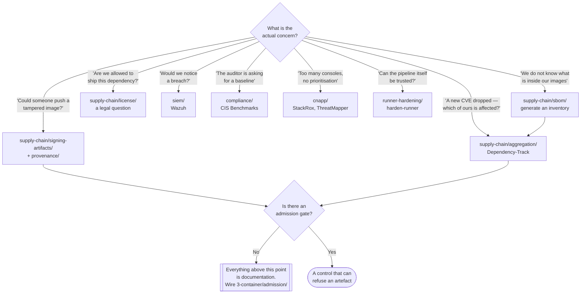

[← Security](../README.md)

# 0 — Governance

The outermost ring: the evidence about what an artefact is, the rules about what may run,
and the record of what happened. None of it runs inside the workload it governs.

Capabilities: [`supply-chain/`](supply-chain/README.md) · [`cnapp/`](cnapp/README.md) ·
[`siem/`](siem/README.md) · [`compliance/`](compliance/README.md) ·
[`runner-hardening/`](runner-hardening/README.md)

## Contents

1. [Why governance is layer zero](#1-why-governance-is-layer-zero)
2. [The capabilities](#2-the-capabilities)
   - [Where each one produces its output](#where-each-one-produces-its-output)
3. [The three questions this layer answers](#3-the-three-questions-this-layer-answers)
4. [Evidence is not enforcement](#4-evidence-is-not-enforcement)
5. [CNAPP and the consolidation argument](#5-cnapp-and-the-consolidation-argument)
6. [Decision tree](#6-decision-tree)
7. [Anti-patterns](#7-anti-patterns)
8. [How this applies to pikakube](#8-how-this-applies-to-pikakube)

---

## 1. Why governance is layer zero

The other four rings in [`security/`](../README.md) all act on something that exists inside
the platform — an account, a cluster, an image, a repository. This one does not. It produces
**statements about artefacts** and **rules about behaviour**, and both are consumed by the
rings below.

That is why it is numbered zero rather than five. It comes first in the sense that its output
is an input everywhere else: an admission controller in `3-container/` can only refuse an
unsigned image if something in `0-governance/` did the signing; a CIS benchmark run in
`2-cluster/posture/` is only meaningful because a baseline was chosen here.

It also has the layer's characteristic weakness. **Everything here is inert on its own.** An
SBOM, an attestation, a signature, a benchmark score and a SIEM alert all describe the world;
none of them changes it. The value of the layer is entirely determined by whether something
downstream is wired to act on what it produces.

## 2. The capabilities

| Capability | The question it answers | Output | Consumed by |
|---|---|---|---|
| [`supply-chain/`](supply-chain/README.md) | what is in this artefact, where did it come from, and can we prove it? | SBOMs, attestations, signatures, licence reports | admission in `3-container/`, and humans during incident response |
| [`cnapp/`](cnapp/README.md) | one platform correlating build-time findings with runtime behaviour | a prioritised, deduplicated risk view | security teams; policy decisions |
| [`siem/`](siem/README.md) | what happened, and would we notice if it happened again? | correlated events, alerts, retained logs | detection and forensics |
| [`compliance/`](compliance/README.md) | which external baseline are we measured against, and do we meet it? | benchmark results, CVE references | auditors, and `posture/` scanners at every ring |
| [`runner-hardening/`](runner-hardening/README.md) | is the pipeline that builds all of this itself trustworthy? | egress policy and tamper detection in CI | the entire supply chain, which it underwrites |

### Where each one produces its output

Worth separating, because it decides how each is operated:

| Capability | Runs at | Cadence |
|---|---|---|
| supply-chain — SBOM, provenance, signing | **build time**, once per artefact | per pipeline run |
| supply-chain — aggregation, licences | **continuously**, against artefacts already built | on every new disclosure |
| cnapp | continuously, in and around the cluster | streaming |
| siem | continuously | streaming |
| compliance | periodically | per audit cycle, plus continuous posture checks |
| runner-hardening | **inside every CI job** | per job |

The important row is the second. Build-time evidence is a snapshot; the only capability here
that re-evaluates yesterday's artefact against today's knowledge is aggregation. That
asymmetry is the whole reason it exists as a separate thing.

## 3. The three questions this layer answers

Everything in this folder is one of three questions, and it is worth keeping them separate
because they have different tools and different failure modes.

**"What is this thing?"** — the composition question. An SBOM answers it. So does a licence
report, which is the same inventory read for a different kind of risk.

**"Where did it come from?"** — the provenance question. Signatures and attestations answer
it. This is the one people assume the first answers, and it does not: an SBOM tells you a
package is present, not that the build was honest.

**"What is happening now, and what happened before?"** — the observation question. CNAPP and
SIEM answer it. Distinct from the other two because it concerns behaviour rather than
artefacts, and because it is the only part of this layer that can catch something nobody
predicted.

`runner-hardening/` cuts across all three: it protects the **machine that produces the
answers**. Evidence generated on a compromised runner is evidence about nothing.

## 4. Evidence is not enforcement

The single most common failure in this layer, stated plainly:

> A pipeline that generates an SBOM, signs the image, and pushes an attestation, into a
> cluster that pulls by mutable tag and admits anything, has added minutes to every build and
> zero security.

The chain of custody only becomes a control at its last link, and that link lives in a
different folder — `3-container/admission/`, where Connaisseur, Ratify, the Sigstore policy
controller or a Kyverno `verifyImages` rule refuse an artefact whose evidence does not check
out.

The implication for adoption order is counterintuitive. It is tempting to build the evidence
first and the gate later, because the evidence is the interesting part. The opposite works
better: **stand up the gate in audit mode first**, so that the day evidence starts flowing
there is already something reading it, and so the blast radius of turning enforcement on is
known before it is turned on.

## 5. CNAPP and the consolidation argument

[`cnapp/`](cnapp/README.md) is a different shape from the rest of this folder. It is not a
new capability — it is most of `1-cloud/`, `2-cluster/` and `3-container/` sold as one
product: cloud posture, image scanning, admission policy, runtime monitoring and network
graphing behind a single console.

The argument for it is real and it is about **correlation**, not features. A vulnerability
scanner says an image has a critical CVE. A runtime sensor says the vulnerable library is
never loaded. A network view says the workload has no egress. Individually those are three
findings; together they are one deprioritised finding. Nothing correlates across tools that
do not share a data model.

The argument against is equally real: a CNAPP is a large, privileged, cluster-wide component
that becomes the thing you must trust most, and consolidating tooling into one vendor makes
the exit expensive. It is placed in governance rather than in `2-cluster/` because the
decision to adopt one is a **portfolio decision** about how many tools the organisation
wants to own, not a technical decision about one control.

## 6. Decision tree

## 7. Anti-patterns

| Anti-pattern | Why it is bad | What to do instead |
|---|---|---|
| Producing evidence with no consumer | SBOMs and signatures cost build time and change nothing on their own | wire admission before, or alongside, the evidence pipeline |
| Signing an image but deploying by mutable tag | the tag can be repointed at an unsigned image after verification | pin by digest, and verify the digest |
| Treating a CIS benchmark score as a security posture | benchmarks are a generic floor; they encode no knowledge of your architecture or your threats | use them as a baseline, then reason about actual attack paths |
| Adopting a CNAPP to avoid understanding the underlying controls | you end up unable to interpret or tune its findings, and locked in besides | understand the individual controls first; consolidate deliberately |
| A SIEM ingesting everything with no detection rules | enormous cost, and the signal is buried by design | start from a small number of detections that have owners |
| Generating evidence on an unhardened CI runner | a compromised runner signs whatever it is told to sign | [`runner-hardening/`](runner-hardening/README.md) is a prerequisite, not an extra |
| Licence scanning owned by the security team | it is a legal exposure, and security cannot make the call on copyleft obligations | route findings to whoever owns legal risk |
| Turning enforcement on across the fleet in one step | a policy that was never observed in audit mode blocks deploys nobody expected | audit mode, measure, then enforce namespace by namespace |

## 8. How this applies to pikakube

The folder is **mapped in full and deployed in fragments**. There are Flux `HelmRelease`
definitions for StackRox, ThreatMapper, Dependency-Track and GUAC, all with empty `values:`
blocks — staged, not configured. Nothing here is enforcing anything today.

The one part with real, recorded practice is signing: [`cosign`](supply-chain/signing-artifacts/cosign/README.md)
carries actual commands run against a real published image, digest-pinned. That is the
correct half of the pattern. The missing half is a verification step at admission, which
lives in `3-container/admission/` and is not wired.

The cheapest meaningful improvement available here, in order:

1. **Verify the cosign signature at admission.** The signing already happens. A single
   Kyverno `verifyImages` policy or the Sigstore policy controller turns an existing build
   step into an actual gate.
2. **Point Dependency-Track at the SBOMs.** The chart is already staged; the value shows up
   the first time a disclosure lands and the question "are we affected?" is answered from a
   database rather than by rescanning.
3. **Leave CNAPP alone for now.** Two CNAPP charts are staged and neither is configured. For
   a local single-node cluster the correlation argument in section 5 barely applies, and the
   operational cost is real.

---

[← Security](../README.md)
