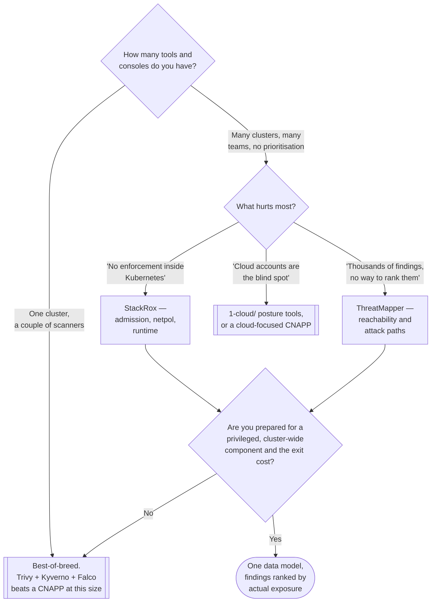

[← Governance](../README.md)

# CNAPP

Cloud Native Application Protection Platform — most of the other four rings, sold as one
product, with correlation as the actual argument.

Tools: [`stackrox/`](stackrox/README.md) · [`threatmapper/`](threatmapper/README.md)

## Contents

1. [What the acronym actually covers](#1-what-the-acronym-actually-covers)
2. [The real argument is correlation](#2-the-real-argument-is-correlation)
3. [The real argument against](#3-the-real-argument-against)
4. [Why this sits in governance](#4-why-this-sits-in-governance)
5. [The two tools here](#5-the-two-tools-here)
6. [Decision tree](#6-decision-tree)
7. [Anti-patterns](#7-anti-patterns)
8. [How this applies to pikakube](#8-how-this-applies-to-pikakube)

---

## 1. What the acronym actually covers

CNAPP is an analyst category rather than a technology, and it is the union of several older
acronyms:

| Component | Older name | Where it lives in this repository |
|---|---|---|
| Cloud posture | CSPM | `1-cloud/scan/`, `1-cloud/policies/` |
| Workload protection | CWPP | `2-cluster/runtime-security/`, `2-cluster/pod-security/` |
| Image scanning | — | `3-container/scan/` |
| Admission policy | — | `3-container/admission/`, `2-cluster/policies/` |
| Entitlements | CIEM | `1-cloud/iam/` |
| Network visibility | — | `2-cluster/network-policies/` |
| Code and dependencies | ASPM-adjacent | `4-code/` |

So a CNAPP is not a new capability. It is a **packaging decision** — the same controls, from
one vendor, sharing one data model and one console.

That framing is the useful one, because it makes the evaluation question concrete: not "do we
need CNAPP" but "is one vendor's version of each of these better than the best-of-breed tool,
and is the correlation worth the difference".

## 2. The real argument is correlation

Individually, these findings are three tickets:

- an image scanner reports a critical CVE in a library
- a runtime sensor observes that the library is never loaded
- a network view shows the workload has no egress and is not internet-reachable

Together they are **one deprioritised finding**, and possibly none at all.

Nothing correlates across tools that do not share a data model. Every platform ends up with the
same failure at scale: thousands of findings, no way to rank them by actual exposure, and a
security team that reads none of them. Correlation is the only thing that converts a finding
list into a priority list, and correlation is what a single data model buys.

The concrete questions a CNAPP answers that separate tools cannot:

| Question | Why separate tools cannot answer it |
|---|---|
| Which of these CVEs are in code that actually runs? | the scanner does not observe runtime; the sensor does not know the SBOM |
| Which vulnerable workloads are reachable from the internet? | requires joining image findings to network topology |
| Which findings sit on a path to cluster-admin? | requires joining RBAC, workload configuration and identity |
| What changed between yesterday's clean report and today's alert? | requires one timeline across posture and runtime |

That is a genuine capability, and it is the honest reason the category exists.

## 3. The real argument against

Equally real, and usually understated:

**It becomes the most privileged thing in the cluster.** A CNAPP wants an admission webhook, a
privileged DaemonSet with kernel visibility, cluster-wide read on every resource, and often
cloud credentials. Its compromise is a full compromise, and its outage can block admission.
That is a large amount of trust concentrated in one component.

**Exit cost.** Detections, policies, exceptions, tuning and integrations accumulate inside the
product. Two years in, the migration is not a tool swap, it is a rebuild of the security
programme's institutional memory.

**Each component is usually weaker than the best-of-breed alternative.** The scanner is not
Trivy or Grype; the runtime sensor is not Falco or Tetragon; the policy engine is not Kyverno.
The bet is that correlation is worth more than per-component quality — which is often true at
scale and rarely true at small scale.

**Cost, and its shape.** Priced per node or per workload, so it scales with the estate rather
than with the value delivered.

## 4. Why this sits in governance

Because the decision to adopt one is a **portfolio decision**, not a technical control choice.
It is about how many tools the organisation wants to own, how many consoles a team can watch,
and where the security programme's memory lives. Those are governance questions.

Placing it in `2-cluster/` would also be wrong on the facts: a CNAPP spans cloud, cluster,
container and code, so filing it under any one ring misrepresents it.

## 5. The two tools here

| | [StackRox](stackrox/README.md) | [ThreatMapper](threatmapper/README.md) |
|---|---|---|
| Origin | Red Hat, open-sourced as the upstream of Red Hat Advanced Cluster Security | Deepfence |
| Focus | Kubernetes-first: admission control, network policy generation, runtime detection, image scanning, CIS benchmarks | attack-path and exploitability: scanning plus a topology graph across cloud, Kubernetes and hosts |
| Strongest at | policy enforcement inside Kubernetes, and turning observed traffic into NetworkPolicies | **prioritising** by reachability and exposure rather than by CVSS |
| Weakest at | multi-cloud posture breadth | being the enforcement point — it observes and prioritises more than it blocks |
| Deployment shape | central services plus a per-cluster sensor | console plus sensor agents |

They are not really the same product. StackRox is a Kubernetes security platform with
enforcement; ThreatMapper is a prioritisation and attack-path tool. Running both is
duplication in scanning and complementary in intent, which is worth deciding deliberately
rather than by accident.

## 6. Decision tree

## 7. Anti-patterns

| Anti-pattern | Why it is bad | What to do instead |
|---|---|---|
| Adopting a CNAPP to avoid learning the individual controls | you cannot tune or interpret findings you do not understand, and you are locked in besides | understand the controls first; consolidate deliberately |
| Running a CNAPP **and** best-of-breed tools for the same job | duplicate findings, duplicate cost, and no clarity about which is authoritative | pick one per job |
| Treating the CNAPP as low-risk because it is a security tool | it holds cluster-wide read, kernel visibility and often cloud credentials | threat-model it like any other privileged component |
| Enforcing blocking policies on day one | a platform with cluster-wide admission control can stop every deploy | audit mode, measure, then enforce namespace by namespace |
| Buying it for the dashboard | dashboards do not reduce risk; correlation and enforcement do | evaluate on the correlation questions in section 2 |
| Deploying one on a small estate | the correlation argument needs volume to pay for the operational cost | best-of-breed until the console count is the problem |
| Ignoring the admission webhook's failure mode | a failing webhook with `failurePolicy: Fail` blocks all deployments | decide the failure policy explicitly, and monitor the webhook |

## 8. How this applies to pikakube

Both are **staged and neither is configured**: StackRox (`stackrox-central-services`, chart
`400.5.5`, from the `stackrox/helm-charts` opensource path) and ThreatMapper
(`deepfence-console`) exist as Flux `HelmRelease` definitions with empty `values:` blocks. The
ThreatMapper release does not even have a name or chart version filled in, which is a fair
indicator of how far it got.

The recommendation here is to **leave them alone**, and the reasoning is section 3 applied
honestly to this environment:

- This is a local single-node cluster. The correlation argument in section 2 needs a volume of
  findings and a number of consoles that do not exist here.
- Both are heavy. StackRox central services and the Deepfence console are substantial
  deployments; on a Kind cluster they would dominate the resources available for the platform
  the repository is actually about.
- Running two CNAPPs simultaneously is the anti-pattern above, twice over.

What produces more security here for less is the best-of-breed path this repository already has
mapped: Trivy or Grype in the image pipeline, a policy engine in `2-cluster/policies/`, and the
admission verification that the [supply chain](../supply-chain/README.md) is waiting on. That
is roughly one afternoon and no new privileged cluster-wide component.

If either is deployed anyway, StackRox is the more instructive one — its NetworkPolicy
generation from observed traffic is a genuinely useful feature to have seen, and it is the kind
of thing worth learning on a cluster where breaking things is free.

---

[← Governance](../README.md)
