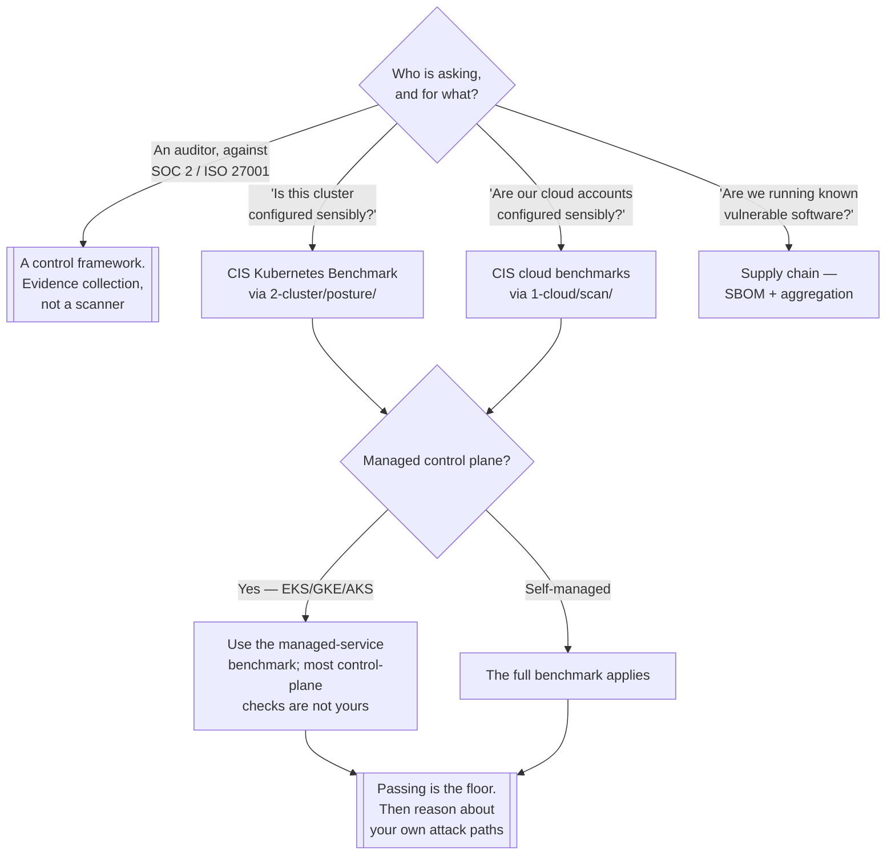

[← Governance](../README.md)

# Compliance

The external baselines a platform is measured against — what they are good for, and the much
larger thing they are not.

No tool subfolders; the scanners that implement these baselines live at the ring they measure
(`2-cluster/posture/`, `3-container/posture/`, `1-cloud/scan/`). The reference sources are in
[Notes](#7-notes).

## Contents

1. [Baseline, framework, regulation](#1-baseline-framework-regulation)
2. [CIS Benchmarks in practice](#2-cis-benchmarks-in-practice)
3. [A benchmark is a floor, not a threat model](#3-a-benchmark-is-a-floor-not-a-threat-model)
4. [Who implements the checks](#4-who-implements-the-checks)
5. [Vulnerability data and its limits](#5-vulnerability-data-and-its-limits)
6. [Decision tree](#6-decision-tree)
7. [Notes](#7-notes)
8. [Anti-patterns](#8-anti-patterns)
9. [How this applies to pikakube](#9-how-this-applies-to-pikakube)

---

## 1. Baseline, framework, regulation

Three different things that all get called "compliance", and confusing them wastes a lot of
effort:

| | **Technical baseline** | **Control framework** | **Regulation** |
|---|---|---|---|
| Examples | CIS Benchmarks, DISA STIGs, Kubernetes Pod Security Standards | NIST 800-53, ISO 27001, SOC 2, NIST CSF | GDPR, HIPAA, PCI DSS, LGPD |
| Says | *set this specific setting to this value* | *have a control for this category of risk* | *the law requires this outcome* |
| Automatable | **yes, largely** | partly — evidence collection | no; it requires interpretation |
| Who cares | engineers | security and risk functions | lawyers, auditors, regulators |
| Failure means | a misconfiguration | a control gap | legal exposure |

The relationship is a stack: a regulation demands an outcome, a framework organises controls
that produce it, and a baseline says which settings implement one of those controls on a
specific technology.

Where teams go wrong is entering at the wrong level. Running a CIS scan does not produce SOC 2
compliance, and a SOC 2 auditor's checklist does not tell you what to set `--anonymous-auth`
to. Both are needed and they answer different questions.

## 2. CIS Benchmarks in practice

The Center for Internet Security publishes consensus-built configuration baselines for most
common technologies. The ones relevant to this repository:

| Benchmark | What it covers | Implemented by |
|---|---|---|
| CIS Kubernetes | control-plane flags, etcd, kubelet, RBAC, network policy, Pod Security | `2-cluster/posture/` — kube-bench, kubescape |
| CIS Docker | daemon configuration, image and container runtime settings | `3-container/posture/` — docker-bench-security |
| CIS Benchmarks for cloud providers | account, IAM, logging and network settings | `1-cloud/scan/` — Prowler, ScoutSuite, CloudSploit |
| CIS Benchmarks for Linux distributions | host hardening | host tooling, and Wazuh's configuration assessment |

Two structural details worth knowing before reading any result:

**Scored and not-scored items.** Benchmarks distinguish checks that can be evaluated
automatically from those that require human judgement. A tool reports the first category; a
clean automated run is not a clean benchmark.

**Managed control planes.** On EKS, GKE and AKS a large fraction of CIS Kubernetes checks are
about components you cannot see or change. There are separate managed-service benchmarks for
exactly this reason, and running the vanilla Kubernetes benchmark against a managed cluster
produces a long list of failures that are neither actionable nor real.

## 3. A benchmark is a floor, not a threat model

The point this capability exists to make.

A benchmark is a **generic** document. It was written without knowledge of your architecture,
your data, your users or your adversaries. It encodes what is sensible for most deployments of
a technology, which is exactly what makes it useful as a starting point and useless as a
definition of "secure".

| A benchmark tells you | A benchmark cannot tell you |
|---|---|
| anonymous auth should be off | that one namespace holds every customer record |
| the kubelet read-only port should be closed | that a CI service account has cluster-admin |
| audit logging should be enabled | that nobody reads the audit log |
| containers should not run as root | that your actual exposure is an internet-facing service with a weak authorisation model |

Passing every check and having a straightforward path to compromise is entirely possible, and
common. The right use is: **satisfy the baseline because it is cheap and well understood, then
do the work the baseline cannot do** — reason about your own attack paths, which is what
`2-cluster/attack-path/` tooling exists for.

The inverse mistake is worth naming too: dismissing benchmarks because they are generic. They
encode a lot of accumulated operational knowledge, and most real incidents involve something a
benchmark would have flagged.

## 4. Who implements the checks

This folder holds the **baselines**; the scanners live at the ring they measure. That split is
deliberate — a CIS Kubernetes check is a cluster concern and belongs next to the other cluster
tooling, while the decision about which baseline applies is a governance concern.

| Ring | Where the scanners are |
|---|---|
| Cloud account | `1-cloud/scan/` |
| Kubernetes | `2-cluster/posture/` |
| Container and host | `3-container/posture/` |
| Continuous, correlated | [`cnapp/`](../cnapp/README.md), [`siem/`](../siem/README.md) — both report compliance status as a feature |

## 5. Vulnerability data and its limits

Compliance work reaches for CVE data constantly — "are we running anything with known
vulnerabilities" is a control in nearly every framework. Two limits are worth stating, because
they explain why the [supply-chain](../supply-chain/README.md) folder is shaped the way it is.

**Severity is not risk.** CVSS scores a vulnerability in the abstract. Whether it matters
depends on whether the code path is reachable, whether the workload is exposed, and what it can
access — none of which CVSS knows. This is the same argument as
[`cnapp/`](../cnapp/README.md#2-the-real-argument-is-correlation), reached from the compliance
side.

**Identification is imperfect.** NVD-style matching on CPE strings routinely produces both
false positives and misses, particularly for language-ecosystem packages. That is why OSV's
package-and-version model, recorded in the
[supply-chain notes](../supply-chain/README.md#11-notes), is preferred where available.

The consequence for compliance: "zero critical CVEs" as a policy target is not achievable and
not meaningful. A policy about **exploitable, reachable** vulnerabilities with a remediation
window is defensible; a raw count is a number that goes up.

## 6. Decision tree

## 7. Notes

Original references recorded for this folder:

> <https://downloads.cisecurity.org>

The **CIS download portal** — where the benchmark PDFs themselves come from. Worth knowing the
distinction between this and the tooling: `kube-bench` and friends implement a *version* of a
benchmark, and the authoritative text lives here. Two practical points. The documents are free
for individual use after registration, and they include the **rationale and remediation** for
every check — which is the part that makes a failing result actionable, and which the scanner
output usually condenses to one line. And the benchmarks are **versioned against product
versions**: a CIS Kubernetes Benchmark written for 1.27 has checks that do not apply to 1.31,
so a scanner running an old profile reports failures for flags that no longer exist. Matching
the benchmark version to the cluster version is the first thing to check when results look
strange.

> <https://www.cvedetails.com>

A **CVE browsing and statistics site** built on NVD data. Its useful properties are aggregation
views the NVD does not offer directly: vulnerabilities by vendor, by product, by version, and
over time — which is how you answer "how bad is this product's history" rather than "is this
specific version vulnerable". Two caveats. It is derived from NVD, so it inherits NVD's CPE
matching problems described in section 5 — a product page can list vulnerabilities that do not
apply to your build, and miss ones that do. And it is a browsing tool, not a data source to
automate against; for automation the right inputs are OSV and the vendor feeds recorded in the
[supply-chain notes](../supply-chain/README.md#11-notes).

## 8. Anti-patterns

| Anti-pattern | Why it is bad | What to do instead |
|---|---|---|
| Treating a benchmark score as a security posture | it is generic and knows nothing about your architecture or adversaries | pass it, then model your own attack paths |
| Running the vanilla Kubernetes benchmark against a managed cluster | most control-plane checks are about components you do not control | use the managed-service benchmark |
| Mismatched benchmark and product versions | failures for flags that no longer exist, and gaps for ones that do | match the profile to the cluster version |
| "Zero critical CVEs" as a policy | not achievable, and severity is not risk | a policy about exploitable, reachable vulnerabilities with a remediation window |
| Confusing a framework with a baseline | a SOC 2 auditor cannot tell you a kubelet flag; a CIS scan is not SOC 2 evidence | enter at the right level; both are needed |
| Compliance as a documentation exercise | produces a binder and changes no configuration | automate the baseline checks in CI or as a scheduled job |
| Dismissing benchmarks because they are generic | they encode real operational knowledge, and most incidents involve something they flag | treat as a cheap floor |
| Automated checks passing counted as "the benchmark passed" | not-scored items require human judgement and are not evaluated | read the full benchmark, not just the tool output |

## 9. How this applies to pikakube

Not run, and the case for it here is unusual.

This is a **self-managed Kind cluster**, which means — unlike EKS or GKE — the full CIS
Kubernetes Benchmark genuinely applies: the control-plane flags, etcd configuration and kubelet
settings are all visible and all yours. That makes it a good environment for actually reading
a benchmark rather than skimming a report, because every failing check corresponds to something
you can look at and change.

It also means the results will be poor, and that is expected. A Kind cluster is a development
tool; it is not configured for the threat model a CIS benchmark assumes. Treating a bad score
here as a problem to fix would be misreading it. Treating it as a **guided tour of what a
hardened control plane looks like** is the productive use.

Concretely, the cheap version is `kube-bench` as a Job in `2-cluster/posture/`, with the
profile matched to the cluster's Kubernetes version, read once with the CIS PDF open alongside
it. No compliance obligation exists here, so the value is entirely educational — which is worth
being explicit about rather than presenting an empty checklist as a gap.

---

[← Governance](../README.md)
