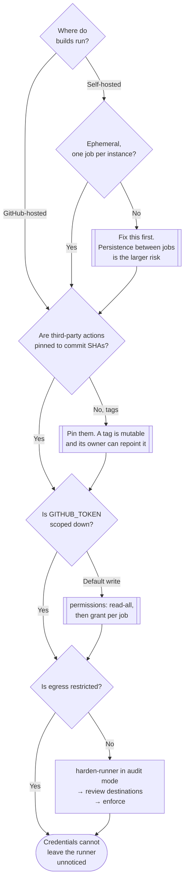

[← Governance](../README.md)

# Runner hardening

Securing the machine that builds everything else — because evidence produced on a compromised
runner is evidence about nothing.

Tools: [`harden-runner/`](harden-runner/README.md)

## Contents

1. [The runner is the highest-value target](#1-the-runner-is-the-highest-value-target)
2. [What actually goes wrong](#2-what-actually-goes-wrong)
3. [Egress filtering](#3-egress-filtering)
4. [Tamper detection](#4-tamper-detection)
5. [Hosted vs self-hosted runners](#5-hosted-vs-self-hosted-runners)
6. [Decision tree](#6-decision-tree)
7. [Anti-patterns](#7-anti-patterns)
8. [How this applies to pikakube](#8-how-this-applies-to-pikakube)

---

## 1. The runner is the highest-value target

Every control in [`supply-chain/`](../supply-chain/README.md) rests on the same assumption:
that the pipeline producing the evidence was honest. Signatures are made there. Provenance is
attested there. SBOMs are generated there. Registry credentials, cloud credentials and package
publishing tokens all live there.

So the runner is not a build detail — it is the single point where compromising one thing
compromises everything downstream, silently and with valid signatures.

> A CI runner has: write access to your registry, cloud credentials, a signing identity, and it
> executes arbitrary code from every dependency in your build. It is the most privileged
> untrusted-code execution environment most organisations run.

That last clause is the uncomfortable part. A build **is** arbitrary code execution by design:
`npm install` runs install scripts, a Makefile runs whatever it likes, a test suite executes
whatever the dependency tree contains. The runner is built to execute code nobody reviewed.

This is why runner hardening sits in governance rather than in `4-code/`: it underwrites the
whole layer rather than checking one artefact.

## 2. What actually goes wrong

The realistic attack paths, none of which require anything sophisticated:

| Path | Mechanism |
|---|---|
| **Malicious dependency** | a package's install or build script exfiltrates environment variables — where the credentials are |
| **Compromised third-party action** | an action referenced by mutable tag (`@v3`) is repointed by its owner or by whoever compromised it |
| **Script injection** | untrusted input (`${{ github.event.pull_request.title }}`) interpolated into a `run:` block executes as shell |
| **`pull_request_target` misuse** | runs untrusted fork code in a context that *has* secrets — the single most common serious GitHub Actions vulnerability |
| **Over-scoped token** | a default write-permission `GITHUB_TOKEN` lets injected code push to the repository or alter releases |
| **Self-hosted runner reuse** | one job leaves state — credentials, caches, binaries — that the next job inherits |
| **Cache poisoning** | a writable shared cache is a persistence mechanism across builds |

Two properties make these hard to catch with conventional tooling. Everything is **inside a
process the pipeline legitimately started**, so nothing looks anomalous. And the runner is
**ephemeral** — after the job, the evidence is gone.

Both point to the same conclusion: the controls have to be applied *during* the job, and they
have to be about behaviour rather than about static configuration.

## 3. Egress filtering

The primary control, and the reason this capability exists as something more than a checklist.

Exfiltration requires an outbound connection. A build's legitimate network needs are narrow and
enumerable: a package registry, the source host, a container registry, maybe an artefact store.
Everything else is either unnecessary or hostile.

**Default-deny egress with an allow-list** turns the dominant attack — steal credentials, send
them somewhere — from silent into blocked and visible.

| Property | Consequence |
|---|---|
| Enumerable legitimate destinations | an allow-list is actually maintainable, unlike in production networks |
| Exfiltration needs egress | blocking it defeats the attack rather than detecting it late |
| Blocked attempts are a signal | a build reaching for an unexpected host is a finding, not noise |
| No knowledge of the attack required | it does not matter which dependency was malicious |

The adoption path that works is the same as for NetworkPolicies: run in **audit mode** first,
collect the destinations real builds use, review that list — the review itself is frequently
where something surprising shows up — then enforce.

## 4. Tamper detection

The complement to egress control: monitoring what the job does *inside* the runner.

- **File monitoring** — was a source file altered after checkout and before the build? That is
  the shape of a build-time backdoor: the reviewed source and the built artefact differ, and
  nothing in the repository shows it.
- **Process monitoring** — what did the build actually execute? Unexpected processes during a
  dependency install are the classic signal.
- **Behavioural baseline** — a build's network and process profile is remarkably stable across
  runs, so deviation is meaningful in a way it rarely is elsewhere.

This is what closes the gap identified in
[`provenance/`](../supply-chain/provenance/README.md#1-the-gap-signing-leaves-open): provenance
proves *which* pipeline built the artefact, and tamper detection is about whether that pipeline
did what it was supposed to while it ran.

## 5. Hosted vs self-hosted runners

Different threat models, and the difference is worth being explicit about:

| | **Hosted** (GitHub-hosted, etc.) | **Self-hosted** |
|---|---|---|
| Isolation between jobs | fresh VM per job — strong by construction | **whatever you built** |
| Persistence risk | none | the primary risk: state survives between jobs |
| Network position | outside your network | often **inside** it, with access to internal systems |
| Public repository forks | risky by default | **dangerous** — a fork PR can execute on your infrastructure |
| Credential exposure | scoped to the job | potentially the host's identity, including a cloud instance role |
| What to add | egress filtering, tamper detection | the above, **plus ephemeral runners** |

The rule for self-hosted runners: **ephemeral, one job per instance, never for public
repositories without strict controls.** A long-lived self-hosted runner inside a corporate
network, accepting jobs from a public repository, is close to offering remote code execution as
a service.

## 6. Decision tree

## 7. Anti-patterns

| Anti-pattern | Why it is bad | What to do instead |
|---|---|---|
| Third-party actions referenced by tag | `@v3` is mutable; the owner, or whoever compromises them, can repoint it at anything | pin to a full commit SHA, with Dependabot or Renovate updating it |
| Default `GITHUB_TOKEN` permissions | injected code can push to the repository or alter releases | `permissions: read-all` at the top, grant narrowly per job |
| `pull_request_target` running fork code | executes untrusted code with access to secrets — the classic serious misconfiguration | never check out and run PR code in that context |
| Interpolating event data into `run:` blocks | `${{ github.event.* }}` is attacker-controlled and becomes shell | pass through an environment variable and quote it |
| Long-lived self-hosted runners | one poisoned job persists into every later job | ephemeral runners, one job per instance |
| Self-hosted runners for public repositories | a fork PR executes on your infrastructure, often inside your network | do not, or require approval and full isolation |
| Unrestricted egress from builds | exfiltration is silent and undetectable after the fact | default-deny with an allow-list |
| Secrets available to every job | broadens the blast radius of any single compromise | scope secrets to the jobs that need them; prefer OIDC over static credentials |
| Signing on a runner nobody hardened | the signature is valid and the artefact is not what you think | this folder is a prerequisite for [`signing-artifacts/`](../supply-chain/signing-artifacts/README.md) |

## 8. How this applies to pikakube

This is a **public GitHub repository**, which makes the fork-PR paths in section 5 relevant in
principle even though the pipeline surface here is small.

Nothing in this repository currently signs or publishes from CI — the one signing exercise
recorded in [cosign](../supply-chain/signing-artifacts/cosign/README.md) was run locally with a
local key. That is worth noticing because it inverts the usual order: this capability normally
becomes urgent the moment CI holds a signing identity, and here it would become urgent
*precisely as a result of* the improvement the supply-chain folder recommends. Moving signing
into CI with keyless OIDC is the right change and it puts a signing identity on a runner, which
is exactly what this folder exists to protect.

The controls worth having in place before that happens, cheapest first:

1. **`permissions: read-all`** at the top of workflows, granting more only where needed. One
   line, and it removes the most common escalation path.
2. **Pin third-party actions to commit SHAs.** This is also one of the checks
   [Scorecard](../supply-chain/posture/scorecard/README.md) reports, so it gets measured for
   free once that runs.
3. **[harden-runner](harden-runner/README.md) in audit mode.** Free for public repositories, one
  step per job, and the destination list it produces is informative on its own.

None of this requires a decision about tooling, and all of it is a prerequisite for the
supply-chain work rather than an alternative to it.

---

[← Governance](../README.md)
