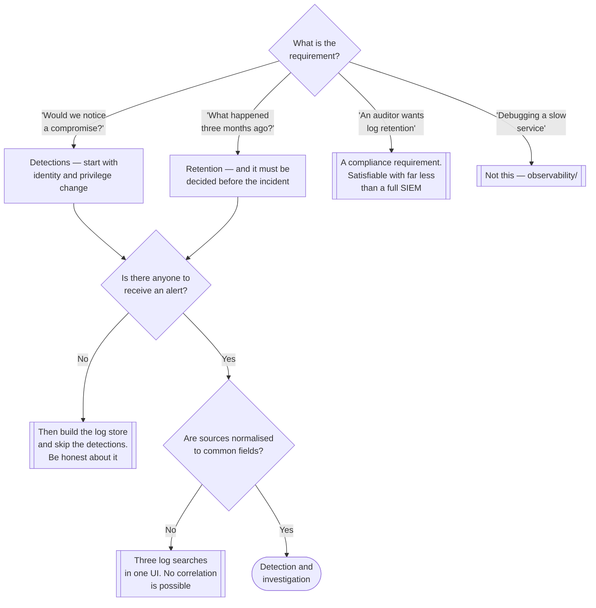

[← Governance](../README.md)

# SIEM

Collecting security-relevant events from everywhere, correlating them, and being able to
answer what happened — before, during and after.

Tools: [`wazuh/`](wazuh/README.md)

## Contents

1. [What a SIEM is for](#1-what-a-siem-is-for)
   - [SIEM is not observability](#siem-is-not-observability)
2. [The four jobs](#2-the-four-jobs)
3. [Detections are the product](#3-detections-are-the-product)
4. [The cost problem, stated honestly](#4-the-cost-problem-stated-honestly)
5. [Where it overlaps with the other rings](#5-where-it-overlaps-with-the-other-rings)
6. [Decision tree](#6-decision-tree)
7. [Anti-patterns](#7-anti-patterns)
8. [How this applies to pikakube](#8-how-this-applies-to-pikakube)

---

## 1. What a SIEM is for

Security Information and Event Management. Two questions, and the second is the one people
forget:

- **Would we notice?** — detection: correlating events across sources into an alert that a
  human acts on.
- **What actually happened?** — investigation: reconstructing a sequence after the fact, from
  data that was collected before anyone knew it would be needed.

The second is why retention matters and why a SIEM is not simply an alerting system. The value
of a log during an incident is decided months earlier, when someone chose whether to keep it.
The typical intrusion is discovered long after it began, and the investigation is bounded by
whatever was retained.

### SIEM is not observability

They collect similar data and answer different questions, and confusing them produces a
platform that does both badly.

| | **Observability** (`observability/`) | **SIEM** |
|---|---|---|
| Question | why is the system slow or broken? | did something malicious happen? |
| Data | metrics, traces, application logs | auth events, audit logs, syscalls, file integrity, network flows |
| Retention | days to weeks; sampling is fine | **months to years; sampling destroys evidence** |
| Consumers | engineers debugging | detection and incident response |
| Access model | broad | restricted — it contains evidence, and must resist tampering |
| Cardinality concern | high-cardinality labels | **completeness** — a dropped event is a blind spot |

The retention row is the structural difference. Observability systems are built to drop data
cheaply; a SIEM is built to keep it. Running detections on a sampled, short-retention pipeline
means the answer to "what happened three months ago" is "we do not know".

## 2. The four jobs

| Job | What it involves | Where it usually fails |
|---|---|---|
| **Collection** | agents and shippers across hosts, containers, the Kubernetes audit log, cloud audit trails, network devices, identity providers | the source nobody instrumented is the one the attacker used |
| **Normalisation** | mapping every source into common fields so a rule can span them | skipped, so every rule is written per-source and none of them correlate |
| **Detection** | rules and correlation producing alerts | far too many alerts, or none that ever fire |
| **Response** | triage, investigation, containment | there is nobody on the other end |

Normalisation is the least visible and the most decisive. Correlation — "this user failed
authentication in the identity provider, then succeeded from a new country, then a pod in that
namespace opened an outbound connection" — is impossible unless those three sources share a
schema. Without it a SIEM is three log searches in one interface.

## 3. Detections are the product

A SIEM with no tuned detections is a log store with an expensive licence.

The rules that pay for themselves are boring and specific, and they are almost always about
*identity and change* rather than about exotic exploits:

- authentication anomalies — impossible travel, brute force, a service account used
  interactively
- privilege changes — a new cluster-admin binding, a role granted, an IAM policy attached
- audit-log gaps — logging stopped, an agent went quiet, a trail was disabled. **Absence of
  data is itself a detection**, and it is the one people forget to write
- workload anomalies — a container spawning a shell, an unexpected outbound connection
- integrity — a binary or configuration file changed on a host that should be immutable

Each rule needs an owner and a documented response. A detection with no response is a
notification, and notifications that nobody acts on train people not to look.

## 4. The cost problem, stated honestly

SIEM economics are the reason most deployments fail, and it is worth being blunt about the
shape of it.

Ingest-priced products punish exactly the behaviour you want — collecting more sources — so
teams under-collect to control spend, and then discover during an incident that the relevant
source was excluded. Self-hosted products move the cost from licence to storage and operations,
which is cheaper in money and more expensive in attention.

The way out is not "collect everything" or "collect little". It is **collect what has a
detection or an investigation attached**, deliberately:

| Data | Keep? |
|---|---|
| Kubernetes audit log (filtered to meaningful verbs) | yes — it is the record of who did what to the cluster |
| Cloud audit trail | yes — non-negotiable, and cheap relative to its value |
| Identity provider events | yes — most intrusions touch identity |
| Host auth, sudo, file integrity | yes |
| Application debug logs | no — that is observability |
| Full packet capture | rarely; enormous, and usually unnecessary |

## 5. Where it overlaps with the other rings

A SIEM sits in governance because it spans every ring — but several of its inputs are produced
by tools documented elsewhere, and the boundary is worth being explicit about:

| Producer | Ring | What it sends |
|---|---|---|
| Falco, Tetragon, Tracee | `2-cluster/runtime-security/` | syscall-level workload events |
| Kubernetes audit | `2-cluster/audit/` | who called which API |
| Cloud audit trails | `1-cloud/` | control-plane activity in the account |
| [CNAPP](../cnapp/README.md) | governance | correlated posture and runtime findings |

The rule of thumb: those tools **detect**, the SIEM **correlates and retains**. A runtime
sensor knows a container opened a shell; only the SIEM can tell you the same identity had
changed an IAM policy twenty minutes earlier.

## 6. Decision tree

## 7. Anti-patterns

| Anti-pattern | Why it is bad | What to do instead |
|---|---|---|
| Ingesting everything with no detections | maximum cost, and the signal is buried by design | start from a few detections that have owners, then collect what they need |
| Deploying a SIEM with nobody to respond | alerts accumulate unread and the platform is blamed | agree the response process before the deployment |
| Using the observability stack as the SIEM | short retention, sampling, and read access for everyone — all wrong for evidence | separate pipeline, separate retention, restricted access |
| Retention chosen by budget alone | intrusions are typically discovered long after they begin | retain by investigation window, not by what is left over |
| Alerting on everything a runtime sensor emits | the sensors are noisy by design; that is what correlation is for | correlate, then alert |
| No detection for missing data | an attacker's first step is often to stop the logging | alert on agent silence and on audit configuration changes |
| Skipping normalisation | cross-source correlation becomes impossible, which is the entire point | map sources into a common schema on ingest |
| Log store writable by the systems it monitors | evidence an attacker can edit is not evidence | append-only, separate credentials, off-host storage |

## 8. How this applies to pikakube

Not deployed. [Wazuh](wazuh/README.md) is documented as the open-source option and nothing runs.

For a local single-node cluster that is a defensible position, and it is worth saying why
rather than listing it as a gap: there is no adversary, no compliance obligation and nobody on
call. A SIEM's two products are detection and investigation, and both require a responder. The
cost here would be entirely real and the benefit entirely hypothetical.

What is worth doing regardless, and is much cheaper:

- **Turn on the Kubernetes audit log.** It is the record of who did what to the cluster, it is
  the input every other detection depends on, and it belongs to `2-cluster/audit/`. Having it
  written somewhere durable is most of the value of this capability at a fraction of the cost.
- **Run a runtime sensor before running a SIEM.** Falco or Tetragon in `2-cluster/` produces
  the events a SIEM would correlate. Producing them is useful on its own; correlating them
  needs a responder.

If Wazuh is deployed here, treat it as a **learning deployment** and say so — it is a good way
to understand agent-based collection, file integrity monitoring and rule writing, and it should
not be mistaken for a monitored environment.

---

[← Governance](../README.md)
