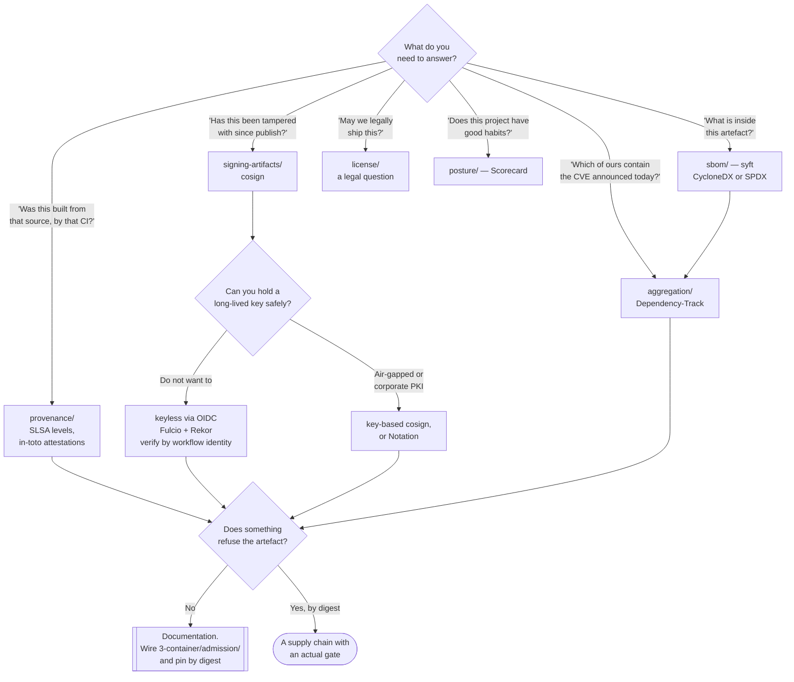

[← Governance](../README.md)

# Supply chain

Knowing what is inside an artefact, proving where it came from, and being able to answer
"are we affected?" about a vulnerability that did not exist when the artefact was built.

Capabilities: [`sbom/`](sbom/README.md) · [`aggregation/`](aggregation/README.md) ·
[`provenance/`](provenance/README.md) · [`signing-artifacts/`](signing-artifacts/README.md) ·
[`license/`](license/README.md) · [`posture/`](posture/README.md) · [`ml/`](ml/README.md)

## Contents

1. [The through-line](#1-the-through-line)
   - [The five steps](#the-five-steps)
   - [Where it usually breaks](#where-it-usually-breaks)
2. [SBOM — the inventory](#2-sbom--the-inventory)
   - [The two formats](#the-two-formats)
   - [An SBOM alone is worthless](#an-sbom-alone-is-worthless)
3. [Aggregation — the part that keeps working](#3-aggregation--the-part-that-keeps-working)
   - [A scan is a point in time](#a-scan-is-a-point-in-time)
   - [Dependency-Track vs GUAC](#dependency-track-vs-guac)
4. [Provenance — was it really built that way](#4-provenance--was-it-really-built-that-way)
   - [SLSA is levels, in-toto is the format](#slsa-is-levels-in-toto-is-the-format)
   - [What signing alone does not prove](#what-signing-alone-does-not-prove)
5. [Signing — binding a claim to an artefact](#5-signing--binding-a-claim-to-an-artefact)
   - [Keyless signing, and why it matters](#keyless-signing-and-why-it-matters)
   - [The legacy options](#the-legacy-options)
6. [Licence compliance is a legal risk, not a security one](#6-licence-compliance-is-a-legal-risk-not-a-security-one)
7. [Posture — the practices of the repository itself](#7-posture--the-practices-of-the-repository-itself)
8. [Enforcement, which lives in another folder](#8-enforcement-which-lives-in-another-folder)
9. [Decision tree](#9-decision-tree)
10. [Anti-patterns](#10-anti-patterns)
11. [Notes](#11-notes)
12. [How this applies to pikakube](#12-how-this-applies-to-pikakube)

---

## 1. The through-line

This folder is not a collection of independent tools. It is one chain, and each link is
useless without the ones on either side of it.

### The five steps

```
1. SBOM              what is inside this artefact
2. aggregation       keep asking that question as the world changes
3. provenance        it was built from that source, by that pipeline
4. signing           this evidence is bound to this exact artefact
5. enforcement       refuse the artefact when the evidence does not check out
```

| # | Step | Folder | Answers |
|---|---|---|---|
| 1 | Inventory | [`sbom/`](sbom/README.md) | what components does this contain? |
| 2 | Continuous monitoring | [`aggregation/`](aggregation/README.md) | which of our artefacts contain the thing disclosed today? |
| 3 | Provenance | [`provenance/`](provenance/README.md) | was this built from that commit, by that builder? |
| 4 | Signing | [`signing-artifacts/`](signing-artifacts/README.md) | who vouches for this, and for exactly this digest? |
| 5 | **Enforcement** | `3-container/admission/` | may this run in the cluster? |

Two capabilities sit beside the chain rather than inside it: [`license/`](license/README.md)
reads the same inventory for a legal question, and [`posture/`](posture/README.md) rates the
repository's own habits rather than any artefact.

### Where it usually breaks

**Step 5 is in a different folder, and that is where most implementations stop.**

Say it plainly, because it is the thing worth remembering from this entire folder:

> Steps 1 to 4 produce documents. Only step 5 produces a decision. A platform that generates
> SBOMs, publishes attestations and signs every image, and then admits anything the registry
> serves, has bought itself nothing except a slower pipeline.

The second-most-common break is step 2. Generating an SBOM and attaching it to the build
artefact feels complete, and it is the least valuable place to put it — see section 3.

## 2. SBOM — the inventory

A **Software Bill of Materials** is a machine-readable list of what is actually in an
artefact: packages, versions, and ideally the relationships between them. Generated by
scanning the built thing, not by reading the manifest, which is the point — a lockfile
describes intent, an SBOM describes what shipped.

[`syft`](sbom/syft/README.md) is the tool here.

### The two formats

| | **CycloneDX** | **SPDX** |
|---|---|---|
| Origin | OWASP | Linux Foundation, now ISO/IEC 5962 |
| Optimised for | security use cases — VEX, vulnerability exploitability | licence compliance and legal provenance |
| Ecosystem | Dependency-Track is CycloneDX-native | strong in legal and OSS-programme tooling |
| Practical rule | **the default for security tooling** | the default when lawyers are the consumer |

Both are widely supported and converters exist. The choice is usually forced by the consumer:
Dependency-Track wants CycloneDX, so if aggregation is the destination, that decides it.

### An SBOM alone is worthless

This deserves its own heading because the industry spent several years pretending otherwise.

An SBOM is a **list**. A list has value only when something reads it and compares it against
something else — a vulnerability database, a licence policy, an allowlist. Attaching a JSON
file to a build artefact and never querying it is a compliance gesture.

The consumers that make it worth generating:

| Consumer | What it does with the list |
|---|---|
| [`aggregation/`](aggregation/README.md) | continuously re-checks it against new disclosures |
| [`license/`](license/README.md) | checks every component's licence against policy |
| Incident response | answers "are we affected?" in minutes instead of days |
| Admission (`3-container/`) | refuses images whose inventory violates policy |

The incident-response row is the one that pays for the whole exercise the first time it
happens. "Do we run log4j anywhere, and where?" is a question that takes an afternoon of
grepping without an SBOM database and a single query with one.

## 3. Aggregation — the part that keeps working

### A scan is a point in time

The insight this capability exists for:

> **A vulnerability disclosed tomorrow affects the image you built today.**

Scanning at build time answers "is this artefact known-vulnerable *right now*". That answer
has a shelf life measured in days. Nothing about the artefact changes when a CVE is published
— but its risk profile does, and no build-time control will ever notice, because the build
already finished.

The naive fix is to rescan everything on a schedule, which means pulling every image in the
estate and running a scanner over it repeatedly. That is expensive, slow, and it scales with
the number of artefacts rather than with the number of disclosures.

The correct fix is to invert it: **store the inventories once, and re-evaluate the
inventories** when the vulnerability data changes. That is what an SBOM aggregation platform
does, and it is why aggregation is a separate capability rather than a feature of a scanner.

### Dependency-Track vs GUAC

| | [Dependency-Track](aggregation/dependency-track/README.md) | [GUAC](aggregation/guac/README.md) |
|---|---|---|
| Model | a portfolio of projects, each with an SBOM | a **graph** of artefacts, sources, builds and attestations |
| Answers | "which projects contain component X?" | "what is the full ancestry and blast radius of X?" |
| Inputs | CycloneDX SBOMs | SBOMs **and** attestations, VEX, provenance, from many sources |
| Maturity | mature, widely deployed, the default choice | younger, more ambitious, more moving parts |
| Cost to run | one service plus a database | a graph store and a set of collectors |

Dependency-Track is the answer to the concrete question most teams actually have. GUAC is the
answer when the question is broader than components — when you want to traverse from a CVE to
a package to every image containing it to every deployment running that image, across
evidence types.

## 4. Provenance — was it really built that way

### SLSA is levels, in-toto is the format

The most common confusion in this area, so state it directly:

| | [SLSA](provenance/slsa/README.md) | [in-toto](provenance/in-toto/README.md) |
|---|---|---|
| What it is | a **framework of levels** — a maturity ladder for build integrity | an **attestation format and specification** |
| Shape | requirements: sourced, built on a hosted builder, non-falsifiable provenance, hermetic/reproducible | a signed statement: subject, predicate type, predicate |
| You "do" it by | meeting the requirements of a level | emitting and verifying attestations |
| Relationship | SLSA provenance **is** an in-toto attestation with a specific predicate type | in-toto is the envelope SLSA's claims travel in |

They are not alternatives. SLSA tells you *what* to claim and how trustworthy the claim is;
in-toto is *how* the claim is written down.

[`buildsafe`](provenance/buildsafe/README.md) sits alongside both as an implementation
approach — building artefacts in a way that makes strong provenance achievable in the first
place, rather than asserting it after the fact.

### What signing alone does not prove

A signature says: *someone with this key vouched for this exact digest.* That is a real and
useful claim, and it is narrower than people assume.

| Question | Answered by a signature? |
|---|---|
| Has this artefact been modified since it was signed? | **Yes** |
| Did the person or system holding the key intend to publish it? | Yes |
| Was it built from the source in that repository, at that commit? | **No** |
| Was it built by the pipeline we think builds it? | **No** |
| Did a maintainer build it on their laptop with an extra patch applied? | **No** — and it would still verify |

Provenance closes exactly that gap. It is what turns "this image is authentic" into "this
image is the output of *that* build of *that* commit". In a world where the dominant
supply-chain attacks are compromised build systems rather than forged artefacts, that is the
more important claim of the two.

## 5. Signing — binding a claim to an artefact

[`cosign`](signing-artifacts/cosign/README.md) is the current answer, and it is not close.

### Keyless signing, and why it matters

Cosign's important feature is not that it signs container images — plenty of things sign
container images. It is **keyless signing**, and the mechanism is worth understanding because
it removes an entire class of operational problem.

```
CI job holds an OIDC identity (e.g. "the workflow X on repo Y, ref Z")
        │
        ▼
Fulcio  issues a short-lived certificate binding that identity to an ephemeral key
        │
        ▼
sign the artefact with the ephemeral key, then throw the key away
        │
        ▼
Rekor   records the signature in a public, append-only transparency log
        │
        ▼
verify against the identity, not against a key
```

What that buys:

| Problem with long-lived keys | What keyless does |
|---|---|
| The key must be stored somewhere, usually a CI secret | there is no key at rest — it lives for seconds |
| A leaked key signs forever, undetectably | nothing to leak |
| Rotation is a project | expiry is measured in minutes, by construction |
| "Who signed this?" answers with a key fingerprint | it answers with a **workflow identity**: this repo, this workflow, this ref |

That last row is the conceptual shift. Verification policy stops being "trust this public
key" and becomes "trust artefacts signed by the release workflow of this repository on the
main branch" — which is a statement a human can read and an admission controller can enforce.

The trade-off is real and should be stated: keyless depends on a public transparency log and
on the Sigstore public-good instance being available and trusted. Air-gapped environments and
organisations that cannot publish signing events run their own Sigstore stack or keep
long-lived keys.

### The legacy options

| Tool | Status |
|---|---|
| [`docker-trust`](signing-artifacts/docker-trust/README.md) | **legacy**. Docker Content Trust, built on Notary v1. Still functional, effectively unmaintained as a direction, and awkward — per-repository keys, poor CI ergonomics, no attestation story |
| [`notary`](signing-artifacts/notary/README.md) | Notary **v1 is largely superseded**. The live work is Notary Project / `notation` and the OCI-native signature specification, which is a genuine alternative to cosign — particularly where a corporate PKI already exists and keyless is not wanted |

For anything new: cosign. The others are documented because they are what you will find in
existing systems.

## 6. Licence compliance is a legal risk, not a security one

Say it up front, because the tooling lives next to security tooling and gets mistaken for it:
**a GPL violation is not a vulnerability.** Nothing is exploitable. The exposure is a lawsuit,
an injunction, or a forced source release — and the person who should decide the policy is
whoever owns legal risk, not the security team.

The mechanics that actually matter:

| Concept | What it means |
|---|---|
| **Permissive** (MIT, BSD, Apache-2.0) | use freely; attribution, and for Apache-2.0 a patent grant and a notice requirement |
| **Weak copyleft** (LGPL, MPL, EPL) | modifications to *the component* must be shared; your code is not infected |
| **Strong copyleft** (GPL) | derivative works must be distributed under the same licence — **source included** |
| **Network copyleft** (AGPL) | the same, triggered by *serving over a network* rather than by shipping a binary |

The condition everyone gets wrong: **copyleft obligations are triggered by distribution.**
Running GPL software on your own servers is not distribution, which is why AGPL exists and why
it is the one that catches SaaS. But a **container image is a distributed artefact** the
moment it leaves your registry — pushed to a public registry, shipped to a customer, or
handed to a partner. That is the actual risk in this folder, and it is the reason licence
scanning belongs to the image pipeline and not only to the source repository.

[`fossa`](license/fossa/README.md), [`ort`](license/ort/README.md) and
[`grant`](license/grant/README.md) are the tools; the capability README compares them.

## 7. Posture — the practices of the repository itself

[`scorecard`](posture/scorecard/README.md) is different from everything else here. It does not
examine an artefact — it examines the **repository's own security practices** and scores them:
is branch protection on, are workflow tokens read-only, are dependencies pinned, is there a
fuzzing setup, are releases signed, has a maintainer been active.

It is a proxy measure, and it should be read as one. A high score does not mean the code is
secure; it means the project has the habits that correlate with catching problems. Its two
honest uses are: on **your own** repositories as a checklist with a number attached, and on
**dependencies** as one input when choosing between two libraries that do the same thing.

## 8. Enforcement, which lives in another folder

The final link is `3-container/admission/` — the ring where an artefact is actually refused.
It is deliberately not in this folder, because it acts on the container at admission time
rather than producing evidence at build time.

What runs there, in general terms: an admission controller that verifies the cosign signature
against an expected identity, checks that a SLSA provenance attestation exists and names the
right builder and source repository, and optionally evaluates the SBOM against policy. The
usual candidates are the Sigstore policy controller, Connaisseur, Ratify, or a Kyverno
`verifyImages` rule.

One detail that quietly breaks the whole chain: **verification must be by digest.** A
signature binds to `sha256:...`, not to a tag. If deployments reference a mutable tag, the tag
can be repointed after verification and everything upstream is void.

## 9. Decision tree



## 10. Anti-patterns

| Anti-pattern | Why it is bad | What to do instead |
|---|---|---|
| Generating SBOMs and storing them in the build artefact | nothing ever reads them; the moment they are useful is during an incident, when nobody can find them | push to [`aggregation/`](aggregation/README.md) |
| Relying on build-time scanning alone | it answers a question that expires; tomorrow's CVE is invisible to it | continuous monitoring of stored SBOMs |
| Signing images and never verifying them | build time spent on a signature nobody checks | admission verification in `3-container/admission/` |
| Verifying signatures against a mutable tag | the tag can be repointed at an unsigned image after verification | pin and verify by `sha256:` digest |
| Assuming a signature proves provenance | it proves integrity and intent, not that the build was honest | SLSA provenance attestations |
| Treating SLSA and in-toto as competing choices | they are a framework and a format; you use both | see section 4 |
| Long-lived signing keys in CI secrets | a leaked key signs forever and the leak is undetectable | keyless signing via OIDC |
| Licence scanning owned by security | security cannot make the call on copyleft obligations, and the risk is not exploitability | route to legal; scan the image, not only the repo |
| Copying an SBOM from the base image and calling it done | it describes the base, not your application layers | generate from the final built artefact |
| Reading a Scorecard number as a security guarantee | it measures habits, not code | use it comparatively, when choosing a dependency |
| Building the evidence pipeline before the gate | the gate is the only part that changes behaviour, and it is deferred forever | stand the gate up in audit mode first |

## 11. Notes

Original references recorded for this folder, and what each is for.

**Vulnerability and dependency data**

> <https://github.com/google/osv.dev>
> <https://github.com/google/deps.dev>

**OSV** is an open, distributed vulnerability database with a precise data model: entries are
keyed to package ecosystems and exact affected version ranges, rather than to CPE strings.
That distinction is why it produces far fewer false positives than NVD-based matching, which
is notoriously bad at deciding whether "OpenSSL 3.0.2" in some vendor's notation matches your
package. **deps.dev** is the companion service that maps the transitive dependency graph of
open-source packages, including the licences and OSV advisories of everything downstream. Both
have APIs; both are the kind of data source an aggregation platform consumes.

**Exploitability and advisory formats**

> <https://github.com/openvex/spec>
> <https://github.com/cisagov/CSAF>

These two solve the problem that follows an SBOM: an inventory plus a CVE feed produces a
false-positive rate high enough to make the whole exercise unusable. **VEX** (Vulnerability
Exploitability eXchange) is a machine-readable statement from a producer saying *this CVE is
present but not exploitable in this product, and here is why* — `not_affected`, `affected`,
`fixed`, `under_investigation`. OpenVEX is the minimal, Sigstore-adjacent implementation.
**CSAF** (Common Security Advisory Framework, an OASIS standard, tooling from CISA) is the
broader machine-readable advisory format that carries VEX statements among other things — the
successor to human-readable security bulletins. The practical value: without VEX, a vulnerable
library that is never loaded looks identical to one on the request path, and triage collapses
under its own volume.

**Attestations in GitHub Actions and Docker**

> <https://github.com/actions/attest-build-provenance>
> <https://docs.docker.com/build/ci/github-actions/attestations/>
> <https://docs.docker.com/build/metadata/attestations/attestation-storage/>

The concrete, low-effort route to provenance for anyone already on GitHub Actions.
`attest-build-provenance` generates a signed SLSA provenance attestation for a build artefact
using the workflow's OIDC identity — no key management, a few lines of YAML. The Docker links
cover the same from BuildKit's side: `docker buildx` can emit SBOM and provenance attestations
as part of the build, and the storage page explains **where they live** — as separate
manifests in the OCI image index, referenced from the image, which is what makes them
portable across registries and discoverable by a verifier. Worth knowing because "where is the
attestation stored" is the first thing that breaks when moving between registries.

**SBOM generation for Kubernetes**

> <https://github.com/kubernetes-sigs/bom>

The Kubernetes project's own SBOM tool, producing SPDX. Notable mostly because it is how the
Kubernetes release artefacts themselves are described — a useful reference for what a
release-grade SBOM looks like in practice, and an option when SPDX is the required format.

**Dependency review at the pull request**

> <https://github.com/actions/dependency-review-action>

Shifts the question left to the diff: it fails a pull request that *introduces* a dependency
with a known vulnerability or a disallowed licence. The important property is that it looks
at the **change**, not the whole tree — which means it does not drown a team in pre-existing
findings on day one, and it stops the backlog from growing. It is the cheapest useful control
in this entire folder for a repository that has never had one.

**Frameworks and benchmarks for the chain itself**

> <https://github.com/ossf/s2c2f>
> <https://github.com/aquasecurity/chain-bench>
> <https://nvlpubs.nist.gov/nistpubs/SpecialPublications/NIST.SP.800-204D.pdf>

**S2C2F** (Secure Supply Chain Consumption Framework, OpenSSF, originally Microsoft) is the
mirror image of SLSA: SLSA is about how you *produce* artefacts, S2C2F is about how you
*consume* open source — ingesting, scanning, updating and, notably, mirroring dependencies
into an internal feed so a deleted upstream package cannot break or hijack your build. Most
organisations need the consumption side far more urgently than the production side.
**chain-bench** audits a software supply chain against CIS Software Supply Chain benchmarks —
source control settings, build pipeline configuration, dependency management, artefact
handling — which is the practical, runnable version of those frameworks. **NIST SP 800-204D**
is the official guidance on integrating supply-chain security into CI/CD for cloud-native
applications; useful when a control has to be justified to an auditor in language they accept.

**Pipeline security cheat sheets**

> <https://cheatsheetseries.owasp.org/cheatsheets/GitHub_Actions_Security_Cheat_Sheet.html>
> <https://cheatsheetseries.owasp.org/cheatsheets/CI_CD_Security_Cheat_Sheet.html>

The concrete failure modes of the pipeline itself: `pull_request_target` running untrusted
code with secrets, script injection through `${{ github.event.* }}` interpolated into a `run`
block, unpinned third-party actions (`@v3` is a mutable tag — pin the commit SHA), overly
permissive `GITHUB_TOKEN` scopes, and self-hosted runners reused between jobs. These belong
next to [`runner-hardening/`](../runner-hardening/README.md) and to `4-code/pipeline/`, and
they are worth reading before any of the heavier frameworks above — most real pipeline
compromises are one of these, not a sophisticated attack on the build.

## 12. How this applies to pikakube

The chain is **mapped completely and wired at exactly one point**.

| Step | State here |
|---|---|
| SBOM | [syft](sbom/syft/README.md) documented; nothing generates SBOMs in a pipeline |
| Aggregation | [Dependency-Track](aggregation/dependency-track/README.md) and [GUAC](aggregation/guac/README.md) staged as Flux `HelmRelease`s with empty `values:` — not configured, nothing ingesting |
| Provenance | documented; no attestations produced |
| Signing | **real** — [cosign](signing-artifacts/cosign/README.md) commands recorded against a published image, correctly digest-pinned |
| Enforcement | **absent** — nothing in `3-container/admission/` verifies anything |

So the single most valuable change is not adding a tool. It is connecting the two ends that
already exist: sign in CI (already done by hand) and verify at admission (not done at all).
That is one policy resource, and it converts an existing build step from a gesture into a
control.

The second, in order of value: point Dependency-Track at SBOMs generated by syft in CI. The
chart is already staged. The first time a disclosure lands, the question "does anything here
contain it?" becomes a query.

The third is nearly free and often skipped: `dependency-review-action` on pull requests, from
the notes above. It costs a few lines and prevents the backlog from growing while the rest is
being built.

---

[← Governance](../README.md)
