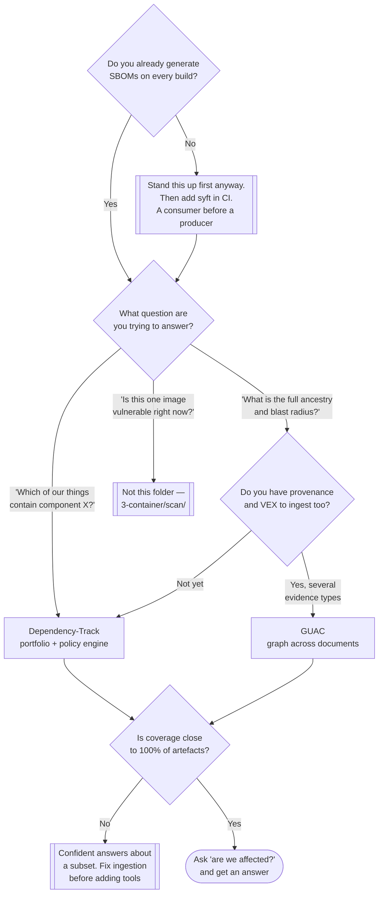

[← Supply chain](../README.md)

# Aggregation

Continuous monitoring of stored SBOMs against vulnerability data that keeps changing — the
only capability in this folder that re-evaluates an artefact after it was built.

Tools: [`dependency-track/`](dependency-track/README.md) · [`guac/`](guac/README.md)

## Contents

1. [The insight](#1-the-insight)
   - [Why rescanning does not solve it](#why-rescanning-does-not-solve-it)
   - [The question this makes answerable](#the-question-this-makes-answerable)
2. [The inversion, stated as architecture](#2-the-inversion-stated-as-architecture)
3. [The two tools](#3-the-two-tools)
   - [Portfolio vs graph](#portfolio-vs-graph)
4. [What it takes to run this properly](#4-what-it-takes-to-run-this-properly)
5. [Decision tree](#5-decision-tree)
6. [Anti-patterns](#6-anti-patterns)
7. [How this applies to pikakube](#7-how-this-applies-to-pikakube)

---

## 1. The insight

> **A scan is a point in time. A vulnerability disclosed tomorrow affects the image you built
> today.**

Everything in this folder follows from that sentence.

A build-time scanner answers: *does this artefact contain anything known to be vulnerable, as
of right now?* The answer is correct and it decays immediately. Nothing about the artefact
changes when a CVE is published — the bytes are identical — but the artefact's risk changes,
and the pipeline that would have caught it finished weeks ago.

The gap is not small. Serious disclosures routinely affect libraries that have been in
production images for years. Log4Shell is the canonical case: the vulnerable code had been
shipping since 2013, every scanner passed it every day until December 2021, and then the only
question anyone cared about was *which of our things contain log4j-core, and which versions*.

### Why rescanning does not solve it

The obvious response is a nightly job that pulls every image and rescans it. It works, and it
scales badly:

| | Rescanning images | Re-evaluating stored SBOMs |
|---|---|---|
| Work per cycle | pull and catalogue every artefact | a database query |
| Scales with | the number of artefacts × their size | the number of new disclosures |
| Needs registry access to old images | yes — including ones since deleted | no |
| Time to answer during an incident | hours | seconds |
| Covers artefacts no longer built | only if still present | yes, the record persists |

The last row matters more than it looks. The image running in production is frequently not
one CI would rebuild today, and it may not be reproducible. The SBOM is a durable record of it
either way.

### The question this makes answerable

Dependency-Track's actual product, in one line:

> **"Which of our things contain log4j?"** — answered from a database, without touching a
> single registry or running a single scan.

That is the question asked in the first ten minutes of every supply-chain incident, and the
difference between answering it in seconds and answering it over two days of grepping is the
entire justification for the capability.

## 2. The inversion, stated as architecture

Ordinary scanning:

```
for each artefact:            ← expensive loop, runs on a schedule
    pull it
    catalogue its contents
    match against the CVE feed
```

Aggregation:

```
once per artefact:            ← at build time, cheap, already happening
    generate an SBOM
    upload it

on every vulnerability feed update:   ← the loop moved
    re-match every stored inventory
    alert on what changed
```

The inventory is generated once and stored; the *matching* is what repeats. That is the whole
design, and it is why aggregation is a platform with a database rather than a CLI.

Two consequences worth naming:

- **The SBOM becomes the system of record**, which means it must be keyed to the image
  **digest** and must be uploaded reliably. A missed upload is a silent blind spot — no error,
  just an artefact nobody is watching.
- **Coverage becomes the metric that matters**, not findings. A platform with 40% of the
  estate uploaded produces confident answers about the wrong 40%.

## 3. The two tools

| | [Dependency-Track](dependency-track/README.md) | [GUAC](guac/README.md) |
|---|---|---|
| Data model | projects, each with a component inventory | a **graph** of artefacts, packages, sources, builds, attestations |
| Primary input | CycloneDX SBOMs | SBOMs, in-toto attestations, VEX, OSV, deps.dev, scorecards |
| Best question | "which projects contain component X?" | "what is connected to X, and how far does it reach?" |
| VEX support | yes, first-class | yes, as another node type |
| Maturity | mature, widely deployed | younger, more ambitious |
| Operational cost | one service plus a relational database | a graph store, a collector set, and more to understand |
| Recorded issue | **the documentation is poor** — see its README | — |

### Portfolio vs graph

The distinction is not maturity, it is shape.

**Dependency-Track is a portfolio.** You register projects, you upload an SBOM per project per
version, and it maintains a component-to-project index plus a policy engine. It answers
inventory questions decisively and it is the right default because that is the question people
actually have.

**GUAC is a knowledge graph.** It ingests every kind of supply-chain document into one graph
and lets you traverse: from a CVE to the vulnerable package, to every SBOM containing it, to
the source repository, to the build that produced it, to the other artefacts that build also
produced. It answers questions Dependency-Track structurally cannot — blast radius across
evidence types — and it asks for more setup and more understanding in exchange.

The honest recommendation: start with Dependency-Track. Add GUAC when the questions being
asked have stopped being about components and started being about relationships — which for
most platforms is later than the marketing suggests, and for some is never.

## 4. What it takes to run this properly

Aggregation is the capability most likely to be half-implemented, so the prerequisites are
worth listing explicitly:

| Requirement | Why it is load-bearing |
|---|---|
| SBOM generation on **every** build | partial coverage produces confident wrong answers |
| Uploads keyed by **digest**, with a stable project/version scheme | otherwise you cannot join a finding to a running workload |
| A CI step that **fails loudly** when the upload fails | a silent skip is invisible until an incident |
| A mapping from artefact to **what is actually deployed** | knowing an image is vulnerable is not knowing whether it is running |
| Someone who receives the alerts | continuous monitoring with no recipient is a mailbox |
| VEX, eventually | without it, unreachable vulnerabilities drown the reachable ones |

The fourth row is the one that separates a useful deployment from a noisy one. Dependency-Track
tells you a project version is affected; connecting that to "and it is running in three
namespaces right now" is either a manual join or the reason someone eventually installs a
CNAPP.

## 5. Decision tree



## 6. Anti-patterns

| Anti-pattern | Why it is bad | What to do instead |
|---|---|---|
| Rescanning every image nightly instead of storing inventories | cost scales with the estate, and deleted or unreproducible images fall out of view | store SBOMs, re-match on feed updates |
| Uploading SBOMs for some pipelines | partial coverage produces confident answers about the wrong subset | make it a required step; fail the build if upload fails |
| Keying projects by tag rather than digest | tags move; the record then describes a different artefact | digest, always |
| Treating every new finding as an incident | the feed produces findings daily; without triage the alerts stop being read | VEX, severity policy, and an owner |
| Deploying the platform before anything produces SBOMs | an empty dashboard, and the capability gets a reputation | it is still the right order — but wire the producer within days, not months |
| Adopting GUAC because it is more capable | more capable in exchange for more to operate and understand; most questions are inventory questions | Dependency-Track first, GUAC when relationships are the question |
| No link from findings to running workloads | "this image is affected" is not "we are exposed" | maintain the artefact-to-deployment mapping |

## 7. How this applies to pikakube

Both charts are **staged and not configured**: [Dependency-Track](dependency-track/README.md)
at chart version `0.18.0` from `dependencytrack.github.io/helm-charts`, and
[GUAC](guac/README.md) at `0.6.2` from `kusaridev.github.io/helm-charts`, each as a Flux
`HelmRelease` with an empty `values:` block and its own namespace. Nothing produces SBOMs, so
nothing would be ingested if they were running.

Having both staged is worth revisiting. They are not complements at this stage — GUAC's value
appears when there are attestations, VEX documents and provenance to correlate, and none of
those exist here yet. Dependency-Track alone would answer every question this platform can
currently ask.

The sequence that makes this real, given what already exists:

1. Bring up Dependency-Track and confirm it accepts an upload.
2. Add a syft step producing CycloneDX for the one image this platform publishes — the Flink
   image already recorded in [cosign](../signing-artifacts/cosign/README.md), keyed to its
   digest.
3. Only then consider GUAC, and only if provenance attestations start being produced.

---

[← Supply chain](../README.md)
