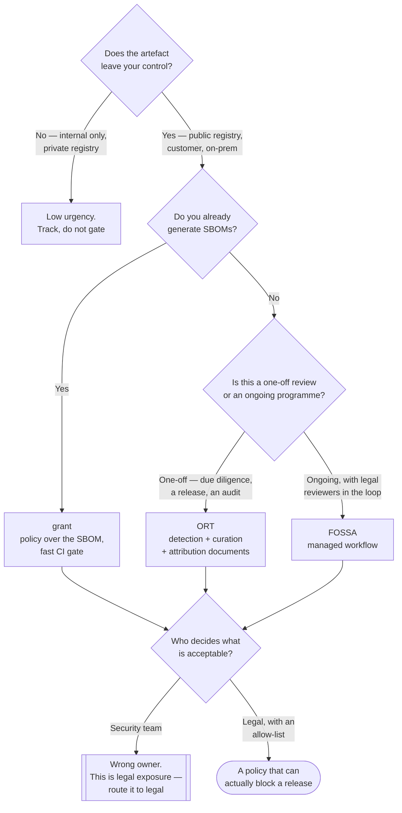

[← Supply chain](../README.md)

# License compliance

Reading the same dependency inventory for a different kind of risk — legal, not security.

Tools: [`fossa/`](fossa/README.md) · [`ort/`](ort/README.md) · [`grant/`](grant/README.md)

## Contents

1. [This is a legal risk, not a security one](#1-this-is-a-legal-risk-not-a-security-one)
2. [The licence families](#2-the-licence-families)
3. [Distribution is the trigger — and a container image is distribution](#3-distribution-is-the-trigger--and-a-container-image-is-distribution)
4. [Declared vs detected](#4-declared-vs-detected)
5. [The tools](#5-the-tools)
6. [What a workable policy looks like](#6-what-a-workable-policy-looks-like)
7. [Decision tree](#7-decision-tree)
8. [Anti-patterns](#8-anti-patterns)
9. [Notes](#9-notes)
10. [How this applies to pikakube](#10-how-this-applies-to-pikakube)

---

## 1. This is a legal risk, not a security one

Say it first, because the tooling sits next to security tooling and inherits its vocabulary:

> **A licence violation is not a vulnerability.** Nothing is exploitable. Nobody gets in. The
> exposure is a cease-and-desist, an injunction, a forced source release, or a failed
> acquisition due diligence.

Three consequences follow, and all three are routinely ignored:

- **The owner is not the security team.** Security can run the scanner; only whoever owns
  legal risk can decide whether AGPL is acceptable in a product. A security engineer making
  that call is making a decision they have no standing to make.
- **Severity is not a useful axis.** There is no CVSS for licences. A copyleft obligation is
  either triggered or it is not, and the answer depends on how the software is used, not on
  how bad the licence is.
- **The remediation is different.** You do not patch a licence. You replace the component,
  comply with the obligation, or obtain a commercial licence — all of which are decisions with
  lead times, not tickets.

It lives in this folder because it consumes the same artefact — the
[SBOM](../sbom/README.md) — and because the container image is where the risk actually
materialises.

## 2. The licence families

| Family | Examples | Obligation | Practical risk |
|---|---|---|---|
| **Permissive** | MIT, BSD-2/3, ISC | attribution; keep the notice | low — keep a NOTICE file |
| **Permissive + patent grant** | Apache-2.0 | attribution, state changes, patent grant/termination | low; the patent clause is a feature |
| **Weak copyleft** | LGPL, MPL-2.0, EPL-2.0 | modifications **to the component** must be shared | moderate — file-level or library-level scope, your code is not affected |
| **Strong copyleft** | GPL-2.0, GPL-3.0 | derivative works distributed under the same licence, **source included** | high, when distributing |
| **Network copyleft** | **AGPL-3.0** | the same, triggered by **use over a network** | high for SaaS — the clause written for exactly this case |
| **Source-available / non-open** | SSPL, BSL, Elastic, Confluent Community | restrictions on offering the software as a service | **often the real problem** — not OSI-approved, and the terms vary per licence |
| Public domain-ish | Unlicense, CC0, 0BSD | none | low, though some jurisdictions dislike public-domain dedications |

The last two rows deserve attention. The licences that actually cause problems in a data
platform are frequently not GPL — they are the source-available relicensings of infrastructure
software (Elasticsearch, MongoDB, Redis, Terraform, Grafana components at various points). They
are not copyleft; they are restrictions on what you may offer as a service, and generic
"copyleft" policies do not catch them.

## 3. Distribution is the trigger — and a container image is distribution

The condition everyone gets wrong.

GPL obligations attach on **distribution**. Running GPL software on your own servers to provide
a service is not distribution, which is why running GPL software internally has never required
publishing anything — and precisely why AGPL was written, since network use *is* the trigger
there.

But:

> **A container image is a distributed artefact the moment it leaves your registry.**

Pushed to a public registry, shipped to a customer, handed to a partner, or included in an
on-premise deployment — each of those is distribution of everything in the image, including the
base layer's OS packages, the JVM, the copied binaries, and every library baked in.

That is the specific reason licence scanning belongs to the **image** pipeline and not only to
the source repository:

| Scanned object | Sees |
|---|---|
| Source repository dependencies | your direct and transitive language dependencies |
| **The built image** | the above **plus** the base image's OS packages, anything a `RUN` step installed, vendored binaries, and the JDK |

An internal-only image on a private registry is a much weaker case for concern, and that
distinction — internal deployment vs distributed artefact — is the first question any policy
should ask.

## 4. Declared vs detected

Two different qualities of answer, and tools differ mainly on this axis:

| | **Declared** | **Detected** |
|---|---|---|
| Source | package metadata — `license: MIT` in the manifest | scanning file headers and full text |
| Cost | trivial | expensive, and produces ambiguity to resolve |
| Accuracy | good enough usually, wrong sometimes | far better, and never fully automatic |
| Catches | the common case | vendored code, relicensed files, missing metadata, dual licences |

Declared metadata is missing or wrong often enough to matter, and the errors are not random —
they cluster in exactly the vendored and copied code that a scanner is most needed for. That is
the gap [ORT](ort/README.md) and [FOSSA](fossa/README.md) fill and [grant](grant/README.md)
does not.

The practical position: declared-licence checking in CI as a fast gate, deeper detection at
release or due-diligence time.

## 5. The tools

| Tool | Model | Reads | Shines when | Detail |
|---|---|---|---|---|
| **grant** | CLI, policy over an existing SBOM | syft SBOMs, images, directories | you already generate SBOMs and want a cheap `deny GPL` gate in CI | [→](grant/README.md) |
| **ORT** | open-source toolkit, full pipeline | source trees, many package managers | you need real detection, curation of wrong metadata, and generated attribution documents | [→](ort/README.md) |
| **FOSSA** | commercial SaaS (with a CLI and Action) | source and builds | licence compliance is an ongoing programme with legal reviewers and a workflow, not a check | [→](fossa/README.md) |

They line up with section 4: grant is declared-only and fast, ORT is detection and curation and
slow, FOSSA is a managed version of the same with people attached.

## 6. What a workable policy looks like

Licence policies fail by being either absent or maximal. A workable one has three properties:

**It distinguishes how the component is used.** The same library carries different obligations
as a build-time tool, a runtime dependency linked into the artefact, and a service run
alongside. A policy that treats a GPL compiler and a GPL linked library identically will block
the wrong things and lose credibility.

**It distinguishes internal from distributed.** Section 3 — internal deployment on a private
registry is a materially weaker case than an image handed to a customer.

**It has an allow-list and an escalation path, not just a deny-list.** New licences appear.
"Anything not on the allow-list goes to legal" is operable; "deny GPL" leaves everything else
undecided and every unusual licence silently permitted.

## 7. Decision tree

## 8. Anti-patterns

| Anti-pattern | Why it is bad | What to do instead |
|---|---|---|
| Treating licence findings as vulnerabilities | wrong severity model, wrong owner, wrong remediation | route to whoever owns legal risk |
| Scanning only the source repository | misses the base image's OS packages, the JDK, and anything a `RUN` step installed — all of which ship | scan the built image too |
| A deny-list of a few licences | everything unusual is silently permitted, which is where the surprises are | an allow-list with an escalation path |
| Relying on declared metadata alone | missing or wrong exactly where it matters — vendored and copied code | detection scanning at release time |
| Ignoring source-available licences because they are "not copyleft" | SSPL, BSL and friends restrict offering the software as a service, which is often the actual business model | policy must name them explicitly |
| Blocking AGPL everywhere by reflex | plenty of AGPL software is fine to run internally; the trigger is network *provision* to third parties | decide by how it is used |
| Treating build-time and runtime dependencies alike | a GPL build tool and a GPL linked library are different obligations | model the usage type |
| Adding licence scanning with nobody to review the output | the queue grows, the gate gets bypassed, the programme dies | a named reviewer before the scanner |

## 9. Notes

Original references recorded for this folder:

> License List
> <https://spdx.org/licenses/>
> <https://www.gnu.org/licenses/license-list.html>
> <https://opensource.org/licenses>

Three lists, and they are not interchangeable — each answers a different question.

**SPDX licence list** is the **identifier registry**: the canonical short strings (`MIT`,
`Apache-2.0`, `GPL-3.0-or-later`) plus the expression syntax for combinations
(`Apache-2.0 OR MIT`, `GPL-2.0-only WITH Classpath-exception-2.0`). Every tool in this folder
speaks these identifiers, so this is the vocabulary a policy should be written in. Writing
"GPL" in a policy is ambiguous; writing `GPL-2.0-only` is not.

**The FSF list** is the **interpretation**: for each licence, whether the FSF considers it free,
whether it is copyleft, and — the genuinely useful column — **whether it is compatible with the
GPL**. Compatibility is the question that actually decides whether two components can be
combined, and it is not derivable from the identifiers alone.

**The OSI list** is the **approval** register: which licences meet the Open Source Definition.
Its practical use here is the negative one — it is how you establish that SSPL, BSL, the
Elastic License and the Confluent Community License are *not* open source, which is exactly
the class of licence that generic copyleft policies miss.

The habit worth forming: policy written in SPDX identifiers, compatibility questions checked
against the FSF list, and "is this actually open source" checked against OSI.

## 10. How this applies to pikakube

Not implemented, and the honest assessment is that it is **low urgency here** — which is worth
saying rather than listing it as a gap.

This is a personal platform repository. Nothing is distributed to customers, and the artefacts
it builds are not commercial products. Section 3's trigger is only partly met: the one image
this platform publishes goes to a **public** registry (`docker.io/andreyolv/flink`), which is
distribution, but it is a derivative of Apache Flink and the obligations of the Apache-2.0
stack it sits on are attribution-shaped rather than copyleft-shaped.

Where it would become real: if the platform ever ships an image containing a GPL or
source-available component to anyone else. The data ecosystem this repository maps is full of
exactly that class of licence — several databases, streaming systems and observability tools
in the neighbouring folders have relicensed to BSL or SSPL at some point.

The cheap version, if it is ever wanted, is [grant](grant/README.md) over a syft SBOM: the
SBOM has to be generated anyway for [aggregation](../aggregation/README.md), and the licence
check is then one more consumer of a file that already exists. That is the argument for
building the SBOM pipeline first — it makes this capability nearly free rather than a separate
project.

---

[← Supply chain](../README.md)
