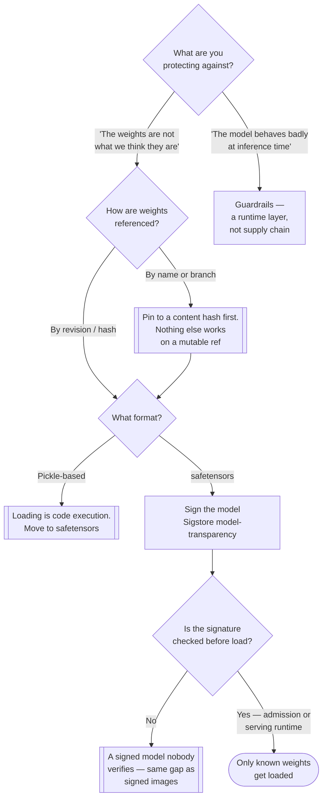

[← Supply chain](../README.md)

# ML supply chain

Model weights are artefacts too — pulled from a registry, executed with privileges, and
almost never signed or verified.

No tool subfolders yet; the references recorded so far are in [Notes](#7-notes).

## Contents

1. [Why a model is a supply-chain problem](#1-why-a-model-is-a-supply-chain-problem)
2. [The specific risks](#2-the-specific-risks)
3. [Applying the existing chain to models](#3-applying-the-existing-chain-to-models)
4. [Guardrails are a different layer](#4-guardrails-are-a-different-layer)
5. [Decision tree](#5-decision-tree)
6. [Anti-patterns](#6-anti-patterns)
7. [Notes](#7-notes)
8. [How this applies to pikakube](#8-how-this-applies-to-pikakube)

---

## 1. Why a model is a supply-chain problem

A model download has all the properties this folder exists to worry about, and usually none of
the controls:

| Property | Container images | Model weights |
|---|---|---|
| Pulled from a public registry | yes | yes — Hugging Face, often by name and branch |
| Executed with the application's privileges | yes | yes |
| Signed and verified | increasingly | **rarely** |
| Inventoried | SBOM | **almost never** |
| Provenance recorded | attestations | **almost never** |
| Pinned immutably | by digest | frequently a mutable ref |

The last row is the one people miss. `from_pretrained("org/model")` resolves against a
repository that can change, on a branch that can move — the tag-versus-digest problem from
[`signing-artifacts/`](../signing-artifacts/README.md#4-digests-not-tags), in a place where
almost nobody pins.

The result is a class of software pulled straight into production from an internet repository,
by name, unverified. The container ecosystem spent a decade fixing exactly that.

## 2. The specific risks

Three that are genuinely different from the container case, and one that is the same:

**Deserialisation.** The classic Python `pickle` format executes arbitrary code on load. Any
model distributed as a pickled artefact — which historically included most PyTorch checkpoints
— is code execution, not data. `safetensors` exists precisely to remove this, and using it is
the single highest-value change available in this area.

**Backdoored weights.** A model can be trained or fine-tuned to behave normally except on a
specific trigger input. Nothing in the weights looks anomalous, no scanner detects it, and no
amount of static inspection helps. The only defences are provenance — knowing who produced the
weights and from what — and evaluation.

**Training data provenance.** The equivalent of a dependency graph, and generally unavailable.
Whether a model was trained on data with licence restrictions or on poisoned inputs is
typically unanswerable, which is a real limit on how much assurance is achievable here at all.

**Everything the container chain already covers**, because a model is usually served inside a
container: the image, its libraries, the CUDA stack. That part is not special and belongs in
[`sbom/`](../sbom/README.md) and `3-container/`.

## 3. Applying the existing chain to models

The useful framing is that the five steps from [`../README.md`](../README.md#the-five-steps)
apply unchanged; only the artefact type differs.

| Step | For models |
|---|---|
| Inventory | which models, which versions, which revision hash — an SBOM-equivalent that mostly does not exist yet |
| Continuous monitoring | thin — there is no CVE feed for model weights, though there is for the serving stack |
| Provenance | who trained or fine-tuned this, from which base model, on what pipeline |
| **Signing** | sign the weights; this is the part with working tooling today |
| **Enforcement** | verify before load — at admission, or in the serving runtime |

Signing and enforcement are where the recorded tooling sits (see [Notes](#7-notes)), and they
are the two links that can be built now. Inventory and monitoring are immature.

The load-bearing detail, again: **pin by content hash, not by name or branch.** A signature
over a model revision means nothing if what gets loaded is resolved from a mutable reference at
runtime.

## 4. Guardrails are a different layer

Worth separating clearly, because both get filed under "AI security" and they defend against
unrelated things.

| | **Supply chain** (this folder) | **Guardrails** |
|---|---|---|
| Threat | a tampered, backdoored or unverified model artefact | harmful, off-policy or injected **behaviour at inference time** |
| Acts on | the weights, before they are loaded | prompts and responses, while running |
| Fails as | you are running someone else's model | the model says or does something it should not |
| Example control | signature verification at load | topic restriction, prompt-injection filtering, output validation |

They are complementary and neither substitutes for the other. A perfectly signed model with
verified provenance is still susceptible to prompt injection; a guardrail layer does nothing
about a backdoor in the weights it is guarding.

## 5. Decision tree

## 6. Anti-patterns

| Anti-pattern | Why it is bad | What to do instead |
|---|---|---|
| Pulling models by name from a public hub at runtime | the reference is mutable and the download is unverified; it is `curl \| bash` with a nicer API | pin to a revision hash, mirror internally |
| Loading pickle-format weights from an untrusted source | deserialisation is arbitrary code execution before any model logic runs | `safetensors`, and refuse pickle from outside |
| Assuming a scanner can detect a backdoored model | there is nothing anomalous to detect in the weights | provenance and evaluation, not scanning |
| Treating guardrails as supply-chain security | they defend against behaviour, not against tampering | both, at their own layers |
| Signing models and not verifying at load | the same gap as signed-but-unverified images | verification in the serving path or at admission |
| Ignoring the serving container because the focus is the model | the CUDA stack and Python dependencies are ordinary supply chain, and are usually the larger surface | apply [`sbom/`](../sbom/README.md) and image scanning as normal |
| Fine-tuning a model of unknown provenance and publishing the result | you inherit and then redistribute whatever was in the base | record the base model and its source in provenance |

## 7. Notes

Original references recorded for this folder:

> <https://github.com/sigstore/model-transparency>
> <https://github.com/sigstore/model-validation-operator>
>
> <https://github.com/NVIDIA-NeMo/Guardrails>

The first two are the supply-chain half, and they pair the way cosign and an admission
controller do.

**`model-transparency`** brings Sigstore to model artefacts: it signs a model — which in
practice means signing a manifest of the files and their hashes, since a model is a directory
rather than a single blob — using the same keyless OIDC flow described in
[`signing-artifacts/`](../signing-artifacts/README.md#keyless-signing), with the event recorded
in Rekor. The claim it produces is the familiar one: *this identity published exactly these
weights*.

**`model-validation-operator`** is the verification half, as a Kubernetes operator: it checks
the signature of model artefacts before a workload is allowed to use them. That is the
enforcement step, and its existence is what makes signing worth doing here — without it,
signing models repeats the mistake this whole folder warns about.

**NeMo Guardrails** is NVIDIA's runtime guardrail framework — programmable rails around an LLM
application, defining what topics are permitted, what the model may say, and what checks run on
input and output. It is deliberately filed alongside the others as a reminder that it addresses
a **different layer**, per section 4: it constrains behaviour at inference time and offers no
protection against a tampered artefact.

## 8. How this applies to pikakube

Nothing implemented, and no tool subfolders yet — this is a placeholder for a problem the
platform will meet rather than a solved area.

The honest state of this capability generally, not just here: model signing has working
tooling and almost no adoption, model inventory barely exists, and training-data provenance is
mostly unavailable. That is roughly where container supply chain was in 2018.

If this platform starts serving models, the order that gets the most for the least is the same
as everywhere else in this folder, and the first two steps cost nothing:

1. **Pin model references to a revision hash**, and prefer `safetensors` over pickle. Two
   configuration decisions that remove the largest risks.
2. **Mirror weights internally** rather than pulling from a public hub at runtime — the same
   argument as an internal package feed, and the S2C2F consumption framing from
   [`../README.md`](../README.md#11-notes) applies directly.
3. Sign and verify, once there is something to serve and an operator to verify it.

The serving container, meanwhile, is ordinary supply chain and should not wait for any of this.

---

[← Supply chain](../README.md)
