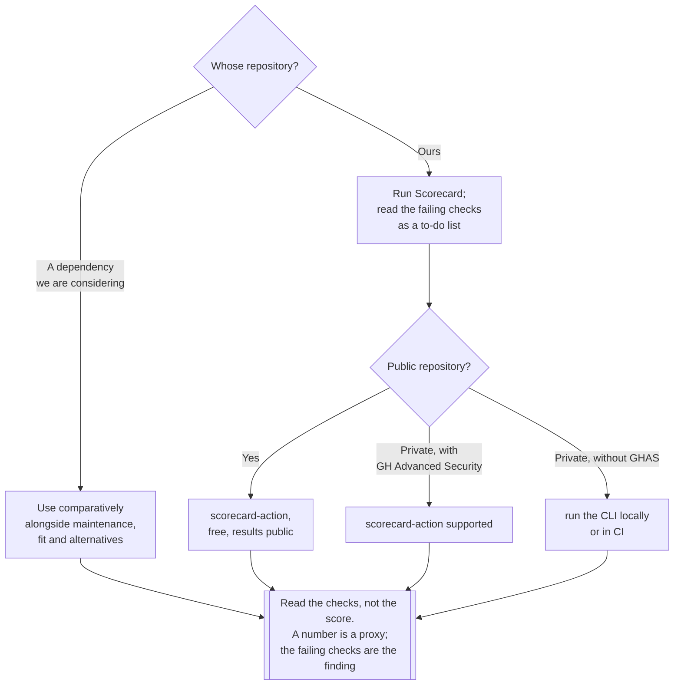

[← Supply chain](../README.md)

# Posture

Rating the security practices of a **repository** rather than the contents of an artefact.

Tools: [`scorecard/`](scorecard/README.md) · [`allstar/`](allstar/README.md)

## Contents

1. [A different unit of analysis](#1-a-different-unit-of-analysis)
2. [What is actually measured](#2-what-is-actually-measured)
3. [The two honest uses](#3-the-two-honest-uses)
4. [What a score does not mean](#4-what-a-score-does-not-mean)
5. [Decision tree](#5-decision-tree)
6. [Anti-patterns](#6-anti-patterns)
7. [How this applies to pikakube](#7-how-this-applies-to-pikakube)

---

## 1. A different unit of analysis

Everything else in [`supply-chain/`](../README.md) examines an artefact: what is in it, where
it came from, whether it has been tampered with. This capability examines the **project** — the
habits of the repository that produces artefacts.

| | Artefact-oriented | **Posture** |
|---|---|---|
| Unit | an image, a binary, a package | a repository |
| Question | what is in it, and is it authentic? | does this project have the practices that catch problems? |
| Evidence | SBOM, attestation, signature | branch protection, token scopes, pinned dependencies, review, releases |
| Nature of the answer | factual | **a proxy** |

The word *proxy* is the whole point and section 4 returns to it. A repository with branch
protection, read-only workflow tokens and pinned actions is not thereby secure; it is a
repository where certain classes of failure are less likely and certain classes of compromise
are harder. That is a correlation, and it is a useful one, provided nobody mistakes it for a
guarantee.

The two tools here are the OpenSSF pair, and they are two halves of one job:

| | [`scorecard/`](scorecard/README.md) | [`allstar/`](allstar/README.md) |
|---|---|---|
| What it does | **rates** — runs checks and produces a score | **enforces** — watches settings and acts on drift |
| Output | a report, and SARIF findings | a GitHub issue, or the setting changed |
| Cadence | on demand, or on a schedule | continuous |
| Answers | where are we today? | did it stay that way? |

Scorecard is the first move, because reading the failing checks is how the work gets scoped.
Allstar is what stops the work unwinding — practices drift, and a report has no opinion about
that.

## 2. What is actually measured

[OpenSSF Scorecard](scorecard/README.md) runs a set of automated checks against a repository.
Grouped by what they are really about:

| Group | Checks | What a failure means |
|---|---|---|
| **Change control** | branch protection, code review, dangerous workflow patterns | changes can reach the default branch without review, or a workflow can be abused to run untrusted code with secrets |
| **Build integrity** | pinned dependencies, token permissions, CI tests, signed releases | the build can pull mutable inputs, or a workflow token can write more than it needs |
| **Vulnerability hygiene** | known vulnerabilities, dependency update tooling, SAST, fuzzing | problems are found late or not at all |
| **Project health** | maintained, contributors, licence, security policy, packaging | the project may not be there to fix the next problem |

The **pinned dependencies** and **token permissions** checks are the ones with the most direct
security content, and they map exactly onto the pipeline failure modes listed in
[`../README.md`](../README.md#11-notes): a GitHub Action referenced as `@v3` is a mutable tag
that its owner can repoint, and a `GITHUB_TOKEN` with default write permissions is a lateral
movement path out of any injected script.

The **maintained** check is the most underrated. For a dependency, "will anyone fix this when a
CVE lands" is frequently the more consequential question than the current vulnerability count.

## 3. The two honest uses

**On your own repositories, as a checklist with a number attached.** The score itself is not
interesting; the individual failing checks are, and most of them are configuration changes
rather than projects. It is a fast way to find that workflow tokens are write-by-default or
that third-party actions are unpinned.

**On dependencies, as one input among several.** When choosing between two libraries that do
the same job, the one with review requirements, an active maintainer and signed releases is
the better bet. This is a comparative signal, not a threshold — "score above 7" as an
acceptance criterion produces bad decisions, because scores are not comparable across project
types.

A third use that is *not* honest: publishing the badge and treating it as an assurance
statement. See section 4.

## 4. What a score does not mean

| Reading | Correct? |
|---|---|
| "This project has good security practices" | roughly yes, that is what it measures |
| "This code is secure" | **no** — no check looks at the code's behaviour |
| "This project has no vulnerabilities" | no — one check looks at known vulnerabilities, shallowly |
| "A 9 is safer than a 6" | not reliably; the checks are weighted and several are not applicable to every project |
| "Improving the score improves security" | only if the checks you fixed were the ones that mattered — optimising the number is possible without changing risk |

That last row is the failure mode of every metric that becomes a target. Several checks can be
satisfied cosmetically (adding a `SECURITY.md`, adding a licence file) without changing any
security property. Read the failing checks, not the total.

## 5. Decision tree

## 6. Anti-patterns

| Anti-pattern | Why it is bad | What to do instead |
|---|---|---|
| Treating the score as a security guarantee | it measures practices, not code; nothing here examines behaviour | read it as a correlation |
| A minimum score as a dependency acceptance gate | scores are not comparable across project types, and small well-run libraries often score poorly | use it comparatively, with judgement |
| Optimising the number | several checks are satisfiable cosmetically without changing risk | fix the checks that correspond to real exposure — pinning, token scopes, review |
| Publishing the badge as an assurance statement | it invites exactly the misreading in section 4 | state what it measures if you publish it |
| Running it once | practices drift; unpinned actions creep back in | run it on a schedule, and enforce with [`allstar/`](allstar/README.md) |
| Enforcing with `fix` before anyone has seen a finding | a bot silently changes teams' settings, and the App gets uninstalled | start Allstar in `issue` mode, same as admission policies start in audit |
| Ignoring the "maintained" check on dependencies | a well-scored abandoned project still will not fix the next CVE | weight maintenance heavily for dependencies |

## 7. How this applies to pikakube

Not run, and it is one of the few things in this discipline that would take minutes rather
than a project.

This is a **public repository**, which is the case Scorecard's GitHub Action supports for free
— no GitHub Advanced Security required, as the note in [`scorecard/`](scorecard/README.md)
records. Nothing else in this folder can be turned on that cheaply.

What it would most likely find, based on what this kind of repository usually looks like:
unpinned third-party GitHub Actions (referenced by tag rather than commit SHA), default
workflow token permissions, and no `SECURITY.md`. The first two are the ones worth acting on
— they are the pipeline failure modes the
[supply-chain notes](../README.md#11-notes) point at, and they are also the exposure
[harden-runner](../../runner-hardening/harden-runner/README.md) exists to contain from the
other direction.

[Allstar](allstar/README.md) is the follow-on, in that order and not the other one: run Scorecard,
read the failing checks, fix them, then install Allstar in `issue` mode so they stay fixed. It is
free on public repositories too, and it covers the same two findings — dangerous workflows and
branch protection — from the enforcement side rather than the reporting side.

---

[← Supply chain](../README.md)
