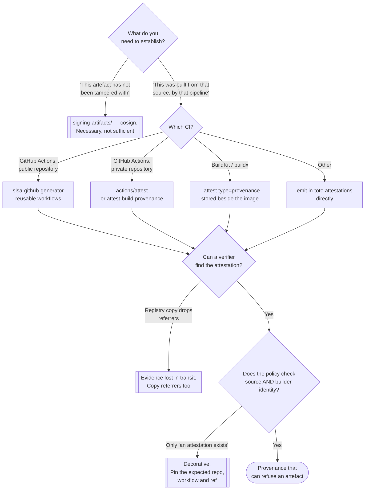

[← Supply chain](../README.md)

# Provenance

Proving that an artefact was built from *that* source, by *that* pipeline — the claim a
signature does not make.

Tools: [`slsa/`](slsa/README.md) · [`in-toto/`](in-toto/README.md) ·
[`buildsafe/`](buildsafe/README.md)

## Contents

1. [The gap signing leaves open](#1-the-gap-signing-leaves-open)
2. [SLSA is levels, in-toto is the format](#2-slsa-is-levels-in-toto-is-the-format)
   - [The SLSA levels](#the-slsa-levels)
   - [What an in-toto attestation looks like](#what-an-in-toto-attestation-looks-like)
3. [Where attestations live](#3-where-attestations-live)
4. [Verification is the whole point](#4-verification-is-the-whole-point)
5. [Reproducible and hermetic builds](#5-reproducible-and-hermetic-builds)
6. [Decision tree](#6-decision-tree)
7. [Anti-patterns](#7-anti-patterns)
8. [How this applies to pikakube](#8-how-this-applies-to-pikakube)

---

## 1. The gap signing leaves open

A signature is a narrow claim: *someone holding this key vouched for this exact digest.* It
proves the artefact has not changed since it was signed, and that whoever held the key
intended to publish it.

It does not prove anything about **how the artefact came to exist**.

| Question | Signature | Provenance |
|---|---|---|
| Modified since publication? | yes | — |
| Published deliberately? | yes | — |
| Built from commit `abc123` of repo `X`? | **no** | yes |
| Built by the release workflow rather than on a laptop? | **no** | yes |
| Built with the parameters we expect — no extra build args, no injected patch? | **no** | yes |
| Built from a source tree that matches what reviewers approved? | **no** | yes |

That gap is not academic. The supply-chain compromises that matter — SolarWinds, the
xz-utils backdoor, several npm and PyPI incidents — did not forge signatures. The artefacts
were **legitimately signed by the legitimate publisher**, because the *build* was
compromised, or the published artefact did not correspond to the reviewed source. Every
signature verified correctly.

Provenance is the control that would have made those visible: a machine-readable, signed
statement of what produced the artefact, emitted by the builder itself rather than asserted
by the publisher.

## 2. SLSA is levels, in-toto is the format

The most common confusion in this area, so it gets its own section.

| | **[SLSA](slsa/README.md)** | **[in-toto](in-toto/README.md)** |
|---|---|---|
| Category | a **framework of levels** — a maturity ladder for build integrity | an **attestation specification and format** |
| Tells you | what to claim, and how trustworthy the claim is | how to write a claim down and sign it |
| Shape | requirements you either meet or do not | a JSON envelope: subject + predicate |
| "Doing" it | reaching a level | emitting and verifying attestations |
| Relationship | SLSA provenance **is** an in-toto attestation with the `slsa.dev/provenance` predicate type | the envelope SLSA's claims travel in |

They are not alternatives, and choosing between them is a category error. SLSA is the policy;
in-toto is the file format.

### The SLSA levels

The current specification (v1.0) defines build levels. Paraphrased in terms of what each
actually buys:

| Level | Requirement | What it rules out |
|---|---|---|
| **L1** | provenance exists and is available | nothing, really — but it establishes the plumbing and makes the build documented |
| **L2** | provenance is **signed** by a hosted build platform | a developer fabricating provenance by hand |
| **L3** | the build runs on a **hardened, isolated** platform; provenance is unforgeable, and build secrets are not reachable by the build itself | one build tampering with another, and a compromised build step forging its own provenance |

The jump that matters is L1 → L2 → L3, and the honest framing is that **L2 is achievable in an
afternoon** on a hosted CI with OIDC (see the notes in [`slsa/`](slsa/README.md)), while L3
requires the build platform itself to guarantee isolation — which is a property of the
platform, not something a repository can configure.

Earlier drafts had four levels and included reproducibility at the top; the v1.0 track
dropped that. If you find a "SLSA 4" reference, it predates the current spec.

### What an in-toto attestation looks like

Conceptually, every attestation is three things:

```
subject      what this statement is about — a name plus a digest (sha256:...)
predicateType  what kind of statement this is  (provenance? SBOM? test results? review?)
predicate    the statement itself — structured per predicate type
```

wrapped in a **DSSE** envelope (Dead Simple Signing Envelope) that carries the signature.

That structure is why in-toto is more general than provenance. The same envelope carries an
SBOM attestation, a VEX document, a "this passed the test suite" statement, or a "two humans
reviewed this" statement. Provenance is one predicate type among many, and the format is the
reason all supply-chain evidence can be verified the same way.

## 3. Where attestations live

An attestation is only useful if a verifier can find it, and this is where implementations
diverge:

| Storage | How it works | Note |
|---|---|---|
| **OCI referrers** | the attestation is a separate manifest in the registry that *refers to* the image digest | the modern default; portable, discoverable, needs registry support for the referrers API |
| Cosign's `.att` tag convention | stored under a derived tag (`sha256-<digest>.att`) | the older pattern; works everywhere, clutters the tag list |
| A transparency log (Rekor) | the statement is recorded publicly, append-only | discovery and tamper-evidence, not primary storage |
| Alongside the release | files attached to a GitHub release | fine for binaries, not for images |

The practical failure: attestations produced against one registry and then the image is copied
to another, without the referrers. The image arrives; the evidence does not; verification
fails at admission for a reason that looks like a bug. Whatever copies images between
registries has to copy referrers too.

## 4. Verification is the whole point

Everything above produces a document. The control appears only when something refuses an
artefact because the document is missing or wrong — which happens in `3-container/admission/`,
not here.

A verification policy worth writing has four parts, and skipping any of them makes it
decorative:

| Check | Without it |
|---|---|
| The attestation **exists** for this digest | you verify nothing and pass |
| The signature is valid, against an **expected identity** | any signer is accepted — including an attacker's |
| The provenance names the **expected source repository** | an artefact built from a fork passes |
| The provenance names the **expected builder / workflow** | an artefact built by an arbitrary workflow in the right repo passes |

The third and fourth are the ones commonly omitted, and they are where the value is. "A valid
SLSA provenance attestation exists" is nearly meaningless; "this was built by the `release`
workflow on the `main` branch of `org/repo`" is a statement worth enforcing.

## 5. Reproducible and hermetic builds

Two related properties, frequently mentioned near SLSA and distinct from it:

- **Hermetic** — the build declares all its inputs and cannot fetch anything else. No
  `curl | bash`, no unpinned package installs at build time. This is a prerequisite for
  meaningful provenance, because provenance that lists inputs the build did not actually
  restrict itself to is provenance about a fiction.
- **Reproducible** — building the same source twice produces byte-identical output. This
  allows independent parties to rebuild and compare, which is the strongest form of
  verification available: it does not require trusting the builder at all.

Reproducibility is hard, and it is not required by SLSA v1.0. Hermeticity is more attainable
and buys most of the practical benefit. [`buildsafe`](buildsafe/README.md) is the folder's
entry for tooling that approaches builds from this direction.

## 6. Decision tree



## 7. Anti-patterns

| Anti-pattern | Why it is bad | What to do instead |
|---|---|---|
| Treating a signature as proof of provenance | it proves integrity and intent only; every major supply-chain compromise had valid signatures | emit and verify provenance attestations |
| Choosing "SLSA or in-toto" | they are a framework and a format; you use both | see section 2 |
| Verifying only that an attestation exists | any attestation from any signer passes | pin the expected source repo, workflow and ref |
| Self-generated provenance from inside the build | a compromised build step can write whatever it likes | provenance must come from the build platform (SLSA L2+) |
| Copying images between registries without referrers | the evidence silently does not travel; verification fails downstream | ensure the copy tool handles referrers |
| Claiming a SLSA level without meeting the isolation requirements | the level is a claim others rely on; an unearned one is worse than none | be explicit about which level, and why |
| Aiming for reproducible builds before hermetic ones | reproducibility is expensive and it is not what SLSA v1.0 asks for | hermeticity first; it buys most of the benefit |
| Attestations for release artefacts only | the images actually deployed are the ones that matter | attest what ships |

## 8. How this applies to pikakube

Nothing here is implemented. Provenance is the least-started link of the chain in this
repository: [cosign](../signing-artifacts/cosign/README.md) has real recorded usage, and no
attestation of any kind is produced.

That order is worth noticing because it is the common one, and it is backwards relative to
value. Signing is easier to adopt, so it gets adopted; provenance answers the more important
question, so it gets deferred. For a platform building its own images — the published Flink
image is the concrete case — the cheapest step is the one recorded in
[`slsa/`](slsa/README.md): on GitHub Actions, `actions/attest-build-provenance` (or the newer
`actions/attest`) produces a signed SLSA provenance attestation with a few lines of YAML and
no key management, because it uses the workflow's own OIDC identity.

The step after that is the same one this whole discipline is waiting on: a verification policy
in `3-container/admission/` that checks the attestation names this repository and this
workflow. Without it, the attestation is a file.

---

[← Supply chain](../README.md)
