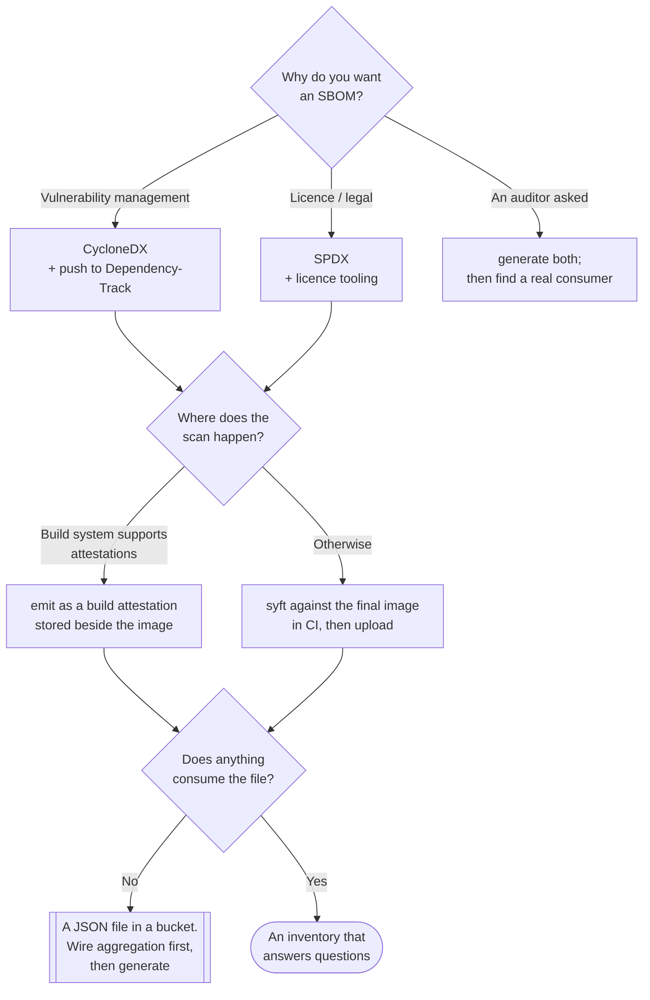

[← Supply chain](../README.md)

# SBOM

A machine-readable inventory of what is actually inside a built artefact — and the first link
of the supply-chain chain, useless on its own.

Tools: [`syft/`](syft/README.md)

## Contents

1. [What an SBOM is, precisely](#1-what-an-sbom-is-precisely)
   - [Manifest, lockfile, SBOM](#manifest-lockfile-sbom)
2. [The two standards](#2-the-two-standards)
3. [Where in the pipeline it is generated](#3-where-in-the-pipeline-it-is-generated)
4. [Where the SBOM goes afterwards](#4-where-the-sbom-goes-afterwards)
5. [What an SBOM does not tell you](#5-what-an-sbom-does-not-tell-you)
6. [Decision tree](#6-decision-tree)
7. [Anti-patterns](#7-anti-patterns)
8. [Notes](#8-notes)
9. [How this applies to pikakube](#9-how-this-applies-to-pikakube)

---

## 1. What an SBOM is, precisely

A **Software Bill of Materials** lists the components present in an artefact: name, version,
package ecosystem, ideally a `purl` (package URL) identifier, a hash, a licence, and the
dependency relationships between them.

The word that carries the weight is **present**. An SBOM describes the thing that was built,
discovered by examining it — reading package databases inside a container image, walking
installed modules, identifying binaries. It is not a restatement of what the build was asked
to install.

### Manifest, lockfile, SBOM

Three artefacts that are routinely conflated:

| | Manifest (`pyproject.toml`, `package.json`) | Lockfile (`poetry.lock`, `package-lock.json`) | **SBOM** |
|---|---|---|---|
| Describes | **intent** — ranges and constraints | **resolution** — exact versions of direct and transitive deps | **reality** — what is in the built artefact |
| Includes OS packages from the base image? | no | no | **yes** |
| Includes things installed by a `RUN apt-get`? | no | no | **yes** |
| Includes vendored or copied binaries? | no | no | usually yes |
| Exists for a built image? | only if the source is present | only if the source is present | yes, that is the point |

The gap between the lockfile and the SBOM is where most surprises live: the base image's
OpenSSL, a curl installed for a healthcheck, a JAR copied in from a builder stage. None of it
appears in any dependency file, and all of it ships.

## 2. The two standards

| | **CycloneDX** | **SPDX** |
|---|---|---|
| Steward | OWASP | Linux Foundation — ISO/IEC 5962:2021 |
| Designed around | security use cases | licence compliance and legal provenance |
| Carries VEX | yes, natively | via separate mechanisms |
| Formats | JSON, XML, Protobuf | JSON, YAML, tag-value, RDF |
| Consumer that forces the choice | **Dependency-Track is CycloneDX-native** | legal/OSS-programme tooling, and the Kubernetes release process |

Both are mature and syft emits either. The decision is made by whatever consumes the file, and
in practice that means: **CycloneDX if the destination is security tooling, SPDX if the
destination is a licence or legal workflow.** Generating both is cheap and occasionally the
right answer.

## 3. Where in the pipeline it is generated

The choice of *when* determines what the SBOM can see.

| Point | Sees | Misses | Verdict |
|---|---|---|---|
| From source, pre-build | declared dependencies | everything from the base image and from `RUN` steps | incomplete — this is a lockfile with extra steps |
| **From the final image, post-build** | OS packages, language packages, binaries | things generated at runtime | **the default; this is what you want** |
| From a running container | the above plus runtime-installed content | nothing much | useful for drift detection, not for release evidence |
| As a build attestation (BuildKit) | the final image, produced by the builder itself | — | best when available — the SBOM travels with the image, in the registry |

The last row is worth preferring where the build system supports it, because it removes the
step where an SBOM is generated in one place and has to be shipped somewhere else — the step
that quietly stops working.

## 4. Where the SBOM goes afterwards

Generating it is the easy half. The destination decides whether it was worth doing:

| Destination | What it enables |
|---|---|
| [`aggregation/`](../aggregation/README.md) | continuous re-evaluation against new CVEs — the highest-value destination by a distance |
| Attached to the image in the registry (OCI referrer / attestation) | the inventory travels with the artefact and can be verified at admission |
| [`license/`](../license/README.md) | licence policy evaluation |
| A build artefact in CI | **almost worthless** — nothing reads it, and during an incident nobody can find it |

## 5. What an SBOM does not tell you

Four limits worth stating, because each one is a place where SBOM programmes overpromise:

- **Presence is not exploitability.** A vulnerable library that is never loaded is not a risk
  you should page anyone about. That gap is what VEX exists for — see the notes in
  [`../README.md`](../README.md#11-notes).
- **Identification is imperfect.** Statically linked Go and Rust binaries, shaded JARs,
  vendored C libraries and anything copied in without a package manager are hard to identify
  reliably. Coverage is good and it is not total.
- **It says nothing about provenance.** The inventory is accurate about the artefact you fed
  it, including a tampered one. See [`provenance/`](../provenance/README.md).
- **It is a snapshot.** Correct on the day it was generated, about a world that changes daily.
  Hence [`aggregation/`](../aggregation/README.md).

## 6. Decision tree

## 7. Anti-patterns

| Anti-pattern | Why it is bad | What to do instead |
|---|---|---|
| Generating the SBOM from source instead of the built image | misses the base image and everything a `RUN` step installed — which is where most CVEs are | scan the final artefact |
| Storing SBOMs as CI build artefacts | expire with the build, unsearchable, and unavailable at the exact moment they are needed | push to an aggregation platform |
| Reusing the base image's SBOM | describes the base, not your application layers | regenerate per artefact |
| Generating an SBOM per tag rather than per digest | tags move; the inventory then describes a different image | key everything on the digest |
| Treating every SBOM finding as a vulnerability to fix | presence is not exploitability; triage collapses | VEX, and reachability where available |
| Picking a format before knowing the consumer | conversion works but loses fidelity, and formats carry different fields | let the destination decide |
| SBOM programme with no aggregation | the effort is spent and the payoff never arrives | build the consumer first |

## 8. Notes

Original references recorded for this folder:

> SBOM Standard Specifications
> <https://github.com/CycloneDX/specification>
> <https://github.com/spdx/spdx-spec>

The two specifications themselves, and worth having to hand for one specific reason: when a
tool's output does not contain a field you expected, the answer is almost always in the spec's
data model rather than in the tool's documentation. The **CycloneDX specification** repository
holds the JSON schemas for each version — useful for validating generated output in CI, and
for understanding which version of the spec a consumer requires, since Dependency-Track and
others are version-sensitive. The **SPDX specification** repository holds the ISO-standardised
model; the concepts that matter there are the `Package`, `File` and `Relationship` entities
and the licence expression syntax, which is the same SPDX identifier syntax used by
[`license/`](../license/README.md) tooling.

## 9. How this applies to pikakube

Documented, not running. [syft](syft/README.md) is mapped; no pipeline in this repository
generates an SBOM, and the [aggregation](../aggregation/README.md) platforms that would
consume one are staged with empty values.

The order that works here is the reverse of the intuitive one: get Dependency-Track actually
running and accepting uploads first, then add a syft step to CI that pushes to it. An SBOM
generated before there is somewhere to send it becomes a file in a build artefact, which is
the anti-pattern above.

The one image this platform publishes and signs — the Flink image referenced in
[cosign](../signing-artifacts/cosign/README.md) — is the obvious first subject: it already has
a digest recorded and a signature against it, so an SBOM keyed to the same digest completes
two links of the chain on one artefact.

---

[← Supply chain](../README.md)
