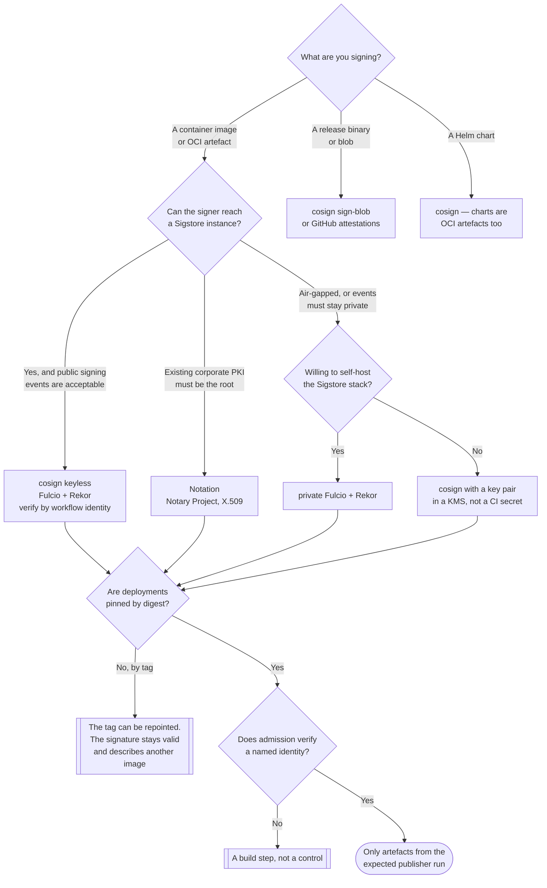

[← Supply chain](../README.md)

# Signing artifacts

Binding a verifiable claim to an exact artefact digest, so that "this is the image we
published" becomes checkable rather than assumed.

Tools: [`cosign/`](cosign/README.md) · [`notary/`](notary/README.md) ·
[`docker-trust/`](docker-trust/README.md)

## Contents

1. [What a signature actually claims](#1-what-a-signature-actually-claims)
2. [cosign is the current answer](#2-cosign-is-the-current-answer)
   - [Keyless signing](#keyless-signing)
   - [Fulcio and Rekor](#fulcio-and-rekor)
   - [When keyless is the wrong choice](#when-keyless-is-the-wrong-choice)
3. [The legacy options](#3-the-legacy-options)
4. [Digests, not tags](#4-digests-not-tags)
5. [Signing is not verification](#5-signing-is-not-verification)
6. [Decision tree](#6-decision-tree)
7. [Anti-patterns](#7-anti-patterns)
8. [How this applies to pikakube](#8-how-this-applies-to-pikakube)

---

## 1. What a signature actually claims

Precisely this: **an identity vouched for a specific digest at a specific time.**

| Claim | Made by a signature? |
|---|---|
| The bytes have not changed since signing | yes |
| The signer intended to publish this | yes |
| The signer is who the policy expects | only if verification checks the identity |
| It was built from the expected source and pipeline | **no** — see [`provenance/`](../provenance/README.md) |
| The contents are free of vulnerabilities | no |
| Nobody has since pushed a different image to the same tag | **no** — see section 4 |

Signing is necessary and narrow. Most of the value people attribute to it actually comes from
combining it with provenance and with digest pinning; on its own it defends against
modification in transit and in the registry, which is a real but smaller threat than a
compromised build.

## 2. cosign is the current answer

[cosign](cosign/README.md), part of Sigstore, is the default for container images and OCI
artefacts, and it is not a close contest. It signs images, blobs and other OCI artefacts,
stores signatures and attestations in the registry alongside the artefact, and covers
attestations as well as bare signatures — which means the same tool handles SBOM and provenance
attachment.

### Keyless signing

The feature that matters is **keyless**, and it is worth understanding because it removes a
category of problem rather than improving on it.

The traditional model: generate a key pair, store the private key in a CI secret, sign with it,
publish the public key, and tell verifiers to trust that key. Every part of that is an
operational burden — storage, rotation, revocation, and the fact that a leaked key signs
convincingly and undetectably until someone notices.

Keyless replaces the key with an **identity**:

```
CI job holds an OIDC token     ("workflow release.yml, repo org/app, ref refs/heads/main")
        │
        ▼
Fulcio issues a short-lived certificate binding that identity to a freshly generated key
        │
        ▼
sign with the ephemeral key — then discard it
        │
        ▼
Rekor records the signature and certificate in a public append-only log
        │
        ▼
verify against the identity: --certificate-identity, --certificate-oidc-issuer
```

| Problem with long-lived keys | What keyless does |
|---|---|
| Private key stored in CI | no key at rest — it exists for seconds |
| Leaked keys sign forever, silently | nothing durable to leak |
| Rotation is a project | expiry is measured in minutes, structurally |
| "Who signed this?" answers with a fingerprint | it answers with **which workflow, in which repo, on which ref** |

That last row is the conceptual shift. A verification policy stops being *trust key
`abc123...`* and becomes *trust artefacts signed by the release workflow on the main branch of
this repository* — a sentence a human can audit and an admission controller can enforce.

### Fulcio and Rekor

Two Sigstore components worth naming separately, because they do different jobs:

| | **Fulcio** | **Rekor** |
|---|---|---|
| What it is | a certificate authority | a transparency log |
| Does what | exchanges a valid OIDC token for a short-lived signing certificate | records signing events in a tamper-evident, append-only Merkle log |
| Solves | key custody — there is no key to keep | **detection** — a signature you did not make is publicly visible |
| Analogy | the identity half | the audit half |

Rekor is the answer to the obvious objection about short-lived certificates: if the
certificate expired minutes after signing, how can anyone verify the signature later? Because
the log recorded that the signature was made *while the certificate was valid*. Verification
checks the log entry, not the certificate's current validity.

The secondary benefit is monitoring: because the log is public and append-only, an
organisation can watch for entries claiming its own identities. That is a detection capability
no key-based scheme has.

### When keyless is the wrong choice

Stated plainly, because the trade-off is real:

- **air-gapped or disconnected environments** — Fulcio and Rekor must be reachable at signing
  time. Self-hosting the Sigstore stack is possible and is a substantial undertaking
- **signing events cannot be public** — a Rekor entry reveals that repository X published an
  artefact at time T. For some organisations that is unacceptable metadata leakage; the answer
  is a private Sigstore deployment or key-based signing
- **an existing corporate PKI must be the trust root** — keyless roots trust in Sigstore's
  chain, not yours. Key-based cosign, or Notation with your CA, keeps the existing root
- **no OIDC identity available** — signing from a laptop or from CI without OIDC federation
  falls back to keys

## 3. The legacy options

| Tool | Status and why |
|---|---|
| [`docker-trust`](docker-trust/README.md) | **Legacy.** Docker Content Trust, built on Notary v1 and TUF. Functional, effectively frozen, and awkward in practice: per-repository root keys, an unpleasant CI story, no attestation support, and enabled by an environment variable (`DOCKER_CONTENT_TRUST=1`) that silently does nothing when unset. Documented because you will meet it in existing systems |
| [`notary`](notary/README.md) | **Notary v1 is largely superseded** — it is what Docker Content Trust runs on. The live work is the **Notary Project**: `notation` plus an OCI-native signature specification. That is a genuine alternative to cosign, particularly where signatures must chain to an existing corporate PKI or an HSM, and where keyless is not wanted |

For anything new, the choice is between cosign (keyless, Sigstore trust root) and Notation
(X.509, your trust root). Docker Content Trust is not a candidate.

## 4. Digests, not tags

The single detail that most often makes a signing programme worthless.

A signature binds to a **digest** — `sha256:1badb98e...`. A tag is a mutable pointer. So:

```
1. CI builds and pushes  myapp:1.0   (digest sha256:AAA)
2. CI signs              sha256:AAA
3. someone pushes a different image to myapp:1.0   (digest sha256:BBB)
4. the cluster pulls     myapp:1.0   →  sha256:BBB, unsigned
```

Nothing in that sequence fails. The signature over `sha256:AAA` is still perfectly valid; it
is simply about a different image than the one running.

The rules that close it:

- **sign the digest**, which cosign does anyway
- **deploy by digest** — `image: myapp@sha256:...` in the manifest, not `myapp:1.0`
- **verify by digest** at admission, and resolve the tag *before* verification if a tag must
  be used
- treat `imagePullPolicy: Always` as unrelated to this — it re-resolves the tag, which is the
  problem, not the fix

## 5. Signing is not verification

Half of every signing implementation in the wild is the half that costs time and buys nothing.
Signing happens in CI, is easy to add, and produces a satisfying green tick. Verification
happens at admission, requires a policy decision about what identity to trust, and can break
deploys — so it gets deferred.

The verification policy has to name an identity to be worth anything:

| Policy | Worth |
|---|---|
| "a valid signature exists" | almost nothing — any signer passes, including an attacker's keyless signature |
| "signed by key `X`" | real, if the key is genuinely restricted |
| "signed by identity `https://github.com/org/repo/.github/workflows/release.yml@refs/heads/main`, issuer `token.actions.githubusercontent.com`" | **the actual control** |

Where that policy runs: `3-container/admission/` — the Sigstore policy controller, Connaisseur,
Ratify, or a Kyverno `verifyImages` rule.

## 6. Decision tree



## 7. Anti-patterns

| Anti-pattern | Why it is bad | What to do instead |
|---|---|---|
| Signing without verifying | the expensive half is the one nobody notices is missing | admission policy in `3-container/admission/` |
| Verifying that "a signature exists" | any signer passes, which includes an attacker who can also sign keylessly | pin the expected certificate identity and OIDC issuer |
| Deploying by mutable tag | the tag can be repointed after verification; the signature remains valid for a different image | `image: repo@sha256:...` |
| Long-lived signing keys in CI secrets | undetectable if leaked, and rotation never happens | keyless, or a KMS-held key with an audit trail |
| Treating a signature as proof of provenance | it says nothing about how the artefact was built | add [`provenance/`](../provenance/README.md) attestations |
| Adopting Docker Content Trust for something new | frozen, awkward, no attestation story, silently inactive when the env var is unset | cosign, or Notation |
| Copying images between registries without their signatures | the signature is a separate registry object; the copy leaves it behind | use a copy tool that carries referrers/signatures |
| One key for every team and every artefact | a single leak compromises everything, and "who signed this" loses meaning | identity-based signing, or per-pipeline keys |

## 8. How this applies to pikakube

This is the one link of the supply chain with **real recorded practice**:
[cosign](cosign/README.md) carries actual commands run against a published image
(`docker.io/andreyolv/flink`), correctly digest-pinned, using a locally generated key pair.

Two observations follow from that.

**The digest pinning is right.** The recorded `sign` and `verify` commands both address the
image by `@sha256:...`, which is the detail section 4 exists to make. Whoever wrote those notes
did the correct thing.

**The key is local, which is the part to change.** `cosign generate-key-pair` on a workstation
is the right way to learn the tool and the wrong way to run it: the private key is a file
somebody has to keep, and there is no record of what it signed. Moving that image build into
CI with keyless signing removes the key entirely and turns the verification policy into a
sentence about this repository rather than about a key file.

**And nothing verifies.** There is no admission control in this cluster. Until a policy in
`3-container/admission/` checks the signature, the signing is an exercise. That is a single
policy resource away, and it is the highest-value change available anywhere in this discipline.

---

[← Supply chain](../README.md)
