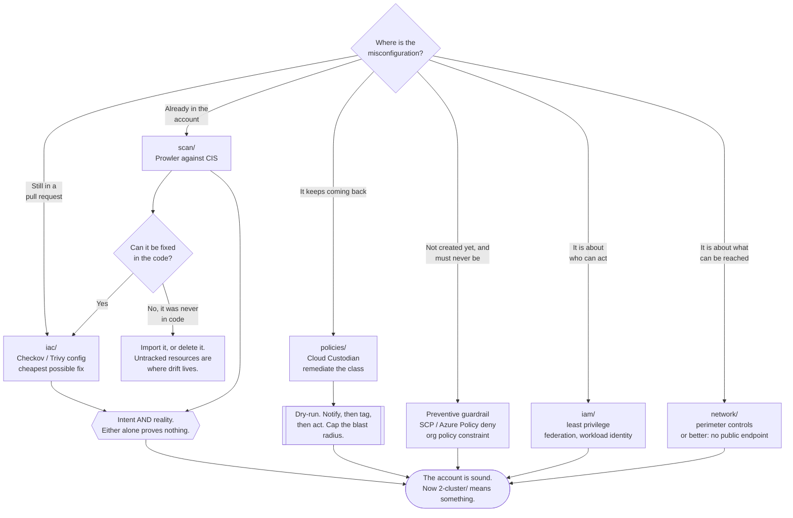

[← Security](../README.md)

# Cloud

The account and its perimeter — the layer below Kubernetes, where a misconfiguration
costs more than any vulnerability.

Capabilities: [`iac`](iac/README.md) · [`scan`](scan/README.md) · [`iam`](iam/README.md) ·
[`network`](network/README.md) · [`policies`](policies/README.md)

## Contents

1. [What this layer is](#1-what-this-layer-is)
2. [Misconfiguration, not exploitation](#2-misconfiguration-not-exploitation)
   - [The anatomy of a real cloud breach](#the-anatomy-of-a-real-cloud-breach)
   - [What this changes about tooling](#what-this-changes-about-tooling)
3. [The shared responsibility model](#3-the-shared-responsibility-model)
   - [The line moves with the service](#the-line-moves-with-the-service)
   - [The honest reading](#the-honest-reading)
4. [Intent, reality, and the gap between them](#4-intent-reality-and-the-gap-between-them)
5. [The capabilities in this folder](#5-the-capabilities-in-this-folder)
   - [How they fit together](#how-they-fit-together)
6. [Where to start, in order](#6-where-to-start-in-order)
7. [Decision tree](#7-decision-tree)
8. [Anti-patterns](#8-anti-patterns)
9. [How this applies to pikakube](#9-how-this-applies-to-pikakube)

---

## 1. What this layer is

Everything in `security/` is organised by the layer it defends. This one is the **cloud
account**: the identities that can act on it, the network boundary around it, the resources
inside it, and the code that creates them.

It sits directly below the cluster and above nothing. If this layer fails, nothing above it
matters — an attacker with an over-permissive role does not need to bypass a NetworkPolicy,
because they can read the disk the cluster runs on, assume the node role, or read every
secret from the key management service. Cluster hardening assumes the account is sound.

| | This layer | The layer above (`2-cluster`) |
|---|---|---|
| The unit | an account, a subscription, a project | a cluster |
| The identities | IAM roles, service principals, federated users | ServiceAccounts, RBAC subjects |
| The boundary | the VPC edge, the load balancer, the account perimeter | the pod network and admission control |
| Who configures it | Terraform, a pipeline, or a person in a console | manifests, GitOps |
| The characteristic failure | a resource left open | a workload given too much |

## 2. Misconfiguration, not exploitation

The organising idea of this entire folder:

> **Cloud environments are not breached by exploiting the cloud. They are breached because
> someone configured it wrongly.**

A public storage bucket and an over-permissive IAM role have caused more incidents than any
CVE in a cloud provider's own infrastructure. That is not a claim that providers have no
vulnerabilities — it is a claim about where the volume is, and the volume is not close.

The reason is structural rather than accidental:

| Force | Effect |
|---|---|
| The provider's own infrastructure is defended by a large, well-funded team | it is the hardest target in the picture |
| Your configuration is defended by whoever had a deadline | it is the softest |
| The API surface is enormous and grows weekly | nobody holds the whole model in their head |
| Insecure defaults exist and persist for backward compatibility | the wrong thing happens through omission, not decision |
| Everything is reachable from everywhere by default | the blast radius of a mistake is the internet |
| A mistake is invisible when it works | an over-permissive policy produces no symptom at all |

That last row is the crux. A misconfiguration has no failure signal. The deploy succeeds,
the application works, the dashboard is green, and the bucket is public. Nothing in the
normal feedback loop of software engineering surfaces it — which is why the answer has to be
a tool that looks for it deliberately.

### The anatomy of a real cloud breach

The pattern is monotonous, and it repeats because each step is somebody's ordinary mistake:

1. Something is reachable that should not be — a public bucket, a database with a public
   endpoint, an exposed management interface, a leaked static access key.
2. That access yields a **credential** — an instance metadata token, a key in an environment
   variable, a secret in a repository, a role attached to a compromised workload.
3. The credential has **more permissions than it needed**, because nobody knew the minimum
   set and `"*"` made the deploy work.
4. Those permissions allow **escalation** — create a role, attach a policy, pass a role,
   read the key management service.
5. Data is read or exfiltrated, and logging is disabled or was never enabled in that region.

No zero-day appears anywhere in that sequence. Every step is a configuration decision, and
each capability in this folder is aimed at a different step: [`iac`](iac/README.md) at step 1
before it exists, [`scan`](scan/README.md) at step 1 after it exists,
[`network`](network/README.md) at reachability, [`iam`](iam/README.md) at steps 2 to 4, and
[`policies`](policies/README.md) at closing the loop automatically.

### What this changes about tooling

If misconfiguration is the threat, then the tools that matter are not the ones that look for
vulnerabilities. They are the ones that **read the configuration and compare it to what it
should be** — before it is applied, after it is applied, and continuously. That is exactly
what the five capabilities here do, and it is why none of them is a scanner for CVEs.

## 3. The shared responsibility model

Every provider publishes a version of the same diagram: they secure the cloud, you secure
what you put in it.

| The provider is responsible for | You are responsible for |
|---|---|
| Physical datacentres and hardware | Who can access your account, and with what permissions |
| The hypervisor and host operating system | The configuration of every resource you create |
| The network fabric between regions | Your network boundaries, security groups and exposure |
| Managed service control planes | Your data, its classification and its encryption choices |
| Patching the services they operate | Patching everything you operate |
| Availability of the platform | The availability design of your workloads |

### The line moves with the service

The most useful thing to understand about the model is that it is **not one line** — it
moves with the abstraction level, and the same word means different splits for different
services:

| Service model | The provider handles | You still own |
|---|---|---|
| A virtual machine | the hypervisor and below | the OS, patching, the agent, the firewall rules, the data |
| A managed database | the engine, patching, backups, the host | network exposure, credentials, encryption settings, who can read it |
| Managed Kubernetes | the control plane, etcd, its patching | the nodes, RBAC, workloads, network policy, everything in `2-cluster/` |
| Serverless functions | everything under the runtime | the code, its dependencies, and above all the **execution role** |

Note what does not change in any row: **identity, network exposure and data are always
yours.** No abstraction level takes them away. That is why [`iam`](iam/README.md) is the
highest-value folder here regardless of how managed the estate is.

### The honest reading

The model is frequently quoted as though it were a support contract that transfers risk. It
is not. Two things are worth saying plainly:

- **Nearly every publicised cloud breach falls on the customer side of the line.** The line
  is not a defence; it is a statement about who gets blamed.
- **The provider will not stop you.** Making a bucket public is a supported operation. So is
  attaching `AdministratorAccess` to a role assumable by an external account, and so is
  opening port 22 to `0.0.0.0/0`. There is no confirmation dialogue that saves you, and there
  is no reason to expect one — those are all legitimate operations that someone, somewhere,
  intends.

What providers do offer is **guardrails you have to turn on**: account-level public access
blocks, service control policies, organisation policy constraints, mandatory encryption
defaults. Those are the highest-leverage settings in this entire folder precisely because
they make the mistake impossible rather than detectable.

## 4. Intent, reality, and the gap between them

Two of the capabilities here look superficially like the same thing and are not. The
distinction is the backbone of the folder:

| | [`iac/`](iac/README.md) | [`scan/`](scan/README.md) |
|---|---|---|
| Reads | files in a repository | live provider APIs |
| Answers | "is what we **mean** to create safe?" | "is what **exists** safe?" |
| Runs | on every pull request | on a schedule, per account, per region |
| Cost of a finding | seconds, in an editor | a change ticket, a window, an owner who has moved on |
| Cannot see | anything created outside the repository | anything not yet created |

The distance between those two answers is **drift**, and drift is not an edge case — it is
the normal condition of a cloud account. A console change during an incident, a resource
created before IaC existed, a half-failed apply, another team's pipeline, a vendor
integration, a changed provider default. Every one of them produces a resource that a
perfect IaC scan will never see.

> **A clean IaC scan is evidence about the repository, not about the account.**
> Run both, or neither result is trustworthy.

## 5. The capabilities in this folder

| Capability | The question it answers | When it runs | Detail |
|---|---|---|---|
| **iac** | is this misconfigured **before** it is applied? | on every pull request | [→](iac/README.md) |
| **scan** | is the deployed account misconfigured **now**? | scheduled, every account and region | [→](scan/README.md) |
| **iam** | who can do what, to which resource? | continuously, and at every design decision | [→](iam/README.md) |
| **network** | what can be reached, from where? | at design time, and enforced at the edge | [→](network/README.md) |
| **policies** | how does it get **fixed** without a human? | on a schedule, or on a provider event | [→](policies/README.md) |

### How they fit together

They are not five alternatives. They are one pipeline with a feedback loop:

- [`iac`](iac/README.md) stops the misconfiguration from being created.
- [`scan`](scan/README.md) finds what was created anyway — by drift, by hand, or before the
  gate existed.
- [`policies`](policies/README.md) fixes the classes that keep coming back, instead of
  reporting them forever.
- [`iam`](iam/README.md) and [`network`](network/README.md) are not stages in that pipeline.
  They are the two **surfaces** the pipeline is mostly inspecting: identity and reachability,
  which are where the incidents in section 2 actually come from.

The loop closes properly only when a finding from `scan` results in a fix in the code that
`iac` checks. Remediating in the account while leaving the source unchanged means the next
apply recreates the problem — and then the two tools fight each other indefinitely.

## 6. Where to start, in order

If none of this exists yet, the order matters more than the tool choice. Roughly in
descending value per unit of effort:

1. **Turn on the account-level guardrails.** Public access blocks, mandatory encryption
   defaults, organisation policy constraints. They cost nothing and make whole categories of
   mistake impossible.
2. **Remove static access keys and the root account's keys.** Federation for humans, OIDC for
   pipelines. See [`iam/README.md`](iam/README.md).
3. **Enable the audit log in every region**, and send it somewhere the account cannot delete
   it from.
4. **Run a posture scan once** to find out what you actually have. Expect the number to be
   unpleasant. See [`scan/README.md`](scan/README.md).
5. **Add an IaC gate on pull requests**, with a baseline so it does not block on day one. See
   [`iac/README.md`](iac/README.md).
6. **Fix reachability**: no management ports open to the world, and private endpoints where
   possible. See [`network/README.md`](network/README.md).
7. **Automate the recurring findings**, carefully, once the first six are steady. See
   [`policies/README.md`](policies/README.md).

Steps 1 to 3 are preventive and cheap. Everything after that is detection, which is more
work and worth less — which is the general shape of this whole discipline.

## 7. Decision tree

## 8. Anti-patterns

| Anti-pattern | Why it is bad | What to do instead |
|---|---|---|
| Hardening the cluster while the account is unmanaged | an over-permissive role reads the disks, the secrets and the node identity without touching Kubernetes at all | fix this layer first; `2-cluster/` assumes it |
| Reading the shared responsibility model as a transfer of risk | identity, exposure and data are always yours, at every service level | treat the model as a map of what you own, not of what you have delegated |
| Assuming the provider prevents dangerous configurations | making a bucket public is a supported operation with no warning | turn on the account-level guardrails that make it impossible |
| Scanning IaC but never the account | drift, console changes and untracked resources are invisible to it | [`scan/`](scan/README.md) alongside [`iac/`](iac/README.md) |
| Scanning the account but never the code | every problem is caught after it exists, at the most expensive point | [`iac/`](iac/README.md) alongside [`scan/`](scan/README.md) |
| Remediating in the account without fixing the source | the next apply recreates it, and the two tools fight forever | fix the code; remediation is for what the code does not own |
| Looking for CVEs and calling it cloud security | the breach pattern is configuration, not exploitation | configuration review, continuously |
| Wildcard IAM policies as a permanent state | the credential in step 3 of every breach chain | derive policies from observed usage — [`iam/`](iam/README.md) |
| Long-lived access keys anywhere | they never expire, they leak, and they keep working after they leak | federation for humans, OIDC for pipelines, workload identity for pods |
| Management ports open to `0.0.0.0/0` | found by internet-wide scanners within minutes | a session-manager style mechanism, or a scoped source range at minimum |
| Audit logging in one region only | the incident happens in the region nobody watches | every region, shipped somewhere the account cannot delete |
| One account for everything | no blast radius boundary exists at all | separate accounts per environment, with organisation-level guardrails above them |
| A findings list nobody owns | it grows monotonically and becomes a reason to distrust the tooling | owners, a baseline, and alerting only on the delta |
| Buying a CNAPP and calling it done | the tool produces findings; nothing in the box fixes anything | ownership and a remediation path before the purchase |

## 9. How this applies to pikakube

**pikakube has no cloud account.** It is a Kind cluster running locally, deployed by
Kustomize and ArgoCD from `clusters/`. There is no VPC, no IAM, no bucket to leave public
and nothing for a posture scanner to assess. `cloud-computing/aws/localstack/` is an
emulator for application development, not an account with a security posture.

So this folder is mostly **the design that applies when there is an account**, and it is
worth being explicit about which parts are live today and which are not:

| Capability | Status here |
|---|---|
| [`iac`](iac/README.md) | **applicable now** — Checkov or `trivy config` over the manifests, Kustomize overlays and Helm charts in `clusters/` |
| [`scan`](scan/README.md) | partly — `prowler kubernetes` assesses the Kind cluster against the CIS Kubernetes Benchmark; the cloud half has nothing to scan |
| [`iam`](iam/README.md) | conceptually — Vault and External Secrets already implement the same "prove identity, receive a short-lived credential" pattern that workload identity applies in a cloud |
| [`network`](network/README.md) | mostly not — the on-prem tools recorded there belong to the physical network around the lab; WAF at ingress-nginx is the one in-cluster path |
| [`policies`](policies/README.md) | conceptually — Kyverno is deployed, and it is the same idea one layer up: policy as code, audit before enforce |

The most useful thing this layer contributes to the repository as it stands is the **IaC
gate**, because the manifests in `clusters/` are exactly the kind of artifact these scanners
read, and the workload-level findings they produce — privileged containers, missing resource
limits, automounted tokens — are the same ones Kyverno enforces at admission. Two
enforcement points, one in the pull request where it is cheap, one at the API server where
nothing gets past it.

Everything else here is written down because the reasoning transfers unchanged the day a
real account exists, and because the ordering in section 6 — guardrails and identity before
scanners — is the part that is normally learned in the wrong order.

---

[← Security](../README.md)
