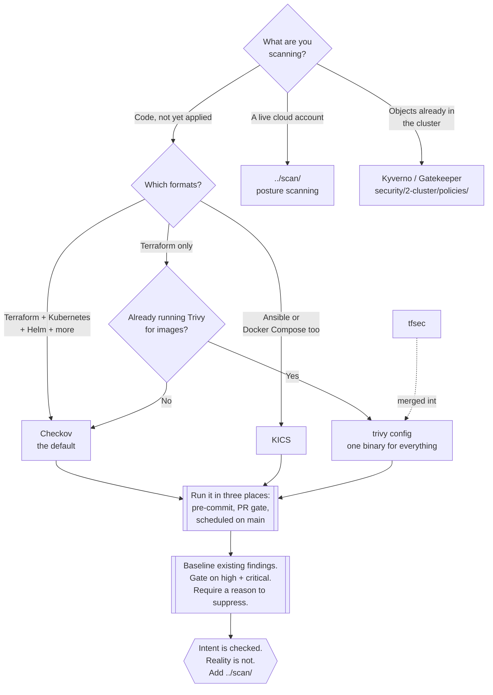

[← Cloud](../README.md)

# IaC scanning

Checking infrastructure-as-code for misconfiguration **before it is applied**, while the
mistake is still text.

Tools covered: [`checkov`](checkov/README.md) · [`kics`](kics/README.md) ·
[`terrascan`](terrascan/README.md) · [`tfsec`](tfsec/README.md)

## Contents

1. [The cheapest place to catch a misconfiguration](#1-the-cheapest-place-to-catch-a-misconfiguration)
   - [The cost curve](#the-cost-curve)
2. [What these tools actually check](#2-what-these-tools-actually-check)
   - [Source or plan](#source-or-plan)
3. [The tools](#3-the-tools)
   - [tfsec is now Trivy](#tfsec-is-now-trivy)
   - [Choosing one](#choosing-one)
4. [Where the scan runs](#4-where-the-scan-runs)
5. [The gap this does not close](#5-the-gap-this-does-not-close)
6. [Making the gate survive contact with a team](#6-making-the-gate-survive-contact-with-a-team)
7. [Decision tree](#7-decision-tree)
8. [Anti-patterns](#8-anti-patterns)
9. [How this applies to pikakube](#9-how-this-applies-to-pikakube)

---

## 1. The cheapest place to catch a misconfiguration

The central argument of this folder is short:

> **Nothing has been created yet.**

A public bucket in a Terraform file is a string. The same bucket after `apply` is a public
bucket — reachable, indexed, and possibly already read by someone. The misconfiguration is
identical; the cost of it is not remotely the same, and the difference is entirely a
function of when it was caught.

### The cost curve

| Caught | Cost to fix | What else is involved |
|---|---|---|
| In the editor, on save | seconds | nothing |
| In the pull request | minutes | one reviewer |
| After `apply`, by a posture scan | hours to weeks | a change ticket, a maintenance window, an owner who has moved teams |
| By someone else | unbounded | incident response, disclosure, an exposure window of unknown length |

Every other capability in `../` operates to the right of this table. That is the whole
reason to put a scanner at the left edge of it.

## 2. What these tools actually check

They parse infrastructure definitions and evaluate rules against the resulting resource
attributes. Nothing is executed and no cloud credentials are involved — which is also why
they are safe to run on a laptop and in a pull request from a fork.

The rule families are consistent across all four tools:

| Family | Examples |
|---|---|
| Public exposure | a bucket with public ACLs, a security group open to `0.0.0.0/0`, a database with a public endpoint |
| Encryption | volumes, buckets, queues and databases created unencrypted, or without a customer-managed key |
| Identity | wildcard IAM actions, a policy with `Principal: "*"`, an over-broad assume-role trust |
| Logging and audit | access logs off, flow logs missing, audit trails not enabled |
| Kubernetes workload settings | privileged containers, `hostNetwork`, no resource limits, no `runAsNonRoot`, mounted service-account tokens |
| Provider defaults | the long tail of settings whose default is the insecure one |

That last row is the one that earns the tool. Nobody writes `encrypted = false`; the volume
is unencrypted because the attribute was omitted and the provider default did the rest. A
scanner reads the absence.

### Source or plan

For Terraform there is a real distinction that changes results:

| Input | What it sees | Trade-off |
|---|---|---|
| **HCL source** | the code as written | fast, no credentials, but variables, `count`, conditionals and module inputs are unresolved |
| **`terraform plan` JSON** | every value resolved to what will actually be created | accurate, but requires a plan, which requires provider credentials |

Scan the source on every commit; scan the plan in the pipeline stage that already produces
one. A rule that depends on a variable's value is only meaningful against the plan.

## 3. The tools

| Tool | Language | Policy language | Coverage | Detail |
|---|---|---|---|---|
| **Checkov** | Python | Python + YAML | the broadest — Terraform, plan JSON, CloudFormation, Kubernetes, Helm, Kustomize, ARM, Bicep, Serverless, Dockerfile, GitHub Actions, OpenAPI | [→](checkov/README.md) |
| **KICS** | Go | Rego (OPA) | Terraform, Kubernetes, Helm, Docker, Docker Compose, Ansible, CloudFormation, ARM, Pulumi, Crossplane, OpenAPI | [→](kics/README.md) |
| **Terrascan** | Go | Rego (OPA) | Terraform, Kubernetes, Helm, Kustomize, CloudFormation, ARM — plus an admission-webhook mode | [→](terrascan/README.md) |
| **tfsec** | Go | Rego | Terraform only — **merged into Trivy** | [→](tfsec/README.md) |

### tfsec is now Trivy

This matters for tool choice, so it goes here rather than in a footnote: Aqua Security
folded tfsec's checks into **Trivy**, and `trivy config` is the maintained path. tfsec still
runs and still exits zero, which is precisely the problem — a scanner whose rule set has
stopped moving produces a green build on resource types it has never heard of. Any pipeline
being built today should use `trivy config`. Trivy already has a folder in this repository
at `security/3-container/scan/trivy/`.

### Choosing one

Pick one and go. The rule sets overlap heavily, and a second scanner mostly buys duplicate
findings that nobody triages.

- **Default: Checkov.** Widest format coverage, graph checks that reason across resources,
  custom policies writable in YAML, and the largest community.
- **Trivy (`trivy config`)** if the estate is Terraform-plus-Kubernetes and the team already
  runs Trivy for images — one binary for images, filesystems, manifests and Terraform is a
  genuine operational simplification.
- **KICS** if Rego is already the house policy language, or if scan time on a very large
  repository is a real constraint.
- **Terrascan** only for a specific reason, and check its activity first.

## 4. Where the scan runs

The same binary belongs at three points, doing three different jobs:

| Point | Job | Behaviour on failure |
|---|---|---|
| **Pre-commit hook** | fast feedback while the author still has context | warn, and only on changed files |
| **CI, on pull request** | the actual gate | fail the build; publish SARIF so findings land as line annotations in the diff |
| **Scheduled, on the default branch** | catch rules added after the code merged | report to a dashboard, do not break the branch |

The third one is routinely skipped and is the reason "we scan in CI" quietly stops being
true: new checks ship with new tool versions, and code that merged clean last year is never
re-evaluated.

## 5. The gap this does not close

An IaC scanner sees **intent**. It has no idea what is running.

The gap between the two is **drift**, and it has a small number of very common causes:

- someone changed a setting in the console during an incident and never went back
- a resource was created by hand and was never in code at all
- a `terraform apply` failed halfway and left the account in a partial state
- another team, another pipeline, or a vendor integration changed something outside your repo
- the provider changed a default, and the resource was created before the change

None of these is exotic; together they are the normal state of a cloud account. A clean IaC
scan is therefore evidence about the repository, not about the account — which is why
[`../scan/README.md`](../scan/README.md) is a separate capability and not an optional
extra. **Both, or neither is trustworthy.**

## 6. Making the gate survive contact with a team

The technical part of adoption is an afternoon. The part that fails is social, and it fails
the same way every time: the first run reports four hundred findings on an existing
repository, the build goes red, someone adds `--soft-fail`, and the gate becomes decoration.

What works instead:

| Move | Why |
|---|---|
| **Baseline the existing findings on day one** | `checkov --create-baseline` freezes today's state; the build fails only on **new** problems |
| **Gate on severity, not on everything** | fail on high and critical, report the rest |
| **Require a reason on every suppression** | `# checkov:skip=CKV_AWS_20:public static site by design` puts the justification in the diff, where a reviewer sees it |
| **Burn the baseline down deliberately** | a fixed budget per sprint, tracked, rather than an intention |
| **Pin the tool version** | an unpinned scanner turns an unrelated pull request red when a new check ships |

The suppression syntax is not a loophole to be closed. Some findings are wrong, and some
are accepted risk; a scanner without a documented escape hatch gets bypassed wholesale
instead of case by case.

## 7. Decision tree

## 8. Anti-patterns

| Anti-pattern | Why it is bad | What to do instead |
|---|---|---|
| Scanning IaC and never scanning the deployed account | drift, console changes and hand-created resources bypass the scanner completely; a green pipeline says nothing about the account | pair it with [`../scan/README.md`](../scan/README.md) — intent **and** reality |
| Turning on every rule, at every severity, on day one | four hundred findings, a red build, and `--soft-fail` added within the week | baseline first, gate on high and critical, burn the baseline down |
| Blanket `--soft-fail` left in permanently | the scan runs, reports, and blocks nothing — the appearance of a control with none of the effect | fail on the severities that matter; suppress individually, with reasons |
| Suppressions with no justification | nobody can tell an accepted risk from a nuisance, so nobody ever revisits any of them | mandatory reason in the skip comment, reviewed in the pull request |
| Scanning only in CI, never locally | feedback arrives after the context is gone, which is where the resentment comes from | pre-commit hook on changed files |
| Scanning HCL source only, never the plan | variables, `count` and module inputs are unresolved — the rule evaluates a placeholder | scan the plan JSON in the pipeline stage that already generates one |
| Four scanners "for coverage" | duplicate findings across four report formats, and nobody owns any of them | one primary tool; a second only if someone owns the overlap |
| Treating tfsec as a current tool | it is merged into Trivy; the rule set no longer moves, but it still returns success | `trivy config` |
| Custom policies with no owner | they rot, start failing on refactors, and get deleted in a hurry | keep them with the code, with tests and a named owner |
| Unpinned scanner version | an unrelated pull request goes red because a new check shipped this morning | pin, and upgrade deliberately |

## 9. How this applies to pikakube

There is no Terraform in this repository. The infrastructure-as-code here is **Kubernetes
manifests, Kustomize overlays, Helm charts and ArgoCD `Application` objects** under
`clusters/`, plus the Kind node configurations in `clusters/kind-configs/`. That changes
which of these tools is relevant, and it does not make the capability irrelevant:

| Tool | Applies here? |
|---|---|
| **Checkov** | yes — `--framework kubernetes helm kustomize` covers everything in `clusters/` |
| **Trivy (`trivy config`)** | yes — same coverage, and the repository already has a Trivy folder under `security/3-container/scan/` |
| **KICS** | yes, for the same content |
| **Terrascan** | technically yes; no reason to prefer it here |
| **tfsec** | no — Terraform only, and there is none |

The realistic gate for this repository is a single scanner over `clusters/`, run on pull
requests, checking the workload-level rules: privileged containers, missing resource limits,
`runAsNonRoot`, automounted service-account tokens, `hostPath` volumes. Those are exactly
the findings that also appear at admission time — **Kyverno** is already deployed here
(`clusters/dev/kustomization/kyverno.yaml`), which means the same class of rule can be
enforced twice, in the two places it belongs: in the pull request, where it is cheap to fix,
and at the API server, where nothing gets past it.

The other half of this folder's argument does not apply yet, and should be said plainly:
pikakube has **no cloud account**, so there is no drift to find and no posture scan to pair
with. The `cloud-computing/aws/localstack/` folder is the closest thing, and a local
emulator does not have the misconfigurations that make posture scanning worthwhile. This
capability is complete here on the Kubernetes side and theoretical on the cloud side.

---

[← Cloud](../README.md)
