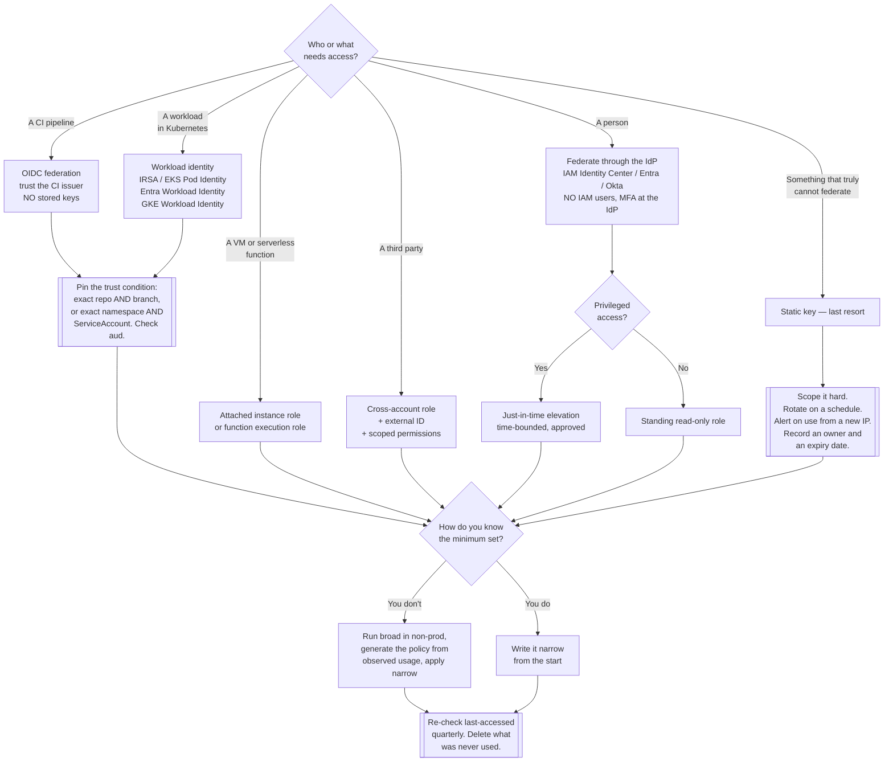

[← Cloud](../README.md)

# IAM

Who can do what, to which resource, in the cloud account. The highest-value area in this
layer, and reliably the worst-managed.

## Contents

1. [Why this is the area that matters most](#1-why-this-is-the-area-that-matters-most)
2. [Least privilege, and why wildcard policies happen anyway](#2-least-privilege-and-why-wildcard-policies-happen-anyway)
   - [The fix is evidence, not discipline](#the-fix-is-evidence-not-discipline)
3. [Identity policies and resource policies](#3-identity-policies-and-resource-policies)
   - [How the two combine](#how-the-two-combine)
   - [The ceilings above both](#the-ceilings-above-both)
   - [Why identity-only reviews miss public buckets](#why-identity-only-reviews-miss-public-buckets)
4. [Long-lived keys are the problem](#4-long-lived-keys-are-the-problem)
   - [Humans: federation](#humans-federation)
   - [Pipelines: OIDC](#pipelines-oidc)
5. [Workload identity: the single biggest improvement available](#5-workload-identity-the-single-biggest-improvement-available)
   - [How it works](#how-it-works)
   - [The trust condition nobody checks](#the-trust-condition-nobody-checks)
6. [What to review, and how often](#6-what-to-review-and-how-often)
7. [Decision tree](#7-decision-tree)
8. [Anti-patterns](#8-anti-patterns)
9. [How this applies to pikakube](#9-how-this-applies-to-pikakube)

---

## 1. Why this is the area that matters most

Everything else in [`../README.md`](../README.md) is about a resource being configured
wrongly. IAM is about **who is allowed to configure it** — which makes it the control that
sits above all the others.

A misconfigured bucket exposes one bucket. A role with `Action: "*"` on `Resource: "*"`,
assumable from somewhere it should not be, exposes the account: it can read every bucket,
create new identities, disable logging, and delete the evidence. Identity is the layer where
a small mistake has unbounded consequences, and it is the layer that produces the escalation
paths attackers actually use once they are inside.

It is also, consistently, the worst-managed:

- Permissions accumulate and are never removed. Access granted for one incident in 2022 is
  still attached.
- Nobody can safely delete a policy, because nobody knows what would break.
- The wildcard was added to unblock a deploy and became permanent the moment it worked.
- Static keys were created "temporarily" and are now in a CI variable, a laptop, and a
  Slack thread from three years ago.

None of this is incompetence. It is the predictable outcome of a system where the cost of
too few permissions is immediate and visible, and the cost of too many is invisible until it
is catastrophic.

## 2. Least privilege, and why wildcard policies happen anyway

Least privilege is the principle that an identity holds exactly the permissions it needs to
do its job, and nothing else. Everyone agrees with it. Almost nobody achieves it, and the
reason is structural rather than moral:

| Force | Effect |
|---|---|
| **Nobody knows the minimum set.** A cloud provider has tens of thousands of API actions, and the mapping from "deploy this application" to the exact list is not documented anywhere | the honest answer to "what does this need?" is "I don't know" |
| **The two failure modes are wildly asymmetric.** Too few permissions: the deploy fails at 02:00 and someone is paged. Too many: nothing happens, ever, until an incident | the pressure runs in one direction only |
| **Iterating is slow.** Add a permission, redeploy, hit the next `AccessDenied`, repeat, twenty times | `"*"` ends the loop immediately |
| **Nobody is rewarded for narrowing it later.** The ticket was "make the deploy work" | it worked; the ticket closed |

So `Action: "*"` ships, with a comment saying it will be tightened later, and it is not
tightened later.

### The fix is evidence, not discipline

Telling people to try harder does not work, because the problem is missing information. What
works is deriving the policy from what the identity actually did:

| Provider | Mechanism |
|---|---|
| **AWS** | IAM Access Analyzer **policy generation** — reads CloudTrail history for a role and generates a policy containing only the actions it actually used. Also *last accessed* data, which shows which services a policy grants but the principal has never touched |
| **Azure** | Entra ID access reviews, and the *least-privileged role* recommendations in PIM |
| **GCP** | IAM Recommender — proposes narrowed roles based on 90 days of observed usage |

The practical workflow that survives contact with a delivery deadline:

1. Start broad in a **non-production** account so nothing is blocked.
2. Let it run for a representative period — including the monthly job, the failover path and
   the backup window, which is why "a week" is usually not long enough.
3. Generate the policy from observed usage.
4. Apply the narrowed policy in production, and keep the wildcard nowhere.
5. Re-run the *last accessed* report periodically, and remove what has gone unused.

The last step is the one that makes it a process rather than an event. Permissions decay
into unused permissions continuously, because applications change and features get removed.

## 3. Identity policies and resource policies

This distinction is the one people conflate, and conflating it is how public buckets happen.

| | **Identity policy** | **Resource policy** |
|---|---|---|
| Attached to | a principal — user, group, role, service account | the resource — a bucket, a KMS key, a queue, a topic, a Lambda function |
| Answers | "what may this principal do?" | "who may touch this object?" |
| Names the principal? | implicitly — it *is* the principal | explicitly, in a `Principal` field |
| Can grant access to an identity in another account | no, not by itself | **yes** |
| Where "public" lives | nowhere | **here** — `Principal: "*"` |
| Examples | an IAM policy on a role | an S3 bucket policy, a KMS key policy, an SQS queue policy, an ECR repository policy |

### How the two combine

The rules are provider-specific in detail; on AWS, which is the model most people are
reasoning about, the shape is:

- **An explicit `Deny` anywhere always wins.** Nothing overrides it.
- **Same account:** an `Allow` in the identity policy is generally sufficient — the resource
  policy does not also have to grant it. There are exceptions where the resource policy is
  authoritative and must grant access explicitly, **KMS key policies** being the one that
  bites most often.
- **Cross-account:** **both sides must allow.** The identity policy in the calling account
  must permit the action, and the resource policy in the owning account must permit that
  principal. This is why cross-account access fails in a way that looks like a bug — one
  side is configured and the other is not.

### The ceilings above both

Two mechanisms cap what any policy can grant. Neither ever grants anything itself, which is
the part that surprises people:

| Mechanism | Scope | What it does |
|---|---|---|
| **Service Control Policies (SCPs)** | an AWS Organization, OU or account | define the **maximum** available permissions in the account. An action denied by an SCP cannot be allowed by any policy underneath it |
| **Permission boundaries** | a single identity | cap what that identity can be granted, which is how you safely let a team create its own roles |

Permission boundaries are the underused one. They are the answer to "developers need to
create roles, but must not be able to create a role more privileged than themselves" — which
is otherwise a straight privilege-escalation path via `iam:CreateRole` and `iam:PassRole`.

### Why identity-only reviews miss public buckets

The canonical cloud incident — an S3 bucket readable by the internet — has **nothing to do
with identity policies**. There is no over-permissive role involved. The bucket policy says
`Principal: "*"`, or the ACL is public, and no principal in your account is relevant at all.

A review that walks through roles and their attached policies will not find it. Public
exposure lives on the **resource** side, and it has to be checked there:

- account-level public-access blocks — S3 Block Public Access on AWS is the single highest-value
  setting in this entire folder, precisely because it overrides individual mistakes
- resource policies containing `"*"` or `AWS: "*"` in `Principal`
- trust policies naming an external account you cannot identify
- anything shared publicly: snapshots, AMIs, container images, secrets

This is also where [`../scan/README.md`](../scan/README.md) earns its place — posture
scanners check exactly this class of resource-side exposure across every service and every
region, which no human review does reliably.

## 4. Long-lived keys are the problem

A static access key has no expiry. Once created, it works until someone remembers to delete
it, and it travels: into a CI variable, a `.env`, a laptop's `~/.aws/credentials`, a
Terraform state file, a Slack thread, a Docker image layer, a public repository.

Credentials in leaked-credential reports are overwhelmingly of this kind, because they are
the only kind that keeps working after it leaks. A short-lived session credential that
leaks is expired by the time anyone finds it. **That is the entire argument**, and it
generalises to every case below.

The replacement in all cases is the same idea: **prove identity, receive a short-lived
credential.**

### Humans: federation

Nobody should have an IAM user. Humans authenticate against the existing identity provider
— Entra ID, Okta, Google Workspace — through AWS IAM Identity Center, Azure RBAC or GCP IAM,
and receive session credentials that expire.

What this buys beyond expiry:

- **One offboarding action.** Disabling the account in the IdP removes cloud access
  everywhere, immediately. With IAM users, offboarding means finding every account.
- **MFA is enforced centrally**, by the IdP, not per-account.
- **The audit trail names a person**, not a shared key.
- **Just-in-time elevation** becomes possible — Azure PIM and equivalent patterns grant
  privileged roles for a bounded window with an approval, so nobody sits with admin all day.

### Pipelines: OIDC

CI systems do not need stored cloud keys. GitHub Actions, GitLab CI and others act as OIDC
providers: the pipeline receives a signed token describing itself — repository, branch,
environment, workflow — and exchanges it for a cloud role.

The result is a repository with **no cloud secret in it at all**. Nothing to rotate, nothing
to leak, and access that is automatically scoped to the specific repository and branch that
the trust policy names.

## 5. Workload identity: the single biggest improvement available

For a platform team running Kubernetes, this is the highest-leverage change in the entire
folder, and it is worth stating without hedging:

> **A pod assuming a cloud role via OIDC, rather than holding a static key, is the single
> biggest security improvement available in this layer.**

The alternative it replaces is a cloud access key sitting in a Kubernetes Secret. That
Secret is base64, not encrypted; it is readable by anyone with `get secrets` in the
namespace and by anyone who can create a pod that mounts it; it appears in etcd backups; it
never expires; and it is shared by every replica of the workload, so no audit trail can ever
attribute an action to one of them.

Every major provider solves this the same way, with different names:

| Provider | Feature |
|---|---|
| AWS | IRSA (IAM Roles for Service Accounts), and the newer EKS Pod Identity |
| Azure | Azure AD / Entra Workload Identity |
| GCP | GKE Workload Identity |

### How it works

The mechanism is worth understanding, because it explains why this is genuinely secure and
not just a different place to keep a secret:

1. The cluster publishes an **OIDC discovery document and a public key set**. It is an
   identity provider.
2. The cloud account is configured to **trust that issuer**.
3. A pod gets a **projected ServiceAccount token** — a short-lived JWT, audience-scoped,
   automatically rotated by the kubelet, naming the namespace and ServiceAccount.
4. The workload exchanges that token for cloud credentials. The provider verifies the
   signature against the cluster's public keys and checks the token's claims against the
   role's trust policy.
5. It receives **temporary credentials**, valid for around an hour, refreshed automatically
   by the SDK.

Nothing long-lived exists anywhere in that chain. There is no secret to rotate, no secret to
leak, and the cloud audit log records which namespace and ServiceAccount performed each
action — so per-workload least privilege becomes possible for the first time, because each
workload can have its own role.

The cluster-side half of this — ServiceAccounts, projected tokens, the OIDC issuer
configuration — lives under `security/2-cluster/identity-access/`. The two halves have to be
designed together: the cloud role's trust policy names a specific namespace and
ServiceAccount, so the cluster's namespace layout becomes part of the account's security
boundary.

### The trust condition nobody checks

The mechanism is only as good as the **condition in the trust policy**, and this is where it
is routinely got wrong.

A role's trust policy checks the token's `sub` claim. If that condition is written with a
wildcard, the role is assumable by principals you did not intend:

- A GitHub OIDC role trusting `repo:my-org/*` is assumable from **every repository in the
  organisation**, including one a contractor can push to.
- A trust condition matching `system:serviceaccount:*:*` is assumable by **every
  ServiceAccount in the cluster**, which reduces the whole mechanism to "anyone who can
  create a pod".
- Omitting the `aud` (audience) check entirely allows tokens minted for a different purpose
  to be replayed.

Pin the full subject: the exact repository **and** branch or environment, or the exact
namespace **and** ServiceAccount. A workload identity role with a loose trust condition is
not an improvement on a static key — it is a static key that anyone in the cluster can pick
up.

## 6. What to review, and how often

| Item | Cadence | What you are looking for |
|---|---|---|
| Root / global administrator accounts | continuously | no access keys, MFA on, alerting on any use at all |
| Static access keys | continuously | that none exist; each one that does needs an owner and an expiry date |
| Wildcard policies (`"*"` in `Action` or `Resource`) | monthly | new ones, and why the last ones are still there |
| Resource policies with `Principal: "*"` | continuously — automated | public exposure of any resource type |
| Trust policies naming external accounts | quarterly | accounts you can still identify, and third parties still in the relationship |
| OIDC trust conditions | on every change | wildcards in `sub`, missing `aud` |
| *Last accessed* / unused permissions | quarterly | permissions granted and never exercised — delete them |
| Unused identities | quarterly | roles and users with no activity in 90 days |
| Human access | on every joiner, mover, leaver | that the IdP is the only door |

Automate the "continuously" rows. A quarterly manual review does not catch a bucket that was
made public on a Tuesday afternoon.

## 7. Decision tree

## 8. Anti-patterns

| Anti-pattern | Why it is bad | What to do instead |
|---|---|---|
| `Action: "*"` on `Resource: "*"` | the identity can do anything, including creating new identities and deleting the audit trail; it is the escalation path | generate the policy from observed usage, then narrow and re-review |
| Static access keys for CI | they never expire, they live in a settings page, and they leak | OIDC federation — no secret in the repository at all |
| Cloud keys in a Kubernetes Secret | base64, not encrypted; readable by anyone with `get secrets`; present in etcd backups; shared by every replica | workload identity — IRSA, Entra Workload Identity, GKE Workload Identity |
| An OIDC trust condition with a wildcard `sub` | `repo:org/*` is assumable from any repository; `serviceaccount:*:*` from any pod — the mechanism is defeated | pin the full subject, and check the audience claim |
| IAM users for people | offboarding becomes a search; MFA is per-account; the audit trail is a key, not a person | federate through the existing identity provider |
| Root or global admin used day to day | no blast radius left to contain, and often no MFA | lock it away, MFA it, alert on any use |
| One role shared by every workload | any compromised pod gets the union of everything every workload needs | one role per workload, which workload identity makes practical |
| Reviewing identity policies only | public buckets live in **resource** policies; no identity is involved | check resource policies and account-level public-access blocks, automatically |
| Permissions added per incident, never removed | entitlement grows monotonically and nobody dares subtract | last-accessed reports quarterly, with deletion as the default |
| No SCPs or organisation guardrails | every account can do everything, so one mistake has no ceiling above it | SCPs for the maximum, permission boundaries for delegated role creation |
| Letting developers create roles with no boundary | `iam:CreateRole` plus `iam:PassRole` is a straight path to admin | permission boundaries |
| "We will tighten it after launch" | the ticket closes when it works, and nothing reopens it | narrow before production, with generated policies |

## 9. How this applies to pikakube

There is no cloud account and no IAM in this repository. Kind runs locally; nothing here
assumes a role. So the honest position is that this folder is **the design that gets applied
when a cloud account exists**, not a description of something running.

Two things are nonetheless directly relevant.

**First, the pattern is already present one layer up.** The repository deploys **Vault** and
**External Secrets Operator** (`clusters/dev/kustomization/vault.yaml`,
`clusters/dev/kustomization/external-secrets.yaml`). The reason those exist is the same
argument made in section 4: a workload should **prove who it is and be given a short-lived
credential**, rather than holding a static one that was copied in at deploy time. External
Secrets pulls from a backend at runtime; Vault's Kubernetes auth method authenticates a pod
by its ServiceAccount token and issues a lease with a TTL. That is workload identity, with
Vault standing in for the cloud provider — the same mechanism, the same reasoning, one
substitution away from IRSA.

**Second, the cluster half of workload identity is a real prerequisite.** The trust policy
in a cloud account names a namespace and a ServiceAccount, which means the namespace layout
and ServiceAccount naming in `clusters/` become part of the account's security boundary the
day a cloud account is attached. Deciding "one ServiceAccount per workload, never a shared
default" costs nothing now and is expensive to retrofit. That side is documented under
`security/2-cluster/identity-access/`.

The rest of this folder — SCPs, permission boundaries, federation, access reviews — has no
local analogue, and pretending otherwise would be the kind of thing this repository is
written to avoid.

---

[← Cloud](../README.md)
