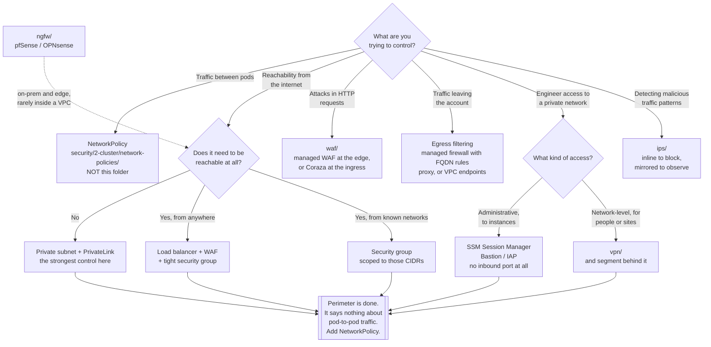

[← Cloud](../README.md)

# Cloud network

Perimeter controls at the account and VPC edge — a different world from Kubernetes
NetworkPolicy, and not a substitute for it.

Categories covered: [`waf`](waf/README.md) · [`ngfw`](ngfw/README.md) ·
[`ips`](ips/README.md) · [`vpn`](vpn/README.md)

## Contents

1. [What perimeter means in a cloud account](#1-what-perimeter-means-in-a-cloud-account)
2. [Why this is a different world from NetworkPolicy](#2-why-this-is-a-different-world-from-networkpolicy)
   - [Where the two blur](#where-the-two-blur)
3. [The four categories](#3-the-four-categories)
4. [The controls you get before buying anything](#4-the-controls-you-get-before-buying-anything)
   - [Egress is the one nobody does](#egress-is-the-one-nobody-does)
5. [The strongest perimeter control is not a firewall](#5-the-strongest-perimeter-control-is-not-a-firewall)
6. [Self-hosted appliances in a cloud VPC](#6-self-hosted-appliances-in-a-cloud-vpc)
7. [Decision tree](#7-decision-tree)
8. [Anti-patterns](#8-anti-patterns)
9. [How this applies to pikakube](#9-how-this-applies-to-pikakube)

---

## 1. What perimeter means in a cloud account

The perimeter is every point where traffic crosses into or out of the account: the internet
gateway, the load balancer, the NAT gateway, the VPN or interconnect back to the corporate
network, and every managed service endpoint that is reachable from outside.

Controls at that boundary answer questions the cluster cannot:

- Who on the internet can reach this address, on which port?
- Is this HTTP request an attack against the application behind it?
- Where is this traffic going when it leaves, and should it be?
- How do engineers reach a private network without exposing it?

None of these questions has an answer inside Kubernetes, because by the time a packet
reaches a pod it has already crossed the boundary.

## 2. Why this is a different world from NetworkPolicy

Be honest about this rather than blurring it, because conflating the two is how
organisations end up with a control they think they have and do not.

| | **NetworkPolicy** (`security/2-cluster/network-policies/`) | **Perimeter controls** (here) |
|---|---|---|
| Where it runs | inside the cluster, enforced by the CNI | at the VPC edge, the load balancer, or a firewall appliance |
| What it selects on | pod labels, namespaces — **workload identity** | IP addresses, CIDRs, ports, protocols, and for a WAF, HTTP payloads |
| Traffic it sees | pod to pod, east-west | anything crossing the account boundary, north-south |
| Traffic it cannot see | anything that never enters the cluster | anything between two pods on the same node |
| Survives a pod restart | yes — labels are stable, IPs are not | it never knew about the pod in the first place |
| Configured by | Kubernetes objects, GitOps | provider APIs, Terraform, or an appliance console |
| Blocks an attack in an HTTP body | no — it is L3/L4 | a WAF does, and only a WAF |

The consequence stated plainly: **a perimeter firewall gives you nothing between two pods,
and a NetworkPolicy gives you nothing at the internet edge.** They are not layers of the
same control; they are different controls at different places, and a serious environment
needs both.

The one thing pod IPs guarantee is that IP-based rules do not work inside a cluster. Pods
are ephemeral and their addresses are recycled, so a firewall rule naming an IP is either
already stale or so broad — the whole node CIDR — that it means nothing.

### Where the two blur

Two places, and both are worth knowing about because they are where the useful hybrids live:

- **An in-cluster WAF.** ModSecurity or Coraza running in the ingress controller inspects
  HTTP inside the cluster. That is a perimeter-style control at the cluster's own edge
  rather than the account's — see [`waf/README.md`](waf/README.md).
- **A service mesh.** mTLS and L7 authorisation between pods give identity-based rules with
  HTTP awareness, which is the property a WAF has and NetworkPolicy lacks — but applied
  east-west.

## 3. The four categories

| Category | What it inspects | Typical placement | Detail |
|---|---|---|---|
| **WAF** | HTTP requests — payloads, headers, paths, rates | in front of the application: CDN, load balancer, or ingress controller | [→](waf/README.md) |
| **NGFW** | connections, with application awareness and routing | the network edge; on-prem or at a branch far more often than inside a cloud VPC | [→](ngfw/README.md) |
| **IPS / IDS** | packet and flow content against signatures or behaviour | inline on a chokepoint (IPS, blocks) or on a mirrored feed (IDS, observes) | [→](ips/README.md) |
| **VPN** | nothing — it creates an encrypted path | between networks, or between a user and a network | [→](vpn/README.md) |

The last row is different in kind and worth separating in your head: a VPN is not an
inspection control. It grants **reachability**. That makes it the one item in this folder
that can reduce security if treated as a security product — see the anti-patterns.

## 4. The controls you get before buying anything

Every cloud provider ships the primitives, and they cover the majority of real cases at zero
additional cost. Reach for these before considering an appliance:

| Control | AWS | Azure | GCP |
|---|---|---|---|
| Instance-level stateful filtering | Security Group | Network Security Group | VPC firewall rules |
| Subnet-level stateless filtering | Network ACL | NSG on the subnet | hierarchical firewall policies |
| Managed L7 WAF | AWS WAF | Azure WAF (Front Door / App Gateway) | Cloud Armor |
| Managed network firewall with egress filtering | Network Firewall | Azure Firewall | Cloud NGFW |
| Threat detection from provider telemetry | GuardDuty | Defender for Cloud | Security Command Center |
| Site-to-site connectivity | Site-to-Site VPN, Direct Connect | VPN Gateway, ExpressRoute | Cloud VPN, Interconnect |
| Private service access, no public endpoint | PrivateLink, VPC endpoints | Private Endpoint / Private Link | Private Service Connect |
| Administrative access without inbound ports | SSM Session Manager | Bastion | IAP TCP forwarding |

Two notes that change decisions:

- **Security groups are the workhorse.** They are stateful, they reference other security
  groups rather than IP ranges, and they are enforced at the interface. Most "we need a
  firewall" requirements are a security group that was never tightened.
- **GuardDuty, Defender and SCC are detection, not prevention.** They read provider
  telemetry — flow logs, DNS logs, control-plane events — and raise findings. They do not
  sit inline and do not block. Filing them mentally as "our IPS" is a mistake.

### Egress is the one nobody does

Inbound rules get attention because the threat is obvious. Outbound is left at
allow-everything in the overwhelming majority of accounts, and outbound is the direction
that matters after something has gone wrong: data leaving, a compromised workload reaching a
command-and-control host, a container pulling a payload at runtime.

Egress filtering is genuinely harder — modern workloads talk to package registries, cloud
APIs and SaaS endpoints on shifting address ranges, so an IP allowlist is unmaintainable.
The practical options are FQDN-based rules in a managed firewall, an explicit proxy, or VPC
endpoints so that cloud API traffic never traverses the internet at all. Start by logging
egress and looking at it; the destination list is usually shorter and more surprising than
anyone expects.

## 5. The strongest perimeter control is not a firewall

The most effective thing available in this folder is **not having a public endpoint**.

A database in a private subnet with no public address, reached through PrivateLink, is not
protected by a rule that someone can loosen — it is unreachable. A private cluster API
endpoint cannot be brute-forced from the internet. Administrative access through SSM Session
Manager or IAP means no inbound port exists for SSH at all, and access is governed by
[`../iam/README.md`](../iam/README.md) rather than by a source IP.

This reframes the whole folder. Inspection controls are for traffic that must be allowed in;
they are not a way to make exposure acceptable. The first question about any perimeter
requirement should be whether the thing needs to be reachable at all — and often the answer
turns out to be no.

## 6. Self-hosted appliances in a cloud VPC

pfSense, OPNsense, Suricata on an inline instance: all real tools, and mostly the wrong
answer **inside a cloud VPC**.

| Consideration | Reality in a cloud VPC |
|---|---|
| Availability | the appliance instance becomes a single point of failure; making it HA means route-table failover you now own |
| Throughput | it is one instance; the managed alternatives scale horizontally without you |
| Traffic steering | everything must be routed through it, which means route tables, gateway load balancers and asymmetric-routing debugging |
| Overlap | security groups already do stateful L3/L4 filtering at every interface, for free |
| Operations | patching, tuning and monitoring a firewall is a job, and it is one nobody was hired for |

Where these tools genuinely belong: **on-premises and at the edge** — a physical or virtual
appliance at a site boundary, a home lab, a branch office, a colocated rack. That is what
they were built for, and there they are excellent. In a cloud account, prefer security
groups plus the managed network firewall.

## 7. Decision tree

## 8. Anti-patterns

| Anti-pattern | Why it is bad | What to do instead |
|---|---|---|
| `0.0.0.0/0` on SSH, RDP or a database port | it is found by internet-wide scanners within minutes of being opened, not months | SSM Session Manager / Bastion / IAP, or a source-scoped rule at minimum |
| Treating NetworkPolicy as a perimeter control | it never sees traffic that has not entered the cluster, and it cannot inspect HTTP | perimeter controls at the edge, NetworkPolicy inside — both |
| Treating a perimeter firewall as pod segmentation | pod IPs are ephemeral and pod-to-pod traffic never reaches the appliance | NetworkPolicy, which selects on labels |
| A WAF left in count/detection mode indefinitely | it observes attacks and permits them; the dashboard implies protection that does not exist | tune on real traffic, then enforce — with a documented date |
| A VPN as the only control | once connected, the user is on a flat network with reachability to everything | segment behind the VPN, or use an identity-based overlay with per-resource ACLs |
| Unrestricted egress | exfiltration and command-and-control traffic leave unnoticed, which is the direction that matters post-compromise | log egress first, then FQDN rules, a proxy, or VPC endpoints |
| Self-hosting pfSense or OPNsense inside a cloud VPC | a single-instance bottleneck, route-table gymnastics, and it duplicates what security groups already do | security groups plus the managed network firewall; keep the appliances for on-prem |
| Deploying an IPS with nobody reading the alerts | thousands of low-value signature hits, muted within a fortnight | tune to the environment, route only high-confidence alerts, or run it as an IDS for forensics |
| Assuming GuardDuty or Defender blocks anything | they are detection over telemetry, entirely out of band | pair detection with an inline control if blocking is the requirement |
| Public endpoints "protected" by a WAF | a WAF filters known attack patterns; it does not make an exposed database acceptable | make it private — the WAF is for what must be public |
| Firewall rules maintained by hand in a console | drift immediately, and nobody can say why a rule exists | manage them as code, scanned by [`../iac/README.md`](../iac/README.md) |

## 9. How this applies to pikakube

pikakube is a **Kind cluster on a laptop**. There is no VPC, no internet gateway, no load
balancer and no account boundary — so most of this folder describes controls with nothing to
attach to.

What exists locally, and what it maps to:

| Real here | Equivalent in this folder |
|---|---|
| The host's own firewall, and the fact that nothing is exposed beyond `127.0.0.1` | the perimeter, such as it is |
| MetalLB and ingress-nginx (`clusters/dev/`) | the load balancer and the edge — the natural place an in-cluster WAF would sit |
| `nip.io` hostnames resolving to `127.0.0.1` | names that are publicly resolvable but not publicly reachable |
| Cilium, available as a Kind configuration (`clusters/kind-configs/cilium.yaml`) | the enforcement point for NetworkPolicy — **not** this folder |

The subfolders here are documented for two reasons rather than one. **NGFW, IPS and VPN
belong to the on-premises and home-lab side of the lab** — pfSense or OPNsense at the edge of
a physical network, Suricata or CrowdSec watching that network, WireGuard reaching it
remotely. Those are legitimate uses of the tools recorded here and they do not require a
cloud account. **WAF is the one category with a direct in-cluster path**: Coraza or
ModSecurity in ingress-nginx would inspect HTTP at the cluster edge, which is where traffic
actually arrives in this repository.

The cluster-internal segmentation story — the part that genuinely applies to a Kind cluster
— is `security/2-cluster/network-policies/`, and it is deliberately not duplicated here.

---

[← Cloud](../README.md)
