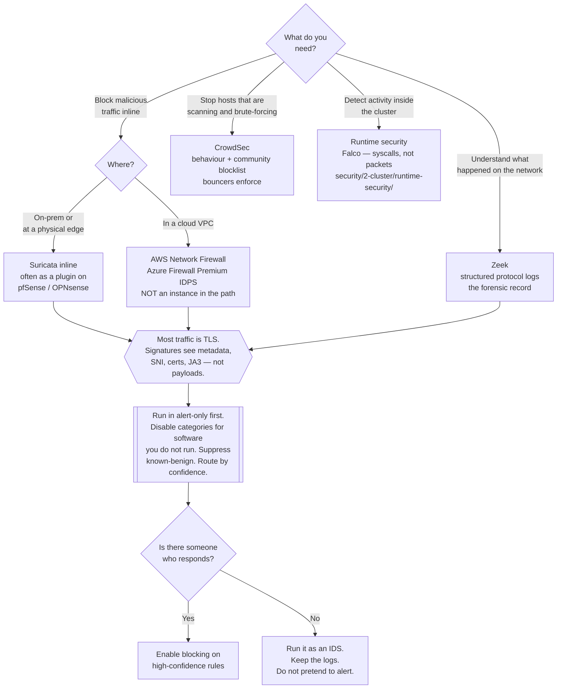

[← Cloud network](../README.md)

# IPS and IDS

Inspecting traffic content for malicious activity — blocking it inline, or observing it and
telling you.

## Contents

1. [IDS and IPS are the same tool in two placements](#1-ids-and-ips-are-the-same-tool-in-two-placements)
2. [Three detection models](#2-three-detection-models)
3. [The options](#3-the-options)
   - [Suricata, Zeek and CrowdSec are not alternatives](#suricata-zeek-and-crowdsec-are-not-alternatives)
4. [The encryption problem](#4-the-encryption-problem)
5. [What this looks like in a cloud account](#5-what-this-looks-like-in-a-cloud-account)
6. [The alerts problem](#6-the-alerts-problem)
7. [Decision tree](#7-decision-tree)
8. [Anti-patterns](#8-anti-patterns)
9. [Notes](#9-notes)
10. [How this applies to pikakube](#10-how-this-applies-to-pikakube)

---

## 1. IDS and IPS are the same tool in two placements

The distinction is entirely about where the sensor sits in the path, not about what it
knows:

| | **IDS** — detection | **IPS** — prevention |
|---|---|---|
| Placement | out of band, on a mirrored feed (SPAN port, TAP, VPC traffic mirroring) | **inline** — traffic passes through it |
| On a match | raises an alert | drops the packet or resets the connection |
| On a false positive | noise in a queue | **legitimate traffic is broken** |
| On failure of the sensor | you lose visibility | you lose the network, unless it fails open |
| Latency | none — it is a copy | added to every packet |

The trade-off is exactly the one it looks like. Inline placement is the only way to stop
something, and it puts a pattern-matching engine in the path of production traffic where a
bad rule causes an outage. Most organisations run detection first for a long time, precisely
because the cost of being wrong is asymmetric.

There is a middle position worth knowing about: many engines can run inline in "alert only"
mode, so the placement risk is taken once and the blocking decision is made per rule
afterwards.

## 2. Three detection models

Which model a tool uses determines what it can possibly find, and it explains why the three
options in this folder are not substitutes for one another.

| Model | How it works | Catches | Misses |
|---|---|---|---|
| **Signature** | patterns matched against packet content | known exploits, known malware traffic, known command-and-control | anything new, and anything encrypted |
| **Protocol analysis** | full parsing of protocol state, producing structured records of what happened | anomalies, policy violations, and everything that a log of connections makes visible in hindsight | nothing per se — but it does not decide; it describes |
| **Behaviour / reputation** | scenarios over time, plus lists of addresses already known to be attacking others | brute force, scanning, enumeration, distributed abuse | a single well-formed malicious request |

A signature engine answers "is this packet a known attack?". A protocol analyser answers
"what happened on this network?". A behavioural engine answers "is this source acting
maliciously?". Three different questions.

## 3. The options

No tool subfolders here. The three recorded in this repository, plus the classic:

| Option | Model | What it is | Link |
|---|---|---|---|
| **Suricata** | signature (+ protocol parsing) | high-performance, multi-threaded IDS/IPS/NSM. Runs passively or inline, consumes Emerging Threats and Snort-format rules, and also emits protocol logs and extracted files | <https://github.com/OISF/suricata> |
| **Zeek** | protocol analysis | not a signature engine at all — a network analysis framework that turns traffic into rich structured logs (connections, DNS, HTTP, TLS, files) with a scripting language on top | <https://github.com/zeek/zeek> |
| **CrowdSec** | behaviour + reputation | parses logs, applies scenarios describing malicious behaviour, shares signals across a community blocklist, and enforces through separate "bouncers" | <https://github.com/crowdsecurity/crowdsec> |
| **Snort** | signature | the original, and the source of the rule format everything else reads. Suricata is the usual choice today for its threading model | <https://github.com/snort3/snort3> |
| **Fail2ban** | behaviour, single host | the minimal ancestor of CrowdSec: parse a log, ban an IP in the local firewall | <https://github.com/fail2ban/fail2ban> |

### Suricata, Zeek and CrowdSec are not alternatives

This is the thing the original note's three links most need explaining, because they read as
a list of competitors and they are not:

- **Suricata blocks.** It is the one you deploy when the requirement is "stop this traffic".
  Inline, with a tuned rule set, it drops known exploit attempts. It is also the only one of
  the three that is a real IPS.
- **Zeek explains.** It answers questions after the fact: which hosts talked to which, over
  what protocols, with which TLS certificates and JA3 fingerprints, transferring which
  files. It raises very few alerts by design. Its value is that when something happens, the
  record already exists — which is worth more during an investigation than any number of
  signature hits.
- **CrowdSec bans sources.** It works from logs rather than packets, so it sees things that
  are encrypted on the wire but plain in the application log, and its blocklist stops
  scanners before they send a payload at all.

The mature pattern deploys **Suricata and Zeek together** on the same feed — one for
enforcement and known threats, one for the forensic record — and that is exactly what the
established open-source NSM distributions bundle. CrowdSec sits alongside both, operating on
a different input entirely.

## 4. The encryption problem

Say this plainly, because it is the biggest limitation of the signature model and it is
routinely glossed over: **most traffic is TLS-encrypted, and a signature engine cannot see
inside it.**

What remains visible without decryption:

- addresses, ports, volumes, timing and connection patterns
- SNI, and certificate details during the handshake
- TLS fingerprints (JA3/JA4), which identify the client stack and are genuinely useful for
  spotting malware families
- DNS queries, unless DoH or DoT is in use

That is still enough to detect beaconing, connections to known-bad infrastructure, data
volumes leaving at odd hours, and unexpected client software. It is not enough to detect an
exploit payload inside an HTTPS request — which is one of the arguments for a WAF, since it
sits **after** termination and sees plaintext. See [`../waf/README.md`](../waf/README.md).

The alternative is TLS interception, which requires a CA trusted by every client, breaks
certificate pinning, and carries real privacy consequences. It is a deliberate organisational
decision, not a configuration flag.

## 5. What this looks like in a cloud account

Running Suricata inline in a VPC means routing traffic through an instance, with all the
problems described in [`../ngfw/README.md`](../ngfw/README.md) — chokepoint, availability,
throughput. The cloud-native equivalents:

| Requirement | Cloud option |
|---|---|
| Managed inline IPS on egress | AWS Network Firewall (which runs Suricata-compatible rules), Azure Firewall Premium IDPS, Cloud NGFW |
| Traffic visibility for a sensor | VPC Traffic Mirroring to a Zeek or Suricata instance |
| Detection from provider telemetry | GuardDuty, Defender for Cloud, Security Command Center — **detection only, entirely out of band** |
| Flow-level record | VPC Flow Logs — the cheap approximation of Zeek's connection log |

Worth internalising: **GuardDuty and its equivalents are not an IPS.** They analyse flow
logs, DNS logs and control-plane events, and they raise findings. Nothing is inline and
nothing is blocked. Treating them as prevention is a common and consequential
misunderstanding.

Also worth noting for a Kubernetes platform: the analogous control **inside** the cluster is
runtime security — Falco and friends, under `security/2-cluster/runtime-security/` — which
watches syscalls rather than packets. Different signal, same job of detecting something
already inside.

## 6. The alerts problem

A default rule set on a real network produces thousands of alerts a day, nearly all of them
low-value: scanner noise, policy violations nobody cares about, and signatures for
vulnerabilities that do not exist in the environment. The predictable outcome is that the
channel is muted, and it stays muted through the one alert that mattered.

What makes an IDS deployment survive:

1. **Tune to the environment.** Disable rule categories for software that is not present.
   The rule set ships for everyone; almost none of it applies to you.
2. **Suppress the known-benign** explicitly — vulnerability scanners, monitoring probes,
   backup traffic — rather than by ignoring the resulting alerts.
3. **Route by confidence.** High-confidence detections to a channel someone answers;
   everything else to storage, queryable when needed.
4. **Decide who responds before deploying.** An alert with no responder is a log line.
5. **Keep the Zeek-style logs regardless.** Even with every alert muted, the record is what
   makes an investigation possible.

If nobody will do steps 1 through 4, deploy Zeek for the record and skip the alerting
entirely. That is a defensible position and a much better outcome than a muted IPS.

## 7. Decision tree

## 8. Anti-patterns

| Anti-pattern | Why it is bad | What to do instead |
|---|---|---|
| Deploying an IPS with nobody reading the alerts | thousands of low-value hits, muted within a fortnight, including the one that mattered | tune hard, route by confidence, name a responder — or run it as an IDS for the record |
| Enabling every rule category | most signatures target software you do not run; the noise buries the applicable ones | disable by category, based on what is actually deployed |
| Going inline with an untuned rule set | a false positive is now an outage rather than an alert | inline in alert-only mode first, then enable blocking per rule |
| Expecting signatures to inspect TLS payloads | encrypted traffic is opaque; the engine sees metadata only | use metadata, SNI and JA3 signals; put a WAF after termination for payload inspection |
| Treating GuardDuty or Defender for Cloud as an IPS | they analyse telemetry out of band and block nothing | pair them with an inline control if blocking is the requirement |
| Suricata on an instance in the path of a VPC | a chokepoint you must make highly available, at a fraction of the throughput | the provider's managed firewall, which runs the same rule format |
| Choosing Zeek *or* Suricata | they answer different questions — signatures versus a protocol record | run both on the same feed; that is what the NSM distributions do |
| No packet or flow record kept at all | after an incident there is nothing to investigate, and the questions asked are never the ones a signature covered | keep Zeek logs, or at minimum flow logs |
| Fail2ban treated as a network control | it reads one host's logs and bans in that host's firewall; it has no view of the network | CrowdSec for the multi-host, reputation-sharing version |
| An IPS as a substitute for patching | signatures buy time against known exploits; they do not remove the vulnerability | patch, and use detection to know you were targeted |

## 9. Notes

The original note in this folder recorded three links, with no commentary. What each one is,
and why the three together are more interesting than any of them alone:

- <https://github.com/OISF/suricata> — **Suricata**, from the Open Information Security
  Foundation. A multi-threaded IDS/IPS/NSM engine that runs passively or inline, reads
  Snort-format and Emerging Threats rules, and also produces protocol logs and file
  extraction. It is the open-source engine behind a large amount of commercial tooling —
  AWS Network Firewall accepts Suricata-compatible rules, and pfSense and OPNsense both ship
  it as a plugin, which connects this folder directly to [`../ngfw/README.md`](../ngfw/README.md).
- <https://github.com/zeek/zeek> — **Zeek**, formerly Bro. Frequently filed as an IDS and it
  is not one: it raises few alerts and matches almost no signatures. It is a network analysis
  framework that converts traffic into structured logs — `conn.log`, `dns.log`, `http.log`,
  `ssl.log`, `files.log` — with a scripting language for custom analysis. The value is
  retrospective: when something happens, the record of what the network did already exists.
  Its rename from Bro in 2018 is worth knowing, because a great deal of documentation still
  uses the old name.
- <https://github.com/crowdsecurity/crowdsec> — **CrowdSec**. Recorded here **and** in
  [`../waf/README.md`](../waf/README.md), which is deliberate. Its core operates on **logs**
  rather than packets: scenarios describe malicious behaviour over time, decisions are made
  about offending addresses, and separate components called **bouncers** enforce them at
  nginx, a firewall or a CDN. That split — detection in one place, enforcement in another —
  is what lets it act on traffic it never sees on the wire. Its distinguishing feature is
  the **crowd-sourced blocklist**: signals from the user base produce a shared list of
  addresses already attacking other people, so a scanner is blocked before it sends anything
  to you. The AppSec component adds HTTP request inspection, which is the WAF-shaped part
  and the reason for the second filing.

The reason the three were recorded together is the reason section 3 exists: they are three
different detection models, and the useful deployment combines them rather than choosing
between them.

## 10. How this applies to pikakube

Nothing in this folder runs against a Kind cluster, and the reason is structural rather than
a matter of effort: there is no network to inspect. Traffic is loopback, there is no edge to
place a sensor at, no mirrored feed, and no hostile traffic to detect.

Where these tools are real for this repository is the **physical network** the lab sits on.
Suricata as a plugin on the pfSense or OPNsense box described in
[`../ngfw/README.md`](../ngfw/README.md) is the standard home-lab deployment of everything
above, and Zeek on the same mirrored feed gives the forensic record. CrowdSec is the one that
makes sense on any host exposed to the internet at all, including a VPS.

The in-cluster analogue — and this is the part that genuinely applies to pikakube — is
**runtime security**, under `security/2-cluster/runtime-security/`. Falco watches syscalls
rather than packets and answers the equivalent question one layer up: is something already
inside doing what it should not? The repository has a Kind configuration for it
(`clusters/kind-configs/falco.yaml`), which makes that the right place to spend effort on
detection in this environment.

The pairing to remember, since it is the same one in both worlds: **something inline to
block, and something recording to explain.** At the network edge that is Suricata and Zeek.
Inside the cluster it is admission control and runtime detection.

---

[← Cloud network](../README.md)
