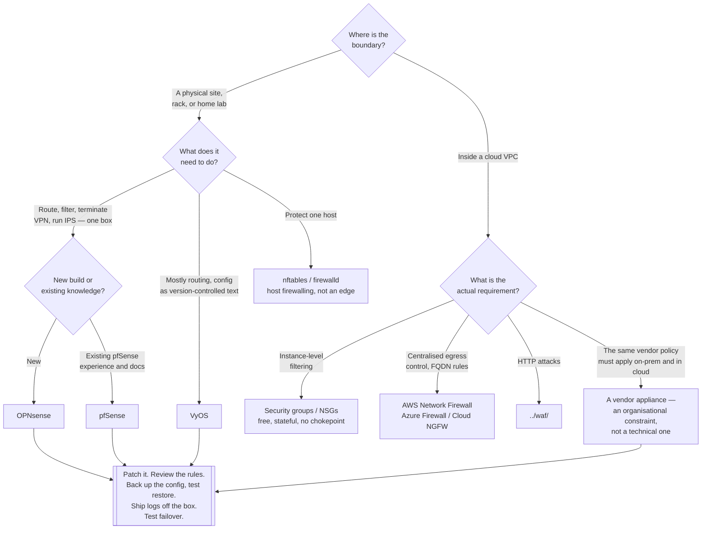

[← Cloud network](../README.md)

# NGFW

Next-generation firewalls — the appliance at a network edge. Excellent on-premises, and
usually the wrong answer inside a cloud VPC.

## Contents

1. [What "next-generation" actually means](#1-what-next-generation-actually-means)
2. [Where an NGFW belongs](#2-where-an-ngfw-belongs)
   - [Why not inside a cloud VPC](#why-not-inside-a-cloud-vpc)
3. [The options](#3-the-options)
   - [pfSense and OPNsense](#pfsense-and-opnsense)
4. [What you are signing up to operate](#4-what-you-are-signing-up-to-operate)
5. [Decision tree](#5-decision-tree)
6. [Anti-patterns](#6-anti-patterns)
7. [Notes](#7-notes)
8. [How this applies to pikakube](#8-how-this-applies-to-pikakube)

---

## 1. What "next-generation" actually means

A traditional firewall filters on the five-tuple: source address, destination address,
source port, destination port, protocol. "Next-generation" is a marketing term that stuck,
and it denotes a firewall that adds some combination of:

| Capability | What it adds over five-tuple filtering |
|---|---|
| **Application awareness** | identifies the application from traffic content rather than trusting the port — "this is BitTorrent on 443", not "this is HTTPS" |
| **User identity** | rules written against directory users and groups instead of addresses |
| **Integrated IPS** | signature inspection of packet content inline — see [`../ips/README.md`](../ips/README.md) |
| **TLS inspection** | decrypt, inspect, re-encrypt, which requires a CA trusted by every client |
| **URL and category filtering** | block by destination category, usually with a subscription feed |
| **Threat intelligence feeds** | reputation-based blocking of known-bad addresses and domains |

In practice, an NGFW is a **platform** that bundles routing, filtering, VPN termination,
IPS, DHCP, DNS and reporting into one box with one console. That consolidation is the actual
product, more than any individual feature.

## 2. Where an NGFW belongs

At a **network edge you own**: the boundary of a physical site, a branch office, a colocated
rack, a home lab. Somewhere all traffic already passes through one point, where the box has
to route anyway, and where the alternative is several separate devices.

There it is a genuinely good answer. One appliance terminates the WAN, routes between VLANs,
enforces inter-segment rules, terminates the site-to-site and client VPNs, runs the IPS and
produces the reporting. Splitting those across five tools would be worse.

### Why not inside a cloud VPC

The same appliance in a cloud account is a different proposition, and it is worth stating
plainly because the marketplace AMIs make it look like an obvious move:

| Consideration | Reality |
|---|---|
| **Availability** | it is an instance. Making it highly available means an active/passive pair plus route-table failover that you now own and must test |
| **Throughput** | a single instance with a single network interface. The managed alternatives scale without your involvement |
| **Traffic steering** | everything must be routed through it — route tables, gateway load balancers, and a long afternoon debugging asymmetric routing |
| **Overlap** | security groups already provide stateful L3/L4 filtering at every interface, for free, with no chokepoint |
| **Cost** | instance hours, plus data processing, plus support, plus the time of whoever operates it |
| **Operations** | patching, tuning, monitoring and upgrading a firewall is a job. It is rarely the job anyone on the team was hired for |

The cloud-native replacements cover the same requirements without the chokepoint: **security
groups and NSGs** for east-west and instance-level filtering, **AWS Network Firewall / Azure
Firewall / Cloud NGFW** for centralised egress control including FQDN rules, and the managed
WAF for HTTP. Use those. The exception that occasionally justifies an appliance is a
compliance or corporate requirement that the *same* vendor firewall policy applies on-prem
and in cloud — and that is an organisational constraint, not a technical conclusion.

## 3. The options

No tool subfolders here. The credible open-source options:

| Option | What it is | Where it fits | Link |
|---|---|---|---|
| **pfSense** | FreeBSD-based firewall/router distribution; CE is free, Plus is Netgate's commercial edition | the long-standing default for home labs, small sites and appliances | <https://github.com/pfsense/pfsense> |
| **OPNsense** | a fork of pfSense with a different governance model, a faster release cadence and a modernised UI | the same roles; usually the recommendation for a new deployment today | <https://github.com/opnsense/core> |
| **VyOS** | a router-first network OS with a configuration CLI in the Junos/IOS idiom; no web console | when it is really a router, and when configuration should be text under version control | <https://github.com/vyos/vyos-1x> |
| **nftables / firewalld** | the Linux kernel's own packet filter | a single host, not a network edge — this is host firewalling, a different job |  — |
| **AWS Network Firewall / Azure Firewall / Cloud NGFW** | managed, scaled by the provider, with FQDN-based egress rules | **the answer inside a cloud account** | — |

### pfSense and OPNsense

Both links in the original note point at these two, so the comparison is the useful content:

| | pfSense | OPNsense |
|---|---|---|
| Base | FreeBSD | FreeBSD (HardenedBSD lineage) |
| Origin | the original project | a 2015 fork of pfSense |
| Governance | Netgate, with a free CE edition and a paid Plus edition | a foundation-backed model, fully open |
| Releases | slower; CE has historically lagged Plus | faster, on a predictable schedule |
| Interface | functional, dated | modernised, more consistent |
| Ecosystem | larger; more tutorials and forum history | smaller but active |

They are close relatives and either works. The decision usually comes down to governance
preference and release cadence — OPNsense for a new build, pfSense if the existing
documentation and muscle memory are worth more. What matters far more than the choice is
whether anyone will actually maintain the box after it is installed.

## 4. What you are signing up to operate

An appliance that is not maintained is worse than the security groups it replaced, because
it is trusted. The recurring work:

- **Patching**, promptly. A firewall is internet-facing by definition, and firewall and VPN
  appliances are a favourite target class precisely because they sit at the edge and are
  rarely updated.
- **Rule hygiene.** Rules accumulate. Without periodic review — what is this for, is it
  still needed, who asked — the rule base becomes an artifact nobody dares to change.
- **Backup and restore of the configuration**, tested. The configuration is the device.
- **Failover, tested.** An untested HA pair is a single point of failure with extra steps.
- **Log destination.** Local logs on the box are lost with the box.
- **Certificate lifecycle** if TLS inspection is enabled, which also means a CA trusted by
  every client on the network — a substantial commitment with real privacy implications.

## 5. Decision tree

## 6. Anti-patterns

| Anti-pattern | Why it is bad | What to do instead |
|---|---|---|
| Running pfSense or OPNsense as the edge of a cloud VPC | a single-instance bottleneck, route-table gymnastics, and it duplicates what security groups already do for free | security groups plus the provider's managed firewall |
| An appliance nobody patches | edge firewalls and VPN appliances are a heavily targeted class, precisely because they are exposed and neglected | a patch cadence with an owner, or do not run one |
| A rule base that only ever grows | nobody remembers what a rule was for, so nobody removes it, and the policy becomes unauditable | periodic review; every rule carries a comment saying why it exists |
| Management interface reachable from the internet | the console is the whole device; it is scanned continuously | management on a dedicated interface or over VPN only, never on the WAN |
| An untested HA pair | a single point of failure with extra complexity, discovered during the outage | test failover on a schedule |
| Logs kept only on the appliance | when the box is compromised or dies, the evidence goes with it | ship to central logging |
| TLS inspection enabled without a plan | it needs a CA trusted by every client, breaks pinned applications, and carries real privacy implications | do it deliberately and narrowly, or not at all |
| Treating an NGFW as segmentation for Kubernetes | pod-to-pod traffic never reaches it, and pod IPs are ephemeral | NetworkPolicy — `security/2-cluster/network-policies/` |
| Buying an NGFW to solve a WAF problem | the integrated inspection is generic; HTTP attacks need a real WAF with tunable rules | [`../waf/README.md`](../waf/README.md) |

## 7. Notes

The original note in this folder recorded exactly two links:

- <https://github.com/pfsense/pfsense> — **pfSense**, the FreeBSD-based firewall and router
  distribution maintained by Netgate. The long-standing default for home labs and small
  sites: a single box that routes, filters, terminates VPNs and runs an IPS, driven from a
  web console rather than a configuration file.
- <https://github.com/opnsense/core> — **OPNsense**, which forked from pfSense in 2015. Same
  lineage and much the same feature set, but with open foundation governance, a faster and
  more predictable release cadence, and a modernised interface. Note that the repository is
  named `core` because OPNsense is split across several repositories — `core` is the system
  itself, with `ports`, `plugins` and `tools` alongside it.

The two being recorded side by side is the point: they are the same decision, and the
comparison in section 3 is what that pair of links is really asking. The important
conclusion for this repository is the one in section 2 — **both belong on-premises**, at a
physical edge. Neither is the right answer inside a cloud account, where security groups and
the provider's managed firewall cover the requirement without introducing a chokepoint that
you then have to make highly available.

## 8. How this applies to pikakube

Nothing here runs in pikakube, and it is worth being direct about why: a Kind cluster on a
laptop has no network edge. There is no WAN interface, no VLAN to segment, no site boundary,
and no traffic that is not already loopback.

Where this category is real for the person maintaining this repository is the **physical
network the laptop is on** — a home lab or an office network, where pfSense or OPNsense on
dedicated hardware or a small VM is the natural edge device, terminating the internet
connection, segmenting the network, and terminating the VPN described in
[`../vpn/README.md`](../vpn/README.md). That is a legitimate and common use of these tools,
and it does not require a cloud account at all. It also pairs directly with
[`../ips/README.md`](../ips/README.md), since both pfSense and OPNsense can run Suricata as a
plugin on the same box.

The two things that actually protect the cluster in this repository are elsewhere:
NetworkPolicy inside the cluster (`security/2-cluster/network-policies/`, with Cilium
available via `clusters/kind-configs/cilium.yaml`), and the fact that ingress is bound to
`127.0.0.1` and reachable by nobody else.

---

[← Cloud network](../README.md)
