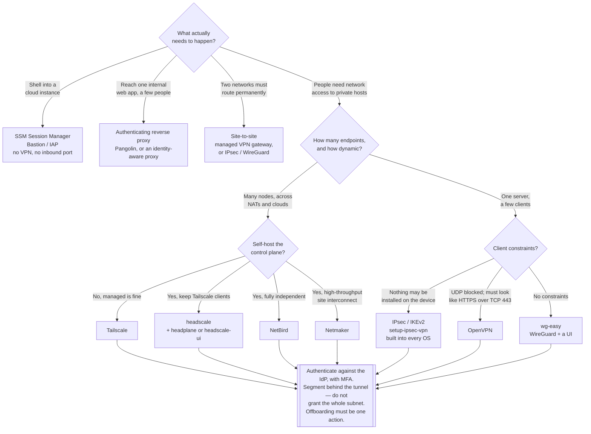

[← Cloud network](../README.md)

# VPN

Encrypted paths into a private network. The one category here that grants reachability
rather than restricting it — which is why it needs the most care.

## Contents

1. [A VPN is reachability, not security](#1-a-vpn-is-reachability-not-security)
2. [Three shapes, three problems](#2-three-shapes-three-problems)
3. [Protocols: WireGuard, OpenVPN, IPsec](#3-protocols-wireguard-openvpn-ipsec)
4. [Classic VPN servers](#4-classic-vpn-servers)
5. [Mesh and overlay networks](#5-mesh-and-overlay-networks)
   - [The control-plane question](#the-control-plane-question)
   - [Headscale user interfaces](#headscale-user-interfaces)
6. [In a cloud account, prefer no VPN at all](#6-in-a-cloud-account-prefer-no-vpn-at-all)
7. [Decision tree](#7-decision-tree)
8. [Anti-patterns](#8-anti-patterns)
9. [Notes](#9-notes)
10. [How this applies to pikakube](#10-how-this-applies-to-pikakube)

---

## 1. A VPN is reachability, not security

Every other control in [`../README.md`](../README.md) reduces what can be reached. A VPN
increases it: it takes something that was unreachable and makes it reachable, for whoever
holds a credential.

That is a legitimate and necessary thing to do. It is also the reason a VPN is the item in
this folder most often mistaken for a security product. The classic outcome is a flat
network behind the tunnel: authenticate once, and now reach every host, every port, every
database, from a laptop of unknown health, with an account that was provisioned three
employers ago.

Three consequences follow, and they are the whole design brief:

- **Authentication must be strong and centralised.** A VPN account is a network account; it
  belongs in the identity provider, with MFA, so that offboarding removes it in one action.
- **Authorisation must exist behind it.** Connecting should grant access to specific
  resources, not to a subnet. This is the single biggest difference between the classic
  servers in section 4 and the overlays in section 5.
- **Device state matters.** The tunnel extends your network to the endpoint, whatever
  condition it is in.

## 2. Three shapes, three problems

| Shape | Problem it solves | Typical tool |
|---|---|---|
| **Site-to-site** | two networks must route to each other permanently — office to cloud, datacentre to datacentre | IPsec, or the provider's managed VPN gateway; WireGuard between Linux endpoints |
| **Client-to-site (remote access)** | a person needs to reach a private network from anywhere | OpenVPN, WireGuard, IPsec/IKEv2 |
| **Mesh / overlay** | many endpoints — people, servers, containers, across clouds and NATs — need to reach each other without a hub | Tailscale, headscale, NetBird, Netmaker |

The third shape is the one that has changed in the last few years, and it is where most new
deployments should start. A hub-and-spoke VPN concentrator is a single point of failure, a
bandwidth bottleneck and a latency detour; a mesh establishes direct encrypted peer
connections, traverses NAT automatically, and — the important part — lets access be expressed
**per resource and per identity** instead of per subnet.

## 3. Protocols: WireGuard, OpenVPN, IPsec

| | **WireGuard** | **OpenVPN** | **IPsec (IKEv2)** |
|---|---|---|---|
| Codebase | very small, in the Linux kernel | large, userspace, TLS-based | large, complex, standardised |
| Performance | the fastest of the three, by a clear margin | slower; userspace and TLS overhead | fast, kernel-based |
| Configuration | public keys and allowed IPs — minimal | many options, and many ways to be wrong | notoriously fiddly, with many interoperating implementations |
| Native client support | not built into OS defaults; a client is installed | client required | **built into Windows, macOS, iOS, Android** |
| Firewall traversal | UDP only, which some restrictive networks block | can run over TCP/443 and look like HTTPS | UDP 500/4500, often blocked |
| Identity model | key-per-peer; no user concept | certificates and user accounts, with rich authorisation options | certificates or EAP, integrates with directories |
| Roaming | excellent — connections survive network changes | reconnects | good with MOBIKE |

The practical reading:

- **WireGuard is the default for anything new.** It is simpler, faster and much harder to
  misconfigure. Everything in section 5 is built on it.
- **OpenVPN still wins in one situation**: a hostile network where UDP is blocked and traffic
  must look like HTTPS over TCP/443. That is a real requirement, and WireGuard does not meet
  it without a wrapper.
- **IPsec wins when clients must use the operating system's built-in VPN** with nothing
  installed — corporate laptops under MDM, or users who cannot install software.

## 4. Classic VPN servers

The hub-and-spoke options recorded in this folder:

| Option | What it is | Where it fits | Link |
|---|---|---|---|
| **OpenVPN** | the mature, TLS-based VPN. Rich authorisation, PKI-based, runs over TCP or UDP | restrictive networks, and existing deployments with a working PKI | <https://github.com/openvpn/openvpn> |
| **wg-easy** | WireGuard plus a web UI for creating peers and printing QR codes — the fastest way to a working WireGuard server | a home lab or a small team; one server, a handful of clients | <https://github.com/wg-easy/wg-easy> |
| **setup-ipsec-vpn** | scripts that stand up an IPsec/L2TP and IKEv2 server on a Linux host | when clients must connect with the operating system's built-in VPN client | <https://github.com/hwdsl2/setup-ipsec-vpn> |
| **WireGuard** | the protocol and its reference tooling | the substrate under most of this page | <https://www.wireguard.com> |

All of these share the same structural limitation, and it is the reason section 5 exists:
**they grant network access.** Once connected, a peer's `AllowedIPs` or pushed routes decide
what it can reach, and that is a subnet-level decision with no concept of a user or a
resource. Fine-grained authorisation has to be built separately, with firewall rules that
nobody maintains.

## 5. Mesh and overlay networks

These wrap WireGuard in a **control plane**: a coordination server that knows every node's
identity, distributes keys, brokers NAT traversal, and — critically — enforces an access
policy expressed as *which identities may reach which resources on which ports*.

| Option | What it is | Where it fits | Link |
|---|---|---|---|
| **Tailscale** | the commercial product that defined the category: SSO login, ACLs as policy, DERP relays, MagicDNS | when a managed control plane is acceptable; free tier covers small teams | <https://github.com/tailscale/tailscale> |
| **headscale** | an open-source, self-hosted implementation of Tailscale's control server, used with the official Tailscale clients | when the clients and UX are wanted but the coordination server must be yours | <https://github.com/juanfont/headscale> |
| **NetBird** | a full open-source alternative — its own control plane, clients, SSO integration and policy engine, self-hosted or managed | a self-contained mesh with identity-based access, without depending on Tailscale's clients | <https://github.com/netbirdio/netbird> |
| **Netmaker** | WireGuard mesh management with an emphasis on throughput and on site-to-site/egress gateways, using kernel WireGuard | high-bandwidth mesh, connecting whole networks rather than mostly laptops | <https://github.com/gravitl/netmaker> |
| **Pangolin** | a self-hosted tunneled reverse proxy: sites connect outbound over WireGuard, and services are published through the hub with identity and access control in front | exposing internal services to specific people **without** giving them network access, and without opening a port | <https://github.com/fosrl/pangolin> |

Pangolin is the odd one out and worth separating: it is not really a VPN for users. It is
closer to the "no inbound port" pattern in section 6 — a tunnel outward from the private
network, with an authenticating proxy publishing individual applications. When the actual
requirement is *give three people access to one internal web UI*, that is a much smaller
grant than putting three laptops on the network.

### The control-plane question

The trade-off across the whole category:

| | Managed control plane (Tailscale) | Self-hosted (headscale, NetBird, Netmaker) |
|---|---|---|
| Operations | none | you run and back up the coordination server |
| Availability | someone else's problem | your problem; if it is down, new connections and key rotation fail |
| Trust | a third party knows your network topology and brokers key distribution | nobody outside |
| Features | the most complete — ACLs, SSO, device posture, audit | varies; headscale in particular lags the commercial feature set |

Note the property that mitigates the availability concern: in a WireGuard mesh, the control
plane distributes keys and policy but does **not** carry data. Established peer connections
keep working while it is down. That makes self-hosting far less risky than it sounds — the
failure mode is "no new nodes and no policy changes", not "the network is down".

### Headscale user interfaces

headscale ships as a server with a CLI and no web interface, which is a real friction point
for day-to-day administration — approving nodes, managing pre-auth keys, seeing who is
connected. Two community front-ends fill that gap:

| Option | Link |
|---|---|
| **headplane** | <https://github.com/tale/headplane> |
| **headscale-ui** | <https://github.com/gurucomputing/headscale-ui> |

Both are third-party projects that talk to headscale's API. Treat them as what they are:
an administrative console for a component that controls network access. Do not expose one to
the internet, put it behind authentication, and check each project's activity before
adopting — community front-ends for a fast-moving upstream API are exactly the kind of
project that falls behind.

## 6. In a cloud account, prefer no VPN at all

For the common case — an engineer needs to reach a private instance or database — the cloud
providers offer something better than a VPN, and it is underused:

| Need | Option | Why it beats a VPN |
|---|---|---|
| Shell on an instance | **AWS SSM Session Manager**, Azure Bastion, GCP IAP TCP forwarding | no inbound port exists at all; access is governed by [`../../iam/README.md`](../../iam/README.md) and every session is logged |
| Reach a private database or service | port forwarding through the same mechanisms | a single port to a single host, for a single authenticated identity |
| Reach a managed service privately | **PrivateLink / Private Endpoint / Private Service Connect** | the traffic never crosses the internet, so there is nothing to tunnel |
| Publish one internal web app to a few people | an authenticating reverse proxy | grants access to an application, not to a network |
| Two networks must route permanently | a managed site-to-site VPN or Direct Connect / ExpressRoute / Interconnect | this is the case where a VPN really is the answer |

The pattern worth internalising: **a VPN grants network access, and network access is almost
never what was actually needed.** What was needed was access to one service, by one person,
for one task. Every mechanism in that table expresses that more precisely, with an audit
trail attached to an identity rather than to an IP address on a subnet.

## 7. Decision tree

## 8. Anti-patterns

| Anti-pattern | Why it is bad | What to do instead |
|---|---|---|
| A flat network behind the VPN | one credential yields reachability to every host and port; lateral movement is trivial | ACLs per identity and per resource — the reason to prefer an overlay over a classic concentrator |
| VPN accounts managed separately from the identity provider | offboarding is a search, MFA is optional, and old accounts persist for years | SSO, MFA at the IdP, one offboarding action |
| Shared VPN credentials or a shared key file | no attribution, and rotation means telling everyone | per-user identity, per-device keys |
| A VPN to get a shell on a cloud instance | it opens a whole network to solve a single-session problem | SSM Session Manager, Bastion, or IAP |
| Treating "connected to the VPN" as authentication | the application still needs to know who this is; network position is not identity | authenticate at the application, every time |
| An unpatched VPN appliance | edge VPN devices are a heavily targeted class, and the exploits are widely available | patch promptly, or use a managed service |
| Never removing device keys | a lost laptop keeps its access; keys outlive employment | expiring keys, device inventory, periodic review |
| Split tunnelling decided by accident | either all traffic is inspected and the link saturates, or nothing is, and nobody chose | decide deliberately, and write down which it is and why |
| Exposing a headscale or NetBird admin UI to the internet | it is the control plane for network access; compromising it grants everything | keep it internal, behind authentication |
| Assuming the mesh control plane is a single point of failure for traffic | it distributes keys and policy, not data — peers keep talking while it is down | worth knowing, because it makes self-hosting far less risky than it appears |

## 9. Notes

The original note recorded nine links in three visual groups, with no commentary. The
grouping is meaningful, so it is preserved here along with what each one is.

**Group 1 — classic VPN servers:**

- <https://github.com/openvpn/openvpn> — **OpenVPN**. The mature TLS-based VPN. Its
  surviving advantage over WireGuard is transport flexibility: it runs over TCP/443 and looks
  like ordinary HTTPS, which is what gets through restrictive networks.
- <https://github.com/wg-easy/wg-easy> — **wg-easy**. WireGuard with a small web UI for
  adding peers and generating QR codes for mobile clients. The fastest route to a working
  WireGuard server, and the right tool for a home lab. It manages peers; it has no concept of
  users, groups or policy.
- <https://github.com/hwdsl2/setup-ipsec-vpn> — **setup-ipsec-vpn**. Scripts that install an
  IPsec/L2TP and IKEv2 server on a Linux host. Its reason to exist is client compatibility:
  IPsec is built into Windows, macOS, iOS and Android, so users connect with nothing
  installed. That still matters on managed devices where installing a client is not possible.

**Group 2 — mesh and overlay control planes:**

- <https://github.com/juanfont/headscale> — **headscale**. An open-source, self-hosted
  implementation of Tailscale's coordination server, used with the official Tailscale
  clients. The appeal is keeping the client experience while owning the control plane; the
  cost is a feature set that trails the commercial product.
- <https://github.com/netbirdio/netbird> — **NetBird**. A complete open-source alternative:
  its own control plane, clients, SSO integration and policy engine, self-hosted or managed.
  The more independent choice, at the cost of not riding on Tailscale's client ecosystem.
- <https://github.com/gravitl/netmaker> — **Netmaker**. WireGuard mesh management oriented
  toward throughput and toward connecting whole networks — site-to-site and egress gateways —
  rather than mostly laptops.
- <https://github.com/fosrl/pangolin> — **Pangolin**. Not a user VPN at all, despite the
  filing: a self-hosted tunneled reverse proxy. Sites dial out over WireGuard to a hub, and
  services are published through it behind authentication. It solves "let these people use
  this internal app" without opening an inbound port and without putting anyone on the
  network — which is usually the smaller and more correct grant.

**Group 3 — administrative interfaces for headscale:**

- <https://github.com/tale/headplane> — **headplane**.
- <https://github.com/gurucomputing/headscale-ui> — **headscale-ui**.

Both exist for the same reason: headscale ships with a CLI and no web interface, which makes
routine administration — approving nodes, issuing pre-auth keys, seeing who is connected —
more painful than it should be. They are third-party front-ends over headscale's API, which
means two cautions: check that the project still tracks current headscale releases, and never
expose one publicly, because it administers network access.

The three groups together tell the story this page argues in sections 2 and 5: the classic
servers solve reachability, and the overlays solve reachability **plus authorisation**, which
is the part that actually matters.

## 10. How this applies to pikakube

Nothing here runs in the cluster, and nothing needs to. pikakube is a Kind cluster on
`127.0.0.1` — there is no remote access problem, because there is no remote.

Where this category is real for the person maintaining this repository is the **home lab and
personal infrastructure** around it: reaching a machine at home from elsewhere, connecting a
laptop to a VPS, or exposing a self-hosted service to a couple of people. That is exactly the
problem set the recorded links cover, and it is why they were collected. The shortest sensible
paths for that:

| Want | Reach for |
|---|---|
| One WireGuard server, a handful of devices | **wg-easy** |
| Several machines across NATs, with per-resource access rules | **Tailscale**, or **headscale**/**NetBird** to self-host it |
| Publish one internal web UI to specific people | **Pangolin**, or an authenticating reverse proxy |
| A device that cannot have software installed | **setup-ipsec-vpn** |

If a remote cluster ever needs an API endpoint reachable from outside, the guidance in
section 6 applies unchanged and is the more important lesson: prefer a mechanism that grants
access to **one thing for one identity** over one that puts a device on the network. A
private API endpoint reached through an identity-aware proxy is a better answer than a VPN
into the cluster's subnet, for the same reason the whole of [`../README.md`](../README.md)
prefers unreachability to inspection.

---

[← Cloud network](../README.md)
